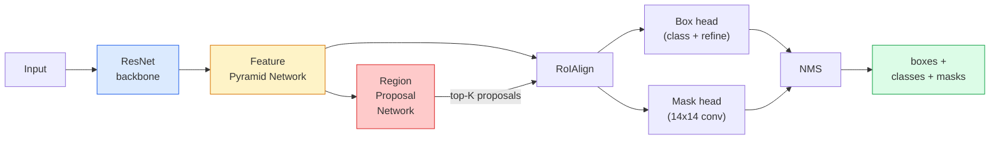

# 实例分割：Mask R-CNN

> 给 Faster R-CNN 检测器加上一个小小的掩码分支，就能实现实例分割。难点在于 RoIAlign，而且它比看起来更难。

**Type:** Build + Learn
**Languages:** Python
**Prerequisites:** 阶段 4 第 06 课（YOLO）、阶段 4 第 07 课（U-Net）
**Time:** ~75 分钟

## 学习目标

- 从头到尾梳理 Mask R-CNN 的架构：主干网络（backbone）、特征金字塔网络（FPN）、区域提议网络（RPN）、RoIAlign、边界框头和掩码头
- 从零实现 RoIAlign，并解释为何不再使用 RoIPool
- 使用 torchvision 的 `maskrcnn_resnet50_fpn_v2` 预训练模型生成达到生产应用质量的实例掩码，并正确解读其输出格式
- 替换边界框头和掩码头，保持主干网络冻结，在小规模自定义数据集上微调（fine-tuning）Mask R-CNN

## 要解决的问题

语义分割（semantic segmentation）为每个类别生成一个掩码。实例分割（instance segmentation）为每个目标生成一个掩码，即使两个目标属于同一类别也能区分开来。个体计数、跨帧跟踪和物体测量（例如确定墙上每块砖、显微图像中每个细胞的边界框）都需要实例分割。

Mask R-CNN（He 等人，2017）把实例分割重新表述为“目标检测加掩码”，由此解决了这个问题。它的设计非常简洁，此后五年间，几乎每篇实例分割论文提出的都是 Mask R-CNN 的变体；对于中小规模数据集，torchvision 的实现至今仍是生产应用中的默认选择。

工程上的难点是采样：当候选框（proposal box）的角点没有与像素边界对齐时，如何从中裁剪出固定大小的特征区域？如果处理不当，各处都会损失零点几个 mAP（平均精确率均值）点。RoIAlign 就是解决办法。

## 核心概念

### 架构



需要理解五个组成部分：

1. **主干网络**：在 ImageNet 上训练的 ResNet-50 或 ResNet-101。生成多个层级的特征图（feature map），步幅（stride）分别为 4、8、16、32。
2. **FPN（Feature Pyramid Network，特征金字塔网络）**：通过自顶向下的连接和横向连接，为每一层提供 C 个通道的、语义信息丰富的特征。检测时使用与目标大小相匹配的 FPN 层。
3. **RPN（Region Proposal Network，区域提议网络）**：一个小型卷积头，在每个锚框（anchor）位置预测“这里有目标吗？”以及“该如何细化这个框？”。每张图像生成约 1000 个候选区域。
4. **RoIAlign**：从任意 FPN 层的任意框中，采样出固定大小（例如 7x7）的局部特征块。采用双线性采样，不做量化（quantisation）。
5. **预测头**：由两层组成的边界框头负责细化边界框并选择类别；另有一个小型卷积头，为每个候选区域输出一个 `28x28` 的二值掩码。

### 为什么使用 RoIAlign，而不是 RoIPool

最初的 Fast R-CNN 使用 RoIPool：将候选框划分为网格，取每个网格单元内特征的最大值，并将所有坐标舍入为整数。舍入会使特征图与输入像素坐标发生错位，最大可达整整一个特征图像素。在 224x224 的图像上，这点偏差看似不大，但当特征图的步幅为 32 时，后果就很严重。

```text
RoIPool:
  box (34.7, 51.3, 98.2, 142.9)
  round -> (34, 51, 98, 142)
  split grid -> round each cell boundary
  misalignment accumulates at every step

RoIAlign:
  box (34.7, 51.3, 98.2, 142.9)
  sample at exact float coordinates using bilinear interpolation
  no rounding anywhere
```

RoIAlign 无需额外代价，就能让 COCO 上的掩码 AP（平均精确率）提升 3-4 个点。如今，所有重视定位的检测器都在使用它，YOLOv7 seg、RT-DETR 和 Mask2Former 也不例外。

### 用一段话说明 RPN

在特征图的每个位置放置 K 个大小和形状各异的锚框。为每个锚框预测一个目标存在性分数（objectness score）和一个回归偏移量，将锚框调整为更贴合目标的框。按分数保留排名靠前的约 1,000 个框，以交并比（IoU）0.7 为阈值执行非极大值抑制（NMS），再把保留下来的框交给预测头。RPN 使用自己的一小组损失进行训练，其结构与第 6 课的 YOLO 损失相同，只是类别只有两个：有目标和无目标。

### 掩码头

对于经过 RoIAlign 处理的每个候选区域，掩码头都是一个小型全卷积网络（FCN）：四个 3x3 卷积、一个 2x 转置卷积（deconv），以及最后一个 1x1 卷积，输出分辨率为 `28x28`、通道数为 `num_classes` 的结果。只保留预测类别对应的通道，其余通道忽略。这使掩码预测与分类解耦。

将 28x28 的掩码上采样至候选区域原本的像素尺寸，即可得到最终的二值掩码。

### 损失函数

Mask R-CNN 将四项损失相加：

```text
L = L_rpn_cls + L_rpn_box + L_box_cls + L_box_reg + L_mask
```

- `L_rpn_cls`、`L_rpn_box`：RPN 候选区域的目标存在性损失与边界框回归损失。
- `L_box_cls`：预测头的分类器在 (C+1) 个类别（含背景类）上的交叉熵（cross-entropy）。
- `L_box_reg`：预测头细化边界框时使用的平滑 L1 损失。
- `L_mask`：在 28x28 掩码输出上逐像素计算的二元交叉熵（binary cross-entropy）。

每项损失都有自己的默认权重；torchvision 实现通过构造函数参数提供这些权重。

### 输出格式

`torchvision.models.detection.maskrcnn_resnet50_fpn_v2` 返回一个字典列表，每张图像对应一个字典：

```text
{
    "boxes":  (N, 4) in (x1, y1, x2, y2) pixel coordinates,
    "labels": (N,) class IDs, 0 = background so indices are 1-based,
    "scores": (N,) confidence scores,
    "masks":  (N, 1, H, W) float masks in [0, 1] — threshold at 0.5 for binary,
}
```

掩码已经具有完整的图像分辨率。预测头输出的 28x28 掩码已在模型内部完成上采样。

```figure
cv3-roialign-sampling
```

## 动手实现

### 第 1 步：从零实现 RoIAlign

这是 Mask R-CNN 中唯一一个看代码比看文字更容易理解的组件。

```python
import torch
import torch.nn.functional as F

def roi_align_single(feature, box, output_size=7, spatial_scale=1 / 16.0):
    """
    feature: (C, H, W) single-image feature map
    box: (x1, y1, x2, y2) in original image pixel coordinates
    output_size: side of the output grid (7 for box head, 14 for mask head)
    spatial_scale: reciprocal of the feature map stride
    """
    C, H, W = feature.shape
    x1, y1, x2, y2 = [c * spatial_scale - 0.5 for c in box]
    bin_w = (x2 - x1) / output_size
    bin_h = (y2 - y1) / output_size

    grid_y = torch.linspace(y1 + bin_h / 2, y2 - bin_h / 2, output_size)
    grid_x = torch.linspace(x1 + bin_w / 2, x2 - bin_w / 2, output_size)
    yy, xx = torch.meshgrid(grid_y, grid_x, indexing="ij")

    gx = 2 * (xx + 0.5) / W - 1
    gy = 2 * (yy + 0.5) / H - 1
    grid = torch.stack([gx, gy], dim=-1).unsqueeze(0)
    sampled = F.grid_sample(feature.unsqueeze(0), grid, mode="bilinear",
                            align_corners=False)
    return sampled.squeeze(0)
```

每个数值都来自相应位置的双线性采样。没有舍入，没有量化，也没有被丢弃的梯度。

### 第 2 步：与 torchvision 的 RoIAlign 对照

```python
from torchvision.ops import roi_align

feature = torch.randn(1, 16, 50, 50)
boxes = torch.tensor([[0, 10, 20, 100, 90]], dtype=torch.float32)  # (batch_idx, x1, y1, x2, y2)

ours = roi_align_single(feature[0], boxes[0, 1:].tolist(), output_size=7, spatial_scale=1/4)
theirs = roi_align(feature, boxes, output_size=(7, 7), spatial_scale=1/4, sampling_ratio=1, aligned=True)[0]

print(f"shape ours:   {tuple(ours.shape)}")
print(f"shape theirs: {tuple(theirs.shape)}")
print(f"max|diff|:    {(ours - theirs).abs().max().item():.3e}")
```

当 `sampling_ratio=1` 且 `aligned=True` 时，两者的差异在 `1e-5` 以内。

### 第 3 步：加载预训练的 Mask R-CNN

```python
import torch
from torchvision.models.detection import maskrcnn_resnet50_fpn_v2, MaskRCNN_ResNet50_FPN_V2_Weights

model = maskrcnn_resnet50_fpn_v2(weights=MaskRCNN_ResNet50_FPN_V2_Weights.DEFAULT)
model.eval()
print(f"params: {sum(p.numel() for p in model.parameters()):,}")
print(f"classes (including background): {len(model.roi_heads.box_predictor.cls_score.out_features * [0])}")
```

参数量为 46M（M 表示百万），有 91 个类别（COCO）。第一个类别（id 0）是背景；模型实际检测的所有类别都从 id 1 开始。

### 第 4 步：运行推理

```python
with torch.no_grad():
    x = torch.randn(3, 400, 600)
    predictions = model([x])
p = predictions[0]
print(f"boxes:  {tuple(p['boxes'].shape)}")
print(f"labels: {tuple(p['labels'].shape)}")
print(f"scores: {tuple(p['scores'].shape)}")
print(f"masks:  {tuple(p['masks'].shape)}")
```

掩码张量的形状为 `(N, 1, H, W)`。以 0.5 为阈值进行二值化，即可得到每个目标的二值掩码：

```python
binary_masks = (p['masks'] > 0.5).squeeze(1)  # (N, H, W) boolean
```

### 第 5 步：替换预测头以适配自定义类别数

常见的微调方法是：复用主干网络、FPN 和 RPN，替换两个分类头。

```python
from torchvision.models.detection.faster_rcnn import FastRCNNPredictor
from torchvision.models.detection.mask_rcnn import MaskRCNNPredictor

def build_custom_maskrcnn(num_classes):
    model = maskrcnn_resnet50_fpn_v2(weights=MaskRCNN_ResNet50_FPN_V2_Weights.DEFAULT)
    in_features = model.roi_heads.box_predictor.cls_score.in_features
    model.roi_heads.box_predictor = FastRCNNPredictor(in_features, num_classes)
    in_features_mask = model.roi_heads.mask_predictor.conv5_mask.in_channels
    hidden_layer = 256
    model.roi_heads.mask_predictor = MaskRCNNPredictor(in_features_mask, hidden_layer, num_classes)
    return model

custom = build_custom_maskrcnn(num_classes=5)
print(f"custom cls_score.out_features: {custom.roi_heads.box_predictor.cls_score.out_features}")
```

`num_classes` 必须包含背景类，因此，具有 4 个目标类别的数据集应使用 `num_classes=5`。

### 第 6 步：冻结不需要训练的部分

对于小规模数据集，冻结主干网络和 FPN。仅训练 RPN 的目标存在性预测与回归部分，以及两个预测头。

```python
def freeze_backbone_and_fpn(model):
    # torchvision Mask R-CNN packs the FPN inside `model.backbone` (as
    # `model.backbone.fpn`), so iterating `model.backbone.parameters()` covers
    # both the ResNet feature layers and the FPN lateral/output convs.
    for p in model.backbone.parameters():
        p.requires_grad = False
    return model

custom = freeze_backbone_and_fpn(custom)
trainable = sum(p.numel() for p in custom.parameters() if p.requires_grad)
print(f"trainable after freeze: {trainable:,}")
```

对于包含 500 张图像的数据集，这一步决定了模型是收敛还是过拟合。

## 实际使用

torchvision 中 Mask R-CNN 的完整训练循环只需 40 行，不同任务之间基本没有变化，换上数据集就能用。

```python
def train_step(model, images, targets, optimizer):
    model.train()
    loss_dict = model(images, targets)
    losses = sum(loss for loss in loss_dict.values())
    optimizer.zero_grad()
    losses.backward()
    optimizer.step()
    return {k: v.item() for k, v in loss_dict.items()}
```

`targets` 目标列表中，每张图像对应的字典都必须包含 `boxes`、`labels` 和 `masks`（形状为 `(num_instances, H, W)` 的二值张量）。模型根据 `model.training` 的值，在训练时返回包含四项损失的字典，在评估时返回预测结果列表。

`pycocotools` 评估器会分别给出边界框和掩码的 mAP@IoU=0.5:0.95。两项数值都需要查看，才能知道瓶颈在边界框头还是掩码头。

## 交付成果

本课产出：

- `outputs/prompt-instance-vs-semantic-router.md`：一个提示词（prompt），通过三个问题，在实例分割、语义分割和全景分割之间作出选择，并给出入手时应使用的具体模型。
- `outputs/skill-mask-rcnn-head-swapper.md`：一个技能，给定新的 `num_classes` 后，生成 10 行代码，用于替换任意 torchvision 检测模型的预测头。

## 练习

1. **（简单）** 在 100 个随机框上，将你的 RoIAlign 与 `torchvision.ops.roi_align` 进行对照验证，报告最大绝对差异。再运行 RoIPool（2017 年以前的做法），展示它在靠近边界的框上会产生约 1-2 个特征图像素的偏差。
2. **（中等）** 在一个包含 50 张图像的自定义数据集上微调 `maskrcnn_resnet50_fpn_v2`，任意选择两个类别，例如气球、鱼、路面坑洞或标志。冻结主干网络，训练 20 轮（epoch），报告掩码 AP@0.5。
3. **（困难）** 将 Mask R-CNN 的掩码头替换为预测分辨率为 56x56 而非 28x28 的版本。测量替换前后的 mAP@IoU=0.75，并解释为什么性能提升（或没有提升）符合对边界精度与内存开销之间权衡的预期。

## 关键术语

| 术语 | 常见说法 | 实际含义 |
|------|----------------|----------------------|
| Mask R-CNN | “检测加掩码” | Faster R-CNN 加上一个小型 FCN 头，为每个候选区域的每个类别预测一个 28x28 掩码 |
| FPN | “特征金字塔” | 通过自顶向下的连接和横向连接，为各个步幅层级提供 C 个通道的、语义信息丰富的特征 |
| RPN | “区域提议器” | 一个小型卷积头，每张图像生成约 1000 个有目标或无目标的候选区域 |
| RoIAlign | “不舍入的裁剪” | 通过双线性采样，从任意浮点坐标框中获得固定大小的特征网格 |
| RoIPool | “2017 年以前的裁剪” | 目的与 RoIAlign 相同，但会对框坐标舍入；已过时 |
| 掩码 AP | “实例 mAP” | 用掩码 IoU 而非边界框 IoU 计算的平均精确率；COCO 的实例分割指标 |
| 二值掩码头 | “按类别生成的掩码” | 为每个候选区域的每个类别预测一个二值掩码，只保留预测类别对应的通道 |
| 背景类 | “类别 0” | 统合所有“无目标”情况的类别；实际目标类别的索引从 1 开始 |

## 延伸阅读

- [Mask R-CNN（He 等人，2017）](https://arxiv.org/abs/1703.06870)：原论文；重点阅读介绍 RoIAlign 的第 3 节
- [FPN: Feature Pyramid Networks（Lin 等人，2017）](https://arxiv.org/abs/1612.03144)：FPN 论文；每一种现代检测器都在使用它
- [torchvision Mask R-CNN 教程](https://pytorch.org/tutorials/intermediate/torchvision_tutorial.html)：微调训练循环的参考资料
- [Detectron2 模型库](https://github.com/facebookresearch/detectron2/blob/main/MODEL_ZOO.md)：提供生产级实现及训练好的权重，涵盖几乎所有检测和分割变体
