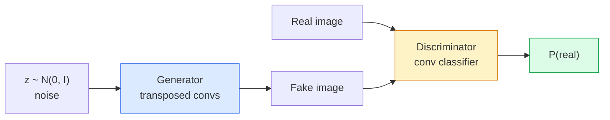
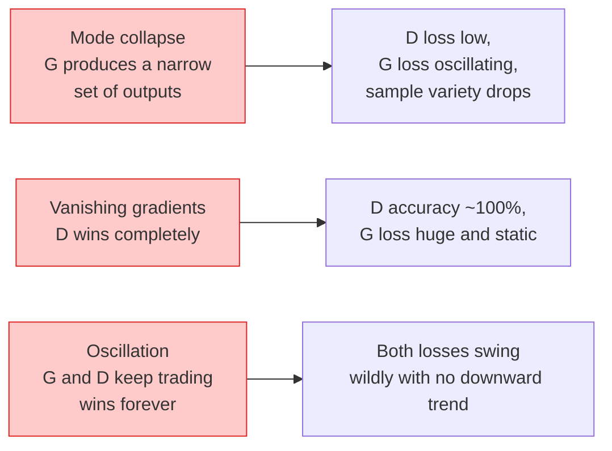

# 图像生成：GAN

> 生成对抗网络（GAN）由两个神经网络组成，两者在固定规则下博弈。一个画图，一个点评。它们一起进步，直到画出的图像能骗过评判者。

**Type:** Build
**Languages:** Python
**Prerequisites:** 第 4 阶段第 03 课（卷积神经网络，CNNs），第 3 阶段第 06 课（优化器），第 3 阶段第 07 课（正则化）
**Time:** ~75 分钟

## 学习目标

- 解释生成器（generator）与判别器（discriminator）之间的极小极大博弈（minimax game），以及为什么均衡对应于 p_model = p_data
- 用不到 60 行 PyTorch 代码实现深度卷积生成对抗网络（DCGAN），让它生成结构连贯的 32x32 合成图像
- 用三种标准技巧稳定 GAN 训练：非饱和损失（non-saturating loss）、谱归一化（spectral norm，SN）和双时间尺度更新规则（TTUR，two-timescale update rule）
- 读懂训练曲线，区分正常收敛、模式坍缩（mode collapse）、振荡以及判别器完全占上风等情况

## 要解决的问题

分类让网络学会把图像映射到标签。生成则把问题反过来：采样出新图像，让它们看起来来自同一分布。这里没有可供逐项比较的“正确”输出，只有一个希望模仿的分布。

标准损失函数，如均方误差（MSE）和交叉熵（cross-entropy），无法衡量“这个样本是否来自真实分布”。最小化逐像素误差只会得到模糊的平均图像，无法生成逼真的样本。突破口在于让模型学习损失：训练第二个网络，专门分辨真假，再用它的判断推动生成器改进。

GAN（Goodfellow 等人，2014）确立了这一框架。到 2018 年，StyleGAN 已能生成与照片难以区分的 1024x1024 人脸。此后，扩散模型（diffusion model）在质量和可控性上占据了首位，但让扩散模型走向实用的每一项技巧，包括归一化方式的选择、潜在空间（latent space）和特征损失，都是人们最早在 GAN 上弄清原理的。

## 核心概念

### 两个网络



**生成器** G 接收噪声向量 `z`，输出一幅图像。**判别器** D 接收一幅图像，输出一个标量：该图像为真实图像的概率。

### 博弈

G 希望 D 判断错误，D 则希望自己判断正确。形式化地写为：

```text
min_G max_D  E_x[log D(x)] + E_z[log(1 - D(G(z)))]
```

从右向左看：D 要最大化对真实图像（`log D(real)`）和生成图像（`log (1 - D(fake))`）的判断准确率。G 则要最小化 D 对生成图像的判断准确率，也就是让 `D(G(z))` 尽量高。

Goodfellow 证明，这一极小极大问题存在全局均衡：`p_G = p_data`，D 对任何输入都输出 0.5，生成分布与真实分布之间的 Jensen-Shannon 散度为零。难点在于如何达到这个均衡。

### 非饱和损失

上面的形式在数值上不稳定。训练初期，每个生成样本的 `D(G(z))` 都接近零，因此 `log(1 - D(G(z)))` 相对于 G 的梯度会消失。解决办法是换一种写法来定义 G 的损失。

```text
L_D = -E_x[log D(x)] - E_z[log(1 - D(G(z)))]
L_G = -E_z[log D(G(z))]                          # non-saturating
```

这样一来，当 `D(G(z))` 接近零时，G 的损失很大，梯度也能提供有效的学习信号。所有现代 GAN 都使用这一变体训练。

### DCGAN 的架构规则

Radford、Metz 和 Chintala（2015）从多年的失败实验中总结出五条规则，让 GAN 训练能够保持稳定：

1. 在两个网络中都用带步幅的卷积（strided convolution）替代池化。
2. 生成器和判别器都使用批量归一化（BN，batch norm），但 G 的输出层和 D 的输入层除外。
3. 在较深的架构中移除全连接层（fully connected layer）。
4. G 的所有层都使用 ReLU，输出层除外；输出层用 tanh 将输出限制在 [-1, 1]。
5. D 的所有层都使用 LeakyReLU（negative_slope=0.2）。

所有现代基于卷积的 GAN（StyleGAN、BigGAN、GigaGAN）仍以这些规则为起点，再逐一替换其中的组成部分。

### 失败模式及其表现



- **模式坍缩**：G 找到一幅能骗过 D 的图像后，就只生成这一种图像。解决办法：加入小批量判别（minibatch discrimination）、谱归一化或标签条件控制（label-conditioning）。
- **判别器占上风**：D 变强得太快，导致 G 的梯度消失。解决办法：缩小 D、降低 D 的学习率（learning rate），或对真实图像的标签使用标签平滑（label smoothing）。
- **振荡**：两个网络轮流占上风，却始终无法接近均衡。解决办法：使用 TTUR，让 D 的学习速度为 G 的 2-4 倍，或者改用 Wasserstein 损失。

### 评估

GAN 没有可供对照的真实值（ground truth），那怎样判断它是否有效呢？

- **查看样本**：每轮（epoch）结束时，直接查看 64 个样本。这一步不能省略。
- **FID（Fréchet Inception Distance，Fréchet Inception 距离）**：真实图像集与生成图像集的 Inception-v3 特征分布之间的距离，越低越好，是社区的标准指标。
- **Inception Score**：较早的指标，也更脆弱；优先使用 FID。
- **生成模型的精确率（Precision）/召回率（Recall）**：分别衡量质量（精确率）和覆盖程度（召回率），比只看 FID 提供的信息更多。

对于小规模合成数据训练，查看样本就足够了。

```figure
cv-gan-image
```

## 动手实现

### 第 1 步：生成器

下面这个小型 DCGAN 生成器接收 64 维噪声，生成一幅 32x32 图像。

```python
import torch
import torch.nn as nn

class Generator(nn.Module):
    def __init__(self, z_dim=64, img_channels=3, feat=64):
        super().__init__()
        self.net = nn.Sequential(
            nn.ConvTranspose2d(z_dim, feat * 4, kernel_size=4, stride=1, padding=0, bias=False),
            nn.BatchNorm2d(feat * 4),
            nn.ReLU(inplace=True),
            nn.ConvTranspose2d(feat * 4, feat * 2, kernel_size=4, stride=2, padding=1, bias=False),
            nn.BatchNorm2d(feat * 2),
            nn.ReLU(inplace=True),
            nn.ConvTranspose2d(feat * 2, feat, kernel_size=4, stride=2, padding=1, bias=False),
            nn.BatchNorm2d(feat),
            nn.ReLU(inplace=True),
            nn.ConvTranspose2d(feat, img_channels, kernel_size=4, stride=2, padding=1, bias=False),
            nn.Tanh(),
        )

    def forward(self, z):
        return self.net(z.view(z.size(0), -1, 1, 1))
```

四层转置卷积（transposed convolution），每层都使用 `kernel_size=4, stride=2, padding=1`，因此恰好将空间尺寸扩大一倍。输出层通过 tanh 将激活值限制在 [-1, 1]。

### 第 2 步：判别器

结构与生成器形成镜像：使用 LeakyReLU 和带步幅的卷积，最终输出一个标量 logit（未经归一化的分数）。

```python
class Discriminator(nn.Module):
    def __init__(self, img_channels=3, feat=64):
        super().__init__()
        self.net = nn.Sequential(
            nn.Conv2d(img_channels, feat, kernel_size=4, stride=2, padding=1),
            nn.LeakyReLU(0.2, inplace=True),
            nn.Conv2d(feat, feat * 2, kernel_size=4, stride=2, padding=1, bias=False),
            nn.BatchNorm2d(feat * 2),
            nn.LeakyReLU(0.2, inplace=True),
            nn.Conv2d(feat * 2, feat * 4, kernel_size=4, stride=2, padding=1, bias=False),
            nn.BatchNorm2d(feat * 4),
            nn.LeakyReLU(0.2, inplace=True),
            nn.Conv2d(feat * 4, 1, kernel_size=4, stride=1, padding=0),
        )

    def forward(self, x):
        return self.net(x).view(-1)
```

最后一层卷积把 `4x4` 的特征图（feature map）缩小到 `1x1`。每幅图像对应一个标量输出；只在计算损失时应用 sigmoid。

### 第 3 步：训练步骤

交替更新：每个批次先更新一次 D，再更新一次 G。

```python
import torch.nn.functional as F

def train_step(G, D, real, z, opt_g, opt_d, device):
    real = real.to(device)
    bs = real.size(0)

    # D step
    opt_d.zero_grad()
    d_real = D(real)
    d_fake = D(G(z).detach())
    loss_d = (F.binary_cross_entropy_with_logits(d_real, torch.ones_like(d_real))
              + F.binary_cross_entropy_with_logits(d_fake, torch.zeros_like(d_fake)))
    loss_d.backward()
    opt_d.step()

    # G step
    opt_g.zero_grad()
    d_fake = D(G(z))
    loss_g = F.binary_cross_entropy_with_logits(d_fake, torch.ones_like(d_fake))
    loss_g.backward()
    opt_g.step()

    return loss_d.item(), loss_g.item()
```

更新 D 时的 `G(z).detach()` 至关重要：我们不希望在更新 D 时让梯度流入 G。忘记这一步是初学者常犯的错误。

### 第 4 步：用合成形状图像完成训练循环

```python
from torch.utils.data import DataLoader, TensorDataset
import numpy as np

def synthetic_images(num=2000, size=32, seed=0):
    rng = np.random.default_rng(seed)
    imgs = np.zeros((num, 3, size, size), dtype=np.float32) - 1.0
    for i in range(num):
        r = rng.uniform(6, 12)
        cx, cy = rng.uniform(r, size - r, size=2)
        yy, xx = np.meshgrid(np.arange(size), np.arange(size), indexing="ij")
        mask = (xx - cx) ** 2 + (yy - cy) ** 2 < r ** 2
        color = rng.uniform(-0.5, 1.0, size=3)
        for c in range(3):
            imgs[i, c][mask] = color[c]
    return torch.from_numpy(imgs)

device = "cuda" if torch.cuda.is_available() else "cpu"
data = synthetic_images()
loader = DataLoader(TensorDataset(data), batch_size=64, shuffle=True)

G = Generator(z_dim=64, img_channels=3, feat=32).to(device)
D = Discriminator(img_channels=3, feat=32).to(device)
opt_g = torch.optim.Adam(G.parameters(), lr=2e-4, betas=(0.5, 0.999))
opt_d = torch.optim.Adam(D.parameters(), lr=2e-4, betas=(0.5, 0.999))

for epoch in range(10):
    for (batch,) in loader:
        z = torch.randn(batch.size(0), 64, device=device)
        ld, lg = train_step(G, D, batch, z, opt_g, opt_d, device)
    print(f"epoch {epoch}  D {ld:.3f}  G {lg:.3f}")
```

DCGAN 默认使用 `Adam(lr=2e-4, betas=(0.5, 0.999))`，其中 Adam 是自适应矩估计优化器（Adaptive Moment Estimation）；较低的 beta1 可避免动量项（momentum）让对抗博弈过度稳定。

### 第 5 步：采样

```python
@torch.no_grad()
def sample(G, n=16, z_dim=64, device="cpu"):
    G.eval()
    z = torch.randn(n, z_dim, device=device)
    imgs = G(z)
    imgs = (imgs + 1) / 2
    return imgs.clamp(0, 1)
```

采样前一定要切换到 eval 模式（评估模式）。这对 DCGAN 很重要，因为此时批量归一化使用的是运行统计量（running statistics），也就是训练过程中累积的统计量，而不是当前批次的统计量。

### 第 6 步：谱归一化

谱归一化可直接替换判别器中的 BN，并保证网络满足 1-Lipschitz 条件。它能解决大多数“D 过于强势”的问题。

```python
from torch.nn.utils import spectral_norm

def build_sn_discriminator(img_channels=3, feat=64):
    return nn.Sequential(
        spectral_norm(nn.Conv2d(img_channels, feat, 4, 2, 1)),
        nn.LeakyReLU(0.2, inplace=True),
        spectral_norm(nn.Conv2d(feat, feat * 2, 4, 2, 1)),
        nn.LeakyReLU(0.2, inplace=True),
        spectral_norm(nn.Conv2d(feat * 2, feat * 4, 4, 2, 1)),
        nn.LeakyReLU(0.2, inplace=True),
        spectral_norm(nn.Conv2d(feat * 4, 1, 4, 1, 0)),
    )
```

将 `Discriminator` 换成 `build_sn_discriminator()` 后，通常就不再需要 TTUR 技巧。若只做一项增强鲁棒性的改进，谱归一化是最容易采用的选择。

## 实际使用

实际开展图像生成任务时，可以使用预训练权重，或转向扩散模型。下面是两个常用库：

- `torch_fidelity` 可以计算生成器的 FID / IS（Inception Score），无需自行编写评估代码。
- `pytorch-gan-zoo`（旧版项目）和 `StudioGAN` 提供经过测试的 DCGAN、WGAN-GP、SN-GAN、StyleGAN 和 BigGAN 实现。

在 2026 年，GAN 仍是以下任务的最佳选择：实时图像生成（延迟 <10 ms）、风格迁移，以及需要精确控制的图像到图像转换（Pix2Pix、CycleGAN）。扩散模型则在照片级真实感和文本条件控制方面更胜一筹。

## 交付成果

本课产出：

- `outputs/prompt-gan-training-triage.md`：一个提示词（prompt），根据训练曲线的描述判断失败模式（模式坍缩、D 占上风或振荡），并给出唯一一项建议的修复措施。
- `outputs/skill-dcgan-scaffold.md`：一个技能（skill），根据 `z_dim`、目标 `image_size` 和 `num_channels` 编写 DCGAN 脚手架（scaffold），包括训练循环和样本保存程序。

## 练习

1. **（简单）** 用合成圆形数据集训练上面的 DCGAN，并在每轮结束时保存由 16 个样本组成的网格图。从哪一轮开始，生成的圆形才明显呈现出圆的形状？
2. **（中等）** 将判别器中的批量归一化替换为谱归一化。分别训练两个版本，作对比。哪一个收敛更快？用三个随机种子分别训练时，哪一个版本的方差更小？
3. **（困难）** 实现一个条件 DCGAN：把类别标签同时输入 G 和 D，在 G 中将 one-hot（独热）向量与噪声拼接，在 D 中拼接一个类别嵌入（embedding）通道。用第 7 课中的“圆形与正方形”合成数据集训练，再按指定标签采样，展示类别条件控制确实有效。

## 关键术语

| 术语 | 通俗说法 | 实际含义 |
|------|----------------|----------------------|
| 生成器（G） | “负责画图的网络” | 将噪声映射为图像；通过训练学会骗过判别器 |
| 判别器（D） | “评判者” | 二分类器；通过训练区分真实图像与生成图像 |
| 极小极大 | “博弈” | 对抗损失对 G 取 min、对 D 取 max；均衡为 p_G = p_data |
| 非饱和损失 | “数值上更合理的版本” | G 的损失为 -log(D(G(z)))，而不是 log(1 - D(G(z)))，以避免训练早期的梯度消失 |
| 模式坍缩 | “生成器只会生成一种东西” | G 只生成数据分布中的一小部分；可用 SN、小批量判别或更大的批量来解决 |
| TTUR | “两种学习率” | D 学得比 G 快，通常为 G 的 2-4 倍；用于稳定训练 |
| 谱归一化 | “1-Lipschitz 层” | 一种权重归一化方法，为每层的 Lipschitz 常数设定界限，防止 D 变得任意陡峭 |
| FID | “Fréchet Inception 距离” | 真实图像集与生成图像集的 Inception-v3 特征分布之间的距离；标准评估指标 |

## 延伸阅读

- [Generative Adversarial Networks（Goodfellow 等人，2014）](https://arxiv.org/abs/1406.2661)：开创这一领域的论文
- [DCGAN（Radford、Metz、Chintala，2015）](https://arxiv.org/abs/1511.06434)：让 GAN 能够顺利训练的架构规则
- [Spectral Normalization for GANs（Miyato 等人，2018）](https://arxiv.org/abs/1802.05957)：最有用的一项训练稳定化技巧
- [StyleGAN3（Karras 等人，2021）](https://arxiv.org/abs/2106.12423)：达到最先进水平（SOTA）的 GAN；读来像是过去十年各种技巧的精选集
