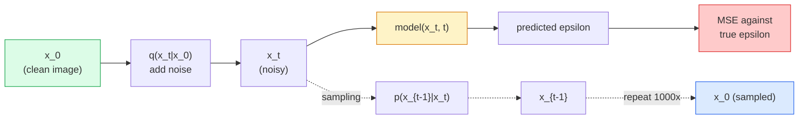

# 图像生成——扩散模型

> 扩散模型（diffusion model）学习的是去噪。训练它从带噪图像中去除一点点噪声，再沿反向过程重复一千次，就得到了一个图像生成器。

**Type:** Build
**Languages:** Python
**Prerequisites:** 第 4 阶段第 07 课（U-Net）、第 1 阶段第 06 课（概率）、第 3 阶段第 06 课（优化器）
**Time:** ~75 分钟

## 学习目标

- 推导正向加噪过程（forward noising process）`x_0 -> x_1 -> ... -> x_T`，解释为什么闭式表达式（closed form）`q(x_t | x_0)` 对任意 t 都成立
- 实现去噪扩散概率模型（DDPM）式的训练目标，回归预测每一步加入的噪声，并实现一个从纯噪声逐步回到图像的采样器（sampler）
- 构建带有时间条件化（time conditioning）的 U-Net，预测任意时间步的噪声；模型要足够小，能在 CPU 上训练
- 解释 DDPM 与去噪扩散隐式模型（DDIM）的采样有何区别，以及各自适合什么场景（第 23 课会深入讲解流匹配（flow matching）与整流流（rectified flow））

## 要解决的问题

生成对抗网络（GAN）一次就能完成生成：输入噪声，经过一次前向传播（forward pass），输出图像。它们生成速度快，但难以训练。扩散模型则迭代生成：从纯噪声出发，一小步一小步地去噪，图像逐渐显现。它们生成速度慢，却容易训练。过去五年里，容易训练这一特点占了上风：任何小团队都能训练扩散模型，得到像样的样本；而训练 GAN 是一门需要经历多年失败尝试才能掌握的手艺。

除了训练稳定性，扩散模型的迭代结构还使现代图像生成的各项能力成为可能：文本条件化（text conditioning）、图像修复（inpainting）、图像编辑、超分辨率（super-resolution）和可控风格。采样循环的每一步都可以加入新的约束。正是这样的介入点，使 Stable Diffusion、Imagen、DALL-E 3、Midjourney，以及你会用到的所有可控图像模型，都采用了扩散机制。

本课构建最精简的 DDPM：正向加噪、反向去噪和训练循环。下一课（Stable Diffusion）会将它与变分自编码器（VAE）、文本编码器和无分类器引导（classifier-free guidance）组合起来，构成一个生产系统。

## 核心概念

### 正向过程

取一幅图像 `x_0`，加入少量高斯噪声（Gaussian noise），得到 `x_1`；再加入少量噪声，得到 `x_2`。持续进行 T 步，直到 `x_T` 与纯高斯噪声几乎无法区分。

```text
q(x_t | x_{t-1}) = N(x_t; sqrt(1 - beta_t) * x_{t-1},  beta_t * I)
```

`beta_t` 是一组较小的方差，按调度安排逐步变化，通常在 T=1000 步中从 0.0001 线性增加到 0.02。每一步都会略微衰减信号，并注入新的噪声。

### 用闭式表达式直接跳到指定时间步

逐步加噪构成一条马尔可夫链（Markov chain），但这些步骤可以在数学上合并：只需一步，就能直接从 `x_0` 抽样得到 `x_t`。

```text
Define alpha_t = 1 - beta_t
Define alpha_bar_t = prod_{s=1..t} alpha_s

Then:
  q(x_t | x_0) = N(x_t; sqrt(alpha_bar_t) * x_0,  (1 - alpha_bar_t) * I)

Equivalently:
  x_t = sqrt(alpha_bar_t) * x_0 + sqrt(1 - alpha_bar_t) * epsilon
  where epsilon ~ N(0, I)
```

扩散模型之所以可行，关键就在这一条公式。训练时随机选择一个 `t`，直接从 `x_0` 抽样得到 `x_t`，然后进行一步训练，无须模拟整条马尔可夫链。

### 反向过程

正向过程是固定的，神经网络要学习的是反向过程（reverse process）`p(x_{t-1} | x_t)`。扩散模型并不直接预测 `x_{t-1}`，而是预测第 t 步加入的噪声 `epsilon`，再通过数学公式由它推导出 `x_{t-1}`。



### 训练损失

每个训练步骤都执行以下操作：

1. 抽取一幅真实图像 `x_0`。
2. 从 [1, T] 中均匀抽样一个时间步 `t`。
3. 抽取噪声 `epsilon ~ N(0, I)`。
4. 计算 `x_t = sqrt(alpha_bar_t) * x_0 + sqrt(1 - alpha_bar_t) * epsilon`。
5. 用网络预测 `epsilon_theta(x_t, t)`。
6. 最小化 `|| epsilon - epsilon_theta(x_t, t) ||^2`。

就这么简单。神经网络学习预测任意时间步的噪声，损失函数采用均方误差（MSE）。没有对抗博弈，没有坍塌，也没有振荡。

### 采样器（DDPM）

生成时，从 `x_T ~ N(0, I)` 出发，沿反向过程逐步回退。

```text
for t = T, T-1, ..., 1:
    eps = model(x_t, t)
    x_{t-1} = (1 / sqrt(alpha_t)) * (x_t - (beta_t / sqrt(1 - alpha_bar_t)) * eps) + sqrt(beta_t) * z
    where z ~ N(0, I) if t > 1, else 0
return x_0
```

关键在于：一般情况下，逆向条件分布并没有已知的闭式表达式，但对于这里特定的高斯正向过程，它却有闭式表达式。那些看起来很复杂的系数，正是由 Bayes 规则（贝叶斯规则）推导得到的。

### 为什么需要 1000 步

正向噪声调度（noise schedule）的设计使每一步加入的噪声量恰好足以让反向步骤近似服从高斯分布。步数太少，反向步骤就会明显偏离高斯分布，网络难以对其准确建模；步数太多，采样成本又会升高，收益却越来越小。T=1000 配合线性调度是 DDPM 的默认设置。

### DDIM：采样提速 20 倍

训练保持不变，改变的只有采样。DDIM（Song 等，2020）定义了一个确定性的反向过程，无须重新训练就能跳过一些时间步。DDIM 采样 50 步，便能达到接近 DDPM 采样 1000 步的质量。所有生产系统都使用 DDIM 或更快的变体（DPM-Solver、Euler ancestral）。

### 时间条件化

网络 `epsilon_theta(x_t, t)` 需要知道自己正在为哪个时间步去噪。现代扩散模型通过正弦时间嵌入（sinusoidal time embeddings）注入 `t`，思路与 Transformer 中的位置编码（positional encoding）相同；这些嵌入会在 U-Net 的每一层级加到特征图（feature map）上。

```text
t_embedding = sinusoidal(t)
feature_map += MLP(t_embedding)
```

没有时间条件化，网络就必须从图像本身猜测噪声水平。这样也能工作，但样本效率会低得多。

```figure
cv-diffusion-image
```

## 动手实现

### 第 1 步：噪声调度

```python
import torch

def linear_beta_schedule(T=1000, beta_start=1e-4, beta_end=2e-2):
    return torch.linspace(beta_start, beta_end, T)


def precompute_schedule(betas):
    alphas = 1.0 - betas
    alphas_cumprod = torch.cumprod(alphas, dim=0)
    return {
        "betas": betas,
        "alphas": alphas,
        "alphas_cumprod": alphas_cumprod,
        "sqrt_alphas_cumprod": torch.sqrt(alphas_cumprod),
        "sqrt_one_minus_alphas_cumprod": torch.sqrt(1.0 - alphas_cumprod),
        "sqrt_recip_alphas": torch.sqrt(1.0 / alphas),
    }

schedule = precompute_schedule(linear_beta_schedule(T=1000))
```

预计算一次，训练和采样时按索引取出相应的值。

### 第 2 步：正向扩散（q_sample）

```python
def q_sample(x0, t, noise, schedule):
    sqrt_a = schedule["sqrt_alphas_cumprod"][t].view(-1, 1, 1, 1)
    sqrt_one_minus_a = schedule["sqrt_one_minus_alphas_cumprod"][t].view(-1, 1, 1, 1)
    return sqrt_a * x0 + sqrt_one_minus_a * noise
```

用一行代码实现闭式表达式。`t` 是一批时间步，批次中的每幅图像各对应一个。

### 第 3 步：带有时间条件化的微型 U-Net

```python
import torch.nn as nn
import torch.nn.functional as F
import math

def timestep_embedding(t, dim=64):
    half = dim // 2
    freqs = torch.exp(-math.log(10000) * torch.arange(half, device=t.device) / half)
    args = t[:, None].float() * freqs[None]
    emb = torch.cat([args.sin(), args.cos()], dim=-1)
    return emb


class TinyUNet(nn.Module):
    def __init__(self, img_channels=3, base=32, t_dim=64):
        super().__init__()
        self.t_mlp = nn.Sequential(
            nn.Linear(t_dim, base * 4),
            nn.SiLU(),
            nn.Linear(base * 4, base * 4),
        )
        self.t_dim = t_dim
        self.enc1 = nn.Conv2d(img_channels, base, 3, padding=1)
        self.enc2 = nn.Conv2d(base, base * 2, 4, stride=2, padding=1)
        self.mid = nn.Conv2d(base * 2, base * 2, 3, padding=1)
        self.dec1 = nn.ConvTranspose2d(base * 2, base, 4, stride=2, padding=1)
        self.dec2 = nn.Conv2d(base * 2, img_channels, 3, padding=1)
        self.time_proj = nn.Linear(base * 4, base * 2)

    def forward(self, x, t):
        t_emb = timestep_embedding(t, self.t_dim)
        t_emb = self.t_mlp(t_emb)
        t_proj = self.time_proj(t_emb)[:, :, None, None]

        h1 = F.silu(self.enc1(x))
        h2 = F.silu(self.enc2(h1)) + t_proj
        h3 = F.silu(self.mid(h2))
        d1 = F.silu(self.dec1(h3))
        d2 = torch.cat([d1, h1], dim=1)
        return self.dec2(d2)
```

这是一个具有两级结构的 U-Net，在瓶颈层（bottleneck）注入时间条件。处理真实图像时，可以增加网络的深度和宽度。

### 第 4 步：训练循环

```python
def train_step(model, x0, schedule, optimizer, device, T=1000):
    model.train()
    x0 = x0.to(device)
    bs = x0.size(0)
    t = torch.randint(0, T, (bs,), device=device)
    noise = torch.randn_like(x0)
    x_t = q_sample(x0, t, noise, schedule)
    pred = model(x_t, t)
    loss = F.mse_loss(pred, noise)
    optimizer.zero_grad()
    loss.backward()
    optimizer.step()
    return loss.item()
```

这就是完整的训练循环。没有 GAN 式的博弈，没有专门设计的损失，只需调用一次 MSE。

### 第 5 步：采样器（DDPM）

```python
@torch.no_grad()
def sample(model, schedule, shape, T=1000, device="cpu"):
    model.eval()
    x = torch.randn(shape, device=device)
    betas = schedule["betas"].to(device)
    sqrt_one_minus_a = schedule["sqrt_one_minus_alphas_cumprod"].to(device)
    sqrt_recip_alphas = schedule["sqrt_recip_alphas"].to(device)

    for t in reversed(range(T)):
        t_batch = torch.full((shape[0],), t, dtype=torch.long, device=device)
        eps = model(x, t_batch)
        coef = betas[t] / sqrt_one_minus_a[t]
        mean = sqrt_recip_alphas[t] * (x - coef * eps)
        if t > 0:
            x = mean + torch.sqrt(betas[t]) * torch.randn_like(x)
        else:
            x = mean
    return x
```

生成一批样本需要 1000 次前向传播。实际编程时，你会将它替换为一个采样 50 步的 DDIM 采样器。

### 第 6 步：DDIM 采样器（确定性，提速约 20 倍）

```python
@torch.no_grad()
def sample_ddim(model, schedule, shape, steps=50, T=1000, device="cpu", eta=0.0):
    model.eval()
    x = torch.randn(shape, device=device)
    alphas_cumprod = schedule["alphas_cumprod"].to(device)

    ts = torch.linspace(T - 1, 0, steps + 1).long()
    for i in range(steps):
        t = ts[i]
        t_prev = ts[i + 1]
        t_batch = torch.full((shape[0],), t, dtype=torch.long, device=device)
        eps = model(x, t_batch)
        a_t = alphas_cumprod[t]
        a_prev = alphas_cumprod[t_prev] if t_prev >= 0 else torch.tensor(1.0, device=device)
        x0_pred = (x - torch.sqrt(1 - a_t) * eps) / torch.sqrt(a_t)
        sigma = eta * torch.sqrt((1 - a_prev) / (1 - a_t) * (1 - a_t / a_prev))
        dir_xt = torch.sqrt(1 - a_prev - sigma ** 2) * eps
        noise = sigma * torch.randn_like(x) if eta > 0 else 0
        x = torch.sqrt(a_prev) * x0_pred + dir_xt + noise
    return x
```

`eta=0` 时完全确定：相同的噪声输入始终产生相同的输出。`eta=1` 则恢复为 DDPM。

## 实际使用

在生产工作中，使用 `diffusers`：

```python
from diffusers import DDPMScheduler, UNet2DModel

unet = UNet2DModel(sample_size=32, in_channels=3, out_channels=3, layers_per_block=2)
scheduler = DDPMScheduler(num_train_timesteps=1000)
```

这个库提供现成的调度器（scheduler，包括 DDPM、DDIM、DPM-Solver、Euler、Heun）、可配置的 U-Net、用于文生图和图生图的管线，以及 LoRA（低秩适配）微调（fine-tuning）辅助工具。

研究时，`k-diffusion`（Katherine Crowson）提供了最忠实的参考实现和最佳采样变体。

## 交付成果

本课产出：

- `outputs/prompt-diffusion-sampler-picker.md`：一个提示词（prompt），根据质量目标、延迟预算和条件类型，在 DDPM / DDIM / DPM-Solver / Euler 中选择采样器。
- `outputs/skill-noise-schedule-designer.md`：一个技能（skill），根据 T 和目标噪声破坏程度，生成线性、余弦或 sigmoid 的 beta 调度，并提供信噪比（signal-to-noise ratio）随时间变化的诊断图。

## 练习

1. **（简单）** 可视化正向过程：取一幅图像，绘制 `t in [0, 100, 250, 500, 750, 1000]` 时的 `x_t`。验证 `x_1000` 看起来像纯高斯噪声。
2. **（中等）** 在合成圆形数据集上训练 TinyUNet，共训练 20 轮（epoch），并采样生成 16 个圆形。比较 DDPM（1000 步）和 DDIM（50 步）的采样：使用相同噪声种子时，它们是否生成相似的图像？
3. **（困难）** 实现余弦噪声调度（Nichol & Dhariwal，2021）：`alpha_bar_t = cos^2((t/T + s) / (1 + s) * pi / 2)`。分别用线性调度和余弦调度训练同一个模型，展示余弦调度在采样步数较少时能生成更好的样本。

## 关键术语

| 术语 | 常见说法 | 实际含义 |
|------|----------------|----------------------|
| 正向过程 | “随时间加噪” | 固定的马尔可夫链，用 T 步对图像逐渐加噪，使其变为高斯噪声 |
| 反向过程 | “逐步去噪” | 学习得到的分布，用于从噪声逐步回到图像 |
| Epsilon 预测 | “预测噪声” | 训练目标：`epsilon_theta(x_t, t)` 预测第 t 步加入的噪声 |
| Beta 调度 | “每步的噪声量” | 由 T 个较小方差组成的序列，决定每步注入多少噪声 |
| alpha_bar_t | “累计保留因子” | 直到时间 t 为止的 (1 - beta_s) 的乘积；t 越大，剩余信号越少 |
| DDPM 采样器 | “祖先抽样，随机” | 从各自的条件高斯分布中抽样得到每个 x_{t-1}；共 1000 步 |
| DDIM 采样器 | “确定性，快速” | 将采样改写为确定性的常微分方程（ODE）；用 20-100 步达到相近质量 |
| 时间条件化 | “告诉模型是哪个 t” | 将 t 的正弦嵌入注入 U-Net，让它知道噪声水平 |

## 延伸阅读

- [Denoising Diffusion Probabilistic Models (Ho et al., 2020)](https://arxiv.org/abs/2006.11239)：让扩散模型走向实用、并在 FID 指标上击败 GAN 的论文
- [Improved DDPM (Nichol & Dhariwal, 2021)](https://arxiv.org/abs/2102.09672)：余弦调度与 v 参数化
- [DDIM (Song, Meng, Ermon, 2020)](https://arxiv.org/abs/2010.02502)：使实时推理成为可能的确定性采样器
- [Elucidating the Design Space of Diffusion (Karras et al., 2022)](https://arxiv.org/abs/2206.00364)：统一梳理扩散模型的各种设计选择，是当前最佳参考资料
