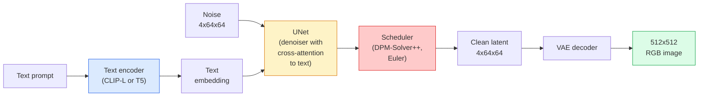

# Stable Diffusion — 架构与微调

> Stable Diffusion 是一种在预训练变分自编码器（VAE）的潜在空间中运行的去噪扩散概率模型（DDPM）：它通过交叉注意力（cross-attention）以文本为条件，使用快速的确定性常微分方程（ODE）求解器采样，并由无分类器引导（classifier-free guidance）控制生成方向。

**Type:** Learn + Use
**Languages:** Python
**Prerequisites:** 阶段 4 第 10 课（扩散），阶段 7 第 02 课（自注意力）
**Time:** 约 75 分钟

## 学习目标

- 梳理 Stable Diffusion 管线（pipeline）的五个组成部分：VAE、文本编码器、U-Net、调度器和安全检查器，并说明它们各自的实际作用
- 解释潜在扩散（latent diffusion），以及为何在 4x64x64 的潜在空间中训练，而非直接处理 3x512x512 的图像，能将计算量降低 48 倍而不损失质量
- 使用 `diffusers` 生成图像，完成图生图、图像修补（inpainting）和 ControlNet 引导的生成
- 在小规模自定义数据集上用 LoRA（低秩适配）微调（fine-tuning）Stable Diffusion，并在推理时加载 LoRA 适配器（adapter）

## 要解决的问题

直接在 512x512 的 RGB（红绿蓝）图像上训练 DDPM，成本很高。每个训练步都要通过 U-Net 进行反向传播，而 U-Net 接收的输入值有 3x512x512 = 786,432 个；采样时，还要让同一个 U-Net 执行 50+ 次前向传播。若要达到 Stable Diffusion 1.5（2022 年发布）的质量水平，像素空间中的扩散模型大约需要 256 GPU 月的训练量，在消费级 GPU 上生成每张图像则要 10-30 秒。

让开放权重的文生图模型变得实用的关键，是**潜在扩散**（Rombach 等，CVPR 2022）。先训练一个 VAE，将 3x512x512 的图像映射为 4x64x64 的潜在张量（tensor），再将其还原为图像；随后，在这个潜在空间中进行扩散。计算量缩减的倍数为 `(3*512*512)/(4*64*64) = 48x`。在同一块 GPU 上，采样耗时从几十秒降到不到两秒。

几乎所有现代图像生成模型，包括 SDXL、SD3、FLUX、HunyuanDiT 和 Wan-Video，都是潜在扩散模型，差别在于自编码器、去噪器（U-Net 或 DiT）以及文本条件的具体设计。学会 Stable Diffusion，也就掌握了这套基本范式。

## 核心概念

### 管线



- **VAE**：冻结的自编码器。编码器将图像转为潜在表示，用于 img2img 和训练；解码器将潜在表示还原为图像。
- **文本编码器**：可以是 CLIP 文本编码器（SD 1.x/2.x）、CLIP-L + CLIP-G（SDXL），或 T5-XXL（SD3/FLUX）。它输出一个由 token（词元）嵌入（embedding）组成的序列。
- **U-Net**：去噪器。它在每个分辨率层级都设有交叉注意力层，让潜在表示关注文本嵌入。
- **调度器**：采样算法，例如 DDIM、Euler、DPM-Solver++。它选择 sigma 值，并将预测噪声混合回潜在表示。
- **安全检查器**：可选的输出图像过滤器，用于过滤 NSFW（不宜在工作场所观看的内容）或违法内容。

### 无分类器引导（CFG）

普通的文本条件建模，会针对每个提示词（prompt）`c` 学习 `epsilon_theta(x_t, t, c)`。CFG 在训练同一个网络时，有 10% 的概率丢弃 `c`，用空嵌入替代。这样，一个模型就能同时预测有条件和无条件的噪声。推理时：

```text
eps = eps_uncond + w * (eps_cond - eps_uncond)
```

`w` 是引导强度（guidance scale）。`w=0` 表示无条件生成，`w=1` 表示普通的有条件生成；`w>1` 会让输出更贴合提示词，但会牺牲多样性。SD 的默认值是 `w=7.5`。

CFG 是文生图能够达到生产级质量的原因。没有它，提示词只能轻微影响输出的倾向；有了它，提示词就能主导输出。

### 潜在空间的几何结构

VAE 的 4 通道潜在表示不只是压缩后的图像。它所在的空间是一个流形（manifold）：其中的算术运算大致对应语义编辑，提示词工程与插值都在这里发挥作用；扩散 U-Net 也经过训练，将全部建模资源投入这一空间。解码一个随机的 4x64x64 潜在表示，并不会得到一张只是看起来随机的图像，而会得到无意义的输出，因为只有特定潜在子流形中的表示才能解码为有效图像。

这带来两个结果：

1. **Img2img（图生图）** = 将图像编码为潜在表示，加入部分噪声，运行去噪器，再解码。由于编码过程近似可逆，图像结构得以保留，而内容会根据提示词变化。
2. **图像修补（Inpainting）** = 与 img2img 相同，但去噪器只更新掩码覆盖的区域；未被掩码覆盖的区域则保持编码得到的潜在表示不变。

### U-Net 架构

SD 的 U-Net 是第 10 课 TinyUNet 的放大版本，并增加了三项设计：

- 每个空间分辨率层级都有 **Transformer 块**，其中包含自注意力（self-attention），以及面向文本嵌入的交叉注意力。
- **时间嵌入**：用多层感知机（MLP）处理正弦编码得到。
- **跳跃连接（skip connections）**：连接编码器与解码器中分辨率相匹配的层。

SD 1.5 的参数总量约为 860M，SDXL 约为 2.6B，FLUX 约为 12B。参数量的增长主要集中在注意力层。

### LoRA 微调

Stable Diffusion 的全量微调需要 20+ GB 的 VRAM（显存），并更新 860M 个参数。LoRA（Low-Rank Adaptation）冻结基座模型（base model），向注意力层注入小型低秩分解矩阵。SD 的 LoRA 适配器通常为 10-50 MB，在单块消费级 GPU 上训练需要 10-60 分钟，并可在推理时直接加载来调整模型。

```text
Original: W_q : (d_in, d_out)   frozen
LoRA:     W_q + alpha * (A @ B)   where A : (d_in, r), B : (r, d_out)

r is typically 4-32.
```

几乎所有社区微调模型都以 LoRA 的形式分发。CivitAI 和 Hugging Face 托管了数百万个这样的适配器。

### 常见的调度器

- **DDIM**：确定性，约 50 步，简单。
- **Euler ancestral**：随机性，30-50 步，生成的样本略有更多创意。
- **DPM-Solver++ 2M Karras**：确定性，20-30 步，是生产环境中的默认选择。
- **LCM / TCD / Turbo**：一致性模型及蒸馏变体；只需 1-4 步，但会牺牲部分质量。

在 `diffusers` 中，更换调度器只需改一行代码，有时无需重新训练就能解决生成样本的问题。

```figure
cv3-latent-compression
```

## 动手实现

本课全程使用 `diffusers`，而不是从零重建 Stable Diffusion。需要重建的各个组成部分，包括 VAE、文本编码器、U-Net 和调度器，都有各自对应的课程；这里的目标是熟练使用生产环境中的 API（应用程序编程接口）。

### 第 1 步：文生图

```python
import torch
from diffusers import StableDiffusionPipeline

pipe = StableDiffusionPipeline.from_pretrained(
    "runwayml/stable-diffusion-v1-5",
    torch_dtype=torch.float16,
).to("cuda")

image = pipe(
    prompt="a dog riding a skateboard in tokyo, studio ghibli style",
    guidance_scale=7.5,
    num_inference_steps=25,
    generator=torch.Generator("cuda").manual_seed(42),
).images[0]
image.save("dog.png")
```

`float16` 能将显存占用减半，且没有可见的质量损失。使用默认的 DPM-Solver++ 时，`num_inference_steps=25` 的效果可媲美 DDIM 的 `num_inference_steps=50`。

### 第 2 步：更换调度器

```python
from diffusers import DPMSolverMultistepScheduler, EulerAncestralDiscreteScheduler

pipe.scheduler = DPMSolverMultistepScheduler.from_config(pipe.scheduler.config)
pipe.scheduler = EulerAncestralDiscreteScheduler.from_config(pipe.scheduler.config)
```

调度器的状态与 U-Net 权重解耦。你可以使用 DDPM 训练，再使用任意调度器采样。

### 第 3 步：图生图

```python
from diffusers import StableDiffusionImg2ImgPipeline
from PIL import Image

img2img = StableDiffusionImg2ImgPipeline.from_pretrained(
    "runwayml/stable-diffusion-v1-5",
    torch_dtype=torch.float16,
).to("cuda")

init_image = Image.open("dog.png").convert("RGB").resize((512, 512))
out = img2img(
    prompt="a dog riding a skateboard, oil painting",
    image=init_image,
    strength=0.6,
    guidance_scale=7.5,
).images[0]
```

`strength` 表示去噪前加入多少噪声，0.0 = 保持不变，1.0 = 完全重新生成。风格迁移的常用范围是 0.5-0.7。

### 第 4 步：图像修补

```python
from diffusers import StableDiffusionInpaintPipeline

inpaint = StableDiffusionInpaintPipeline.from_pretrained(
    "runwayml/stable-diffusion-inpainting",
    torch_dtype=torch.float16,
).to("cuda")

image = Image.open("dog.png").convert("RGB").resize((512, 512))
mask = Image.open("dog_mask.png").convert("L").resize((512, 512))

out = inpaint(
    prompt="a cat",
    image=image,
    mask_image=mask,
    guidance_scale=7.5,
).images[0]
```

掩码中的白色像素表示需要重新生成的区域，黑色像素表示要保留的区域。

### 第 5 步：加载 LoRA

```python
pipe.load_lora_weights(
    "artificialguybr/studioghibli-redmond-1-5v-studio-ghibli-lora-for-liberteredmond-sd-1-5",
    weight_name="StudioGhibliRedmond-15V-LiberteRedmond-StdGBRedmAF-StudioGhibli.safetensors",
)
pipe.fuse_lora(lora_scale=0.8)

image = pipe(prompt="a village square, StdGBRedmAF, Studio Ghibli").images[0]
```

模型卡中的触发短语（`StdGBRedmAF, Studio Ghibli`）用于启用这种风格。`lora_scale` 控制强度：0.0 = 无效果，1.0 = 完整效果。`fuse_lora` 会就地将适配器融合进权重以提高速度，但这样就无法切换适配器了。加载另一个适配器前，需要调用 `pipe.unfuse_lora()`。

### 第 6 步：LoRA 训练概要

实际的 LoRA 训练由 `peft` 或 `diffusers.training` 实现。其大致流程如下：

```python
# Pseudocode
for step, batch in enumerate(dataloader):
    images, prompts = batch
    latents = vae.encode(images).latent_dist.sample() * 0.18215

    t = torch.randint(0, num_train_timesteps, (batch_size,))
    noise = torch.randn_like(latents)
    noisy_latents = scheduler.add_noise(latents, noise, t)

    text_emb = text_encoder(tokenizer(prompts))

    pred_noise = unet(noisy_latents, t, text_emb)  # LoRA weights injected here

    loss = F.mse_loss(pred_noise, noise)
    loss.backward()
    optimizer.step()
```

只有 LoRA 矩阵接收梯度；基座 U-Net、VAE 和文本编码器都保持冻结。将批量大小设为 1，并使用梯度检查点（gradient checkpointing），就能在 8 GB 显存内完成这项训练。

## 实际使用

在生产环境中，你实际需要作出的选择包括：

- **模型家族**：需要开源社区微调模型时选 SD 1.5，需要更高保真度时选 SDXL；需要最先进的效果且有严格许可要求时，选 SD3 / FLUX。
- **调度器**：20-30 步选 DPM-Solver++ 2M Karras；延迟要求低于 1s 时选 LCM-LoRA。
- **精度**：4080/4090 使用 `float16`，A100 及更新型号使用 `bfloat16`；显存紧张时，使用 `int8`，通过 `bitsandbytes` 或 `compel` 实现。
- **条件输入**：纯文本即可使用；需要更强控制时，在基础管线之上加入 ControlNet，提供 canny、深度或姿态条件。

批量生成可使用社区工具 `AUTO1111` / `ComfyUI`；生产 API 则可使用 `diffusers` + `accelerate`，或配合 TensorRT 编译的 `optimum-nvidia`。

## 交付成果

本课产出：

- `outputs/prompt-sd-pipeline-planner.md`：一份提示词，根据延迟预算、保真度目标和许可约束，在 SD 1.5 / SDXL / SD3 / FLUX 中选择模型，并确定调度器和精度。
- `outputs/skill-lora-training-setup.md`：一项技能，为自定义数据集编写完整的 LoRA 训练配置，包括图像描述、秩、批量大小和学习率。

## 练习

1. **（简单）** 对同一提示词，将 `guidance_scale` 分别设为 `[1, 3, 5, 7.5, 10, 15]` 来生成图像。描述图像如何变化。在多大的引导强度下会出现伪影？
2. **（中等）** 选一张真实照片，通过 `StableDiffusionImg2ImgPipeline` 处理，将 `strength` 分别设为 `[0.2, 0.4, 0.6, 0.8, 1.0]`。哪个强度既能保留构图，又能改变风格？为什么 1.0 会完全忽略输入？
3. **（困难）** 用同一主体的 10-20 张图像训练 LoRA，主体可以是宠物、标志或角色，然后生成包含该主体的新场景。报告哪些 LoRA 秩与训练步数，能在不过拟合输入图像的前提下，最好地保留主体身份特征。

## 关键术语

| 术语 | 常见说法 | 实际含义 |
|------|----------------|----------------------|
| 潜在扩散 | “在潜在表示中扩散” | 在 VAE 潜在空间（4x64x64）而非像素空间（3x512x512）中运行整个 DDPM；节省 48 倍的计算开销 |
| VAE 缩放因子 | “0.18215” | 将 VAE 的原始潜在表示重新缩放至近似单位方差的常数；在每条 SD 管线中硬编码 |
| 无分类器引导 | “CFG” | 混合有条件和无条件的噪声预测；对效果影响最大的单个推理调节参数 |
| 调度器 | “采样器” | 将噪声 + 模型预测转化为去噪潜在轨迹的算法 |
| LoRA | “低秩适配器” | 小型低秩分解矩阵，可在不改动基座权重的情况下微调注意力层 |
| 交叉注意力 | “文图注意力” | 从潜在 token 到文本 token 的注意力；在 U-Net 的每个层级注入提示词信息 |
| ControlNet | “结构条件” | 单独训练的适配器，通过额外输入（canny、深度、姿态、分割）引导 SD |
| DPM-Solver++ | “默认调度器” | 二阶确定性 ODE 求解器；在 2026 年，以较少步数（20-30）获得最佳质量 |

## 延伸阅读

- [High-Resolution Image Synthesis with Latent Diffusion（Rombach 等，2022）](https://arxiv.org/abs/2112.10752)：Stable Diffusion 论文，包含为各项设计提供依据的全部消融实验
- [Classifier-Free Diffusion Guidance（Ho 与 Salimans，2022）](https://arxiv.org/abs/2207.12598)：介绍 CFG 的论文
- [LoRA: Low-Rank Adaptation of Large Language Models（Hu 等，2021）](https://arxiv.org/abs/2106.09685)：LoRA 最初用于 NLP，几乎不作改动就迁移到了 SD
- [diffusers 文档](https://huggingface.co/docs/diffusers)：各类 SD / SDXL / SD3 / FLUX 管线的参考文档
