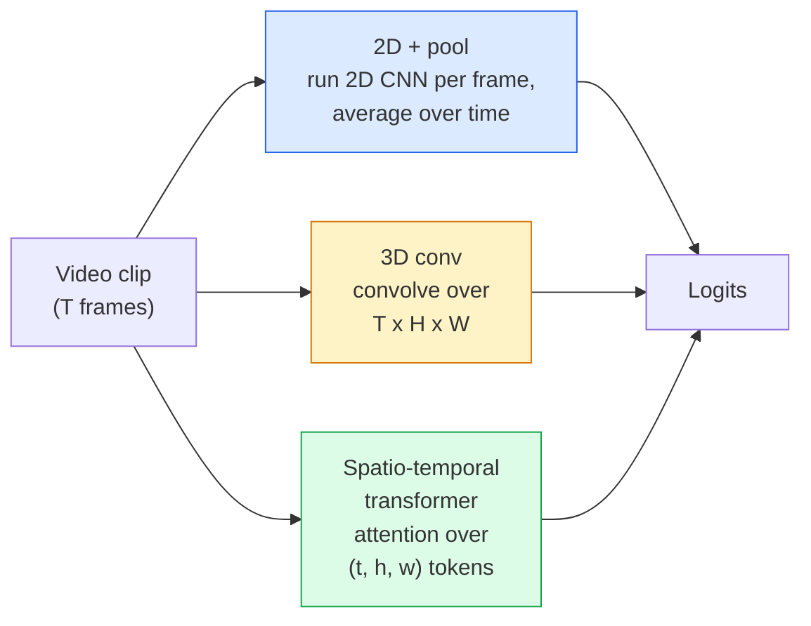

# 视频理解：时序建模

> 视频由一系列图像以及将它们联系起来的物理规律构成。视频模型处理时间的方式无非三种：将其视为额外的轴（3D 卷积）、需要施加注意力的序列（Transformer），或只提取一次再做池化的特征（2D+pool）。

**Type:** Learn + Build
**Languages:** Python
**Prerequisites:** 阶段 4 第 03 课（CNNs），阶段 4 第 04 课（图像分类）
**Time:** ~45 分钟

## 学习目标

- 区分视频建模的三种主要方法（2D+pool、3D 卷积、时空 Transformer），并预判它们在计算成本和准确率之间的权衡
- 在 PyTorch 中实现帧采样、时序池化和一个 2D+pool 基线分类器
- 解释为什么 I3D 的“膨胀”3D 卷积核能够有效迁移 ImageNet 权重，以及分解式 (2+1)D 卷积有何不同
- 了解标准的动作识别数据集和指标：Kinetics-400/600、UCF101、Something-Something V2；片段级和视频级的 top-1 准确率

## 要解决的问题

一段时长 30 秒、帧率 30 fps 的视频包含 900 张图像。最直观的视频分类方法，就是做 900 次图像分类，再以某种方式汇总结果。如果几乎每一帧都能看出正在做什么（例如体育、烹饪、健身视频），这种方法就有效；但如果动作由运动本身定义，它就会严重失效：“把某个东西从左向右推”，在任意单帧中看起来都只是两个静止的物体。

每种视频架构都要回答一个核心问题：何时对时序结构建模，又如何建模？答案决定了其他一切：计算成本、预训练策略、能否复用 ImageNet 权重，以及用什么数据集训练模型。

本课有意比静态图像课程短。核心的图像处理机制已经具备，视频理解主要关注的是时间维度上的几个环节：采样、建模和汇总。

## 核心概念

### 三类架构



### 2D + pool

选一个 2D 卷积神经网络（CNN，例如 ResNet、EfficientNet、ViT），在每个采样帧上分别运行。对各帧的嵌入（embedding）取平均值，或做最大池化、注意力池化，再把池化后的向量送入分类器。

优点：
- ImageNet 预训练得到的能力可以直接迁移。
- 实现最简单。
- 成本低：T 帧 * 单张图像的推理成本。

缺点：
- 无法对运动建模。动作 = 外观的汇总。
- 时序池化具有顺序不变性；“开门”和“关门”看起来没有区别。

适用场景：以外观信息为主的任务、小型视频数据集上的迁移学习（transfer learning）、初始基线。

### 3D 卷积

将 2D (H, W) 卷积核替换为 3D (T, H, W) 卷积核。网络同时沿空间和时间维度做卷积。早期的架构家族包括 C3D、I3D、SlowFast。

I3D 的技巧是：取一个预训练的 2D ImageNet 模型，沿新增的时间轴复制每个 2D 卷积核，将其“膨胀”（inflation）。一个 3x3 的 2D 卷积就变成了 3x3x3 的 3D 卷积。这样，3D 模型便获得了强大的预训练权重，不必从零训练。

优点：
- 直接对运动建模。
- I3D 膨胀无需额外代价就能实现迁移学习。

缺点：
- FLOPs 比对应的 2D 模型增加 T/8（时间卷积核大小为 3、堆叠 3 次时）。
- 时间卷积核较小；长程运动需要金字塔或双流方法。

适用场景：以运动为信号的动作识别，例如 Something-Something V2，以及 Kinetics 中以运动为主的类别。

### 时空 Transformer

将视频划分为网格状的时空块，并将其转换为 token（词元，此处对应时空块），再在所有这些块之间计算注意力。代表模型有 TimeSformer、ViViT、Video Swin、VideoMAE。

需要关注的注意力模式：
- **联合式（Joint）**：在 (t, h, w) 上做一次大规模注意力计算。复杂度随 `T*H*W` 呈二次增长，成本很高。
- **分离式（Divided）**：每个块内做两次注意力计算，一次沿时间，一次沿空间。计算成本近似线性增长。
- **分解式（Factorised）**：在不同块之间交替使用时间注意力和空间注意力。

优点：
- 在所有主要基准上都达到最先进的（SOTA）准确率。
- 通过图像块膨胀，从图像 Transformer（ViT）迁移权重。
- 通过稀疏注意力支持长上下文视频。

缺点：
- 计算需求很高。
- 必须仔细选择注意力模式，否则运行时间会急剧增加。

适用场景：大型数据集、高保真视频理解、多模态视频+文本任务。

### 帧采样

一段时长 10 秒、帧率 30 fps 的片段包含 300 帧；不论使用什么模型，把全部 300 帧都送进去都是浪费。标准策略如下：

- **均匀采样（Uniform sampling）**：在整个片段中均匀选取 T 帧。2D+pool 的默认选择。
- **密集采样（Dense sampling）**：随机选取一个连续的 T 帧窗口。3D 卷积常用这种方法，因为运动需要相邻帧才能体现。
- **多片段采样（Multi-clip）**：从同一视频中采样多个 T 帧窗口，分别分类，并在测试时对预测取平均。

T 通常为 8、16、32 或 64。更大的 T = 更多时序信号，同时也意味着更多计算。

### 评估

分为两个层级：
- **片段级准确率（Clip-level accuracy）**：模型看到一个 T 帧片段，并报告 top-k。
- **视频级准确率（Video-level accuracy）**：对每个视频的多个片段级预测取平均；准确率更高，也更稳定。

始终同时报告这两项指标。片段级准确率为 78%、视频级为 82% 的模型，很大程度上依赖测试时的平均操作；两项分别为 80% / 81% 的模型，单个片段上的表现更稳健。

### 你会遇到的数据集

- **Kinetics-400 / 600 / 700**：通用动作数据集。包含 400k 个片段，提供 YouTube URL（许多现已失效）。
- **Something-Something V2**：以运动定义的动作（“把 X 从左向右移动”）。2D+pool 无法解决这类任务。
- **UCF-101**、**HMDB-51**：年代较早、规模较小，但仍会报告这些数据集上的结果。
- **AVA**：在空间和时间中进行动作*定位*，比分类更难。

```figure
v4-video-temporal
```

## 动手实现

### 步骤 1：帧采样器

实现适用于帧列表或视频张量（tensor）的均匀采样器和密集采样器。

```python
import numpy as np

def sample_uniform(num_frames_total, T):
    if num_frames_total <= T:
        return list(range(num_frames_total)) + [num_frames_total - 1] * (T - num_frames_total)
    step = num_frames_total / T
    return [int(i * step) for i in range(T)]


def sample_dense(num_frames_total, T, rng=None):
    rng = rng or np.random.default_rng()
    if num_frames_total <= T:
        return list(range(num_frames_total)) + [num_frames_total - 1] * (T - num_frames_total)
    start = int(rng.integers(0, num_frames_total - T + 1))
    return list(range(start, start + T))
```

两者都会返回 `T` 个索引，用于对视频张量做切片。

### 步骤 2：一个 2D+pool 基线

在每一帧上运行 2D ResNet-18，对特征做平均池化，再进行分类。

```python
import torch
import torch.nn as nn
from torchvision.models import resnet18, ResNet18_Weights

class FramePool(nn.Module):
    def __init__(self, num_classes=400, pretrained=True):
        super().__init__()
        weights = ResNet18_Weights.IMAGENET1K_V1 if pretrained else None
        backbone = resnet18(weights=weights)
        self.features = nn.Sequential(*(list(backbone.children())[:-1]))  # global avg pool kept
        self.head = nn.Linear(512, num_classes)

    def forward(self, x):
        # x: (N, T, 3, H, W)
        N, T = x.shape[:2]
        x = x.view(N * T, *x.shape[2:])
        feats = self.features(x).view(N, T, -1)
        pooled = feats.mean(dim=1)
        return self.head(pooled)

model = FramePool(num_classes=10)
x = torch.randn(2, 8, 3, 224, 224)
print(f"output: {model(x).shape}")
print(f"params: {sum(p.numel() for p in model.parameters()):,}")
```

一千一百万个参数，经过 ImageNet 预训练：逐帧运行、取平均、分类。在以外观信息为主的任务上，这个基线与真正的 3D 模型之间的差距通常在 5-10 个百分点以内；有时甚至表现更好，因为它复用了更强的 ImageNet 主干网络（backbone）。

### 步骤 3：I3D 风格的膨胀 3D 卷积

沿新增的时间轴重复权重，将单个 2D 卷积变成 3D 卷积。

```python
def inflate_2d_to_3d(conv2d, time_kernel=3):
    out_c, in_c, kh, kw = conv2d.weight.shape
    weight_3d = conv2d.weight.data.unsqueeze(2)  # (out, in, 1, kh, kw)
    weight_3d = weight_3d.repeat(1, 1, time_kernel, 1, 1) / time_kernel
    conv3d = nn.Conv3d(in_c, out_c, kernel_size=(time_kernel, kh, kw),
                        padding=(time_kernel // 2, conv2d.padding[0], conv2d.padding[1]),
                        stride=(1, conv2d.stride[0], conv2d.stride[1]),
                        bias=False)
    conv3d.weight.data = weight_3d
    return conv3d

conv2d = nn.Conv2d(3, 64, kernel_size=3, padding=1, bias=False)
conv3d = inflate_2d_to_3d(conv2d, time_kernel=3)
print(f"2D weight shape:  {tuple(conv2d.weight.shape)}")
print(f"3D weight shape:  {tuple(conv3d.weight.shape)}")
x = torch.randn(1, 3, 8, 56, 56)
print(f"3D output shape:  {tuple(conv3d(x).shape)}")
```

除以 `time_kernel`，可以让激活值的幅度大致保持不变。这很重要，能避免在第一次前向传播时破坏批量归一化（BN）的统计量。

### 步骤 4：分解式 (2+1)D 卷积

把一个 3D 卷积分成一个 2D 空间卷积和一个 1D 时间卷积。感受野（receptive field）相同，参数更少，在某些基准上的准确率更高。

```python
class Conv2Plus1D(nn.Module):
    def __init__(self, in_c, out_c, kernel_size=3):
        super().__init__()
        mid_c = (in_c * out_c * kernel_size * kernel_size * kernel_size) \
                // (in_c * kernel_size * kernel_size + out_c * kernel_size)
        self.spatial = nn.Conv3d(in_c, mid_c, kernel_size=(1, kernel_size, kernel_size),
                                 padding=(0, kernel_size // 2, kernel_size // 2), bias=False)
        self.bn = nn.BatchNorm3d(mid_c)
        self.act = nn.ReLU(inplace=True)
        self.temporal = nn.Conv3d(mid_c, out_c, kernel_size=(kernel_size, 1, 1),
                                  padding=(kernel_size // 2, 0, 0), bias=False)

    def forward(self, x):
        return self.temporal(self.act(self.bn(self.spatial(x))))

c = Conv2Plus1D(3, 64)
x = torch.randn(1, 3, 8, 56, 56)
print(f"(2+1)D output: {tuple(c(x).shape)}")
```

完整的 R(2+1)D 网络，就相当于把 ResNet-18 中的每个 3x3 卷积都替换为 `Conv2Plus1D`。

## 实际使用

以下两个库可以覆盖生产环境中的视频任务：

- `torchvision.models.video`：提供带 Kinetics 预训练权重的 R(2+1)D、MViT、Swin3D。API（应用程序编程接口）与图像模型相同。
- `pytorchvideo`（Meta）：提供模型库、Kinetics / SSv2 / AVA 数据加载器，以及标准变换。

对于视觉—语言视频模型，例如视频描述生成、视频问答，可使用 `transformers`（`VideoMAE`、`VideoLLaMA`、`InternVideo`）。

## 交付成果

本课产出：

- `outputs/prompt-video-architecture-picker.md`：一个提示词（prompt），根据外观与运动的重要性、数据集规模和计算预算，在 2D+pool / I3D / (2+1)D / Transformer 之间做选择。
- `outputs/skill-frame-sampler-auditor.md`：一个技能，用于检查视频管线（pipeline）的采样器，标记常见错误：索引偏一、`num_frames < T` 时采样不均匀、缺少保持宽高比的裁剪等。

## 练习

1. **（简单）** 估算 T=8 的 FramePool 与 T=8 的 I3D 风格 3D ResNet 的 FLOPs。说明为什么 2D+pool 在计算成本上有 3-5x 的优势。
2. **（中等）** 生成一个合成视频数据集：让随机小球沿随机方向运动，按运动方向标注（“从左向右”“从右向左”“斜向上”）。在该数据集上训练 FramePool。展示其准确率接近随机猜测水平，以此证明仅凭外观不足以完成运动任务。
3. **（困难）** 将 ResNet-18 中的每个 Conv2d 替换为 `Conv2Plus1D`，构建 R(2+1)D-18。从经过 ImageNet 预训练的 ResNet-18 中取第一层卷积的权重并做膨胀。在练习 2 的运动数据集上训练，使其超过 FramePool。

## 关键术语

| 术语 | 常见说法 | 实际含义 |
|------|----------------|----------------------|
| 2D + pool | “逐帧分类器” | 在每个采样帧上运行 2D CNN，沿时间对特征做平均池化，再进行分类 |
| 3D 卷积 | “时空卷积核” | 沿 (T, H, W) 做卷积的核；本身就能对运动建模 |
| 膨胀（Inflation） | “将 2D 权重提升到 3D” | 沿新增的时间轴重复 2D 卷积的权重，以此初始化 3D 卷积权重，再除以 kernel_T 以保持激活值尺度 |
| (2+1)D | “分解式卷积” | 将 3D 分解为 2D 空间卷积 + 1D 时间卷积；参数更少，中间还多了一次非线性变换 |
| 分离式注意力（Divided attention） | “先时间，后空间” | 每层有两次注意力计算的 Transformer 块：一次处理同一帧的 token，另一次处理同一位置的 token |
| 片段（Clip） | “T 帧窗口” | 采样得到的 T 帧子序列；视频模型接收的单位 |
| 片段级与视频级准确率 | “两种评估设置” | 片段级 = 每个视频取一个样本，视频级 = 对多个采样片段取平均 |
| Kinetics | “视频领域的 ImageNet” | 包含 400-700 个动作类别、300k+ 个 YouTube 片段，是标准的视频预训练语料库 |

## 延伸阅读

- [I3D: Quo Vadis, Action Recognition (Carreira & Zisserman, 2017)](https://arxiv.org/abs/1705.07750)：介绍膨胀方法和 Kinetics 数据集
- [R(2+1)D: A Closer Look at Spatiotemporal Convolutions (Tran et al., 2018)](https://arxiv.org/abs/1711.11248)：分解式卷积，至今仍是强有力的基线
- [TimeSformer: Is Space-Time Attention All You Need? (Bertasius et al., 2021)](https://arxiv.org/abs/2102.05095)：第一个表现出色的视频 Transformer
- [VideoMAE (Tong et al., 2022)](https://arxiv.org/abs/2203.12602)：视频的掩码自编码器预训练；目前占主导地位的预训练方案
