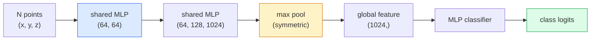

# 3D 视觉：点云与 NeRF

> 3D 视觉有两类表示：点云（point cloud）是传感器的原始输出，神经辐射场（NeRF）则是学习得到的体积场。两者都回答“空间中的什么位置有什么”这个问题。

**Type:** Learn + Build
**Languages:** Python
**Prerequisites:** 第 4 阶段第 03 课（CNN）、第 1 阶段第 12 课（张量运算）
**Time:** ~45 分钟

## 学习目标

- 区分 3D 表示中的显式表示（点云、网格、体素）和隐式表示（有符号距离场 SDF、NeRF），并了解各自的适用场景
- 理解 PointNet 的对称函数（symmetric function）技巧，以及它如何让神经网络对无序点集具有置换不变性（permutation invariance）
- 跟踪 NeRF 的前向传播（forward pass）：光线投射、体渲染、位置编码，以及多层感知机（MLP）的密度与颜色输出头
- 使用 `nerfstudio` 或 `instant-ngp`，借助预训练模型从少量带有相机位姿信息的图像进行 3D 重建

## 要解决的问题

相机生成 2D 图像。激光雷达（LIDAR）生成一组无序的 3D 点。运动恢复结构（structure-from-motion）管线生成由 3D 关键点组成的稀疏点云。NeRF 则从少量带有相机位姿信息的图像重建出完整的 3D 场景。这些都属于“视觉”，但它们都不是卷积神经网络（CNN）所需的那种稠密张量（tensor）。

3D 视觉之所以重要，是因为几乎所有高价值的机器人任务都在 3D 空间中进行：抓取、避障、导航、增强现实（AR）中的遮挡处理，以及 3D 内容采集。只懂 2D 图像的视觉工程师，将难以进入这个领域中增长最快的方向，包括 AR/VR 内容、机器人、自动驾驶技术栈，以及面向房地产或建筑业的 NeRF 3D 重建。

这两类表示占据主导地位的原因各不相同。点云是传感器直接给出的数据。NeRF 及其后继方法（3D Gaussian splatting，即高斯泼溅，以及神经 SDF）则是让神经网络学习场景所得的表示。

## 核心概念

### 点云

点云是 R^3 中 N 个点组成的无序集合，每个点还可以带有特征，例如颜色、强度或法线。

```text
cloud = [
  (x1, y1, z1, r1, g1, b1),
  (x2, y2, z2, r2, g2, b2),
  ...
  (xN, yN, zN, rN, gN, bN),
]
```

没有网格，也没有连接关系。以下两个性质给神经网络带来了难题：

- **置换不变性**：输出不能依赖点的顺序。
- **N 可变**：同一个模型必须能处理点数不同的点云。

PointNet（Qi et al., 2017）用一个思路同时解决了这两个问题：对每个点应用共享 MLP，再用对称函数（最大池化）聚合。这样得到的是一个大小固定、与点的顺序无关的向量。

```text
f(P) = max_{p in P} MLP(p)
```

这就是 PointNet 的全部核心思路。更深的变体（PointNet++、Point Transformer）加入了分层采样和局部聚合，但对称函数这一技巧没有改变。

### PointNet 架构



“共享 MLP”是指对每个点独立运行同一个 MLP。为提高效率，实现时采用沿点维度运算的 1x1 卷积。

### 神经辐射场（NeRF）

面对“能否从 N 张照片重建一个 3D 场景”这个问题，NeRF（Mildenhall et al., 2020）的答案是：用神经网络本身表示场景。网络将 `(x, y, z, viewing_direction)` 映射为 `(density, colour)`。渲染新视角，就是围绕这个网络运行光线投射循环。

```text
NeRF MLP:  (x, y, z, theta, phi) -> (sigma, r, g, b)

To render a pixel (u, v) of a new view:
  1. Cast a ray from the camera through pixel (u, v)
  2. Sample points along the ray at distances t_1, t_2, ..., t_N
  3. Query the MLP at each point
  4. Composite the colours weighted by (1 - exp(-sigma * dt))
  5. The sum is the rendered pixel colour
```

损失函数将渲染出的像素与训练照片中对应像素的真实值进行比较。通过渲染步骤的反向传播来更新 MLP。这里没有 3D 真实值，也没有显式几何表示；场景存储在 MLP 的权重中。

### NeRF 中的位置编码

直接以 `(x, y, z)` 为输入的普通 MLP 无法表示高频细节，因为 MLP 在频谱上偏向低频。NeRF 的解决办法是：在输入 MLP 前，将每个坐标编码为 Fourier 特征向量（傅里叶特征向量）：

```text
gamma(p) = (sin(2^0 pi p), cos(2^0 pi p), sin(2^1 pi p), cos(2^1 pi p), ...)
```

频率层级最多为 L=10。这与 Transformer 表示位置所用的技巧相同，也会出现在扩散模型的时间条件化中（第 10 课）。没有它，NeRF 的渲染结果会显得模糊。

### 体渲染

```text
C(r) = sum_i T_i * (1 - exp(-sigma_i * delta_i)) * c_i

T_i  = exp(- sum_{j<i} sigma_j * delta_j)
delta_i = t_{i+1} - t_i
```

`T_i` 是透射率（transmittance），表示光传播到点 i 时还剩多少。`(1 - exp(-sigma_i * delta_i))` 是点 i 处的不透明度。`c_i` 是颜色。最终像素由沿光线的加权求和得到。

### 哪些方法取代了 NeRF

纯 NeRF 训练慢（需要数小时），渲染也慢（每张图像需要数秒）。此后的演进路线如下：

- **Instant-NGP**（2022）：用哈希网格编码替代 MLP 的位置输入；几秒即可完成训练。
- **Mip-NeRF 360**：处理无界场景和抗混叠。
- **3D Gaussian Splatting**（2023）：用 millions（数百万）个 3D 高斯体替代体积场；几分钟即可完成训练，并能实时渲染。它是目前生产环境的默认选择。

在 2026 年，几乎所有实际的 NeRF 产品用的都是 3D Gaussian splatting。不过，理解它们的基本思路仍然是 NeRF。

### 数据集与基准测试

- **ShapeNet**：将 3D CAD 模型表示为点云，用于分类和分割。
- **ScanNet**：用于分割的真实室内扫描数据。
- **KITTI**：用于自动驾驶的室外 LIDAR 点云。
- **NeRF Synthetic** / **Blended MVS**：带有相机位姿信息的图像数据集，用于视角合成。
- **Mip-NeRF 360** 数据集：无界的真实场景。

```figure
nerf-rays
```

## 动手实现

### 步骤 1：PointNet 分类器

```python
import torch
import torch.nn as nn

class PointNet(nn.Module):
    def __init__(self, num_classes=10):
        super().__init__()
        self.mlp1 = nn.Sequential(
            nn.Conv1d(3, 64, 1),    nn.BatchNorm1d(64),   nn.ReLU(inplace=True),
            nn.Conv1d(64, 64, 1),   nn.BatchNorm1d(64),   nn.ReLU(inplace=True),
        )
        self.mlp2 = nn.Sequential(
            nn.Conv1d(64, 128, 1),  nn.BatchNorm1d(128),  nn.ReLU(inplace=True),
            nn.Conv1d(128, 1024, 1), nn.BatchNorm1d(1024), nn.ReLU(inplace=True),
        )
        self.head = nn.Sequential(
            nn.Linear(1024, 512),   nn.BatchNorm1d(512),  nn.ReLU(inplace=True),
            nn.Dropout(0.3),
            nn.Linear(512, 256),    nn.BatchNorm1d(256),  nn.ReLU(inplace=True),
            nn.Dropout(0.3),
            nn.Linear(256, num_classes),
        )

    def forward(self, x):
        # x: (N, 3, num_points) — transposed for Conv1d
        x = self.mlp1(x)
        x = self.mlp2(x)
        x = torch.max(x, dim=-1)[0]       # (N, 1024)
        return self.head(x)

pts = torch.randn(4, 3, 1024)
net = PointNet(num_classes=10)
print(f"output: {net(pts).shape}")
print(f"params: {sum(p.numel() for p in net.parameters()):,}")
```

参数量约为 1.6M。每个点云输入 1,024 个点。

### 步骤 2：位置编码

```python
def positional_encoding(x, L=10):
    """
    x: (..., D) -> (..., D * 2 * L)
    """
    freqs = 2.0 ** torch.arange(L, dtype=x.dtype, device=x.device)
    args = x.unsqueeze(-1) * freqs * 3.141592653589793
    sinc = torch.cat([args.sin(), args.cos()], dim=-1)
    return sinc.reshape(*x.shape[:-1], -1)

x = torch.randn(5, 3)
y = positional_encoding(x, L=10)
print(f"input:  {x.shape}")
print(f"encoded: {y.shape}     # (5, 60)")
```

乘以 `2^l * pi`，即可得到逐级升高的频率。

### 步骤 3：小型 NeRF MLP

```python
class TinyNeRF(nn.Module):
    def __init__(self, L_pos=10, L_dir=4, hidden=128):
        super().__init__()
        self.L_pos = L_pos
        self.L_dir = L_dir
        pos_dim = 3 * 2 * L_pos
        dir_dim = 3 * 2 * L_dir
        self.trunk = nn.Sequential(
            nn.Linear(pos_dim, hidden), nn.ReLU(inplace=True),
            nn.Linear(hidden, hidden),  nn.ReLU(inplace=True),
            nn.Linear(hidden, hidden),  nn.ReLU(inplace=True),
            nn.Linear(hidden, hidden),  nn.ReLU(inplace=True),
        )
        self.sigma = nn.Linear(hidden, 1)
        self.color = nn.Sequential(
            nn.Linear(hidden + dir_dim, hidden // 2), nn.ReLU(inplace=True),
            nn.Linear(hidden // 2, 3), nn.Sigmoid(),
        )

    def forward(self, x, d):
        x_enc = positional_encoding(x, self.L_pos)
        d_enc = positional_encoding(d, self.L_dir)
        h = self.trunk(x_enc)
        sigma = torch.relu(self.sigma(h)).squeeze(-1)
        rgb = self.color(torch.cat([h, d_enc], dim=-1))
        return sigma, rgb

nerf = TinyNeRF()
x = torch.randn(128, 3)
d = torch.randn(128, 3)
s, c = nerf(x, d)
print(f"sigma: {s.shape}   rgb: {c.shape}")
```

与原版 NeRF 相比，这个模型很小；原版有 2 个深度为 8 的 MLP 主干。这个小模型足以演示其架构。

### 步骤 4：沿一条光线进行体渲染

```python
def volumetric_render(sigma, rgb, t_vals):
    """
    sigma: (..., N_samples)
    rgb:   (..., N_samples, 3)
    t_vals: (N_samples,) distances along the ray
    """
    delta = torch.cat([t_vals[1:] - t_vals[:-1], torch.full_like(t_vals[:1], 1e10)])
    alpha = 1.0 - torch.exp(-sigma * delta)
    trans = torch.cumprod(torch.cat([torch.ones_like(alpha[..., :1]), 1.0 - alpha + 1e-10], dim=-1), dim=-1)[..., :-1]
    weights = alpha * trans
    rendered = (weights.unsqueeze(-1) * rgb).sum(dim=-2)
    depth = (weights * t_vals).sum(dim=-1)
    return rendered, depth, weights


N = 64
t_vals = torch.linspace(2.0, 6.0, N)
sigma = torch.rand(N) * 0.5
rgb = torch.rand(N, 3)
rendered, depth, weights = volumetric_render(sigma, rgb, t_vals)
print(f"rendered colour: {rendered.tolist()}")
print(f"depth:           {depth.item():.2f}")
```

一条光线上的 64 个采样点，合成为一个 RGB（红绿蓝）像素和一个深度值。

## 实际使用

实际工作中可使用：

- `nerfstudio`（Tancik et al.）：目前 NeRF / Instant-NGP / Gaussian Splatting 的参考库，提供命令行工具和网页查看器。
- `pytorch3d`（Meta）：提供可微渲染、点云工具和网格操作。
- `open3d`：用于点云处理、配准和可视化。

在部署场景中，3D Gaussian splatting 已在很大程度上取代纯 NeRF，因为其渲染速度快 100x，而重建质量相当。

## 交付成果

本课产出：

- `outputs/prompt-3d-task-router.md`：一份提示词（prompt），根据任务和输入数据选择合适的 3D 表示，包括点云、网格、体素、NeRF 或高斯泼溅。
- `outputs/skill-point-cloud-loader.md`：一项技能，用于编写读取 .ply / .pcd / .xyz 文件的 PyTorch `Dataset`，正确完成归一化、中心化和点采样。

## 练习

1. **（简单）** 验证 PointNet 的置换不变性：让同一个点云通过网络两次，其中一次打乱点的顺序。检查两次输出是否在浮点噪声范围内一致。
2. **（中等）** 实现一个最小的光线生成函数：给定相机内参和位姿，为 H x W 图像中的每个像素生成光线起点与方向。
3. **（困难）** 用彩色立方体的渲染视图组成一个合成数据集（通过可微渲染或简单的光线追踪器生成），并在该数据集上训练 TinyNeRF。报告第 1、10 和 100 轮（epoch）的渲染损失。模型到第几轮能生成可辨认的视图？

## 关键术语

| 术语 | 常见说法 | 实际含义 |
|------|----------------|----------------------|
| 点云 | “来自 LIDAR 的 3D 点” | (x, y, z) 的无序集合，每个点还可附带特征 |
| PointNet | “首个用于点云的神经网络” | 对每个点应用共享 MLP，再进行对称（最大）池化；其结构本身保证置换不变性 |
| NeRF | “MLP 本身就是场景” | 将 (x, y, z, dir) 映射为 (density, colour) 的网络；通过光线投射进行渲染 |
| 位置编码 | “Fourier 特征” | 将每个坐标编码为多个频率的 sin/cos，以克服 MLP 的低频偏向 |
| 体渲染 | “沿光线积分” | 利用透射率和 alpha，将沿光线的采样点合成为单个像素 |
| Instant-NGP | “哈希网格 NeRF” | 用多分辨率哈希网格替代 NeRF 的坐标 MLP；速度快 100-1000x |
| 3D Gaussian splatting | “Millions（数百万）个高斯体” | 场景 = 一组 3D 高斯体；实时渲染，几分钟即可完成训练 |
| SDF | “有符号距离场” | 返回到最近表面的带符号距离的函数；另一种隐式表示 |

## 延伸阅读

- [PointNet (Qi et al., 2017)](https://arxiv.org/abs/1612.00593)：具有置换不变性的分类器
- [NeRF (Mildenhall et al., 2020)](https://arxiv.org/abs/2003.08934)：将从照片重建 3D 场景转变为神经网络问题的论文
- [Instant-NGP (Müller et al., 2022)](https://arxiv.org/abs/2201.05989)：哈希网格，1000x 加速
- [3D Gaussian Splatting (Kerbl et al., 2023)](https://arxiv.org/abs/2308.04079)：在生产环境中取代 NeRF 的架构
