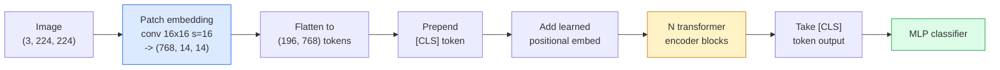

# 视觉 Transformer（ViT）

> 把图像切成图像块，把每个图像块当作一个单词，交给标准 Transformer 处理。一路向前，不必回头。

**Type:** Build
**Languages:** Python
**Prerequisites:** 第 7 阶段第 02 课（自注意力），第 4 阶段第 04 课（图像分类）
**Time:** ~45 分钟

## 学习目标

- 从零实现图像块嵌入（patch embedding）、可学习的位置嵌入（learned positional embedding）、类别 token（class token，token 即词元）和 Transformer 编码器块，构建最小 ViT
- 解释为什么人们曾认为 ViT 需要海量预训练数据，以及 DeiT 和 MAE 如何推翻这一看法
- 比较 ViT、Swin 和 ConvNeXt 的架构先验（分别为无先验、局部窗口注意力、卷积主干网络（backbone））
- 使用 `timm` 和标准的线性探测（linear probe）/ 微调（fine-tuning）方案，在小数据集上微调预训练 ViT

## 要解决的问题

十年间，卷积几乎就是计算机视觉的代名词。卷积神经网络（CNN）具有很强的归纳偏置（inductive bias），包括局部性和平移等变性（translation equivariance），当时没人认为这些特性可以被替代。随后，Dosovitskiy 等人（2020）表明：仅用普通 Transformer 处理展平后的图像块，完全不采用卷积机制，只要规模足够大，就能追平甚至超越最好的 CNN。

关键在于“规模足够大”。仅在 ImageNet-1k 上训练的 ViT 不敌 ResNet，而先在 ImageNet-21k 或 JFT-300M 上预训练、再在 ImageNet-1k 上微调的 ViT 则胜过了它。由此得出的结论是，Transformer 缺少有用的先验，但能从足够多的数据中学到这些先验。后续工作（DeiT、MAE、DINO）表明，只要采用合适的训练方案，包括强数据增强（data augmentation）、自监督预训练和蒸馏，ViT 在小数据集上也能训练得很好。

到了 2026 年，纯 CNN 在边缘设备上仍有竞争力（其中 ConvNeXt 最强），但 Transformer 已主导其他各个领域：分割（Mask2Former、SegFormer）、检测（DETR、RT-DETR）、多模态（CLIP、SigLIP）、视频（VideoMAE、VJEPA）。ViT 的块结构是你需要掌握的重点。

## 核心概念

### 处理管线



共七步。图像块 -> token -> 注意力 -> 分类器。每种变体（DeiT、Swin、ConvNeXt、MAE 预训练）都只改动其中一两步，其余步骤保持不变。

### 图像块嵌入

关键就在第一个卷积。卷积核大小为 16，步幅为 16，因此一张 224x224 图像会变成一个 14x14 网格，每个网格单元对应一个 16x16 图像块，并被投影成 768 维嵌入。这一个卷积同时完成了图像分块和线性投影。

```text
Input:  (3, 224, 224)
Conv (3 -> 768, k=16, s=16, no padding):
Output: (768, 14, 14)
Flatten spatial: (196, 768)
```

196 个图像块 = 196 个 token。每个 token 的特征维度为 768（ViT-B）、1024（ViT-L）或 1280（ViT-H）。

### 类别 token

在序列开头插入一个可学习向量：

```text
tokens = [CLS; patch_1; patch_2; ...; patch_196]   shape (197, 768)
```

经过 N 个 Transformer 块后，`[CLS]` 的输出就是图像的全局表示。分类头（classifier head）只读取这一个向量。

### 位置嵌入

Transformer 本身没有空间位置的概念。给每个 token 加上一个可学习向量：

```text
tokens = tokens + learned_pos_embedding   (also shape (197, 768))
```

这种嵌入是模型的参数；基于梯度的训练会让它适应 2D 图像结构。也有基于正弦函数的 2D 替代方案，但实践中很少使用。

### Transformer 编码器块

采用标准结构：多头自注意力（multi-head self-attention）、多层感知机（MLP）、残差连接（residual connection），以及前置 LayerNorm（层归一化）。

```text
x = x + MSA(LN(x))
x = x + MLP(LN(x))

MLP is two-layer with GELU: Linear(d -> 4d) -> GELU -> Linear(4d -> d)
```

ViT-B/16 堆叠了 12 个这样的块，每个块有 12 个注意力头，总参数量为 86M。

### 为什么使用 pre-LN

早期 Transformer 使用后置层归一化 post-LN（`x = LN(x + sublayer(x))`），如果不做学习率预热（warmup），层数超过 6-8 层后就很难训练。前置层归一化 pre-LN（`x = x + sublayer(LN(x))`）则无需预热，也能稳定训练更深的网络。每一种 ViT 和每一种现代大语言模型（LLM）都使用 pre-LN。

### 图像块大小的权衡

- 16x16 图像块 -> 196 个 token，标准配置。
- 32x32 图像块 -> 49 个 token，速度更快，但分辨率更低。
- 8x8 图像块 -> 784 个 token，粒度更细，但 O(n^2) 的注意力开销随规模增长得很快。

图像块越大 = token 越少 = 速度越快，但空间细节也越少。SwinV2 在分层窗口中使用 4x4 图像块。

### DeiT 在 ImageNet-1k 上训练 ViT 的方案

最初的 ViT 需要 JFT-300M 才能击败 CNN。DeiT（Touvron 等人，2020）仅用 ImageNet-1k，就使 ViT-B 的 top-1 准确率达到 81.8%，靠的是以下四项改动：

1. 强数据增强：RandAugment、Mixup、CutMix、Random Erasing。
2. 随机深度（stochastic depth，在训练时随机丢弃整个块）。
3. 重复增强（repeated augmentation，每个批次对同一张图像采样 3 次）。
4. 从 CNN 教师模型中蒸馏知识（可选，能进一步提高准确率）。

现代 ViT 的每一种训练方案都源自 DeiT。

### Swin 与 ConvNeXt

- **Swin**（Liu 等人，2021）：基于窗口的注意力。每个块在局部窗口内计算注意力；相邻块交替平移窗口，让信息能够跨窗口混合。它在保留注意力算子的同时，重新引入了类似 CNN 的局部性先验。
- **ConvNeXt**（Liu 等人，2022）：重新设计的 CNN，采用与 Swin 相匹配的架构选择（逐通道卷积（depthwise convolution）、LayerNorm、GELU、倒置瓶颈（inverted bottleneck））。这项工作表明，差距不在于“注意力还是卷积”，而在于“现代训练方案 + 架构”。

在 2026 年，ConvNeXt-V2 和 Swin-V2 都已达到生产可用水平；合适的选择取决于你的推理技术栈（ConvNeXt 更易于编译到边缘设备）和预训练语料。

### MAE 预训练

掩码自编码器（MAE，Masked Autoencoder；He 等人，2022）：随机遮蔽 75% 的图像块，训练编码器仅处理可见的 25%，再训练一个小型解码器，根据编码器的输出重构被遮蔽的图像块。预训练完成后，丢弃解码器并微调编码器。

MAE 使 ViT 仅用 ImageNet-1k 就能训练，并达到当前最佳水平（SOTA）；它也是目前默认采用的自监督训练方案。

```figure
batchnorm-inference
```

## 动手实现

### 第 1 步：图像块嵌入

```python
import torch
import torch.nn as nn

class PatchEmbedding(nn.Module):
    def __init__(self, in_channels=3, patch_size=16, dim=192, image_size=64):
        super().__init__()
        assert image_size % patch_size == 0
        self.proj = nn.Conv2d(in_channels, dim, kernel_size=patch_size, stride=patch_size)
        num_patches = (image_size // patch_size) ** 2
        self.num_patches = num_patches

    def forward(self, x):
        x = self.proj(x)
        return x.flatten(2).transpose(1, 2)
```

一次卷积、一次展平、一次转置。这就是从图像到 token 的全部步骤。

### 第 2 步：Transformer 块

pre-LN、多头自注意力、使用 GELU 的 MLP，以及残差连接。

```python
class Block(nn.Module):
    def __init__(self, dim, num_heads, mlp_ratio=4, dropout=0.0):
        super().__init__()
        self.ln1 = nn.LayerNorm(dim)
        self.attn = nn.MultiheadAttention(dim, num_heads, dropout=dropout, batch_first=True)
        self.ln2 = nn.LayerNorm(dim)
        self.mlp = nn.Sequential(
            nn.Linear(dim, dim * mlp_ratio),
            nn.GELU(),
            nn.Dropout(dropout),
            nn.Linear(dim * mlp_ratio, dim),
            nn.Dropout(dropout),
        )

    def forward(self, x):
        a, _ = self.attn(self.ln1(x), self.ln1(x), self.ln1(x), need_weights=False)
        x = x + a
        x = x + self.mlp(self.ln2(x))
        return x
```

`nn.MultiheadAttention` 负责拆分注意力头、计算缩放点积和输出投影。设置 `batch_first=True`，因此张量形状为 `(N, seq, dim)`。

### 第 3 步：构建 ViT

```python
class ViT(nn.Module):
    def __init__(self, image_size=64, patch_size=16, in_channels=3,
                 num_classes=10, dim=192, depth=6, num_heads=3, mlp_ratio=4):
        super().__init__()
        self.patch = PatchEmbedding(in_channels, patch_size, dim, image_size)
        num_patches = self.patch.num_patches
        self.cls_token = nn.Parameter(torch.zeros(1, 1, dim))
        self.pos_embed = nn.Parameter(torch.zeros(1, num_patches + 1, dim))
        self.blocks = nn.ModuleList([
            Block(dim, num_heads, mlp_ratio) for _ in range(depth)
        ])
        self.ln = nn.LayerNorm(dim)
        self.head = nn.Linear(dim, num_classes)
        nn.init.trunc_normal_(self.pos_embed, std=0.02)
        nn.init.trunc_normal_(self.cls_token, std=0.02)

    def forward(self, x):
        x = self.patch(x)
        cls = self.cls_token.expand(x.size(0), -1, -1)
        x = torch.cat([cls, x], dim=1)
        x = x + self.pos_embed
        for blk in self.blocks:
            x = blk(x)
        x = self.ln(x[:, 0])
        return self.head(x)

vit = ViT(image_size=64, patch_size=16, num_classes=10, dim=192, depth=6, num_heads=3)
x = torch.randn(2, 3, 64, 64)
print(f"output: {vit(x).shape}")
print(f"params: {sum(p.numel() for p in vit.parameters()):,}")
```

参数量约为 2.8M，是一个在 CPU 上也能运行的微型 ViT。真正的 ViT-B 有 86M 参数；使用相同的类定义，将配置设为 `dim=768, depth=12, num_heads=12` 即可。

### 第 4 步：基本检查，单张图像推理

```python
logits = vit(torch.randn(1, 3, 64, 64))
print(f"logits: {logits}")
print(f"probs:  {logits.softmax(-1)}")
```

应当可以正常运行，不报错。概率之和为 1。

## 实际使用

`timm` 为每种 ViT 变体都提供了 ImageNet 预训练权重。一行就能创建模型：

```python
import timm

model = timm.create_model("vit_base_patch16_224", pretrained=True, num_classes=10)
```

`timm` 是 2026 年在生产环境中使用视觉 Transformer 的默认选择。它通过同一套 API（应用程序编程接口）支持 ViT、DeiT、Swin、Swin-V2、ConvNeXt、ConvNeXt-V2、MaxViT、MViT、EfficientFormer，以及其他数十种模型。

对于多模态任务（图像 + 文本），`transformers` 提供了 CLIP、SigLIP、BLIP-2、LLaVA。这些模型的图像编码器都是 ViT 变体。

## 交付成果

本课将产出：

- `outputs/prompt-vit-vs-cnn-picker.md`：一个提示词（prompt），根据数据集大小、计算资源和推理技术栈，在 ViT、ConvNeXt 与 Swin 之间做出选择。
- `outputs/skill-vit-patch-and-pos-embed-inspector.md`：一个技能，用于检查 ViT 的图像块嵌入和位置嵌入形状是否与模型预期的序列长度匹配，从而发现最常见的移植错误。

## 练习

1. **（简单）** 打印上面的微型 ViT 在一次前向传播中所有中间张量的形状。确认：输入 `(N, 3, 64, 64)` -> 图像块 `(N, 16, 192)` -> 加入 CLS 后 `(N, 17, 192)` -> 分类器输入 `(N, 192)` -> 输出 `(N, num_classes)`。
2. **（中等）** 在第 4 课的 synthetic-CIFAR 数据集上微调一个预训练的 `timm` ViT-S/16。与在相同数据上微调的 ResNet-18 进行比较，报告训练时间和最终准确率。
3. **（困难）** 为微型 ViT 实现 MAE 预训练：遮蔽 75% 的图像块，训练编码器和一个小型解码器来重构被遮蔽的图像块。在预训练前后，分别评估模型在合成数据上的线性探测准确率。

## 关键术语

| 术语 | 常见说法 | 实际含义 |
|------|----------------|----------------------|
| 图像块嵌入 | “第一个卷积” | 卷积核大小 = 步幅 = 图像块大小的卷积；把图像转换成 token 嵌入网格 |
| 类别 token | “[CLS]” | 添加在 token 序列开头的可学习向量；它的最终输出是图像的全局表示 |
| 位置嵌入 | “可学习的位置向量” | 加到每个 token 上的可学习向量，让 Transformer 知道每个图像块来自哪里 |
| Pre-LN | “子层之前做 LayerNorm” | 稳定的 Transformer 变体：采用 `x + sublayer(LN(x))`，而不是 `LN(x + sublayer(x))` |
| 多头注意力 | “并行注意力” | 将标准 Transformer 注意力拆分到 num_heads 个独立子空间中，随后拼接结果 |
| ViT-B/16 | “Base，图像块大小 16” | 典型规格：dim=768、depth=12、heads=12、patch_size=16、image=224；参数量 ~86M |
| DeiT | “数据高效的 ViT” | 仅在 ImageNet-1k 上使用强数据增强训练的 ViT；证明了大规模预训练数据集并非严格必需 |
| MAE | “掩码自编码器” | 自监督预训练：遮蔽 75% 的图像块，再重构；这是占主导地位的 ViT 预训练方案 |

## 延伸阅读

- [An Image is Worth 16x16 Words (Dosovitskiy et al., 2020)](https://arxiv.org/abs/2010.11929)：ViT 论文
- [DeiT: Data-efficient Image Transformers (Touvron et al., 2020)](https://arxiv.org/abs/2012.12877)：如何仅在 ImageNet-1k 上训练 ViT
- [Masked Autoencoders are Scalable Vision Learners (He et al., 2022)](https://arxiv.org/abs/2111.06377)：MAE 预训练
- [timm 文档](https://huggingface.co/docs/timm)：生产环境中使用各种视觉 Transformer 的参考资料
