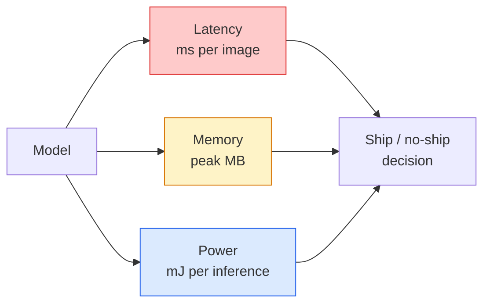

# 实时视觉——边缘端部署

> 边缘端推理（edge inference）这门功夫，就是让一个准确率为 90 的模型，在只有 2 GB RAM 的设备上以 30 fps 运行。准确率的每一个百分点，都要与以毫秒计的延迟相权衡。

**Type:** Learn + Build
**Languages:** Python
**Prerequisites:** 阶段 4 第 04 课（图像分类），阶段 10 第 11 课（量化）
**Time:** ~75 分钟

## 学习目标

- 测量任意 PyTorch 模型的推理延迟（latency）、峰值内存和吞吐量（throughput），读懂 FLOPs（浮点运算次数）/ 参数量 / 延迟之间的权衡
- 使用 PyTorch 的训练后量化（post-training quantisation）将视觉模型量化为 INT8，并验证准确率损失 < 1%
- 导出为 ONNX，并用 ONNX Runtime 或 TensorRT 编译；说出三种最常见的导出失败及其修复办法
- 说明在不同边缘端约束下，何时选择 MobileNetV3、EfficientNet-Lite、ConvNeXt-Tiny 或 MobileViT

## 要解决的问题

训练时的视觉模型是个浮点运算巨兽：100M 个参数、每次前向传播 10 GFLOPs、2 GB 显存（VRAM）。手机、车载信息娱乐系统、工业相机或无人机，都容不下这样的配置。交付一个视觉系统，意味着要在缩小 100x 的资源预算内实现同样的预测。

大部分优化都靠三个调节项：模型选择（沿用同样的方案，换成更小的架构）、量化（quantisation，用 INT8 代替 FP32），以及推理运行时（inference runtime，如 ONNX Runtime、TensorRT、Core ML、TFLite）。调好这三项，才能把工作站上的演示变成可在 $30 相机模块上交付的产品。

本课先建立测量规范（无法测量，就无从优化），再逐一讲解这三个调节项。目标不是学遍所有边缘端运行时，而是知道有哪些手段，以及如何验证每一种手段确实产生了预期效果。

## 核心概念

### 三项资源预算



- **延迟**：p50、p95、p99。只对 p50 求平均，会掩盖实时系统所关心的尾部行为。
- **峰值内存**：设备在运行期间遇到的最大内存占用，而不是稳态平均值。这一点很重要，因为内存耗尽（OOM）对嵌入式目标设备是致命的。
- **功率 / 能耗**：电池供电设备每次推理消耗的 millijoules（毫焦耳）。常用 CPU/GPU 利用率 * 时间作为近似指标。

边缘端决策依据的是一张（模型、延迟、内存、准确率）对照表。每一格数据都要在目标设备上测得，而不是在工作站上测得。

### 测量规范

每次边缘端性能分析都应遵循三条规则：

1. 测量前先用 5-10 次虚拟输入的前向传播来**预热（warm up）**模型。冷缓存和 JIT（即时编译）会使最初的测量值不具代表性。
2. 在计时区段前后调用 `torch.cuda.synchronize()`，**同步** GPU 工作负载。否则测到的是计算内核的调度，而不是计算内核的执行。
3. **固定输入尺寸**，与生产环境的分辨率一致。224x224 的延迟不等于 512x512 的延迟。

### 用 FLOPs 作为近似指标

FLOPs（每次推理的浮点运算次数）是成本低、与设备无关的延迟近似指标。它适合比较架构，但把它当作实际耗时的绝对指标会产生误导。一个 FLOPs 多 10% 的模型，实际运行反而可能快 2x，因为它使用了对硬件友好的算子（逐通道卷积（depthwise convolution）能很好地编译，而大型 7x7 卷积则不然）。

规则：架构搜索用 FLOPs，部署决策用设备端实测延迟。

### 一段话讲清量化

把 FP32 权重和激活值替换为 INT8。模型大小缩小 4x，内存带宽需求降低 4x；在具有 INT8 计算内核的硬件上（所有现代移动 SoC，以及所有配备 Tensor Cores 的 NVIDIA GPU），计算开销降低 2-4x。使用训练后静态量化时，视觉任务的准确率损失通常为 0.1-1 个百分点。

量化类型：

- **动态量化（dynamic quantisation）**——将权重量化为 INT8，激活值用浮点数（FP）计算。操作简单，加速幅度较小。
- **静态量化（训练后）**——量化权重，并在一个小型校准集上校准激活值的范围。比动态量化快得多。
- **量化感知训练（quantisation-aware training，QAT）**——在训练期间模拟量化，让模型学会适应量化的影响。准确率最好，但需要带标签的数据。

对于视觉任务，训练后静态量化用 5% 的工作量就能带来 95% 的收益。只有在训练后量化（PTQ）造成的准确率损失不可接受时，才使用 QAT。

### 剪枝与蒸馏

- **剪枝（pruning）**——移除不重要的权重（基于幅值），或移除通道（结构化剪枝）。适用于过参数化模型；对本来就紧凑的架构，作用较小。
- **蒸馏（distillation）**——训练小型学生模型，让它模仿大型教师模型的 logits（未经归一化的分数）。这通常能恢复因缩小模型而损失的大部分准确率，是生产级边缘端模型的标准做法。

### 推理运行时

- **PyTorch eager（即时执行）**——速度慢，不适合部署。只用于开发。
- **TorchScript**——旧有方案。已被 `torch.compile` 和 ONNX 导出取代。
- **ONNX Runtime**——中立的运行时。CPU、CUDA、CoreML、TensorRT、OpenVINO 都有 ONNX 执行提供程序（provider）。从这里起步。
- **TensorRT**——NVIDIA 的编译器。在 NVIDIA GPU（工作站和 Jetson）上延迟最佳。可与 ONNX Runtime 集成，也可独立使用。
- **Core ML**——Apple 面向 iOS/macOS 的运行时。需要 `.mlmodel` 或 `.mlpackage`。
- **TFLite**——Google 面向 Android/ARM 的运行时。需要 `.tflite`。
- **OpenVINO**——Intel 面向 CPU/VPU 的运行时。需要 `.xml` + `.bin`。

实际流程是：从 PyTorch 导出 -> ONNX -> 选择适合目标设备的运行时。ONNX 是其中的通用语言。

### 边缘端架构选择表

| 预算 | 模型 | 原因 |
|--------|-------|-----|
| < 3M 个参数 | MobileNetV3-Small | 可在各种平台编译，是不错的基线 |
| 3-10M | EfficientNet-Lite-B0 | 在 TFLite 上单位参数量的准确率最佳 |
| 10-20M | ConvNeXt-Tiny | 单位参数量的准确率最佳，对 CPU 友好 |
| 20-30M | MobileViT-S 或 EfficientViT | 具备 ImageNet 准确率的 Transformer |
| 30-80M | Swin-V2-Tiny | 适用于技术栈支持窗口注意力的情况 |

除非有明确理由不这样做，否则应将这些模型全部量化为 INT8。

```figure
cnn-param-count
```

## 动手实现

### 步骤 1：正确测量延迟

```python
import time
import torch

def measure_latency(model, input_shape, device="cpu", warmup=10, iters=50):
    model = model.to(device).eval()
    x = torch.randn(input_shape, device=device)
    with torch.no_grad():
        for _ in range(warmup):
            model(x)
        if device == "cuda":
            torch.cuda.synchronize()
        times = []
        for _ in range(iters):
            if device == "cuda":
                torch.cuda.synchronize()
            t0 = time.perf_counter()
            model(x)
            if device == "cuda":
                torch.cuda.synchronize()
            times.append((time.perf_counter() - t0) * 1000)
    times.sort()
    return {
        "p50_ms": times[len(times) // 2],
        "p95_ms": times[int(len(times) * 0.95)],
        "p99_ms": times[int(len(times) * 0.99)],
        "mean_ms": sum(times) / len(times),
    }
```

先预热，再同步，并使用 `time.perf_counter()`。报告百分位数，而不只是平均值。

### 步骤 2：统计参数量和 FLOP 数

```python
def parameter_count(model):
    return sum(p.numel() for p in model.parameters())

def flops_estimate(model, input_shape):
    """
    Rough FLOP count for a conv/linear-only model. For production use `fvcore` or `ptflops`.
    """
    total = 0
    def conv_hook(m, inp, out):
        nonlocal total
        c_out, c_in, kh, kw = m.weight.shape
        h, w = out.shape[-2:]
        total += 2 * c_in * c_out * kh * kw * h * w
    def linear_hook(m, inp, out):
        nonlocal total
        total += 2 * m.in_features * m.out_features
    hooks = []
    for m in model.modules():
        if isinstance(m, torch.nn.Conv2d):
            hooks.append(m.register_forward_hook(conv_hook))
        elif isinstance(m, torch.nn.Linear):
            hooks.append(m.register_forward_hook(linear_hook))
    model.eval()
    with torch.no_grad():
        model(torch.randn(input_shape))
    for h in hooks:
        h.remove()
    return total
```

实际项目应使用 `fvcore.nn.FlopCountAnalysis` 或 `ptflops`；它们能正确处理每一种模块类型。

### 步骤 3：训练后静态量化

```python
def quantise_ptq(model, calibration_loader, backend="x86"):
    import torch.ao.quantization as tq
    model = model.eval().cpu()
    model.qconfig = tq.get_default_qconfig(backend)
    tq.prepare(model, inplace=True)
    with torch.no_grad():
        for x, _ in calibration_loader:
            model(x)
    tq.convert(model, inplace=True)
    return model
```

三个步骤：配置、准备（插入观测器）、用真实数据校准、转换（融合 + 量化）。需要先对模型做融合（`Conv -> BN -> ReLU` -> `ConvBnReLU`），这由 `torch.ao.quantization.fuse_modules` 处理。

### 步骤 4：导出为 ONNX

```python
def export_onnx(model, sample_input, path="model.onnx"):
    model = model.eval()
    torch.onnx.export(
        model,
        sample_input,
        path,
        input_names=["input"],
        output_names=["output"],
        dynamic_axes={"input": {0: "batch"}, "output": {0: "batch"}},
        opset_version=17,
    )
    return path
```

`opset_version=17` 是 2026 年的稳妥默认值。`dynamic_axes` 允许你以任意批大小运行 ONNX 模型。

### 步骤 5：做基准测试并比较不同配置

```python
import torch.nn as nn
from torchvision.models import mobilenet_v3_small

def compare_regimes():
    model = mobilenet_v3_small(weights=None, num_classes=10)
    params = parameter_count(model)
    flops = flops_estimate(model, (1, 3, 224, 224))
    lat_fp32 = measure_latency(model, (1, 3, 224, 224), device="cpu")
    print(f"FP32 MobileNetV3-Small: {params:,} params  {flops/1e9:.2f} GFLOPs  "
          f"p50={lat_fp32['p50_ms']:.2f}ms  p95={lat_fp32['p95_ms']:.2f}ms")
```

对 `resnet50`、`efficientnet_v2_s` 和 `convnext_tiny` 运行同一个函数，就能得到部署决策所需的对照表。

## 实际使用

生产技术栈通常采用以下三条路径之一：

- **Web / serverless（无服务器）**：PyTorch -> ONNX -> ONNX Runtime（CPU 或 CUDA 执行提供程序）。最简单，对大多数情况已足够。
- **NVIDIA 边缘端（Jetson、GPU 服务器）**：PyTorch -> ONNX -> TensorRT。延迟最佳，工程工作量也最大。
- **移动端**：PyTorch -> ONNX -> Core ML（iOS）或 TFLite（Android）。导出前先量化。

测量时，`torch-tb-profiler`、`nvprof` / `nsys` 以及 macOS 上的 Instruments 能提供逐层分析结果。`benchmark_app`（OpenVINO）和 `trtexec`（TensorRT）则能通过独立的 CLI（命令行接口）给出测量值。

## 交付成果

本课产出：

- `outputs/prompt-edge-deployment-planner.md`——一个提示词（prompt），根据目标设备和延迟 SLA（服务等级协议）选择主干网络（backbone）、量化策略和运行时。
- `outputs/skill-latency-profiler.md`——一个技能，用于编写完整的延迟基准测试脚本，包含预热、同步、百分位数和内存跟踪。

## 练习

1. **（简单）**在 CPU 上，以 224x224 的输入测量 `resnet18`、`mobilenet_v3_small`、`efficientnet_v2_s` 和 `convnext_tiny` 的 p50 延迟。报告对照表，并指出哪种架构的每 ms 准确率最佳。
2. **（中等）**对 `mobilenet_v3_small` 应用训练后静态量化。在 CIFAR-10 或类似数据集的留出子集上，报告 FP32 与 INT8 的延迟和准确率损失。
3. **（困难）**将 `convnext_tiny` 导出为 ONNX，使用 `onnxruntime` 的 `CPUExecutionProvider` 运行，并与 PyTorch eager 基线比较延迟。找出 ONNX Runtime 首个运行更快的层，并解释原因。

## 关键术语

| 术语 | 常见说法 | 实际含义 |
|------|----------------|----------------------|
| 延迟 | “有多快” | 从输入到输出的耗时；用 p50/p95/p99 百分位数表示，而非平均值 |
| FLOPs | “模型大小” | 每次前向传播的浮点运算次数；计算成本的粗略近似指标 |
| INT8 量化 | “8-bit” | 用 8-bit 整数替换 FP32 权重/激活值；大小缩小 ~4x，速度提升 2-4x |
| PTQ | “训练后量化” | 对训练好的模型量化，无需重新训练；简单，通常已足够 |
| QAT | “量化感知训练” | 在训练期间模拟量化；准确率最好，需要带标签的数据 |
| ONNX | “中立的格式” | 所有主流推理运行时都支持的模型交换格式 |
| TensorRT | “NVIDIA 编译器” | 将 ONNX 编译为针对 NVIDIA GPU 优化的引擎 |
| 蒸馏 | “教师 -> 学生” | 训练小模型模仿大模型的 logits；恢复损失的大部分准确率 |

## 延伸阅读

- [EfficientNet (Tan & Le, 2019)](https://arxiv.org/abs/1905.11946)——用于高效架构的复合缩放
- [MobileNetV3 (Howard et al., 2019)](https://arxiv.org/abs/1905.02244)——采用 h-swish 和 squeeze-excite 的移动优先架构
- [Accelerating Inference Up to 6x Faster in PyTorch with Torch-TensorRT (NVIDIA)](https://developer.nvidia.com/blog/accelerating-inference-up-to-6x-faster-in-pytorch-with-torch-tensorrt/)——如何真正达到论文中的吞吐量数值
- [ONNX Runtime 文档](https://onnxruntime.ai/docs/)——量化、图优化、执行提供程序选择
