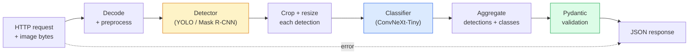

# 构建完整的视觉管线——综合项目

> 生产环境中的视觉系统，是用数据契约（data contract）串起模型和规则的一条管线（pipeline）。所需组件在本阶段已经介绍过；这个综合项目将把它们从头到尾连接起来。

**Type:** Build
**Languages:** Python
**Prerequisites:** 阶段 4 第 01-15 课
**Time:** ~120 分钟

## 学习目标

- 设计一条用于生产环境的视觉管线，完成目标检测、分类并输出结构化 JSON，同时处理每条失败路径
- 将检测器（detector，Mask R-CNN 或 YOLO）、分类器（classifier，ConvNeXt-Tiny）和数据契约（Pydantic）接入同一个服务
- 对端到端管线进行基准测试，找出首要瓶颈（通常是预处理，其次是检测器）
- 交付一个最小 FastAPI 服务，接收上传的图像、运行管线，并返回附有分类结果的检测结果

## 要解决的问题

单个视觉模型很有用，而视觉产品是由多个模型串联而成的。零售货架巡检需要检测器、商品分类器和价格 OCR（光学字符识别）管线。自动驾驶需要 2D 检测器、3D 检测器、分割器、跟踪器和规划器。医学初筛则需要分割器、区域分类器和供临床医生使用的 UI（用户界面）。

把这些环节连接起来，正是机器学习（ML）原型走向产品的关键。模型之间每多一个接口，就多一处可能出错的地方。每次坐标变换、归一化或掩码尺寸调整，都可能在不报错的情况下出问题。管线的可靠程度，取决于其中最薄弱的接口。

这个综合项目搭建一条最小可用管线：检测 + 分类 + 结构化输出 + 服务层。阶段 4 中的其他内容都能接入这个骨架：将 Mask R-CNN 换成 YOLOv8，添加 OCR 头、分割分支或跟踪器。架构保持稳定，各组件可以插拔替换。

## 核心概念

### 管线



共七个阶段。其中两个模型阶段计算开销大；另外五个阶段则是容易藏着缺陷的地方。

### 用 Pydantic 定义数据契约

每个模型边界的数据都用带类型定义的对象表示。这样，原本不易察觉的失败就会明确暴露出来。

```text
Detection(
    box: tuple[float, float, float, float],   # (x1, y1, x2, y2), absolute pixels
    score: float,                              # [0, 1]
    class_id: int,                             # from detector's label map
    mask: Optional[list[list[int]]],           # RLE-encoded if present
)

PipelineResult(
    image_id: str,
    detections: list[Detection],
    classifications: list[Classification],
    inference_ms: float,
)
```

当检测器返回的框采用 `(cx, cy, w, h)` 而不是 `(x1, y1, x2, y2)` 时，Pydantic 的验证会在边界处失败，让你立即发现问题，而不是等到下游裁剪悄悄返回空区域后才去调试。

### 延迟花在了哪里

几乎所有视觉管线都符合以下三点：

1. **预处理往往是耗时最长的单个环节。** JPEG 解码、颜色空间转换、尺寸调整都受 CPU 性能限制，也很容易被忽略。
2. **检测器占据了 GPU 时间的大头。** 70-90% 的 GPU 时间花在检测的前向传播上。
3. **后处理（非极大值抑制 NMS、游程编码 RLE 及其解码）在 GPU 上开销小，在 CPU 上却很昂贵。** 始终在实际目标设备上做性能剖析。

了解时间的分布，才能为优化工作排出优先级。

### 失败模式

- **没有检测到目标**——返回空列表，不要崩溃，并记录日志。
- **边界框越界**——裁剪前先将框限制在图像范围内。
- **裁剪区域过小**——对于小于分类器最小输入尺寸的框，跳过分类。
- **上传内容损坏**——返回带有具体错误码的 400 响应，而不是 500。
- **模型加载失败**——在服务启动时就报错终止，而不是等到第一个请求到来。

生产管线会分别处理上述情况，而不是用笼统的 `try/except` 掩盖失败。每种失败都应有具名错误码和对应响应。

### 批处理

生产服务要同时服务多个客户端。将不同请求的检测与分类合并成批处理，能成倍提高吞吐量，代价是等待凑齐批次带来的额外延迟。典型做法是：用最多 20ms 收集请求，将它们合为一批，处理完毕后分发响应。`torchserve` 和 `triton` 原生支持这种做法；负载可预测的小型服务则自行实现微批处理器（micro-batcher）。

```figure
v4-vision-pipeline
```

## 动手实现

### 步骤 1：数据契约

```python
from pydantic import BaseModel, Field
from typing import List, Optional, Tuple

class Detection(BaseModel):
    box: Tuple[float, float, float, float]
    score: float = Field(ge=0, le=1)
    class_id: int = Field(ge=0)
    mask_rle: Optional[str] = None


class Classification(BaseModel):
    detection_index: int
    class_id: int
    class_name: str
    score: float = Field(ge=0, le=1)


class PipelineResult(BaseModel):
    image_id: str
    detections: List[Detection]
    classifications: List[Classification]
    inference_ms: float
```

对于任何需要认真维护的管线，花五秒写下这些代码，就能省下一小时的调试时间。

### 步骤 2：最小 Pipeline 类

```python
import time
import numpy as np
import torch
from PIL import Image

class VisionPipeline:
    def __init__(self, detector, classifier, class_names,
                 device="cpu", min_crop=32):
        self.detector = detector.to(device).eval()
        self.classifier = classifier.to(device).eval()
        self.class_names = class_names
        self.device = device
        self.min_crop = min_crop

    def preprocess(self, image):
        """
        image: PIL.Image or np.ndarray (H, W, 3) uint8
        returns: CHW float tensor on device
        """
        if isinstance(image, Image.Image):
            image = np.asarray(image.convert("RGB"))
        tensor = torch.from_numpy(image).permute(2, 0, 1).float() / 255.0
        return tensor.to(self.device)

    @torch.no_grad()
    def detect(self, image_tensor):
        return self.detector([image_tensor])[0]

    @torch.no_grad()
    def classify(self, crops):
        if len(crops) == 0:
            return []
        batch = torch.stack(crops).to(self.device)
        logits = self.classifier(batch)
        probs = logits.softmax(-1)
        scores, cls = probs.max(-1)
        return list(zip(cls.tolist(), scores.tolist()))

    def run(self, image, image_id="anonymous"):
        t0 = time.perf_counter()
        tensor = self.preprocess(image)
        det = self.detect(tensor)

        crops = []
        detections = []
        valid_indices = []
        for i, (box, score, cls) in enumerate(zip(det["boxes"], det["scores"], det["labels"])):
            x1, y1, x2, y2 = [max(0, int(b)) for b in box.tolist()]
            x2 = min(x2, tensor.shape[-1])
            y2 = min(y2, tensor.shape[-2])
            detections.append(Detection(
                box=(x1, y1, x2, y2),
                score=float(score),
                class_id=int(cls),
            ))
            if (x2 - x1) < self.min_crop or (y2 - y1) < self.min_crop:
                continue
            crop = tensor[:, y1:y2, x1:x2]
            crop = torch.nn.functional.interpolate(
                crop.unsqueeze(0),
                size=(224, 224),
                mode="bilinear",
                align_corners=False,
            )[0]
            crops.append(crop)
            valid_indices.append(i)

        class_preds = self.classify(crops)

        classifications = []
        for valid_idx, (cls_id, cls_score) in zip(valid_indices, class_preds):
            classifications.append(Classification(
                detection_index=valid_idx,
                class_id=int(cls_id),
                class_name=self.class_names[cls_id],
                score=float(cls_score),
            ))

        return PipelineResult(
            image_id=image_id,
            detections=detections,
            classifications=classifications,
            inference_ms=(time.perf_counter() - t0) * 1000,
        )
```

每个接口都有类型定义，每条失败路径都有明确的处理方式。

### 步骤 3：连接检测器和分类器

```python
from torchvision.models.detection import maskrcnn_resnet50_fpn_v2
from torchvision.models import convnext_tiny

# Use ImageNet-pretrained weights for a realistic pipeline without training
detector = maskrcnn_resnet50_fpn_v2(weights="DEFAULT")
classifier = convnext_tiny(weights="DEFAULT")
class_names = [f"imagenet_class_{i}" for i in range(1000)]

pipe = VisionPipeline(detector, classifier, class_names)

# Smoke test with a synthetic image
test_image = (np.random.rand(400, 600, 3) * 255).astype(np.uint8)
result = pipe.run(test_image, image_id="demo")
print(result.model_dump_json(indent=2)[:500])
```

### 步骤 4：FastAPI 服务

```python
from fastapi import FastAPI, UploadFile, HTTPException
from io import BytesIO

app = FastAPI()
pipe = None  # initialised on startup

@app.on_event("startup")
def load():
    global pipe
    detector = maskrcnn_resnet50_fpn_v2(weights="DEFAULT").eval()
    classifier = convnext_tiny(weights="DEFAULT").eval()
    pipe = VisionPipeline(detector, classifier, class_names=[f"c{i}" for i in range(1000)])

@app.post("/detect")
async def detect_endpoint(file: UploadFile):
    if file.content_type not in {"image/jpeg", "image/png", "image/webp"}:
        raise HTTPException(status_code=400, detail="unsupported image type")
    data = await file.read()
    try:
        img = Image.open(BytesIO(data)).convert("RGB")
    except Exception:
        raise HTTPException(status_code=400, detail="cannot decode image")
    result = pipe.run(img, image_id=file.filename or "upload")
    return result.model_dump()
```

使用 `uvicorn main:app --host 0.0.0.0 --port 8000` 运行服务，再用 `curl -F 'file=@dog.jpg' http://localhost:8000/detect` 测试。

### 步骤 5：对管线进行基准测试

```python
import time

def benchmark(pipe, num_runs=20, image_size=(400, 600)):
    img = (np.random.rand(*image_size, 3) * 255).astype(np.uint8)
    pipe.run(img)  # warm up

    stages = {"preprocess": [], "detect": [], "classify": [], "total": []}
    for _ in range(num_runs):
        t0 = time.perf_counter()
        tensor = pipe.preprocess(img)
        t1 = time.perf_counter()
        det = pipe.detect(tensor)
        t2 = time.perf_counter()
        crops = []
        for box in det["boxes"]:
            x1, y1, x2, y2 = [max(0, int(b)) for b in box.tolist()]
            x2 = min(x2, tensor.shape[-1])
            y2 = min(y2, tensor.shape[-2])
            if (x2 - x1) >= pipe.min_crop and (y2 - y1) >= pipe.min_crop:
                crop = tensor[:, y1:y2, x1:x2]
                crop = torch.nn.functional.interpolate(
                    crop.unsqueeze(0), size=(224, 224), mode="bilinear", align_corners=False
                )[0]
                crops.append(crop)
        pipe.classify(crops)
        t3 = time.perf_counter()
        stages["preprocess"].append((t1 - t0) * 1000)
        stages["detect"].append((t2 - t1) * 1000)
        stages["classify"].append((t3 - t2) * 1000)
        stages["total"].append((t3 - t0) * 1000)

    for stage, times in stages.items():
        times.sort()
        print(f"{stage:12s}  p50={times[len(times)//2]:7.1f} ms  p95={times[int(len(times)*0.95)]:7.1f} ms")
```

在 CPU 上的典型输出为：预处理 ~3 ms，检测 300-500 ms，分类 20-40 ms，总耗时 350-550 ms。在 GPU 上，检测耗时为 20-40 ms，预处理和分类所占的时间比例开始变得更重要。

## 实际使用

生产模板通常采用相同的结构，并补充以下功能：

- **模型版本管理**——始终在响应中记录模型名称和权重哈希。
- **每个请求的追踪 ID（trace ID）**——记录每个请求在各阶段的耗时，以便把慢响应与具体阶段关联起来。
- **回退路径**——如果分类器超时，就返回不含分类信息的检测结果，而不是让整个请求失败。
- **安全过滤器**——NSFW（不宜在工作场所展示的内容）/ PII（个人身份信息）过滤器在分类后、响应离开服务前运行。
- **批处理端点（endpoint）**——提供 `/detect_batch`，接收图像 URL 列表以进行批量处理。

在生产环境提供推理服务时，`torchserve`、`Triton Inference Server` 和 `BentoML` 开箱即用地支持批处理、版本管理、指标和健康检查。对于原型和小规模产品，直接运行 `FastAPI` 即可。

## 交付成果

本课交付：

- `outputs/prompt-vision-service-shape-reviewer.md`——一个提示词（prompt），用于审查视觉服务代码中违反契约或响应结构的问题，并指出第一个会导致故障的缺陷。
- `outputs/skill-pipeline-budget-planner.md`——一个技能，根据目标延迟和吞吐量，为管线各阶段分配时间预算，并标出最先超出预算的阶段。

## 练习

1. **（简单）** 用任意开放数据集中的 10 张图像运行管线。报告各阶段的平均耗时，以及每张图像的检测目标数量分布。
2. **（中等）** 为 `Detection` 添加一个掩码输出字段，并用 RLE 编码。验证即使一张图像中有 10 个目标，JSON 大小也保持在 1MB 以下。
3. **（困难）** 在分类器前添加微批处理器：用最多 10 ms 收集裁剪区域，在一次 GPU 调用中完成所有区域的分类，再按请求返回结果。测量每秒 5 个并发请求时的吞吐量增益和新增延迟。

## 关键术语

| 术语 | 常见说法 | 实际含义 |
|------|----------------|----------------------|
| 管线 | “整个系统” | 由预处理、推理和后处理步骤组成的有序链条，每对相邻步骤之间都有带类型定义的接口 |
| 数据契约 | “schema（结构定义）” | 各阶段输入和输出都必须遵循的 Pydantic / dataclass 定义；在边界处发现集成缺陷 |
| 预处理 | “模型之前的处理” | 解码、颜色转换、尺寸调整和归一化；通常是 CPU 时间开销最大的部分 |
| 后处理 | “模型之后的处理” | NMS、掩码尺寸调整、阈值处理、RLE 编码；在 GPU 上开销小，在 CPU 上开销大 |
| 微批处理器 | “先收集，再前向传播” | 在固定时间窗口内等待多个请求，再执行一次批量前向传播的聚合器 |
| 追踪 ID | “请求 ID” | 每个请求的标识符，在每个阶段都记录，使慢请求能够被端到端追踪 |
| 错误码 | “具名错误” | 为每类失败设置具体错误码，而不是笼统返回 500；让客户端能够实现相应的重试逻辑 |
| 健康检查 | “就绪探针” | 报告服务是否能够响应的低开销端点；负载均衡器依赖它工作 |

## 延伸阅读

- [Full Stack Deep Learning——模型部署](https://fullstackdeeplearning.com/course/2022/lecture-5-deployment/)——生产环境机器学习部署的经典概览
- [BentoML 文档](https://docs.bentoml.com)——支持批处理、版本管理和指标的服务框架
- [torchserve 文档](https://pytorch.org/serve/)——PyTorch 官方的推理服务库
- [NVIDIA Triton Inference Server](https://developer.nvidia.com/triton-inference-server)——支持批处理和多模型的高吞吐量推理服务
