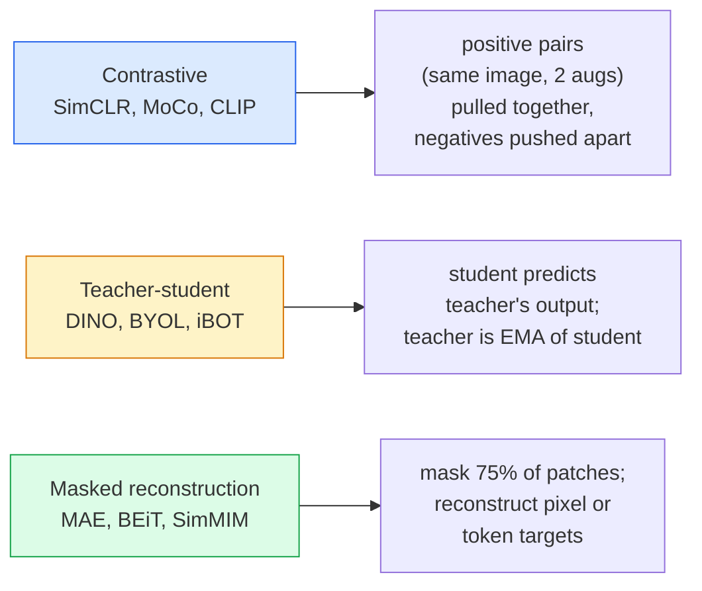

# 自监督视觉 — SimCLR、DINO、MAE

> 标签是监督式视觉学习的瓶颈。自监督预训练消除了对标签的需求：从 100M 张无标签图像中学习视觉特征，再用 10k 张有标签图像进行微调（fine-tuning）。

**Type:** Learn + Build
**Languages:** Python
**Prerequisites:** 阶段 4 第 04 课（图像分类）、阶段 4 第 14 课（ViT）
**Time:** ~75 分钟

## 学习目标

- 梳理自监督学习的三大类别：对比学习（SimCLR）、教师学生学习（DINO）、遮蔽重构（MAE），并说明各自优化什么
- 从零实现 InfoNCE 损失，并解释为什么批大小为 512 时有效、为 32 时却失败
- 解释为什么 MAE 的 75% 遮蔽比例并非随意设定，以及它与 BERT 针对文本采用的 15% 有何不同
- 使用 DINOv2 或 MAE 的 ImageNet 检查点进行线性探测（linear probe）和零样本检索（zero-shot retrieval）

## 要解决的问题

用于监督学习的 ImageNet 有 1.3M 张有标签图像，估计标注成本为 $10M。医疗和工业数据集的规模更小，标注成本却更高。每个视觉团队都会问：能否先用成本低廉的无标签数据进行预训练，例如 YouTube 视频帧、网络抓取内容、网络摄像头录像、卫星扫描图像，再用一个小型有标签数据集进行微调？

答案是自监督学习（self-supervised learning，SSL）。在 LAION 或 JFT 上训练的现代自监督 ViT，经微调后的准确率可以达到或超过 ImageNet 监督学习的水平。与监督预训练相比，它在下游任务（检测、分割、深度）上的迁移效果也更好。对于可迁移的视觉特征，DINOv2（Meta，2023）和 MAE（Meta，2022）是当前生产环境中的默认选择。

这里的观念转变在于：前置任务（pretext task），也就是模型受训要完成的事，不必是下游任务。关键在于，它能迫使模型学到有用的特征。预测灰度图像的颜色、将图像旋转后让模型判断旋转类别、遮蔽图像块再将其重构，这些做法都曾奏效。其中能够扩展到大规模的三种方法是对比学习（contrastive learning）、教师学生蒸馏和遮蔽重构。

## 核心概念

### 三大类别



### 对比学习（SimCLR）

取一张图像，做两次随机数据增强，得到两个视图。将两者都送入同一个编码器及其投影头（projection head）。最小化的损失表达了两层要求：“这两个嵌入（embedding）应当靠近”，以及“这个嵌入应当远离批内其他每张图像的嵌入”。

```text
Loss for positive pair (z_i, z_j) among 2N views per batch:

   L_ij = -log( exp(sim(z_i, z_j) / tau) / sum_k in batch \ {i} exp(sim(z_i, z_k) / tau) )

sim = cosine similarity
tau = temperature (0.1 standard)
```

这就是 InfoNCE 损失。每个正样本都需要许多负样本，因此批大小很重要：SimCLR 需要 512-8192。MoCo 引入了存放过去批次特征的动量队列，将负样本数量与批大小解耦。

### 教师学生学习（DINO）

使用两个架构相同的网络：学生网络和教师网络。教师网络的权重是学生网络权重的指数移动平均（EMA）。两者都接收图像的增强视图。训练使学生的输出匹配教师的输出，不使用显式负样本。

```text
loss = CE( student_output(view_1),  teacher_output(view_2) )
     + CE( student_output(view_2),  teacher_output(view_1) )

teacher_weights = m * teacher_weights + (1 - m) * student_weights   (m ≈ 0.996)
```

它为什么不会坍缩成“预测一个常量”？因为教师的输出经过了中心化（减去各维度的均值）和锐化（除以较小的温度）。中心化防止某一个维度占据主导；锐化防止输出坍缩为均匀分布。

DINOv2 在 142M 张经过筛选的图像上扩展了 DINO。由此得到的特征，在零样本视觉检索和密集预测上达到了当前最先进水平（SOTA）。

### 遮蔽重构（MAE）

遮蔽 ViT 输入中 75% 的图像块。仅将可见的 25% 送入编码器。一个小型解码器接收编码器的输出，并在被遮蔽位置加入掩码 token（占位词元）；训练目标是重构被遮蔽图像块的像素。

```text
Encoder:  visible 25% of patches -> features
Decoder:  features + mask tokens at masked positions -> reconstructed pixels
Loss:     MSE between reconstructed and original pixels on masked patches only
```

让 MAE 奏效的关键设计选择：

- **75% 的遮蔽比例**：比例很高，迫使编码器学习语义特征；如果只重构 25%，任务几乎毫无难度（相邻像素的相关性很强，CNN 就能轻松完成）。
- **非对称编码器/解码器**：大型 ViT 编码器只处理可见图像块；一个小型解码器（8 层、512 维）负责重构。预训练速度是朴素 BEiT 的 3x。
- **像素空间重构目标**：比 BEiT 的 token 化目标更简单，在 ViT 上的效果也更好。

预训练完成后，丢弃解码器。编码器就是特征提取器。

### 为什么是 75%，而不是 15%

BERT 遮蔽 15% 的 token。MAE 遮蔽 75%。差别在于信息密度。

- 自然语言中每个 token 的熵较高。即使只预测 15% 的 token，任务依然很难，因为每个被遮蔽的位置都有许多合理的补全选项。
- 图像块的熵较低：未被遮蔽的邻域往往几乎就能精确确定被遮蔽图像块的像素。要让预测必须依赖语义理解，就需要大比例遮蔽。

75% 的比例足够高，简单的空间外推已无法解决任务；编码器必须表示图像的内容。

### 线性探测评估

自监督预训练之后，标准评估方法是**线性探测**：冻结编码器，在其输出之上只训练一个线性分类器，使用 ImageNet 标签。报告 top-1 准确率。

- SimCLR ResNet-50：准确率约 71%（2020）
- DINO ViT-S/16：准确率约 77%（2021）
- MAE ViT-L/16：准确率约 76%（2022）
- DINOv2 ViT-g/14：准确率约 86%（2023）

线性探测纯粹衡量特征质量；微调通常能再提高 2-5 个百分点，但也混入了分类头重新训练的影响。

```figure
data-augmentation
```

## 动手实现

### 步骤 1：双视图数据增强流水线

```python
import torch
import torchvision.transforms as T

two_view_train = lambda: T.Compose([
    T.RandomResizedCrop(96, scale=(0.2, 1.0)),
    T.RandomHorizontalFlip(),
    T.ColorJitter(0.4, 0.4, 0.4, 0.1),
    T.RandomGrayscale(p=0.2),
    T.ToTensor(),
])


class TwoViewDataset(torch.utils.data.Dataset):
    def __init__(self, base):
        self.base = base
        self.aug = two_view_train()

    def __len__(self):
        return len(self.base)

    def __getitem__(self, i):
        img, _ = self.base[i]
        v1 = self.aug(img)
        v2 = self.aug(img)
        return v1, v2
```

每次调用 __getitem__ 都会返回同一张图像的两个增强视图，不需要标签。

### 步骤 2：InfoNCE 损失

```python
import torch.nn.functional as F

def info_nce(z1, z2, tau=0.1):
    """
    z1, z2: (N, D) L2-normalised embeddings of paired views
    """
    N, D = z1.shape
    z = torch.cat([z1, z2], dim=0)  # (2N, D)
    sim = z @ z.T / tau              # (2N, 2N)

    mask = torch.eye(2 * N, dtype=torch.bool, device=z.device)
    sim = sim.masked_fill(mask, float("-inf"))

    targets = torch.cat([torch.arange(N, 2 * N), torch.arange(0, N)]).to(z.device)
    return F.cross_entropy(sim, targets)
```

调用前，先对嵌入进行 L2 归一化。`tau=0.1` 是 SimCLR 的默认值；更低的温度会让损失更尖锐，也需要更多负样本。

### 步骤 3：InfoNCE 合理性检查

```python
z1 = F.normalize(torch.randn(16, 32), dim=-1)
z2 = z1.clone()
loss_same = info_nce(z1, z2, tau=0.1).item()
z2_random = F.normalize(torch.randn(16, 32), dim=-1)
loss_random = info_nce(z1, z2_random, tau=0.1).item()
print(f"InfoNCE with identical pairs:  {loss_same:.3f}")
print(f"InfoNCE with random pairs:     {loss_random:.3f}")
```

相同的成对嵌入应当产生较低的损失（在批较大且温度较低时，接近 0）。对于含 16 对嵌入的批，随机配对应当产生 log(2N-1) = ~log(31) = ~3.4 的损失。

### 步骤 4：MAE 风格的遮蔽

```python
def random_mask_indices(num_patches, mask_ratio=0.75, seed=0):
    g = torch.Generator().manual_seed(seed)
    n_keep = int(num_patches * (1 - mask_ratio))
    perm = torch.randperm(num_patches, generator=g)
    visible = perm[:n_keep]
    masked = perm[n_keep:]
    return visible.sort().values, masked.sort().values


num_patches = 196
visible, masked = random_mask_indices(num_patches, mask_ratio=0.75)
print(f"visible: {len(visible)} / {num_patches}")
print(f"masked:  {len(masked)} / {num_patches}")
```

这种方法简单、快速，而且在给定随机种子时结果确定。实际的 MAE 实现会将这一过程批量化，并为每个样本保留各自的掩码。

## 实际使用

DINOv2 是 2026 年生产环境中的标准选择：

```python
import torch
from transformers import AutoImageProcessor, AutoModel

processor = AutoImageProcessor.from_pretrained("facebook/dinov2-base")
model = AutoModel.from_pretrained("facebook/dinov2-base")
model.eval()

# Per-image embeddings for zero-shot retrieval
with torch.no_grad():
    inputs = processor(images=[pil_image], return_tensors="pt")
    outputs = model(**inputs)
    embedding = outputs.last_hidden_state[:, 0]  # CLS token
```

得到的 768 维嵌入是现代图像检索、密集对应和零样本迁移流水线的基础。在下游任务上微调时，通常只需要一个线性头。

对于图文嵌入，对应的选择是 SigLIP 或 OpenCLIP；对于 MAE 风格的微调，`timm` 仓库提供了所有 MAE 检查点。

## 交付成果

本课产出：

- `outputs/prompt-ssl-pretraining-picker.md`：一个提示词（prompt），根据数据集大小、计算资源和下游任务，在 SimCLR / MAE / DINOv2 之间作出选择。
- `outputs/skill-linear-probe-runner.md`：一个技能，为任意冻结编码器与有标签数据集的组合编写线性探测评估。

## 练习

1. **（简单）** 验证：对于对齐良好的嵌入，降低温度会使 InfoNCE 损失下降；对于随机嵌入，降低温度会使损失上升。绘制 `tau in [0.05, 0.1, 0.2, 0.5]` 与损失的关系图。
2. **（中等）** 实现一个 DINO 风格的中心值缓冲区。展示在不进行中心化的情况下，学生会在几轮（epoch）内坍缩为一个常量向量。
3. **（困难）** 使用第 10 课的 TinyUNet 作为主干网络（backbone），在 CIFAR-100 上训练 MAE。报告训练 10、50 和 200 轮时的线性探测准确率。展示在同一个含 1,000 张图像的子集上，MAE 预训练后的线性探测优于从零开始的监督式线性探测。

## 关键术语

| 术语 | 常见说法 | 实际含义 |
|------|----------------|----------------------|
| 自监督 | “无需标签” | 通过前置任务，从无标签数据中学习有用的表示 |
| 前置任务 | “那个虚设的任务” | SSL 阶段使用的目标（重构图像块、匹配视图）；预训练后丢弃 |
| 线性探测 | “冻结编码器 + 线性分类头” | 标准 SSL 评估：只在冻结特征之上训练一个线性分类器 |
| InfoNCE | “对比损失” | 对余弦相似度应用 softmax；正样本对是目标类别，其余都是负样本 |
| EMA 教师 | “移动平均教师” | 权重为学生权重的指数移动平均的教师；BYOL、MoCo、DINO 都使用它 |
| 遮蔽比例 | “隐藏图像块的百分比” | MAE 中被遮蔽图像块所占的比例；视觉为 75%，文本为 15% |
| 表示坍缩（representation collapse） | “常量输出” | SSL 的一种失败情形：编码器对所有输入都输出一个常量向量；通过中心化、锐化或负样本来防止 |
| DINOv2 | “生产环境中的 SSL 主干网络” | Meta 于 2023 年推出的自监督 ViT；在 2026 年提供最强的通用图像特征 |

## 延伸阅读

- [SimCLR（Chen 等，2020）](https://arxiv.org/abs/2002.05709)：对比学习参考文献
- [DINO（Caron 等，2021）](https://arxiv.org/abs/2104.14294)：结合动量、中心化和锐化的教师学生方法
- [MAE（He 等，2022）](https://arxiv.org/abs/2111.06377)：用于 ViT 的掩码自编码器预训练
- [DINOv2（Oquab 等，2023）](https://arxiv.org/abs/2304.07193)：将自监督 ViT 扩展为生产环境中的特征提取方法
