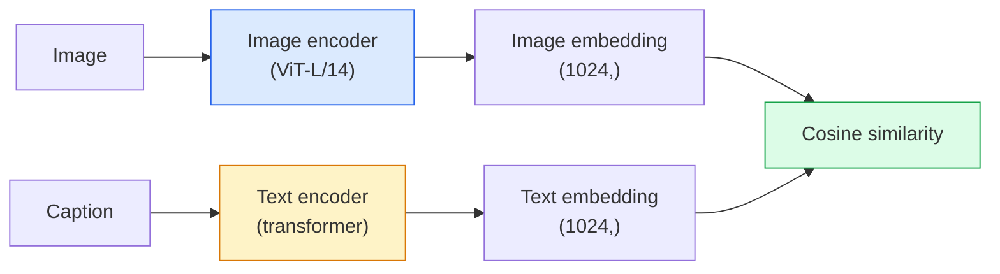

# 开放词表视觉——CLIP

> 联合训练一个图像编码器和一个文本编码器，让匹配的（图像，图像描述）对映射到共享空间中的同一点。诀窍就这么简单。

**Type:** Build + Use
**Languages:** Python
**Prerequisites:** 阶段 4 第 14 课（ViT）、阶段 4 第 17 课（自监督学习）
**Time:** ~45 分钟

## 学习目标

- 解释 CLIP 的双塔架构（two-tower）与对比训练目标（contrastive training objective）
- 使用预训练的 CLIP（或 SigLIP）进行零样本分类（zero-shot classification），无需任何任务专属训练
- 从零实现零样本分类：编码类别提示词（prompt）、计算余弦相似度（cosine similarity）、取 argmax（最大值对应的索引）
- 区分 CLIP、SigLIP、OpenCLIP 和 LLaVA/LLaMA-vision 模型，说明它们在 2026 年各自的用途

## 要解决的问题

传统分类器采用封闭词表：一个 1000 类的 ImageNet 模型只能预测 1000 个标签。每增加一个类别，都需要有标注的数据，并重新训练分类头。

CLIP（Radford 等，OpenAI 2021）表明，用从网络抓取的 400M 个（图像，图像描述）对进行训练，得到的模型可以在推理时将图像分到任意一组类别中，而这些类别只需用自然语言描述。写一句话，就能给它提供一个新类别。

这种能力称为零样本迁移（zero-shot transfer），也正是所有现代视觉系统都从 CLIP 系列模型检查点（checkpoint）起步的原因。检测（Grounding DINO、OWL-ViT）、分割（CLIPSeg、SAM）、检索、内容审核、视觉语言模型（VLM）和文生图，都建立在 CLIP 式联合嵌入（joint embeddings）之上。

## 核心概念

### 双塔



两个编码器的末端都通过线性投影映射到相同的嵌入维度（CLIP-B/32 为 512，CLIP-L/14 为 1024）。进行 L2 归一化，再计算余弦相似度。

### 训练目标

给定一批 N 个（图像，图像描述）对，构造一个 NxN 相似度矩阵。训练两个编码器，使对角线上的匹配对具有较高的相似度，非对角线上的不匹配对具有较低的相似度。

```text
sim_matrix = image_embeddings @ text_embeddings.T / tau

loss_i2t = cross_entropy(sim_matrix,       targets=arange(N))
loss_t2i = cross_entropy(sim_matrix.T,     targets=arange(N))
loss = (loss_i2t + loss_t2i) / 2
```

损失采用对称形式，是因为图像到文本和文本到图像的检索都应有效。`tau`（温度，temperature）通常是一个可学习的标量参数，初始值为 0.07。

### SigLIP：更好的损失

SigLIP（Zhai 等，2023）用逐对计算的 sigmoid 替代了 softmax：

```text
loss = mean over pairs of log(1 + exp(-y_ij * sim_ij))
y_ij = +1 if matching, -1 otherwise
```

逐对计算损失，消除了 CLIP 所需的批次级归一化。SigLIP 在小批量下训练得更好，并能在相同数据量下达到或超过 CLIP 的表现。

### 零样本分类

给定一个训练好的 CLIP：

1. 为每个类别构造一个提示词："a photo of a {class}"。
2. 用文本编码器编码所有类别提示词 -> `T` 的形状为 (C, d)。
3. 编码测试图像 -> `I` 的形状为 (1, d)。
4. 相似度 = `I @ T.T`，形状为 (1, C)。
5. Argmax -> 预测类别。

提示词工程（prompt engineering）很重要。OpenAI 为 ImageNet 发布了 80 种提示词模板（prompt templates），例如 "a photo of a {}"、"a blurry photo of a {}"、"a sketch of a {}" 等。对每个类别的所有模板嵌入取平均，可以额外提升 1-3% 的 top-1 准确率。

### CLIP 式模型在 2026 年的应用

- **零样本分类**：直接使用。
- **图像检索**：将所有图像编码一次，在推理时对查询生成嵌入。
- **以文本为条件的检测**：Grounding DINO、OWL-ViT 将 CLIP 文本塔与检测器结合。
- **以文本为条件的分割**：CLIPSeg；SAM 通过 CLIP 使用文本提示词输入。
- **VLM**：LLaVA、Qwen-VL、InternVL 将 CLIP 系列视觉编码器接入大语言模型（LLM）。
- **文生图**：Stable Diffusion、DALL-E 3 以 CLIP 文本嵌入作为条件。

一旦有了共享嵌入空间，每一项视觉+语言任务就都变成了距离计算。

```figure
clip-contrastive
```

## 动手实现

### 步骤 1：小型双塔模型

真正的 CLIP 是 ViT + Transformer。本课的两个塔则是作用于预先提取特征的小型多层感知机（MLP），这样在 CPU 上也能观察到训练信号。

```python
import torch
import torch.nn as nn
import torch.nn.functional as F


class TwoTower(nn.Module):
    def __init__(self, img_in=128, txt_in=64, emb=64):
        super().__init__()
        self.image_proj = nn.Sequential(nn.Linear(img_in, 128), nn.ReLU(), nn.Linear(128, emb))
        self.text_proj = nn.Sequential(nn.Linear(txt_in, 128), nn.ReLU(), nn.Linear(128, emb))
        self.logit_scale = nn.Parameter(torch.ones([]) * 2.6592)  # ln(1/0.07)

    def forward(self, img_feats, txt_feats):
        i = F.normalize(self.image_proj(img_feats), dim=-1)
        t = F.normalize(self.text_proj(txt_feats), dim=-1)
        return i, t, self.logit_scale.exp()
```

两个投影、相同维度的输出、可学习的温度。接口形式与真正的 CLIP API（应用程序编程接口）相同。

### 步骤 2：对比损失

```python
def clip_loss(image_emb, text_emb, logit_scale):
    N = image_emb.size(0)
    sim = logit_scale * image_emb @ text_emb.T
    targets = torch.arange(N, device=sim.device)
    l_i = F.cross_entropy(sim, targets)
    l_t = F.cross_entropy(sim.T, targets)
    return (l_i + l_t) / 2
```

损失是对称的。logit_scale 越高 = softmax 分布越尖锐 = 预测越自信，但也存在不稳定的风险。

### 步骤 3：零样本分类器

```python
@torch.no_grad()
def zero_shot_classify(model, image_feats, class_text_feats, class_names):
    """
    image_feats:      (N, img_in)
    class_text_feats: (C, txt_in)   one averaged embedding per class
    """
    i = F.normalize(model.image_proj(image_feats), dim=-1)
    t = F.normalize(model.text_proj(class_text_feats), dim=-1)
    sim = i @ t.T
    pred = sim.argmax(dim=-1)
    return [class_names[p] for p in pred.tolist()]
```

每个步骤一行代码。这正是生产环境中使用 CLIP 模型检查点进行零样本分类的流程。

### 步骤 4：合理性检查

```python
torch.manual_seed(0)
model = TwoTower()

img = torch.randn(8, 128)
txt = torch.randn(8, 64)
i, t, scale = model(img, txt)
loss = clip_loss(i, t, scale)
print(f"batch size: {i.size(0)}   loss: {loss.item():.3f}")
```

对于随机初始化的模型，损失应接近 `log(N) = log(8) = 2.08`，这是尚未学到任何结构时，对称交叉熵（cross-entropy）损失的目标值。

## 实际使用

OpenCLIP 是 2026 年社区的默认选择：

```python
import open_clip
import torch
from PIL import Image

model, _, preprocess = open_clip.create_model_and_transforms("ViT-B-32", pretrained="laion2b_s34b_b79k")
tokenizer = open_clip.get_tokenizer("ViT-B-32")

image = preprocess(Image.open("dog.jpg")).unsqueeze(0)
text = tokenizer(["a photo of a dog", "a photo of a cat", "a photo of a car"])

with torch.no_grad():
    image_features = model.encode_image(image)
    text_features = model.encode_text(text)
    image_features = image_features / image_features.norm(dim=-1, keepdim=True)
    text_features = text_features / text_features.norm(dim=-1, keepdim=True)
    probs = (100.0 * image_features @ text_features.T).softmax(dim=-1)

print(probs)
```

SigLIP 是较新的模型，在小规模下训练得更好，也是新项目的首选：`google/siglip-base-patch16-224`。Hugging Face 同时提供两者。

## 交付成果

本课产出：

- `outputs/prompt-zero-shot-class-picker.md`：一个提示词，根据类别列表和领域，为零样本 CLIP 设计类别模板。
- `outputs/skill-image-text-retriever.md`：一项技能，使用任意 CLIP 模型检查点构建图像嵌入索引，支持文本查询和图像查询。

## 练习

1. **（简单）** 使用预训练的 OpenCLIP ViT-B/32，结合包含 80 个模板的提示词集，在 CIFAR-10 上进行零样本分类。报告 top-1 准确率，应在 85-90% 左右。
2. **（中等）** 在同一个 CIFAR-10 任务上，比较单一模板（"a photo of a {}"）与 80 个模板的平均嵌入。量化差距，并解释模板为何有帮助。
3. **（困难）** 构建一个零样本图像检索索引：用 CLIP 为 1,000 张图像生成嵌入，构建 FAISS 索引，再用自然语言描述进行查询。手工编写 20 条留出查询，报告检索 recall@5（召回率）。

## 关键术语

| 术语 | 常见说法 | 实际含义 |
|------|----------------|----------------------|
| 双塔 | “双编码器” | 独立的图像编码器和文本编码器，末端各有一个输出维度相同的投影头（projection head） |
| 零样本 | “无需任务专属训练” | 在推理时，将输入分到仅用文本描述的类别中；不使用任何标签 |
| 温度 / logit_scale | “tau” | 在 softmax 之前缩放相似度矩阵的可学习标量 |
| 提示词模板 | "A photo of a {}" | 用自然语言包装类别名称；对多个模板取平均可提高零样本准确率 |
| CLIP | “图像+文本模型” | OpenAI 在 2021 年提出的模型；到 2026 年已成为该领域的通用语言 |
| SigLIP | “Sigmoid CLIP” | 将 softmax 换成逐对计算的 sigmoid；在小批量下训练得更好 |
| OpenCLIP | “开放复现” | 社区在 LAION 上训练的 CLIP 变体；开源流水线在生产环境中的默认选择 |
| VLM | “视觉语言模型” | CLIP 系列编码器加上一个 LLM，经过训练以回答有关图像的问题 |

## 延伸阅读

- [CLIP：从自然语言监督中学习可迁移的视觉模型（Radford 等，2021）](https://arxiv.org/abs/2103.00020)
- [SigLIP：语言-图像预训练的 Sigmoid 损失（Zhai 等，2023）](https://arxiv.org/abs/2303.15343)
- [OpenCLIP](https://github.com/mlfoundations/open_clip)：社区代码库
- [Oquab 等（2023）。DINOv2：在无监督条件下学习稳健的视觉特征](https://arxiv.org/abs/2304.07193)：论文包含与 CLIP 式和 MAE 式模型的特征基准比较
