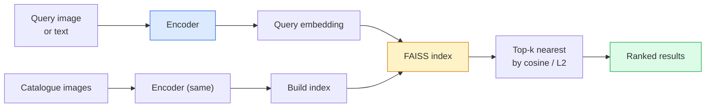

# 图像检索与度量学习

> 检索系统根据嵌入（embedding）空间中的距离对候选项排序。度量学习（metric learning）研究如何塑造这个空间，让距离表达你想要的含义。

**Type:** Build
**Languages:** Python
**Prerequisites:** 第 4 阶段第 14 课（ViT），第 4 阶段第 18 课（CLIP）
**Time:** ~45 分钟

## 学习目标

- 解释三元组损失（triplet loss）、对比损失（contrastive loss）和基于代理的度量学习损失，并为给定数据集选出合适的一种
- 正确实现 L2 归一化和余弦相似度（cosine similarity），并审视“同一物品”检索与“同一类别”检索的区别
- 构建 FAISS 索引，用文本和图像查询它，并报告留出查询集上的 recall@K（召回率）
- 将 DINOv2、CLIP 和 SigLIP 用作现成的嵌入主干网络（backbone），并了解各自在哪些情况下更占优势

## 要解决的问题

在生产环境的视觉应用中，检索无处不在：重复图像检测、以图搜图、视觉搜索（“查找相似商品”）、人脸重识别、监控中的行人重识别，以及电商中的实例级匹配。产品层面的问题始终相同：“给定这张查询图像，对我的图像目录进行排序。”

两个设计决策决定了整个系统的形态。其一是嵌入：用什么模型生成向量。其二是索引：如何在大规模数据中找到最近邻。到 2026 年，两者都已是成熟的通用组件（嵌入用 DINOv2，索引用 FAISS），这也提高了要求：难点在于为你的应用定义*怎样才算相似*，再塑造嵌入空间，让距离与这个定义相符。

这种塑造过程就是度量学习。这是一个规模不大，却能发挥很大作用的领域。

## 核心概念

### 检索流程一览



### 四类损失

| 损失 | 所需数据 | 优点 | 缺点 |
|------|----------|------|------|
| **对比损失** | （锚样本，正样本）+ 负样本 | 简单，适用于任何样本对标签 | 负样本不够多时收敛缓慢 |
| **三元组损失** | （锚样本，正样本，负样本） | 直观；可直接控制间隔 | 困难三元组挖掘开销大 |
| **NT-Xent / InfoNCE** | 样本对 + 从批次中挖掘的负样本 | 可扩展到大批次 | 需要大批次或动量队列 |
| **基于代理的损失（ProxyNCA）** | 只需类别标签 | 快速、稳定，无须挖掘 | 小数据集上可能对代理过拟合 |

对于大多数生产用例，先从预训练主干网络入手；只有当现成嵌入在测试集上的表现不佳时，才增加度量学习微调（fine-tuning）。

### 三元组损失的形式化定义

```text
L = max(0, ||f(a) - f(p)||^2 - ||f(a) - f(n)||^2 + margin)
```

将锚样本（anchor）`a` 拉近正样本（positive）`p`，推离负样本（negative）`n`，并用间隔 `margin` 保证两种距离之间存在差距。这种三图像结构可以推广到任何相似度排序。

挖掘很重要：容易三元组（`n` 已经离 `a` 很远）的损失贡献为零；只有困难三元组才能让网络学到东西。半困难负样本挖掘（semi-hard mining，即 `n` 比 `p` 更远，但仍在间隔之内）是 2016 年 FaceNet 的训练方案，至今仍占主导地位。

### 余弦相似度与 L2

两种度量，两种约定：

- **余弦相似度**：向量之间的夹角。要求嵌入经过 L2 归一化。
- **L2**：欧氏距离（Euclidean distance）。适用于原始嵌入或归一化后的嵌入，但通常采用 L2 归一化与平方 L2 距离的组合。

对于大多数现代网络，两者等价：当 `||a|| = ||b|| = 1` 时，`||a - b||^2 = 2 - 2 cos(a, b)`。应选择与嵌入训练方式相匹配的约定；混用两者会悄然改变“最近”的含义。

### Recall@K

标准的检索指标：

```text
recall@K = fraction of queries where at least one correct match is in the top K results
```

并列报告 recall@1、@5、@10。如果 recall@10 高于 0.95，而 recall@1 低于 0.5，说明嵌入空间的结构是对的，但排序噪声较大；可以尝试延长微调时间，或增加重排序步骤。

对于重复图像检测，precision@K（精确率）更重要，因为每个假阳性都是用户能看到的错误。对于视觉搜索，recall@K 才是反映产品效果的信号。

### 用一段话了解 FAISS

Facebook AI Similarity Search。它是最近邻搜索领域事实上的标准库。有三种索引可选：

- `IndexFlatIP` / `IndexFlatL2`：暴力搜索，精确，无须训练。适用于最多 ~1M 个向量。
- `IndexIVFFlat`：划分为 K 个单元，只搜索最近的几个单元。近似、快速，需要训练数据。
- `IndexHNSW`：基于图，对大量查询最快，索引体积大。

对于 100k 个向量，你很可能需要基于余弦相似度的 `IndexFlatIP`。对于 10M 个向量，需要 `IndexIVFFlat`。对于 100M+ 个向量，则要结合乘积量化（`IndexIVFPQ`）。

### 实例级检索与类别级检索

同一个名称，指向两种截然不同的问题：

- **类别级**：“在我的图像目录中找猫。”这是以类别为条件的相似性；现成的 CLIP / DINOv2 嵌入效果很好。
- **实例级**：“在我的图像目录中找到*这件完全相同的商品*。”这需要在同一类别中视觉上相似的对象之间进行细粒度区分；现成嵌入表现不佳，使用度量学习进行微调很重要。

选择模型前，务必先问清楚要解决的是哪一种问题。

```figure
metric-embedding
```

## 动手实现

### 步骤 1：三元组损失

```python
import torch
import torch.nn.functional as F

def triplet_loss(anchor, positive, negative, margin=0.2):
    d_ap = F.pairwise_distance(anchor, positive, p=2)
    d_an = F.pairwise_distance(anchor, negative, p=2)
    return F.relu(d_ap - d_an + margin).mean()
```

只需一行。适用于经过 L2 归一化的嵌入，也适用于原始嵌入。

### 步骤 2：半困难负样本挖掘

给定一批嵌入和标签，为每个锚样本找出最困难的半困难负样本。

```python
def semi_hard_negatives(emb, labels, margin=0.2):
    dist = torch.cdist(emb, emb)
    same_class = labels[:, None] == labels[None, :]
    diff_class = ~same_class
    N = emb.size(0)

    positives = dist.clone()
    positives[~same_class] = float("-inf")
    positives.fill_diagonal_(float("-inf"))
    pos_idx = positives.argmax(dim=1)

    semi_hard = dist.clone()
    semi_hard[same_class] = float("inf")
    d_ap = dist[torch.arange(N), pos_idx].unsqueeze(1)
    semi_hard[dist <= d_ap] = float("inf")
    neg_idx = semi_hard.argmin(dim=1)

    fallback_mask = semi_hard[torch.arange(N), neg_idx] == float("inf")
    if fallback_mask.any():
        hardest = dist.clone()
        hardest[same_class] = float("inf")
        neg_idx = torch.where(fallback_mask, hardest.argmin(dim=1), neg_idx)
    return pos_idx, neg_idx
```

每个锚样本都会得到类内最困难的正样本，以及一个比正样本更远、但仍在间隔内的半困难负样本。

### 步骤 3：Recall@K

```python
def recall_at_k(query_emb, gallery_emb, query_labels, gallery_labels, k=1):
    sim = query_emb @ gallery_emb.T
    _, top_k = sim.topk(k, dim=-1)
    matches = (gallery_labels[top_k] == query_labels[:, None]).any(dim=-1)
    return matches.float().mean().item()
```

在经过 L2 归一化的嵌入上，按内积选出的 top-k 与按余弦相似度选出的 top-k 相同。报告至少有一个正确近邻的查询所占的平均比例。

### 步骤 4：组合起来

```python
import torch
import torch.nn as nn
from torch.optim import Adam

class Encoder(nn.Module):
    def __init__(self, in_dim=128, emb_dim=64):
        super().__init__()
        self.net = nn.Sequential(
            nn.Linear(in_dim, 128), nn.ReLU(),
            nn.Linear(128, emb_dim),
        )

    def forward(self, x):
        return F.normalize(self.net(x), dim=-1)

torch.manual_seed(0)
num_classes = 6
protos = F.normalize(torch.randn(num_classes, 128), dim=-1)

def sample_batch(bs=32):
    labels = torch.randint(0, num_classes, (bs,))
    x = protos[labels] + 0.15 * torch.randn(bs, 128)
    return x, labels

enc = Encoder()
opt = Adam(enc.parameters(), lr=3e-3)

for step in range(200):
    x, y = sample_batch(32)
    emb = enc(x)
    pos_idx, neg_idx = semi_hard_negatives(emb, y)
    loss = triplet_loss(emb, emb[pos_idx], emb[neg_idx])
    opt.zero_grad(); loss.backward(); opt.step()
```

几百步之后，嵌入会形成每个类别对应一个簇的聚类结构。

## 实际使用

2026 年的生产技术栈：

- **DINOv2 + FAISS**：通用视觉检索，开箱即用。
- **CLIP + FAISS**：用于文本查询。
- **微调后的 DINOv2 + FAISS**：实例级检索、人脸重识别、时尚和电商。
- **Milvus / Weaviate / Qdrant**：封装 FAISS 或 HNSW 的托管向量数据库。

要达到实例检索的当前最佳水平（SOTA），采用的方案是：以 DINOv2 为主干网络，添加一个嵌入头，在标有实例身份的样本对上使用三元组损失或 InfoNCE 损失进行微调，再用 FAISS 建立索引。

## 交付成果

本课产出：

- `outputs/prompt-retrieval-loss-picker.md`：一个提示词（prompt），为给定的检索问题选择三元组损失 / InfoNCE / ProxyNCA。
- `outputs/skill-recall-at-k-runner.md`：一项技能，用于编写清晰规范的 recall@K 评估框架，包含训练集/验证集/图库划分及适当的数据约定。

## 练习

1. **（简单）** 运行上面的玩具示例。用 PCA 绘制训练前后的嵌入，观察六个簇如何形成。
2. **（中等）** 添加 ProxyNCA 损失实现：每个类别一个可学习的“代理”，在余弦相似度上计算标准交叉熵。在玩具数据上，将其收敛速度与三元组损失进行比较。
3. **（困难）** 取 1,000 张 ImageNet 验证图像，通过 HuggingFace 用 DINOv2 生成嵌入，构建 FAISS Flat 索引，然后分别将这些相同图像作为查询（结果应为 1.0），以及使用以 ImageNet 标签为真实标签的留出划分，报告 recall@{1, 5, 10}。

## 关键术语

| 术语 | 常见说法 | 实际含义 |
|------|----------------|----------------------|
| 度量学习 | “塑造空间” | 训练编码器，使其输出空间中的距离反映目标相似性 |
| 三元组损失 | “拉近与推远” | L = max(0, d(a, p) - d(a, n) + margin)；经典的度量学习损失 |
| 半困难负样本挖掘 | “有用的负样本” | 比正样本离锚样本更远、但仍在间隔内的负样本；经验上最有信息量 |
| 基于代理的损失 | “类别原型” | 每个类别一个可学习的代理；对与各代理的相似度计算交叉熵；无须挖掘样本对 |
| Recall@K | “Top-K 命中率” | 前 K 个结果中至少有一个正确结果的查询所占的比例 |
| 实例检索 | “找到这个完全相同的东西” | 细粒度匹配；现成特征通常表现不佳 |
| FAISS | “最近邻库” | Facebook 的最近邻库；支持精确索引和近似索引 |
| HNSW | “图索引” | 分层可导航小世界（Hierarchical navigable small world）；内存开销小的快速近似最近邻算法 |

## 延伸阅读

- [FaceNet: A Unified Embedding for Face Recognition (Schroff et al., 2015)](https://arxiv.org/abs/1503.03832)：介绍三元组损失 / 半困难负样本挖掘的论文
- [In Defense of the Triplet Loss for Person Re-Identification (Hermans et al., 2017)](https://arxiv.org/abs/1703.07737)：三元组微调的实用指南
- [FAISS documentation](https://github.com/facebookresearch/faiss/wiki)：各种索引及其取舍
- [SMoT: Metric Learning Taxonomy (Kim et al., 2021)](https://arxiv.org/abs/2010.06927)：综述现代损失及其相互联系
