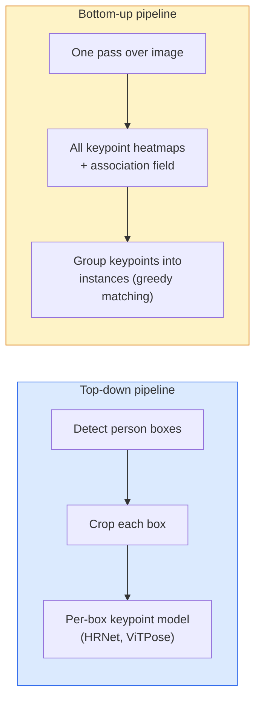

# 关键点检测与姿态估计

> 姿态（pose）是一组有序的关键点（keypoint）。关键点检测器就是热图回归器（heatmap regressor）。其余的都只是信息的记录与管理。

**Type:** Build
**Languages:** Python
**Prerequisites:** 阶段 4 第 06 课（目标检测），阶段 4 第 07 课（U-Net）
**Time:** ~45 分钟

## 学习目标

- 区分自顶向下（top-down）与自底向上（bottom-up）的姿态估计（pose estimation），并说明各自的适用场景
- 以每个关键点对应的高斯（Gaussian）热图为目标，对 K 个关键点的热图进行回归，并在推理（inference）时提取关键点坐标
- 解释部件亲和场（Part Affinity Fields，PAFs），以及自底向上的管线（pipeline）如何将关键点关联成实例（instance）
- 使用 MediaPipe Pose 或 MMPose 在生产环境中进行关键点估计，并理解其输出格式

## 要解决的问题

关键点任务有许多不同的名称：人体姿态（17 个身体关节）、人脸标志点（landmark，68 或 478 个点）、手部（21 个点）、动物姿态、机器人任务中的物体姿态、医学解剖标志点。它们都有相同的结构：检测物体上的 K 个离散点，并输出这些点的 (x, y) 坐标。

姿态估计是动作捕捉、健身应用、体育分析、手势控制、动画、增强现实（AR）试穿和机器人抓取的基础。2D 情况已经成熟；3D 姿态估计（从单个相机的图像估计关节在世界坐标（world coordinates）中的位置）则是当前的研究前沿。

工程上的问题在于规模。单张图像中的单人姿态估计是一个 20ms 的问题；要以 30 fps 估计人群中的多人姿态，则是另一类问题，需要不同的架构。

## 核心概念

### 自顶向下与自底向上



- **自顶向下**：先检测出人，再对每个裁剪区域运行单人关键点模型。准确性最高；计算量随人数线性增长。
- **自底向上**：一次前向传播（forward pass）预测所有关键点及关联场，然后将关键点分组。无论人群规模多大，耗时都恒定。

自顶向下的方法（HRNet、ViTPose）在准确性上领先；在人群密集的场景中，自底向上的方法（OpenPose、HigherHRNet）在吞吐量（throughput）上领先。

### 热图回归

不直接回归 `(x, y)`，而是为每个关键点预测一张 `H x W` 热图，其中的高斯斑块以真实位置为中心。

```text
target[k, y, x] = exp(-((x - cx_k)^2 + (y - cy_k)^2) / (2 sigma^2))
```

推理时，每张热图的 argmax（最大值对应的索引）就是预测的关键点位置。

热图为什么比直接回归更有效：网络的空间结构（卷积特征图，conv feature map）与空间输出天然对应。高斯目标还起到正则化（regularisation）的作用：小幅定位误差会产生较小的损失，而不是零损失。

### 亚像素定位

Argmax 返回整数坐标。要获得亚像素（sub-pixel）定位精度，可以用 argmax 位置及其邻近点拟合抛物线来细化坐标，也可以采用常见的偏移方向 `(dx, dy) = 0.25 * (heatmap[y, x+1] - heatmap[y, x-1], ...)`。

### 部件亲和场（PAFs）

这是 OpenPose 实现自底向上关联的技巧。对于每一对相连的关键点（例如从左肩到左肘），预测一个 2 通道场，编码从其中一点指向另一点的单位向量（unit vector）。要将肩部与对应的肘部关联起来，就沿连接候选点对的直线对 PAF 做线积分（line integral）；积分最大的点对被匹配在一起。

```text
For each connection (limb):
  PAF channels: 2 (unit vector x, y)
  Line integral: sum over sample points of (PAF . line_direction)
  Higher integral = stronger match
```

这种方法简洁巧妙，无须逐人裁剪，就能扩展到任意规模的人群。

### COCO 关键点

这是标准的人体姿态数据集：每人 17 个关键点，使用关键点正确率（Percentage of Correct Keypoints，PCK）和目标关键点相似度（Object Keypoint Similarity，OKS）作为指标。OKS 相当于关键点版本的交并比（IoU），也是 COCO mAP@OKS（mAP 为平均精确率均值） 所报告的指标。

### 2D 与 3D

- **2D 姿态**：使用图像坐标（image coordinates）；已达到生产应用水平（MediaPipe、HRNet、ViTPose）。
- **3D 姿态**：使用世界坐标 / 相机坐标（camera coordinates）；仍是活跃的研究领域。常见方法包括：
  - 用小型多层感知机（MLP）将 2D 预测提升到 3D（VideoPose3D）。
  - 直接从图像回归 3D 姿态（PyMAF、MHFormer）。
  - 使用多视角系统（CMU Panoptic）获取真实值（ground truth）。

```figure
cv3-pose-heatmap
```

## 动手实现

### Step 1: 高斯热图目标

```python
import numpy as np
import torch

def gaussian_heatmap(size, cx, cy, sigma=2.0):
    yy, xx = np.meshgrid(np.arange(size), np.arange(size), indexing="ij")
    return np.exp(-((xx - cx) ** 2 + (yy - cy) ** 2) / (2 * sigma ** 2)).astype(np.float32)

hm = gaussian_heatmap(64, 32, 32, sigma=2.0)
print(f"peak: {hm.max():.3f} at ({hm.argmax() % 64}, {hm.argmax() // 64})")
```

将每个关键点的热图沿通道轴堆叠，就得到完整的目标张量。

### Step 2: 微型关键点预测头

一个 U-Net 风格的模型，输出 K 个热图通道。

```python
import torch.nn as nn
import torch.nn.functional as F

class TinyKeypointNet(nn.Module):
    def __init__(self, num_keypoints=4, base=16):
        super().__init__()
        self.down1 = nn.Sequential(nn.Conv2d(3, base, 3, 2, 1), nn.ReLU(inplace=True))
        self.down2 = nn.Sequential(nn.Conv2d(base, base * 2, 3, 2, 1), nn.ReLU(inplace=True))
        self.mid = nn.Sequential(nn.Conv2d(base * 2, base * 2, 3, 1, 1), nn.ReLU(inplace=True))
        self.up1 = nn.ConvTranspose2d(base * 2, base, 2, 2)
        self.up2 = nn.ConvTranspose2d(base, num_keypoints, 2, 2)

    def forward(self, x):
        h1 = self.down1(x)
        h2 = self.down2(h1)
        h3 = self.mid(h2)
        u1 = self.up1(h3)
        return self.up2(u1)
```

输入为 `(N, 3, H, W)`，输出为 `(N, K, H, W)`。损失是相对于高斯目标的逐像素均方误差（MSE）。

### Step 3: 推理：提取关键点坐标

```python
def heatmap_to_coords(heatmaps):
    """
    heatmaps: (N, K, H, W)
    returns:  (N, K, 2) float coordinates in image pixels
    """
    N, K, H, W = heatmaps.shape
    hm = heatmaps.reshape(N, K, -1)
    idx = hm.argmax(dim=-1)
    ys = (idx // W).float()
    xs = (idx % W).float()
    return torch.stack([xs, ys], dim=-1)

coords = heatmap_to_coords(torch.randn(2, 4, 32, 32))
print(f"coords: {coords.shape}")  # (2, 4, 2)
```

推理时只需一行。要进行亚像素细化，可在 argmax 周围插值。

### Step 4: 合成关键点数据集

很简单：在白色画布上画四个点，让模型学习预测它们。

```python
def make_synthetic_sample(size=64):
    img = np.ones((3, size, size), dtype=np.float32)
    rng = np.random.default_rng()
    kps = rng.integers(8, size - 8, size=(4, 2))
    for cx, cy in kps:
        img[:, cy - 2:cy + 2, cx - 2:cx + 2] = 0.0
    hms = np.stack([gaussian_heatmap(size, cx, cy) for cx, cy in kps])
    return img, hms, kps
```

这个任务足够简单，微型模型一分钟就能学会。

### Step 5: 训练

```python
model = TinyKeypointNet(num_keypoints=4)
opt = torch.optim.Adam(model.parameters(), lr=3e-3)

for step in range(200):
    batch = [make_synthetic_sample() for _ in range(16)]
    imgs = torch.from_numpy(np.stack([b[0] for b in batch]))
    hms = torch.from_numpy(np.stack([b[1] for b in batch]))
    pred = model(imgs)
    # Upsample pred to full resolution
    pred = F.interpolate(pred, size=hms.shape[-2:], mode="bilinear", align_corners=False)
    loss = F.mse_loss(pred, hms)
    opt.zero_grad(); loss.backward(); opt.step()
```

## 实际使用

- **MediaPipe Pose**：Google 的生产级姿态估计器；提供 WebGL + 移动端运行时，延迟（latency）低于 10ms。
- **MMPose**（OpenMMLab）：全面的研究代码库，包含所有最先进的（SOTA）架构及其预训练权重。
- **YOLOv8-pose**：通过一次前向传播实现最快的实时多人姿态估计。
- **transformers HumanDPT / PoseAnything**：较新的视觉语言方法，用于开放词汇姿态估计（任意物体、任意关键点集合）。

## 交付成果

本课产出：

- `outputs/prompt-pose-stack-picker.md`：一份提示词（prompt），根据延迟、人群规模以及 2D 或 3D 需求，在 MediaPipe / YOLOv8-pose / HRNet / ViTPose 之间进行选择。
- `outputs/skill-heatmap-to-coords.md`：一项技能（skill），用于编写每个生产级姿态模型都采用的亚像素热图转坐标例程。

## 练习

1. **（简单）** 在合成的 4 点数据集上训练微型关键点模型。报告训练 200 步后，预测关键点与真实关键点之间的平均 L2 误差。
2. **（中等）** 加入亚像素细化：给定 argmax 位置，利用相邻像素分别沿 x 和 y 方向拟合 1D 抛物线。报告相对于整数 argmax 的定位精度提升。
3. **（困难）** 构建一个 2 人合成数据集，每张图像展示该 4 关键点图案的两个实例。训练一条使用 PAFs 的自底向上管线，预测每个关键点属于哪个实例，并评估 OKS。

## 关键术语

| 术语 | 人们常说的叫法 | 实际含义 |
|------|----------------|----------------------|
| 关键点 | “标志点” | 物体上具有特定顺序的点（关节、角点、特征点） |
| 姿态 | “骨架” | 属于同一个实例的一组有序关键点 |
| 自顶向下 | “先检测，再估计姿态” | 两阶段管线：人体检测器 + 针对每个裁剪区域的关键点模型；准确性最高 |
| 自底向上 | “先估计姿态，再分组” | 单次预测所有关键点 + 分组；耗时不随人群规模变化 |
| 热图 | “高斯目标” | 每个关键点对应一个 H x W 张量，峰值位于真实位置；首选的回归目标 |
| PAF | “部件亲和场” | 编码肢段方向的 2 通道单位向量场；用于将关键点分组成实例 |
| OKS | “关键点的 IoU” | 目标关键点相似度；COCO 用于姿态估计的指标 |
| HRNet | “High-Resolution Net（高分辨率网络）” | 占主导地位的自顶向下关键点架构；全程保留高分辨率特征 |

## 延伸阅读

- [OpenPose (Cao et al., 2017)](https://arxiv.org/abs/1812.08008)：使用 PAFs 的自底向上方法；仍是对该方法最好的阐述
- [HRNet (Sun et al., 2019)](https://arxiv.org/abs/1902.09212)：自顶向下方法的参考架构
- [ViTPose (Xu et al., 2022)](https://arxiv.org/abs/2204.12484)：以普通 ViT 作为姿态估计的主干网络（backbone）；目前在许多基准上达到 SOTA
- [MediaPipe Pose](https://developers.google.com/mediapipe/solutions/vision/pose_landmarker)：生产级实时姿态估计；2026 年最快的已部署技术栈
