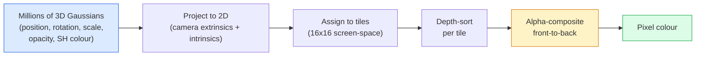

# 从零实现 3D Gaussian Splatting（高斯泼溅）

> 一个场景就是由数百万个 3D 高斯体组成的云团。每个高斯体都有位置、朝向、尺度、不透明度，以及随观察方向变化的颜色。对它们进行光栅化（rasterisation），再通过光栅化过程反向传播，就完成了。

**Type:** Build
**Languages:** Python
**Prerequisites:** 第 4 阶段第 13 课（3D 视觉与 NeRF）、第 1 阶段第 12 课（张量操作）、第 4 阶段第 10 课（扩散基础，可选）
**Time:** ~90 分钟

## 学习目标

- 解释为什么 3D Gaussian Splatting 在照片级真实感 3D 重建中取代 NeRF，成为 2026 年生产环境的默认选择
- 说出每个高斯体的六类参数（位置、旋转四元数、尺度、不透明度、球谐函数颜色、可选特征），以及每类参数占用多少个浮点数
- 从零实现采用 `alpha` 合成的 2D 高斯泼溅光栅化器，再说明 3D 情况如何在投影后归结为同一个循环
- 使用 `nerfstudio`、`gsplat` 或 `SuperSplat`，从 20-50 张照片重建场景，并导出为采用 `KHR_gaussian_splatting` 扩展的 glTF，或采用 OpenUSD 26.03 `UsdVolParticleField3DGaussianSplat` schema（结构定义）的格式

## 要解决的问题

神经辐射场（NeRF）把场景存储在多层感知机（MLP）的权重中。每渲染一个像素，都要沿着一条光线查询 MLP 数百次。训练需要数小时，渲染需要数秒，而且这些权重无法编辑：如果你想移动场景里的一把椅子，就必须重新训练。

3D Gaussian Splatting（Kerbl、Kopanas、Leimkühler、Drettakis，SIGGRAPH 2023）替换了整套做法。场景是由 3D 高斯体组成的显式集合。渲染使用 GPU 光栅化，帧率达到 100+ fps。训练只需数分钟。编辑也很直接：平移其中一部分高斯体，就移动了椅子。到 2026 年，Khronos Group 已批准用于高斯泼溅的 glTF 扩展，OpenUSD 26.03 已提供高斯泼溅 schema；Zillow 和 Apartments.com 用它们来渲染房产场景，而大多数新的 3D 重建研究论文都是对 3DGS 核心思路的变体探索。

这一思路很简单，但数学上涉及的环节不少，因此大多数入门介绍从光栅化讲起，跳过了投影和球谐函数。本课将实现整套流程：先做 2D 版本，再扩展到 3D。

## 核心概念

### 一个高斯体包含什么

一个 3D 高斯体是空间中的参数化团块，具有以下属性：

```text
position         mu         (3,)    centre in world coordinates
rotation         q          (4,)    unit quaternion encoding orientation
scale            s          (3,)    log-scales per axis (exponentiated at render time)
opacity          alpha      (1,)    post-sigmoid opacity [0, 1]
SH coefficients  c_lm       (3 * (L+1)^2,)   view-dependent colour
```

旋转与尺度共同构成一个 3x3 协方差矩阵（covariance matrix）：`Sigma = R S S^T R^T`。它描述高斯体在 3D 空间中的形状。球谐函数（spherical harmonics，SH）让颜色随观察方向变化，例如镜面高光、细微的光泽，以及随视角变化的辉光，而不必为每个视角存储纹理。当 SH 阶数为 3 时，每个颜色通道有 16 个系数，仅颜色一项，每个高斯体就占用 48 个浮点数。

一个场景通常有 1-5 million（百万）个高斯体。每个高斯体存储约 60 个浮点数（3 + 4 + 3 + 1 + 48 + misc）。因此，一个包含五百万个高斯体的场景只需 240 MB，远小于每个点都带纹理的等价点云（point cloud），也比以高分辨率重新渲染的 NeRF 所用的 MLP 权重小一个数量级。

### 使用光栅化，而非光线步进



这五个步骤都适合在 GPU 上运行，无需逐像素查询 MLP。单张 RTX 3080 Ti 渲染 6 million（百万）个泼溅图元时，帧率可达 147 fps。

### 投影步骤

位于世界坐标 `mu`、具有 3D 协方差 `Sigma` 的 3D 高斯体，会投影为屏幕位置 `mu'` 上、具有 2D 协方差 `Sigma'` 的 2D 高斯体：

```text
mu' = project(mu)
Sigma' = J W Sigma W^T J^T          (2 x 2)

W = viewing transform (rotation + translation of camera)
J = Jacobian of the perspective projection at mu'
```

这个 2D 高斯体的覆盖区域是一个椭圆，其轴方向由 `Sigma'` 的特征向量给出。椭圆内的每个像素都会接收该高斯体的贡献，权重为 `exp(-0.5 * (p - mu')^T Sigma'^-1 (p - mu'))`。

### alpha 合成规则

对于一个像素，覆盖它的高斯体按从后向前的顺序排序（也可以等价地采用从前向后的顺序，并反向改写公式）。颜色合成采用的公式，与自 1980 年代以来所有半透明光栅化器使用的公式相同：

```text
C_pixel = sum_i alpha_i * T_i * c_i

T_i = prod_{j < i} (1 - alpha_j)       transmittance up to i
alpha_i = opacity_i * exp(-0.5 * d^T Sigma'^-1 d)   local contribution
c_i = eval_SH(SH_i, view_direction)    view-dependent colour
```

这**与 NeRF 体渲染所用的公式相同**，只不过计算对象换成了显式的稀疏高斯体集合，而不是沿光线取得的稠密样本。正是这种一致性，使渲染质量能够媲美 NeRF：两者都在对同一个辐射场方程积分。

### 为什么这个过程可微

每一步，包括投影、图块分配、alpha 合成和 SH 求值，都对高斯体的参数可微。给定作为真实值的图像，计算渲染像素的损失，通过光栅化器反向传播，再用梯度下降更新全部 `(mu, q, s, alpha, c_lm)`。经过 ~30,000 次迭代，高斯体就会找到合适的位置、尺度和颜色。

### 致密化与剪枝

固定不变的高斯体集合无法覆盖复杂场景。训练中包含两种自适应机制：

- 当一个高斯体的梯度幅值很大、尺度却很小时，在其当前位置**克隆**它：这里的重建需要更多细节。
- 当一个大尺度高斯体的梯度很大时，将它**拆分**为两个更小的高斯体：单个大高斯体过于平滑，无法拟合这个区域。
- 对不透明度降至阈值以下的高斯体进行**剪枝**：它们没有作出贡献。

每隔 N 次迭代执行一次致密化。场景通常从以运动恢复结构（SfM）的点初始化的 ~100k 个高斯体，增长到训练结束时的 1-5M 个。

### 用一段话理解球谐函数

随视角变化的颜色，是定义在单位球面上的函数 `c(direction)`。球谐函数就是球面上的 Fourier 基（傅里叶基）。在阶数 `L` 处截断后，每个通道就有 `(L+1)^2` 个基函数。计算新视角下的颜色，就是将学到的 SH 系数与在该观察方向求得的基函数值做点积。阶数 0 = 一个系数 = 恒定颜色。阶数 3 = 16 个系数 = 足以表现 Lambertian 着色（朗伯着色）、镜面反射和轻微的反射效果。SD Gaussian Splatting 论文默认使用阶数 3。

### 2026 年的生产技术栈

```text
1. Capture         smartphone / DJI drone / handheld scanner
2. SfM / MVS       COLMAP or GLOMAP derives camera poses + sparse points
3. Train 3DGS      nerfstudio / gsplat / inria official / PostShot (~10-30 min on RTX 4090)
4. Edit            SuperSplat / SplatForge (clean floaters, segment)
5. Export          .ply -> glTF KHR_gaussian_splatting or .usd (OpenUSD 26.03)
6. View            Cesium / Unreal / Babylon.js / Three.js / Vision Pro
```

### 4D 与生成式变体

- **4D Gaussian Splatting**：高斯体是时间的函数，用于体积视频（Superman 2026、A$AP Rocky 的《Helicopter》）。
- **生成式泼溅**：根据文本生成泼溅场景的模型（World Labs 的 Marble），可以凭空生成整个场景。
- **3D Gaussian Unscented Transform**：NVIDIA NuRec 用于自动驾驶仿真的变体。

```figure
cv3-gaussian-splat
```

## 动手实现

### 步骤 1：一个 2D 高斯体

先构建一个 2D 光栅化器。3D 情况在投影后就归结为这个问题。

```python
import torch
import torch.nn as nn
import torch.nn.functional as F


def eval_2d_gaussian(means, covs, points):
    """
    means:  (G, 2)      centres
    covs:   (G, 2, 2)   covariance matrices
    points: (H, W, 2)   pixel coordinates
    returns: (G, H, W)  density at every pixel for every Gaussian
    """
    G = means.size(0)
    H, W, _ = points.shape
    flat = points.view(-1, 2)
    inv = torch.linalg.inv(covs)
    diff = flat[None, :, :] - means[:, None, :]
    d = torch.einsum("gpi,gij,gpj->gp", diff, inv, diff)
    density = torch.exp(-0.5 * d)
    return density.view(G, H, W)
```

`einsum`（爱因斯坦求和）为每一对（高斯体，像素）计算二次型 `diff^T Sigma^-1 diff`。

### 步骤 2：2D 泼溅光栅化器

从前向后进行 alpha 合成。深度在 2D 中没有意义，因此我们为每个高斯体使用一个通过学习得到的标量来确定顺序。

```python
def rasterise_2d(means, covs, colours, opacities, depths, image_size):
    """
    means:     (G, 2)
    covs:      (G, 2, 2)
    colours:   (G, 3)
    opacities: (G,)     in [0, 1]
    depths:    (G,)     per-Gaussian scalar used for ordering
    image_size: (H, W)
    returns:   (H, W, 3) rendered image
    """
    H, W = image_size
    yy, xx = torch.meshgrid(
        torch.arange(H, dtype=torch.float32, device=means.device),
        torch.arange(W, dtype=torch.float32, device=means.device),
        indexing="ij",
    )
    points = torch.stack([xx, yy], dim=-1)

    densities = eval_2d_gaussian(means, covs, points)
    alphas = opacities[:, None, None] * densities
    alphas = alphas.clamp(0.0, 0.99)

    order = torch.argsort(depths)
    alphas = alphas[order]
    colours_sorted = colours[order]

    T = torch.ones(H, W, device=means.device)
    out = torch.zeros(H, W, 3, device=means.device)
    for i in range(means.size(0)):
        a = alphas[i]
        out += (T * a)[..., None] * colours_sorted[i][None, None, :]
        T = T * (1.0 - a)
    return out
```

这种实现并不快，实际实现会使用基于图块的 CUDA 内核，但它的数学计算完全正确，而且完全可微。

### 步骤 3：可训练的 2D 泼溅场景

```python
class Splats2D(nn.Module):
    def __init__(self, num_splats=128, image_size=64, seed=0):
        super().__init__()
        g = torch.Generator().manual_seed(seed)
        H, W = image_size, image_size
        self.means = nn.Parameter(torch.rand(num_splats, 2, generator=g) * torch.tensor([W, H]))
        self.log_scale = nn.Parameter(torch.ones(num_splats, 2) * math.log(2.0))
        self.rot = nn.Parameter(torch.zeros(num_splats))  # single angle in 2D
        self.colour_logits = nn.Parameter(torch.randn(num_splats, 3, generator=g) * 0.5)
        self.opacity_logit = nn.Parameter(torch.zeros(num_splats))
        self.depth = nn.Parameter(torch.rand(num_splats, generator=g))

    def covs(self):
        s = torch.exp(self.log_scale)
        c, si = torch.cos(self.rot), torch.sin(self.rot)
        R = torch.stack([
            torch.stack([c, -si], dim=-1),
            torch.stack([si, c], dim=-1),
        ], dim=-2)
        S = torch.diag_embed(s ** 2)
        return R @ S @ R.transpose(-1, -2)

    def forward(self, image_size):
        covs = self.covs()
        colours = torch.sigmoid(self.colour_logits)
        opacities = torch.sigmoid(self.opacity_logit)
        return rasterise_2d(self.means, covs, colours, opacities, self.depth, image_size)
```

`log_scale`、`opacity_logit` 和 `colour_logits` 都是无约束参数，在渲染时通过适当的激活函数进行映射。这是所有 3DGS 实现的标准做法。

### 步骤 4：用 2D 高斯体拟合目标图像

```python
import math
import numpy as np

def make_target(size=64):
    yy, xx = np.meshgrid(np.arange(size), np.arange(size), indexing="ij")
    img = np.zeros((size, size, 3), dtype=np.float32)
    # Red circle
    mask = (xx - 20) ** 2 + (yy - 20) ** 2 < 10 ** 2
    img[mask] = [1.0, 0.2, 0.2]
    # Blue square
    mask = (np.abs(xx - 45) < 8) & (np.abs(yy - 40) < 8)
    img[mask] = [0.2, 0.3, 1.0]
    return torch.from_numpy(img)


target = make_target(64)
model = Splats2D(num_splats=64, image_size=64)
opt = torch.optim.Adam(model.parameters(), lr=0.05)

for step in range(200):
    pred = model((64, 64))
    loss = F.mse_loss(pred, target)
    opt.zero_grad(); loss.backward(); opt.step()
    if step % 40 == 0:
        print(f"step {step:3d}  mse {loss.item():.4f}")
```

经过 200 步，64 个高斯体逐渐形成这两个形状。全部思路就是如此：对显式的几何图元进行梯度下降。

### 步骤 5：从 2D 到 3D

扩展到 3D 时仍使用相同的循环，新增内容如下：

1. 每个高斯体的旋转由四元数表示，而不再是单个角度。
2. 协方差为 `R S S^T R^T`，其中 `R` 由四元数构造，且 `S = diag(exp(log_scale))`。
3. 投影 `(mu, Sigma) -> (mu', Sigma')` 使用相机外参，以及透视投影在 `mu` 处的 Jacobian 矩阵（雅可比矩阵）。
4. 颜色变为球谐函数展开，在观察方向上对它求值。
5. 按深度排序使用相机坐标系中真实的 z，而不再是通过学习得到的标量。

所有生产实现（`gsplat`、`inria/gaussian-splatting`、`nerfstudio`）都通过基于图块的 CUDA 内核，在 GPU 上执行这些操作。

### 步骤 6：球谐函数求值

最高阶数为 3 的 SH 基，每个通道有 16 项。求值如下：

```python
def eval_sh_degree_3(sh_coeffs, dirs):
    """
    sh_coeffs: (..., 16, 3)   last dim is RGB channels
    dirs:      (..., 3)       unit vectors
    returns:   (..., 3)
    """
    C0 = 0.282094791773878
    C1 = 0.488602511902920
    C2 = [1.092548430592079, 1.092548430592079,
          0.315391565252520, 1.092548430592079,
          0.546274215296039]
    x, y, z = dirs[..., 0], dirs[..., 1], dirs[..., 2]
    x2, y2, z2 = x * x, y * y, z * z
    xy, yz, xz = x * y, y * z, x * z

    result = C0 * sh_coeffs[..., 0, :]
    result = result - C1 * y[..., None] * sh_coeffs[..., 1, :]
    result = result + C1 * z[..., None] * sh_coeffs[..., 2, :]
    result = result - C1 * x[..., None] * sh_coeffs[..., 3, :]

    result = result + C2[0] * xy[..., None] * sh_coeffs[..., 4, :]
    result = result + C2[1] * yz[..., None] * sh_coeffs[..., 5, :]
    result = result + C2[2] * (2.0 * z2 - x2 - y2)[..., None] * sh_coeffs[..., 6, :]
    result = result + C2[3] * xz[..., None] * sh_coeffs[..., 7, :]
    result = result + C2[4] * (x2 - y2)[..., None] * sh_coeffs[..., 8, :]

    # degree 3 terms omitted here for brevity; full 16-coefficient version in the code file
    return result
```

学到的 `sh_coeffs` 存储该高斯体“在每个方向上的颜色”。渲染时，按当前观察方向求值，就能得到一个 3 维 RGB 向量。

## 实际使用

在实际 3DGS 工作中，使用 `gsplat`（Meta）或 `nerfstudio`：

```bash
pip install nerfstudio gsplat
ns-download-data example
ns-train splatfacto --data path/to/data
```

`splatfacto` 是 nerfstudio 的 3DGS 训练器。对于一个典型场景，运行需要 10-30 分钟，所用显卡为 RTX 4090。

2026 年值得关注的导出选项：

- `.ply`：原始高斯体云团（可移植，文件最大）。
- `.splat`：PlayCanvas / SuperSplat 的量化格式。
- glTF `KHR_gaussian_splatting`：Khronos 标准，可在不同查看器之间移植（2026 年二月 RC）。
- OpenUSD `UsdVolParticleField3DGaussianSplat`：USD 原生格式，用于 NVIDIA Omniverse 和 Vision Pro 管线。

对于 4D / 动态场景，`4DGS` 和 `Deformable-3DGS` 用随时间变化的均值和不透明度，扩展同一套机制。

## 交付成果

本课产出：

- `outputs/prompt-3dgs-capture-planner.md`：一个提示词（prompt），根据给定的场景类型规划拍摄过程，包括照片数量、相机路径和照明。
- `outputs/skill-3dgs-export-router.md`：一项技能，根据下游查看器或引擎选择合适的导出格式（`.ply` / `.splat` / glTF / USD）。

## 练习

1. **（简单）** 在另一张合成图像上运行上面的 2D 泼溅训练器。将 `num_splats` 分别设为 `[16, 64, 256]`，为每种设置绘制均方误差（MSE）随步数变化的曲线。找出收益开始递减的位置。
2. **（中等）** 扩展 2D 光栅化器，使每个高斯体的 RGB 颜色通过阶数为 2 的谐波函数依赖于一个标量“观察角度”。在一对目标图像上训练，并验证模型能重建这两张图像。
3. **（困难）** 克隆 `nerfstudio`，用你拍摄的任意场景（书桌、植物、人脸、房间）的 20 张照片训练 `splatfacto`。导出为 glTF `KHR_gaussian_splatting`，并在查看器（Three.js `GaussianSplats3D`、SuperSplat、Babylon.js V9）中打开。报告训练时间、高斯体数量和渲染帧率 fps。

## 关键术语

| 术语 | 常见说法 | 实际含义 |
|------|----------------|----------------------|
| 3DGS | “高斯泼溅” | 以数百万个 3D 高斯体构成的显式场景表示，每个高斯体都有位置、旋转、尺度、不透明度和 SH 颜色 |
| 协方差 | “高斯体的形状” | `Sigma = R S S^T R^T`；一个高斯体的朝向和各向异性尺度 |
| alpha 合成 | “从后向前混合” | 与 NeRF 体渲染相同的公式，但现在作用于显式稀疏集合 |
| 致密化 | “克隆与拆分” | 在重建欠拟合的区域自适应地添加新高斯体 |
| 剪枝 | “删除低不透明度图元” | 移除在训练中不透明度已降至接近零的高斯体 |
| 球谐函数 | “随视角变化的颜色” | 球面上的 Fourier 基；将颜色存储为观察方向的函数 |
| Splatfacto | “nerfstudio 的 3DGS” | 训练 3DGS 最简单的途径（2026 年） |
| `KHR_gaussian_splatting` | “glTF 标准” | Khronos 在 2026 年推出的扩展，让 3DGS 可在不同查看器和引擎之间移植 |

## 延伸阅读

- [3D Gaussian Splatting for Real-Time Radiance Field Rendering (Kerbl et al., SIGGRAPH 2023)](https://repo-sam.inria.fr/fungraph/3d-gaussian-splatting/)：原始论文
- [gsplat (Meta/nerfstudio)](https://github.com/nerfstudio-project/gsplat)：生产级 CUDA 光栅化器
- [nerfstudio Splatfacto](https://docs.nerf.studio/nerfology/methods/splat.html)：参考训练方案
- [Khronos KHR_gaussian_splatting extension](https://github.com/KhronosGroup/glTF/blob/main/extensions/2.0/Khronos/KHR_gaussian_splatting/README.md)：2026 年的可移植格式
- [OpenUSD 26.03 release notes](https://openusd.org/release/)：`UsdVolParticleField3DGaussianSplat` schema
- [THE FUTURE 3D State of Gaussian Splatting 2026](https://www.thefuture3d.com/blog-0/2026/4/4/state-of-gaussian-splatting-2026)：行业概览
