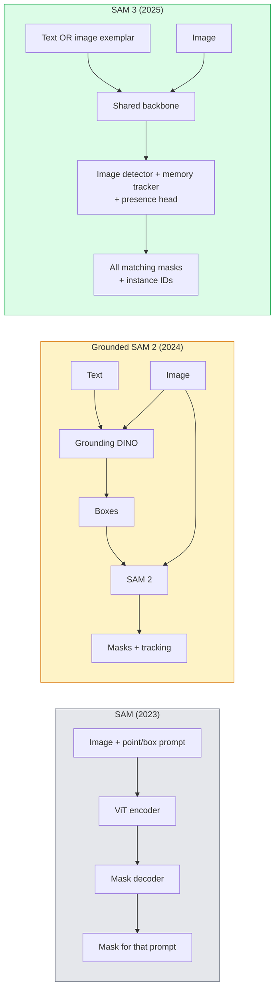

# SAM 3 与开放词表分割

> 给模型一条文本提示词（text prompt）和一张图像，就能得到每个匹配目标（object）的掩码（mask）。SAM 3 把这个过程变成了一次前向传播（forward pass）。

**Type:** Use + Build
**Languages:** Python
**Prerequisites:** 阶段 4 第 07 课（U-Net）、阶段 4 第 08 课（Mask R-CNN）、阶段 4 第 18 课（CLIP）
**Time:** ~60 分钟

## 学习目标

- 区分 SAM（仅支持视觉提示，即 visual prompt）、Grounded SAM / SAM 2（检测器 detector + SAM），以及 SAM 3（通过可提示概念分割，即 Promptable Concept Segmentation，原生支持文本提示词）
- 解释 SAM 3 的架构：共享主干网络（shared backbone）+ 图像检测器 + 基于记忆的视频跟踪器（memory-based video tracker）+ 存在性预测头（presence head）+ 解耦的检测器—跟踪器（decoupled detector-tracker）设计
- 使用 Hugging Face `transformers` 中的 SAM 3 集成，实现由文本提示词驱动的检测、分割和视频跟踪
- 根据延迟、概念复杂度和部署目标，在 SAM 3、Grounded SAM 2、YOLO-World 与 SAM-MI 之间做出选择

## 要解决的问题

2023 年的 SAM 是一个仅支持视觉提示的模型：点击一个点或画一个框，它就会返回一个掩码。对于“give me all the oranges in this photo”（找出这张照片里的所有橙子）这样的需求，你需要先用检测器（Grounding DINO）生成边界框（bounding box），再用 SAM 逐个分割。Grounded SAM 将这一过程组成了管线（pipeline），但它仍是两个冻结的模型（frozen models）的级联（cascade），不可避免地会产生误差累积。

SAM 3（Meta，2025 年十一月，ICLR 2026）将这条级联合并为一个模型。它接受一个简短的名词短语（noun phrase）或图像示例（image exemplar）作为提示词，并在一次前向传播中返回所有匹配的掩码和实例 ID（instance ID）。这就是 **可提示概念分割（Promptable Concept Segmentation，PCS）**。结合 2026 年三月的 Object Multiplex 更新（SAM 3.1），它能在视频中高效跟踪同一概念的多个实例。

本课关注的是这一变化带来的结构性转变。2D 分割、检测和文本—图像对应定位（text-image grounding）已经合为一个模型。生产应用中的问题也从“我该把哪些管线串联起来”，变成了“哪个可提示模型能端到端地处理我的用例”。

## 核心概念

### 三代模型



### 可提示概念分割

“概念提示词”（concept prompt）是一个简短的名词短语（`"yellow school bus"`、`"striped red umbrella"`、`"hand holding a mug"`）或图像示例。模型会为图像中每个符合该概念的实例返回分割掩码，并为每个匹配实例提供唯一的实例 ID。

这与经典的视觉提示 SAM 有三点不同：

1. 不需要逐实例提供提示：一条文本提示词即可返回所有匹配结果。
2. 开放词表（open-vocabulary）：概念可以是任何能用自然语言描述的事物。
3. 一次返回多个实例，而不是每条提示只返回一个掩码。

### 关键架构组件

- **共享主干网络**：单个视觉 Transformer（ViT）处理图像。检测头（detection head）和基于记忆的跟踪器都从中读取特征。
- **存在性预测头**：预测图像中究竟有没有这个概念。将“这里有它吗？”与“它在哪里？”解耦，减少对未出现概念的误报（false positive）。
- **解耦的检测器—跟踪器**：图像级检测和视频级跟踪使用各自独立的预测头，因此互不干扰。
- **记忆库（memory bank）**：跨帧存储每个实例的特征，用于视频跟踪（与 SAM 2 使用的机制相同）。

### 大规模训练

SAM 3 使用 **4 million（即四百万）个不同概念** 进行训练。这些概念由数据引擎生成，该引擎结合 AI 与人工审查，迭代地进行标注和纠正。新的 **SA-CO 基准测试（benchmark）** 包含 270K 个不同概念，规模是以往基准测试的 50x。SAM 3 在 SA-CO 上达到人类表现的 75-80%，在图像 + 视频 PCS 上的表现是现有系统的两倍。

### SAM 3.1 Object Multiplex

2026 年三月更新：**Object Multiplex** 引入了一种共享记忆（shared memory）机制，可以同时联合跟踪同一概念的多个实例。此前，跟踪 N 个实例意味着需要 N 个独立的记忆库。Multiplex 将它们合为一个共享记忆，并为每个实例设置各自的查询。结果是：在不牺牲准确率的情况下，大幅加快多目标跟踪。

### 2026 年 Grounded SAM 仍然重要的场景

- 需要换用某个特定的开放词表检测器（DINO-X、Florence-2）时。
- SAM 3 的许可（在 HF 上受访问限制）构成障碍时。
- 对检测器阈值的控制需求超出 SAM 3 提供的范围时。
- 针对检测器组件开展研究或消融实验（ablation）时。

模块化管线仍有用武之地。对于大多数生产任务，SAM 3 是更简单的选择。

### YOLO-World 与 SAM 3

- **YOLO-World**：仅提供开放词表检测（无掩码）。支持实时运行。最适合需要以高 fps 输出边界框的场景。
- **SAM 3**：完整的分割 + 跟踪。速度较慢，但输出更丰富。

生产应用中的分工：快速、仅做检测的管线（机器人导航、快速仪表盘）使用 YOLO-World；凡是需要掩码或跟踪的任务，都使用 SAM 3。

### SAM-MI 的效率

SAM-MI（2025-2026）针对 SAM 的解码器瓶颈提出了以下核心思路：

- **稀疏点提示（sparse point prompting）**：用少量精心选择的点代替密集提示，将解码器调用次数减少 96%。
- **浅层掩码聚合（shallow mask aggregation）**：将粗略的掩码预测合并成一个边界更清晰的掩码。
- **解耦掩码注入（decoupled mask injection）**：解码器接收预先计算的掩码特征，而不必重新运行。

结果：在开放词表基准测试上，相比 Grounded-SAM 获得 ~1.6× 的加速。

### 三种模型的输出格式

它们都返回相同的总体结构（边界框 + 标签 + 分数 + 掩码 + ID），这很有帮助：管线的下游无需根据运行的是哪个模型来设置分支。

```figure
cv3-open-vocab
```

## 动手实现

### 步骤 1：构造提示词

编写一个辅助函数，将用户的句子转换成 SAM 3 概念提示词列表。这里就是“用户输入的内容”与“模型接收的内容”相接的边界。

```python
def split_concepts(sentence):
    """
    Heuristic splitter for multi-concept prompts.
    Returns list of short noun phrases.
    """
    for sep in [",", ";", "and", "or", "&"]:
        if sep in sentence:
            parts = [p.strip() for p in sentence.replace("and ", ",").split(",")]
            return [p for p in parts if p]
    return [sentence.strip()]

print(split_concepts("cats, dogs and balloons"))
```

SAM 3 每次前向传播接受一个概念；对于多概念查询，应循环调用或进行批处理（batching）。

### 步骤 2：后处理辅助函数

将 SAM 3 的原始输出整理成清晰的检测结果列表，使其符合我们在阶段 4 第 16 课中定义的管线数据契约（data contract）。

```python
from dataclasses import dataclass
from typing import List

@dataclass
class ConceptDetection:
    concept: str
    instance_id: int
    box: tuple          # (x1, y1, x2, y2)
    score: float
    mask_rle: str       # run-length encoded


def rle_encode(binary_mask):
    flat = binary_mask.flatten().astype("uint8")
    runs = []
    prev, count = flat[0], 0
    for v in flat:
        if v == prev:
            count += 1
        else:
            runs.append((int(prev), count))
            prev, count = v, 1
    runs.append((int(prev), count))
    return ";".join(f"{v}x{c}" for v, c in runs)
```

游程编码（run-length encoding，RLE）让响应载荷即使包含大量高分辨率掩码也能保持较小体积。相同格式适用于 SAM 2、SAM 3 和 Grounded SAM 2。

### 步骤 3：统一的开放词表分割接口

无论后端（backend）使用 SAM 3、Grounded SAM 2 还是 YOLO-World + SAM 2，都将它封装成统一的方法接口。这样，后端变化时，下游代码无需改变。

```python
from abc import ABC, abstractmethod
import numpy as np

class OpenVocabSeg(ABC):
    @abstractmethod
    def detect(self, image: np.ndarray, concept: str) -> List[ConceptDetection]:
        ...


class StubOpenVocabSeg(OpenVocabSeg):
    """
    Deterministic stub used for pipeline testing when real models are not loaded.
    """
    def detect(self, image, concept):
        h, w = image.shape[:2]
        return [
            ConceptDetection(
                concept=concept,
                instance_id=0,
                box=(w * 0.2, h * 0.3, w * 0.5, h * 0.8),
                score=0.89,
                mask_rle="0x100;1x50;0x200",
            ),
            ConceptDetection(
                concept=concept,
                instance_id=1,
                box=(w * 0.55, h * 0.25, w * 0.85, h * 0.75),
                score=0.74,
                mask_rle="0x80;1x40;0x220",
            ),
        ]
```

实际实现时，`SAM3OpenVocabSeg` 子类会封装 `transformers.Sam3Model` 和 `Sam3Processor`。

### 步骤 4：Hugging Face SAM 3 用法（参考）

使用实际模型时，`transformers` 集成的用法如下：

```python
from transformers import Sam3Processor, Sam3Model
import torch

processor = Sam3Processor.from_pretrained("facebook/sam3")
model = Sam3Model.from_pretrained("facebook/sam3").eval()

inputs = processor(images=pil_image, return_tensors="pt")
inputs = processor.set_text_prompt(inputs, "yellow school bus")

with torch.no_grad():
    outputs = model(**inputs)

masks = processor.post_process_masks(
    outputs.masks, inputs.original_sizes, inputs.reshaped_input_sizes
)
boxes = outputs.boxes
scores = outputs.scores
```

一条提示词，一次调用就返回所有匹配结果。

### 步骤 5：衡量 Grounded SAM 2 原本自带的优势

客观地做一次基准测试：在真实管线中用 SAM 3 替换 Grounded SAM 2，会发生什么？

- 延迟：SAM 3 省去一次前向传播（不再有独立检测器），但模型本身更重；通常总体延迟不变，或速度略有提升。
- 准确率：对于罕见或组合式概念（compositional concept，例如“striped red umbrella”，即条纹红伞），SAM 3 明显更好。对于由单个词表示的常见概念，两者表现相近。
- 灵活性：Grounded SAM 2 允许替换检测器（DINO-X、Florence-2、Grounding DINO 1.5）；SAM 3 则是一体式模型。

结论：SAM 3 是 2026 年开放词表分割的默认选择。需要检测器灵活性或不同许可条款时，Grounded SAM 2 仍然是合适的选择。

## 实际使用

生产部署模式：

- **实时标注**：SAM 3 + CVAT 的“将标签作为文本提示词”功能。标注人员选择标签名，SAM 3 为每个匹配实例进行预标注，再由标注人员审查和纠正。
- **视频分析**：使用 SAM 3.1 Object Multiplex 进行多目标跟踪，将视频帧送入基于记忆的跟踪器。
- **机器人**：SAM 3 用于开放词表操控（“pick up the red cup”，即拿起红色杯子），作为规划原语运行。
- **医学影像**：针对医学概念微调（fine-tuning）SAM 3；需要在 HF 上申请访问。

Ultralytics 在其 Python 包中封装了 SAM 3：

```python
from ultralytics import SAM

model = SAM("sam3.pt")
results = model(image_path, prompts="yellow school bus")
```

接口与 YOLO 和 SAM 2 相同。

## 交付成果

本课产出：

- `outputs/prompt-open-vocab-stack-picker.md`：一份提示词，根据延迟、概念复杂度和许可情况，在 SAM 3 / Grounded SAM 2 / YOLO-World / SAM-MI 之间做出选择。
- `outputs/skill-concept-prompt-designer.md`：一项技能，将用户话语转换成格式良好的 SAM 3 概念提示词（拆分、消歧、回退）。

## 练习

1. **（简单）** 自选概念提示词，在 10 张图像上运行 SAM 3。与 SAM 2 + Grounding DINO 1.5 在同一组图像上的结果进行比较，报告每个模型遗漏了哪些概念。
2. **（中等）** 在 SAM 3 之上构建“点击纳入 / 点击排除”UI：文本提示词返回候选实例，用户通过点击决定保留哪些实例作为正例。将最终的概念集合输出为 JSON。
3. **（困难）** 在自定义概念集合（例如 5 类电子元器件）上微调 SAM 3，每类使用 20 张已标注图像。在同一测试集上与零样本（zero-shot）SAM 3 进行比较，衡量掩码交并比（IoU）的提升。

## 关键术语

| 术语 | 常见说法 | 实际含义 |
|------|----------------|----------------------|
| 开放词表分割（open-vocabulary segmentation） | “按文本分割” | 为自然语言描述的目标生成掩码，而不是依赖固定的标签集合 |
| PCS | “可提示概念分割” | SAM 3 的核心任务：给定名词短语或图像示例，分割所有匹配实例 |
| 概念提示词 | “文本输入” | 简短的名词短语或图像示例，而不是完整句子 |
| 存在性预测头 | “这里有它吗？” | SAM 3 中在定位之前判断图像中是否存在该概念的模块 |
| SA-CO | “SAM 3 基准测试” | 包含 270K 个概念的开放词表分割基准测试，规模是以往开放词表基准测试的 50x |
| Object Multiplex | “SAM 3.1 更新” | 基于共享记忆的多目标跟踪，快速联合跟踪多个实例 |
| Grounded SAM 2 | “模块化管线” | 检测器 + SAM 2 的级联；需要替换检测器时仍有价值 |
| SAM-MI | “高效 SAM 变体” | 通过掩码注入（Mask Injection），相比 Grounded-SAM 获得 1.6x 的加速 |

## 延伸阅读

- [SAM 3: Segment Anything with Concepts（arXiv 2511.16719）](https://arxiv.org/abs/2511.16719)
- [SAM 3.1 Object Multiplex（Meta AI，2026 年三月）](https://ai.meta.com/blog/segment-anything-model-3/)
- [Hugging Face 上的 SAM 3 模型页面](https://huggingface.co/facebook/sam3)
- [Grounded SAM 2 教程（PyImageSearch）](https://pyimagesearch.com/2026/01/19/grounded-sam-2-from-open-set-detection-to-segmentation-and-tracking/)
- [Ultralytics SAM 3 文档](https://docs.ultralytics.com/models/sam-3/)
- [SAM3-I: Instruction-aware SAM（arXiv 2512.04585）](https://arxiv.org/abs/2512.04585)
