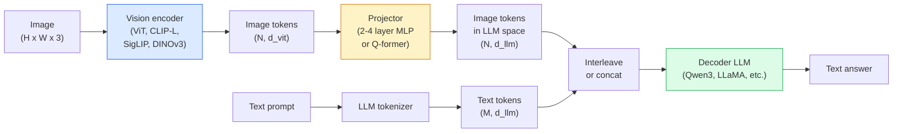

# 视觉语言模型：ViT-MLP-LLM 模式

> 视觉编码器（vision encoder）将图像转换为 token（词元）。多层感知机（MLP）投影器（projector）将这些 token 映射到大语言模型（LLM）的嵌入空间（embedding space）。其余工作由语言模型完成。2026 年所有生产环境中的视觉语言模型（VLM）都采用这种 ViT-MLP-LLM 模式。

**Type:** Learn + Use
**Languages:** Python
**Prerequisites:** 阶段 4 第 14 课（ViT），阶段 4 第 18 课（CLIP），阶段 7 第 02 课（自注意力）
**Time:** ~75 分钟

## 学习目标

- 说明 ViT-MLP-LLM 架构，并解释三个组件各自的作用
- 从参数量、上下文长度和基准测试表现三个方面比较 Qwen3-VL、InternVL3.5、LLaVA-Next 和 GLM-4.6V
- 解释 DeepStack：为什么多层次的 ViT 特征比仅取最后一层特征更能促进视觉与语言的对齐
- 用跨模态错误率（Cross-Modal Error Rate，CMER）衡量生产环境中 VLM 的幻觉（hallucination），并据此采取行动

## 要解决的问题

CLIP（阶段 4 第 18 课）为图像和文本提供了共享嵌入空间，足以支持零样本分类（zero-shot classification）和检索。它无法回答“这张图像中有多少辆红色汽车？”，因为 CLIP 不生成文本，只对相似度打分。

视觉语言模型（Vision-Language Models，VLMs），如 Qwen3-VL、InternVL3.5、LLaVA-Next 和 GLM-4.6V，将 CLIP 系列的图像编码器接到完整的语言模型上。模型接收一张图像和一个问题，然后生成答案。在 2026 年，开源 VLM 在多模态基准测试（MMMU、MMBench、DocVQA、ChartQA、MathVista、OSWorld）上已能媲美或超越 GPT-5 和 Gemini-2.5-Pro。

这三个组件，即视觉 Transformer（ViT）、投影器和 LLM，构成了标准组合。模型之间的区别在于选用哪一种 ViT、投影器和 LLM，以及训练数据和对齐方案。一旦理解了这种模式，更换任何组件都只是按部就班的操作。

## 核心概念

### ViT-MLP-LLM 架构



1. **视觉编码器**：预训练的 ViT（CLIP-L/14、SigLIP、DINOv3，或经过微调（fine-tuning）的变体），负责生成图像块 token。
2. **投影器**：一个小型模块（2-4 层 MLP，或 Q-former 桥接模块），将视觉 token 映射到 LLM 的嵌入维度。大部分微调都发生在这里。
3. **LLM**：仅解码器语言模型（decoder-only language model，如 Qwen3、Llama、Mistral、GLM、InternLM）。它依次读取视觉 + 文本 token，并生成文本。

原则上，这三个组件都可以训练。实际中，训练投影器时，视觉编码器和 LLM 的大部分参数保持冻结，以较低成本获得数个 billion（十亿）参数所提供的信号。

### DeepStack

常规投影只使用 ViT 的最后一层。DeepStack（Qwen3-VL）从 ViT 的多个深度抽取特征，并将其堆叠。较深层携带高层语义，较浅层携带细粒度的空间和纹理信息。将两者都送入 LLM，可以弥合“图像里有什么”（语义）与“具体在哪里”（空间定位，spatial grounding）之间的鸿沟。

### 三个训练阶段

现代 VLM 分阶段训练：

1. **对齐（alignment）**：冻结 ViT 和 LLM，用（图像，图像描述）对，只训练投影器，让它学会将视觉空间映射到语言空间。
2. **预训练（pre-training）**：解冻全部参数，用大规模交错图文数据（500M+ 对，M 表示百万）训练，建立模型的视觉知识。
3. **指令微调（instruction tuning）**：用经过精心整理的（图像，问题，答案）三元组进行微调，教会模型对话行为和任务格式。这一步把“具备视觉感知能力的语言模型”变成了可用的助手。

大多数 LoRA（低秩适配）微调使用一个小型标注数据集，针对阶段 3 进行。

### 模型家族对比（2026 年初）

| 模型 | 参数量 | 视觉编码器 | LLM | 上下文 | 优势 |
|-------|--------|----------------|-----|---------|-----------|
| Qwen3-VL-235B-A22B (MoE，混合专家模型) | 235B（22B 激活参数；B 表示十亿） | 定制 ViT + DeepStack | Qwen3 | 256K（K 表示千） | 通用 SOTA（当前最优水平），GUI（图形用户界面）智能体 |
| Qwen3-VL-30B-A3B (MoE) | 30B（3B 激活参数） | 定制 ViT + DeepStack | Qwen3 | 256K | 规模更小的 MoE 替代方案 |
| Qwen3-VL-8B (dense，稠密) | 8B | 定制 ViT | Qwen3 | 128K | 生产环境中稠密模型的默认选择 |
| InternVL3.5-38B | 38B | InternViT-6B | Qwen3 + GPT-OSS | 128K | MMBench / MMVet 表现强劲 |
| InternVL3.5-241B-A28B | 241B（28B 激活参数） | InternViT-6B | Qwen3 | 128K | 可与 GPT-4o 竞争 |
| LLaVA-Next 72B | 72B | SigLIP | Llama-3 | 32K | 开放，易于微调 |
| GLM-4.6V | ~70B | 定制 | GLM | 64K | 开源，OCR（光学字符识别）能力强 |
| MiniCPM-V-2.6 | 8B | SigLIP | MiniCPM | 32K | 适合边缘设备 |

### 视觉智能体

Qwen3-VL-235B 在 OSWorld 上取得了全球顶尖表现。OSWorld 是一项面向操作 GUI（桌面、移动端、网页）的 **视觉智能体（visual agent）** 的基准测试。模型查看截图、理解界面，并输出动作（点击、输入、滚动）。配合工具，它可以闭环完成常见桌面任务。2026 年大多数“AI PC”演示背后运行的就是这种机制。

### 智能体能力 + RoPE 变体

VLM 需要知道视频中的一帧出现在 **什么时刻**。Qwen3-VL 从 T-RoPE（时间旋转位置嵌入，temporal rotary position embeddings）演进到 **基于文本的时间对齐（text-based time alignment）**，也就是将显式表示时间戳的文本 token 与视频帧交错排列。模型看到“`<timestamp 00:32>` 帧，提示词（prompt）”，就能推理时间关系。

### 对齐问题

某个爬取数据集中，12% 的图文对包含未完全以图像内容为依据的描述。用这些数据训练的 VLM 会悄然学会产生幻觉：捏造物体、读错数字、虚构关系。这是生产环境中最主要的失败模式。

Skywork.ai 提出了 **跨模态错误率（CMER）** 来跟踪这一问题：

```text
CMER = fraction of outputs where the text confidence is high but the image-text similarity (via a CLIP-family checker) is low
```

CMER 较高，意味着模型正在自信地说出缺乏图像依据的内容。在他们的部署中，监测 CMER 并将其作为生产环境的关键绩效指标（KPI），使幻觉率降低了 ~35%。诀窍不是“修好模型”，而是“将高 CMER 的输出交给人工审核”。

### 使用 LoRA / QLoRA 进行微调

对大多数团队而言，全量微调一个 70B 的 VLM 并不现实。在注意力 + 投影器层上应用 LoRA（秩（rank）为 16-64），或使用基座权重为 4-bit 的 QLoRA（结合量化的低秩适配），单张 A100 / H100 就能承载这样的微调任务。成本：5,000-50,000 个样本、$100-$5,000 的计算费用，以及 2-10 小时的训练时间。

### 空间推理仍然薄弱

当前 VLM 在空间推理基准测试（上下、左右、计数、距离）中的得分为 50-60%。如果你的应用场景依赖于判断“哪个物体在另一个物体上方”，就要进行充分验证，因为通用 VLM 的表现低于人类。对于纯空间任务，比 VLM 更好的替代方案包括专门的关键点 / 姿态估计器、深度估计模型，或对边界框几何信息进行后处理的检测模型。

```figure
v4-vlm-projector
```

## 动手实现

### 步骤 1：投影器

这是你最常训练的部分：一个带 GELU 的 2-4 层 MLP。

```python
import torch
import torch.nn as nn


class Projector(nn.Module):
    def __init__(self, vit_dim=768, llm_dim=4096, hidden=4096):
        super().__init__()
        self.net = nn.Sequential(
            nn.Linear(vit_dim, hidden),
            nn.GELU(),
            nn.Linear(hidden, llm_dim),
        )

    def forward(self, x):
        return self.net(x)
```

输入是形状为 `(N_patches, d_vit)` 的 token 张量，输出为 `(N_patches, d_llm)`。LLM 会把输出的每一行都视为一个普通 token。

### 步骤 2：端到端组装 ViT-MLP-LLM

下面是最小 VLM 的前向传播骨架。实际代码使用 `transformers`，这里只展示概念结构。

```python
class MinimalVLM(nn.Module):
    def __init__(self, vit, projector, llm, image_token_id):
        super().__init__()
        self.vit = vit
        self.projector = projector
        self.llm = llm
        self.image_token_id = image_token_id  # placeholder token in text prompt

    def forward(self, image, input_ids, attention_mask):
        # 1. vision features
        vision_tokens = self.vit(image)                     # (B, N_patches, d_vit)
        vision_embeds = self.projector(vision_tokens)       # (B, N_patches, d_llm)

        # 2. text embeddings
        text_embeds = self.llm.get_input_embeddings()(input_ids)  # (B, M, d_llm)

        # 3. replace image placeholder tokens with vision embeds
        merged = self._merge(text_embeds, vision_embeds, input_ids)

        # 4. run LLM
        return self.llm(inputs_embeds=merged, attention_mask=attention_mask)

    def _merge(self, text_embeds, vision_embeds, input_ids):
        out = text_embeds.clone()
        expected = vision_embeds.size(1)
        for b in range(input_ids.size(0)):
            positions = (input_ids[b] == self.image_token_id).nonzero(as_tuple=True)[0]
            if len(positions) != expected:
                raise ValueError(
                    f"batch item {b} has {len(positions)} image tokens but vision_embeds has {expected} patches."
                    " Every sample in the batch must be pre-padded to the same number of image placeholder tokens.")
            out[b, positions] = vision_embeds[b]
        return out
```

文本中的 `<image>` 占位 token 会被真正的图像嵌入替换，这与 LLaVA、Qwen-VL 和 InternVL 使用的模式相同。

### 步骤 3：计算 CMER

一项轻量级的运行时检查。

```python
import torch.nn.functional as F


def cross_modal_error_rate(image_emb, text_emb, text_confidence, sim_threshold=0.25, conf_threshold=0.8):
    """
    image_emb, text_emb: embeddings of image and generated text (normalised internally)
    text_confidence:     mean per-token probability in [0, 1]
    Returns:             fraction of high-confidence outputs with low image-text alignment
    """
    image_emb = F.normalize(image_emb, dim=-1)
    text_emb = F.normalize(text_emb, dim=-1)
    sim = (image_emb * text_emb).sum(dim=-1)        # cosine similarity
    high_conf_low_sim = (text_confidence > conf_threshold) & (sim < sim_threshold)
    return high_conf_low_sim.float().mean().item()
```

将 CMER 视为生产环境的 KPI，按端点（endpoint）、提示词类型和客户分别监测。CMER 上升说明模型开始在某种输入分布上产生幻觉。

### 步骤 4：玩具 VLM 分类器（可运行）

演示投影器可以被训练：输入模拟的“ViT 特征”，由一个微型的 LLM 风格 token 来预测类别。

```python
class ToyVLM(nn.Module):
    def __init__(self, vit_dim=32, llm_dim=64, num_classes=5):
        super().__init__()
        self.projector = Projector(vit_dim, llm_dim, hidden=64)
        self.head = nn.Linear(llm_dim, num_classes)

    def forward(self, vision_tokens):
        projected = self.projector(vision_tokens)
        pooled = projected.mean(dim=1)
        return self.head(pooled)
```

用合成的（特征，类别）对，不到 200 步就能拟合这个模型，足以表明投影器模式有效。

## 实际使用

2026 年，生产团队使用 VLM 有三种方式：

- **托管 API（应用程序编程接口）**：OpenAI Vision、Anthropic Claude Vision、Google Gemini Vision。无需自建基础设施，但存在供应商风险。
- **开源模型自行托管**：通过 `transformers` 和 `vllm` 使用 Qwen3-VL 或 InternVL3.5。可完全掌控，但前期投入更大。
- **领域微调**：加载 Qwen2.5-VL-7B 或 LLaVA-1.6-7B，用 5k-50k（k 表示千）个定制样本进行 LoRA 微调，再通过 `vllm` 或 `TGI` 提供服务。

```python
from transformers import AutoProcessor, AutoModelForVision2Seq
import torch
from PIL import Image

model_id = "Qwen/Qwen3-VL-8B-Instruct"
processor = AutoProcessor.from_pretrained(model_id)
model = AutoModelForVision2Seq.from_pretrained(model_id, torch_dtype=torch.bfloat16, device_map="auto")

messages = [{
    "role": "user",
    "content": [
        {"type": "image", "image": Image.open("plot.png")},
        {"type": "text", "text": "What does this chart show?"},
    ],
}]
inputs = processor.apply_chat_template(messages, add_generation_prompt=True, tokenize=True, return_dict=True, return_tensors="pt").to("cuda")
generated = model.generate(**inputs, max_new_tokens=256)
answer = processor.decode(generated[0][inputs["input_ids"].shape[1]:], skip_special_tokens=True)
```

`apply_chat_template` 隐藏了 `<image>` 占位符的分词细节，合并操作由模型在内部处理。

## 交付成果

本课产出：

- `outputs/prompt-vlm-selector.md`：根据准确率、延迟、上下文长度和预算，在 Qwen3-VL / InternVL3.5 / LLaVA-Next / API 之间做出选择。
- `outputs/skill-cmer-monitor.md`：生成代码，为生产环境中的 VLM 端点接入跨模态错误率监测、按端点划分的仪表盘和告警阈值。

## 练习

1. **（简单）** 选择任意开放的 VLM，对五张图像分别运行三种提示词（“what is this?”、“count the objects”、“describe the scene”）。人工将每个回答评为正确 / 部分正确 / 产生幻觉，计算一个初步的、类似 CMER 的比率。
2. **（中等）** 使用目标领域中带图像描述的 500 张图像，以 LoRA（秩为 16）微调 Qwen2.5-VL-3B 或 LLaVA-1.6-7B。比较零样本与微调后的 MMBench 风格准确率。
3. **（困难）** 将 VLM 的默认 SigLIP/CLIP 图像编码器替换为 DINOv3，仅重新训练投影器（冻结 LLM + 冻结 DINOv3）。衡量稠密预测任务（计数、空间推理）的表现是否提高。

## 关键术语

| 术语 | 常见说法 | 实际含义 |
|------|----------------|----------------------|
| ViT-MLP-LLM | “VLM 模式” | 视觉编码器 + 投影器 + 语言模型；2026 年的每一种 VLM 都如此 |
| 投影器（Projector） | “桥梁” | 将视觉 token 映射到 LLM 嵌入空间的 2-4 层 MLP（或 Q-former） |
| DeepStack | “Qwen3-VL 的特征技巧” | 堆叠多层次的 ViT 特征，而不只使用最后一层 |
| 图像 token（Image token） | “\<image> 占位符” | 文本流中的特殊 token，会被投影后的视觉嵌入替换 |
| CMER | “幻觉 KPI” | 跨模态错误率；文本置信度高而图文相似度低时，该指标较高 |
| 视觉智能体（Visual agent） | “会点击的 VLM” | 通过工具调用来操作 GUI（OSWorld、移动端、网页）的 VLM |
| Q-former | “固定数量 token 的桥梁” | BLIP-2 风格的投影器，生成固定数量的视觉查询 token |
| 对齐 / 预训练 / 指令微调 | “三个阶段” | 标准的 VLM 训练流程 |

## 延伸阅读

- [Qwen3-VL 技术报告（arXiv 2511.21631）](https://arxiv.org/abs/2511.21631)
- [InternVL3.5：推动开源多模态模型发展（arXiv 2508.18265）](https://arxiv.org/html/2508.18265v1)
- [LLaVA-Next 系列](https://llava-vl.github.io/blog/2024-05-10-llava-next-stronger-llms/)
- [BentoML：2026 年最佳开源 VLM](https://www.bentoml.com/blog/multimodal-ai-a-guide-to-open-source-vision-language-models)
- [MMMU：多学科多模态理解基准测试](https://mmmu-benchmark.github.io/)
- [制造业中的 VLM（Robotics Tomorrow，2026 年三月）](https://www.roboticstomorrow.com/story/2026/03/when-machines-learn-to-see-like-experts-the-rise-of-vision-language-models-in-manufacturing/26335/)
