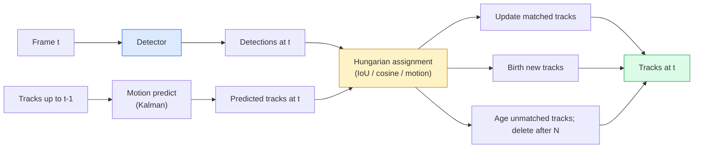

# 多目标跟踪（multi-object tracking）与视频记忆

> 跟踪就是检测加关联（association）。对每一帧进行检测，再按 ID（身份标识符）将当前帧的检测结果与上一帧的轨迹（track）匹配。

**Type:** Build
**Languages:** Python
**Prerequisites:** 阶段 4 第 06 课（YOLO 目标检测）、阶段 4 第 08 课（Mask R-CNN）、阶段 4 第 24 课（SAM 3）
**Time:** ~60 分钟

## 学习目标

- 区分基于检测的跟踪（tracking-by-detection）与基于查询的跟踪（query-based tracking），并说出各算法家族的名称（SORT、DeepSORT、ByteTrack、BoT-SORT、SAM 2 记忆跟踪器、SAM 3.1 Object Multiplex）
- 从零实现交并比（IoU）计算与匈牙利算法（Hungarian algorithm）指派，用于经典的基于检测的跟踪
- 解释 SAM 2 的记忆库（memory bank），以及它为什么比基于 IoU 的关联更擅长处理遮挡（occlusion）
- 读懂三种跟踪指标：MOTA 关注检测错误与 ID 切换（ID switch），IDF1 关注身份一致性，HOTA 关注检测与关联；并针对具体用途选择最重要的指标

## 要解决的问题

检测器告诉你目标在单帧中的位置。跟踪器则告诉你：第 `t` 帧中的哪个检测结果，与第 `t-1` 帧中的某个检测结果属于同一目标。没有这种能力，就无法统计越过一条线的目标数量、在球被遮挡时继续跟踪它，或判断“汽车 #4 已连续 8 秒位于这条车道内”。

所有面向视频的产品都离不开跟踪：体育分析、视频监控、自动驾驶、医学视频分析、野生动物监测、文字标志计数（wordmark counting）。它们共享一组核心组件：逐帧检测器；运动模型，例如卡尔曼滤波器（Kalman filter）或更复杂的模型；关联步骤，即根据 IoU / 余弦 / 学习得到的特征使用匈牙利算法；以及轨迹生命周期，包括新建、更新和终止。

2026 年带来了两种新模式：**SAM 2 基于记忆的跟踪**（使用特征记忆，而非基于运动模型的关联）和 **SAM 3.1 Object Multiplex**（同一概念下的多个实例共用一份记忆）。本课先介绍经典技术栈，再讲基于记忆的方法。

## 核心概念

### 基于检测的跟踪



你在 2026 年遇到的每一种跟踪器，都是这套循环的变体。区别如下：

- **SORT**（2016）：卡尔曼滤波器 + 基于 IoU 的匈牙利指派。简单、快速，不使用外观模型。
- **DeepSORT**（2017）：SORT + 每条轨迹各自的外观特征（appearance feature），该特征由卷积神经网络（CNN）提取，表示为重识别（ReID）嵌入（embedding）。更擅长处理目标交叉。
- **ByteTrack**（2021）：在第二阶段关联低置信度检测结果；无需外观特征，却在 MOT17 上表现领先。
- **BoT-SORT**（2022）：Byte + 相机运动补偿 + ReID。
- **StrongSORT / OC-SORT**：ByteTrack 的衍生算法，改进了运动和外观建模。

### 用一段话理解卡尔曼滤波器

卡尔曼滤波器为每条轨迹维护状态 `(x, y, w, h, dx, dy, dw, dh)` 及其协方差（covariance）。每一帧先用匀速模型（constant-velocity model）**预测**状态，再用匹配的检测结果**更新**状态。预测的不确定性越高，更新时就越信任检测结果。这样既能得到平滑的运动轨迹，也能在短暂遮挡（1-5 帧）期间延续轨迹。

每一种经典跟踪器都在运动预测步骤中使用卡尔曼滤波器。

### 匈牙利算法

给定一个 `M x N` 代价矩阵（cost matrix，轨迹 x 检测结果），找出使总代价最小的一对一指派。代价通常是 `1 - IoU(track_bbox, detection_bbox)`，或外观特征余弦相似度的负值。运行时间复杂度为 O((M+N)^3)；当 M、N 不超过 ~1000 时，通过 Python 中的 `scipy.optimize.linear_sum_assignment` 仍然足够快。

### ByteTrack 的关键想法

标准跟踪器会丢弃低置信度检测结果（< 0.5）。ByteTrack 将它们保留为**第二阶段候选项**：先将轨迹与高置信度检测结果匹配，再让未匹配的轨迹尝试用稍宽松的 IoU 阈值匹配低置信度检测结果。这样可以恢复短暂遮挡期间的跟踪，并修复人群附近的 ID 切换问题。

### SAM 2 基于记忆的跟踪

SAM 2 通过维护一个存储各实例时空特征的**记忆库**来处理视频。在某一帧上给出提示（prompt，例如点击、边界框或文本）后，它会将该实例编码到记忆中。处理后续帧时，通过交叉注意力（cross-attention）让记忆与新帧特征交互，解码器再生成同一实例在新帧中的掩码（mask）。

不用卡尔曼滤波器，也不用匈牙利指派。关联隐含在记忆注意力操作中。

优点：
- 对大范围遮挡具有鲁棒性（记忆跨越许多帧，保留实例身份）。
- 结合 SAM 3 的文本提示词后，支持开放词表（open-vocabulary）。
- 无需单独的运动模型即可工作。

缺点：
- 跟踪大量目标时，比 ByteTrack 慢。
- 记忆库不断增长，限制了上下文窗口。

### SAM 3.1 Object Multiplex

此前的 SAM 2 / SAM 3 跟踪为每个实例维护独立的记忆库。50 个目标就需要 50 个记忆库。Object Multiplex（2026 年三月）将它们合并为一份共享记忆，并为**每个实例设置各自的查询 token（词元）**。开销随实例数量以次线性方式增长。

Multiplex 是 2026 年人群跟踪的新默认选择，适用于演唱会人群、仓库工作人员和交通路口。

### 需要掌握的三种指标

- **多目标跟踪准确率 MOTA（Multi-Object Tracking Accuracy）**：1 - (FN + FP + ID switches) / GT。其中 FN 是漏检数，FP 是误检数，GT 是逐帧统计的真实目标总数。按错误类型加权；用单一指标混合衡量检测和关联失败。
- **身份 F1 分数（IDF1）**：身份精确率（ID precision）与召回率（recall）的调和平均值。专门关注每条真实轨迹（ground-truth track）在时间上保持其 ID 的程度。在对 ID 切换敏感的任务中，它比 MOTA 更合适。
- **高阶跟踪准确率 HOTA（Higher Order Tracking Accuracy）**：分解为检测准确率（DetA）与关联准确率（AssA）。自 2020 年以来的社区标准，也是最全面的指标。

视频监控关注“谁是谁”，应报告 IDF1。体育分析关注传球计数，应报告 HOTA。一般学术比较也应报告 HOTA。

```figure
cv3-track-assoc
```

## 动手实现

### 第 1 步：基于 IoU 的代价矩阵

```python
import numpy as np


def bbox_iou(a, b):
    """
    a, b: (N, 4) arrays of [x1, y1, x2, y2].
    Returns (N_a, N_b) IoU matrix.
    """
    ax1, ay1, ax2, ay2 = a[:, 0], a[:, 1], a[:, 2], a[:, 3]
    bx1, by1, bx2, by2 = b[:, 0], b[:, 1], b[:, 2], b[:, 3]
    inter_x1 = np.maximum(ax1[:, None], bx1[None, :])
    inter_y1 = np.maximum(ay1[:, None], by1[None, :])
    inter_x2 = np.minimum(ax2[:, None], bx2[None, :])
    inter_y2 = np.minimum(ay2[:, None], by2[None, :])
    inter = np.clip(inter_x2 - inter_x1, 0, None) * np.clip(inter_y2 - inter_y1, 0, None)
    area_a = (ax2 - ax1) * (ay2 - ay1)
    area_b = (bx2 - bx1) * (by2 - by1)
    union = area_a[:, None] + area_b[None, :] - inter
    return inter / np.clip(union, 1e-8, None)
```

### 第 2 步：最简 SORT 风格跟踪器

为简洁起见，这里省略固定匀速卡尔曼模型，只使用简单的 IoU 关联；在生产环境中，卡尔曼预测必不可少。`sort` Python 包提供了完整版本。

```python
from scipy.optimize import linear_sum_assignment


class Track:
    def __init__(self, tid, bbox, frame):
        self.id = tid
        self.bbox = bbox
        self.last_frame = frame
        self.hits = 1

    def update(self, bbox, frame):
        self.bbox = bbox
        self.last_frame = frame
        self.hits += 1


class SimpleTracker:
    def __init__(self, iou_threshold=0.3, max_age=5):
        self.tracks = []
        self.next_id = 1
        self.iou_threshold = iou_threshold
        self.max_age = max_age

    def step(self, detections, frame):
        if not self.tracks:
            for d in detections:
                self.tracks.append(Track(self.next_id, d, frame))
                self.next_id += 1
            return [(t.id, t.bbox) for t in self.tracks]

        track_boxes = np.array([t.bbox for t in self.tracks])
        det_boxes = np.array(detections) if len(detections) else np.empty((0, 4))

        iou = bbox_iou(track_boxes, det_boxes) if len(det_boxes) else np.zeros((len(track_boxes), 0))
        cost = 1 - iou
        cost[iou < self.iou_threshold] = 1e6

        matched_track = set()
        matched_det = set()
        if cost.size > 0:
            row, col = linear_sum_assignment(cost)
            for r, c in zip(row, col):
                if cost[r, c] < 1.0:
                    self.tracks[r].update(det_boxes[c], frame)
                    matched_track.add(r); matched_det.add(c)

        for i, d in enumerate(det_boxes):
            if i not in matched_det:
                self.tracks.append(Track(self.next_id, d, frame))
                self.next_id += 1

        self.tracks = [t for t in self.tracks if frame - t.last_frame <= self.max_age]
        return [(t.id, t.bbox) for t in self.tracks]
```

60 行代码，接收逐帧检测结果，返回每一帧的轨迹 ID。实际系统还会加入卡尔曼预测、ByteTrack 的第二阶段重新匹配，以及外观特征。

### 第 3 步：合成运动轨迹测试

```python
def synthetic_frames(num_frames=20, num_objects=3, H=240, W=320, seed=0):
    rng = np.random.default_rng(seed)
    starts = rng.uniform(20, 200, size=(num_objects, 2))
    velocities = rng.uniform(-5, 5, size=(num_objects, 2))
    frames = []
    for f in range(num_frames):
        dets = []
        for i in range(num_objects):
            cx, cy = starts[i] + f * velocities[i]
            dets.append([cx - 10, cy - 10, cx + 10, cy + 10])
        frames.append(dets)
    return frames


tracker = SimpleTracker()
for f, dets in enumerate(synthetic_frames()):
    tracks = tracker.step(dets, f)
```

三个沿直线运动的目标，应该在全部 20 帧中保持各自的 ID 不变。

### 第 4 步：ID 切换指标

```python
def count_id_switches(tracks_per_frame, gt_per_frame):
    """
    tracks_per_frame:  list of list of (track_id, bbox)
    gt_per_frame:      list of list of (gt_id, bbox)
    Returns number of ID switches.
    """
    prev_assignment = {}
    switches = 0
    for tracks, gts in zip(tracks_per_frame, gt_per_frame):
        if not tracks or not gts:
            continue
        t_boxes = np.array([b for _, b in tracks])
        g_boxes = np.array([b for _, b in gts])
        iou = bbox_iou(g_boxes, t_boxes)
        for g_idx, (gt_id, _) in enumerate(gts):
            j = iou[g_idx].argmax()
            if iou[g_idx, j] > 0.5:
                t_id = tracks[j][0]
                if gt_id in prev_assignment and prev_assignment[gt_id] != t_id:
                    switches += 1
                prev_assignment[gt_id] = t_id
    return switches
```

这是一个与 IDF1 相关的简化指标：统计真实目标所分配到的预测轨迹 ID 改变了多少次。真正的 MOTA / IDF1 / HOTA 工具由 `py-motmetrics` 和 `TrackEval` 提供。

## 实际使用

2026 年的生产级跟踪器：

- `ultralytics`：内置 YOLOv8 + ByteTrack / BoT-SORT。`results = model.track(source, tracker="bytetrack.yaml")`。默认选择。
- `supervision`（Roboflow）：ByteTrack 封装及标注工具。
- SAM 2 / SAM 3.1：通过 `processor.track()` 进行基于记忆的跟踪。
- 自定义技术栈：检测器（YOLOv8 / RT-DETR）+ `sort-tracker` / `OC-SORT` / `StrongSORT`。

选择建议：

- 以 30+ fps 跟踪行人 / 汽车 / 箱子：**搭配 ultralytics 的 ByteTrack**。
- 人群中同一类别的众多实例：**SAM 3.1 Object Multiplex**。
- 遮挡严重，但外观可辨识：**DeepSORT / StrongSORT**（ReID 特征）。
- 体育运动 / 复杂交互：**BoT-SORT** 或学习式跟踪器（MOTRv3）。

## 交付成果

本课产出：

- `outputs/prompt-tracker-picker.md`：根据场景类型、遮挡模式和延迟预算，选择 SORT / ByteTrack / BoT-SORT / SAM 2 / SAM 3.1。
- `outputs/skill-mot-evaluator.md`：编写完整的评测框架，对照真实轨迹评测 MOTA / IDF1 / HOTA。

## 练习

1. **（简单）** 用 3、10 和 30 个目标运行上面的合成跟踪器。分别报告 ID 切换次数，找出简单的纯 IoU 关联从何处开始失效。
2. **（中等）** 在关联之前加入匀速卡尔曼预测步骤。展示短暂遮挡（2-3 帧）不再导致 ID 切换。
3. **（困难）** 通过 `transformers` 集成 SAM 2 的记忆跟踪器，作为另一种跟踪器后端。在一段 30 秒的人群视频上分别运行 SimpleTracker 和 SAM 2，手动为 5 名显眼的人物标注真实 ID，然后比较 ID 切换次数。

## 关键术语

| 术语 | 常见说法 | 实际含义 |
|------|----------------|----------------------|
| 基于检测的跟踪 | “先检测，再关联” | 逐帧检测器 + 根据 IoU / 外观进行匈牙利指派 |
| 卡尔曼滤波器 | “运动预测” | 用线性动力学 + 协方差实现平滑的轨迹预测与遮挡处理 |
| 匈牙利算法 | “最优指派” | 求解最小代价二分图匹配问题；`scipy.optimize.linear_sum_assignment` |
| ByteTrack | “低置信度第二遍匹配” | 将未匹配的轨迹与低置信度检测结果重新匹配，以恢复短暂遮挡期间的跟踪 |
| DeepSORT | “SORT + 外观” | 加入 ReID 特征用于跨帧匹配；更有利于保持 ID |
| 记忆库 | “SAM 2 的诀窍” | 跨帧存储各实例的时空特征；用交叉注意力替代显式关联 |
| Object Multiplex | “SAM 3.1 共享记忆” | 一份共享记忆配合每个实例各自的查询，快速跟踪大量目标 |
| HOTA | “现代跟踪指标” | 分解为检测准确率和关联准确率；社区标准 |

## 延伸阅读

- [SORT（Bewley 等，2016）](https://arxiv.org/abs/1602.00763)：介绍最简基于检测的跟踪方法的论文
- [DeepSORT（Wojke 等，2017）](https://arxiv.org/abs/1703.07402)：加入外观特征
- [ByteTrack（Zhang 等，2022）](https://arxiv.org/abs/2110.06864)：低置信度第二遍匹配
- [BoT-SORT（Aharon 等，2022）](https://arxiv.org/abs/2206.14651)：相机运动补偿
- [HOTA（Luiten 等，2020）](https://arxiv.org/abs/2009.07736)：分解式跟踪指标
- [SAM 2 视频分割（Meta，2024）](https://ai.meta.com/sam2/)：基于记忆的跟踪器
- [SAM 3.1 Object Multiplex（Meta，2026 年三月）](https://ai.meta.com/blog/segment-anything-model-3/)
