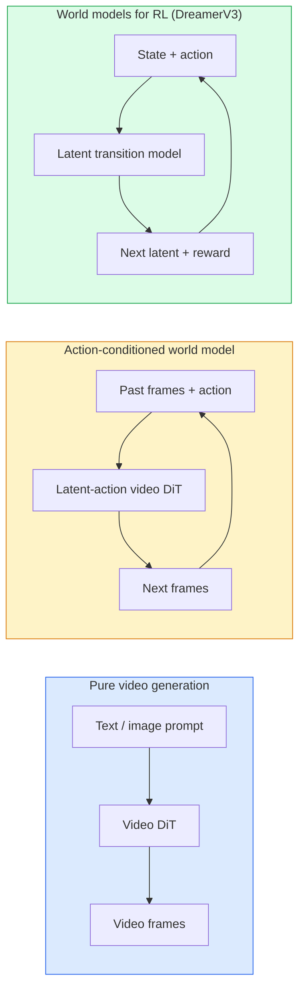

# 世界模型与视频扩散

> 能预测场景接下来几秒变化的视频模型，就是一个世界模拟器（world simulator）。让这种预测以动作为条件，就得到了一个学得的游戏引擎（learned game engine）。

**Type:** Learn + Build
**Languages:** Python
**Prerequisites:** 阶段 4 第 10 课（扩散）、阶段 4 第 12 课（视频理解）、阶段 4 第 23 课（DiT + 整流流）
**Time:** ~75 分钟

## 学习目标

- 解释纯视频生成模型（Sora 2）与以动作为条件的（action-conditioned）世界模型（world model，如 Genie 3、DreamerV3）之间的区别
- 描述视频扩散 Transformer（Video DiT）：时空块（spatio-temporal patch）、3D 位置编码（position encoding），以及在 (T, H, W) token（词元，此处对应时空块）之间进行的联合式注意力（joint attention）
- 梳理世界模型如何接入机器人系统：视觉语言模型（VLM）规划 → 视频模型模拟 → 逆动力学（inverse dynamics）输出动作
- 根据给定用途（创意视频、交互式仿真、自动驾驶数据合成），在 Sora 2、Genie 3、Runway GWM-1 Worlds、Wan-Video 和 HunyuanVideo 之间做出选择

## 要解决的问题

视频生成与世界建模在 2026 年走向融合。一个能生成连贯的一分钟视频的模型，在某种意义上已经学会了世界如何运动：物体恒存性（object permanence）、重力、因果关系、风格。如果让这种预测以动作为条件（向左走、打开门），视频模型就成了一个可学习的模拟器，可以取代游戏引擎、驾驶模拟器或机器人环境。

这些用途很具体。Genie 3 能从单张图像生成可供交互游玩的环境。Runway GWM-1 Worlds 能合成可无限探索的场景。Sora 2 能生成长达一分钟的视频，配有同步音频，并对物理规律进行建模。NVIDIA Cosmos-Drive、Wayve Gaia-2 和 Tesla DrivingWorld 能生成逼真的驾驶视频，作为自动驾驶车辆的训练数据。世界模型范式正在悄然接管机器人领域从仿真到现实的迁移（sim-to-real）。

本课是阶段 4 的“全局概览”课。它把图像生成、视频理解和智能体推理（agentic reasoning）连接起来，呈现主流研究正在迈向的架构模式。

## 核心概念

### 世界建模的三类方法



- **Sora 2** 是以提示词（prompt）为条件的纯视频生成模型。它没有动作接口（action interface）。你无法在模拟轨迹（rollout）生成过程中“操控”它。
- **Genie 3**、**GWM-1 Worlds**、**Mirage / Magica** 是以动作为条件的世界模型。它们从观察到的视频中推断潜在动作（latent action），再让未来帧（frame）的预测以动作为条件。这类模型可以交互：你按下按键或移动相机，场景就会做出响应。
- **DreamerV3** 以及经典的强化学习（RL）世界模型家族，在潜在空间（latent space）中进行预测，明确以动作为条件，并利用奖励信号训练。它们对视觉的侧重较少，更适合样本高效的强化学习（sample-efficient RL）。

### Video DiT 架构

```text
Video latent:          (C, T, H, W)
Patchify (spatial):    grid of P_h x P_w patches per frame
Patchify (temporal):   group P_t frames into a temporal patch
Resulting tokens:      (T / P_t) * (H / P_h) * (W / P_w) tokens
```

位置编码是 3D 的：每个 (t, h, w) 坐标都有一个旋转式嵌入或学得的嵌入（embedding）。注意力可以采用以下形式：

- **全联合式**：所有 token 都关注所有 token。对于 N 个 token，复杂度为 O(N^2)。长视频难以承受这种开销。
- **分离式注意力（divided attention）**：交替进行时间注意力（temporal attention，同一空间位置跨时间：`(H*W) * T^2`）和空间注意力（spatial attention，同一时间步跨空间：`T * (H*W)^2`）。TimeSformer 和大多数视频 DiT 都采用这种形式。
- **窗口注意力（window attention）**：在 (t, h, w) 中使用局部窗口。Video Swin 采用这种形式。

2026 年的每个视频扩散模型都采用这三种模式之一，再结合通过自适应层归一化（AdaLN）施加条件的机制（第 23 课）和整流流（rectified flow）。

### 以动作为条件：潜在动作模型

Genie 通过以判别方式预测一对连续帧之间的动作，为每一帧学习一个 **潜在动作**。随后，模型的解码器（decoder）以推断出的潜在动作为条件，而不是以明确的键盘按键为条件。在推理时，用户可以指定一个潜在动作（也可以从新的先验（prior）中抽样得到一个），模型便会生成与该动作一致的下一帧。

Sora 完全跳过了动作接口。它的解码器根据过去的时空 token 预测接下来的时空 token。提示词为起始生成设定条件；生成过程中没有任何操控输入。

### 物理合理性

Sora 2 在 2026 年发布时，明确宣传了 **物理合理性（physical plausibility）**：重量、平衡、物体恒存性、因果关系。团队通过人工评定的合理性分数来衡量这些表现；与 Sora 1 相比，模型在物体掉落、角色碰撞，以及有意呈现的失败（例如跳跃落空）等场景上都有明显改善。

物理合理性不足仍然是最主要的失效问题。2024-2025 年那些人吃意大利面或用玻璃杯喝水的视频，暴露出模型缺乏持续存在的物体表示（persistent object representation）。2026 年的模型（Sora 2、Runway Gen-5、HunyuanVideo）减少了这些问题，但并未消除它们。

### 自动驾驶世界模型

驾驶世界模型以运动轨迹（trajectory）、边界框（bounding box）或导航地图为条件，生成逼真的道路场景。用途包括：

- **Cosmos-Drive-Dreams**（NVIDIA）：生成数分钟的驾驶视频，用于 RL 训练。
- **Gaia-2**（Wayve）：以运动轨迹为条件合成场景，用于策略（policy）评估。
- **DrivingWorld**（Tesla）：模拟各种天气、时段和交通状况。
- **Vista**（ByteDance）：合成能做出反应的驾驶场景。

它们替代了针对边缘情况开展的高成本真实世界数据收集。这些情况包括行人夜间违规横穿马路、结冰的交叉路口、不常见的车辆类型；否则，要收集这些数据就需要行驶数百万英里。

### 机器人技术栈：VLM + 视频模型 + 逆动力学

正在兴起的、由三个组件构成的机器人循环：

1. **VLM** 解析目标（“拿起红色杯子”），规划高层动作序列（high-level action sequence）。
2. **视频生成模型** 模拟执行每个动作时会呈现的情景，即预测 N 帧之后的观察结果（observation）。
3. **逆动力学模型** 提取能产生这些观察结果的具体电机控制指令。

这取代了奖励塑形（reward shaping）和需要大量样本的 RL。世界模型负责想象；逆动力学则在驱动执行（actuation）环节闭合循环。Genie Envisioner 是其中一种实现；许多研究团队都在向这一结构靠拢。

### 评估

- **视觉质量**：FVD（Fréchet Video Distance，Fréchet 视频距离）、用户研究。
- **提示词对齐（prompt alignment）**：逐帧 CLIPScore、VQA（视觉问答）式评估。
- **物理合理性**：在一组基准测试上进行人工评分（Sora 2 的内部基准、VBench）。
- **可控性（controllability）**（针对交互式世界模型）：动作 → 观察结果的一致性；能否回到先前的状态？

### 2026 年的模型概览

| 模型 | 用途 | 参数 | 输出 | 许可 |
|-------|-----|------------|--------|---------|
| Sora 2 | 文生视频（text-to-video）、音频 | — | 1-min 1080p + 音频 | 仅通过 API（应用程序编程接口）提供 |
| Runway Gen-5 | 文生/图生视频（text/image-to-video） | — | 10s 片段（clip） | API |
| Runway GWM-1 Worlds | 交互式世界 | — | 无限的 3D 模拟轨迹 | API |
| Genie 3 | 从图像生成交互式世界 | 11B+ | 可供交互游玩的帧 | 研究预览 |
| Wan-Video 2.1 | 开放的文生视频模型 | 14B | 高质量片段 | 非商业许可 |
| HunyuanVideo | 开放的文生视频模型 | 13B | 10s 片段 | 宽松许可 |
| Cosmos / Cosmos-Drive | 自动驾驶仿真 | 7-14B | 驾驶场景 | NVIDIA 开放 |
| Magica / Mirage 2 | AI 原生游戏引擎 | — | 可修改的世界 | 产品 |

```figure
v4-world-rollout
```

## 动手实现

### 步骤 1：对视频进行 3D 分块

```python
import torch
import torch.nn as nn


class VideoPatch3D(nn.Module):
    def __init__(self, in_channels=4, dim=64, patch_t=2, patch_h=2, patch_w=2):
        super().__init__()
        self.proj = nn.Conv3d(
            in_channels, dim,
            kernel_size=(patch_t, patch_h, patch_w),
            stride=(patch_t, patch_h, patch_w),
        )
        self.patch_t = patch_t
        self.patch_h = patch_h
        self.patch_w = patch_w

    def forward(self, x):
        # x: (N, C, T, H, W)
        x = self.proj(x)
        n, c, t, h, w = x.shape
        tokens = x.reshape(n, c, t * h * w).transpose(1, 2)
        return tokens, (t, h, w)
```

步幅（stride）等于卷积核（kernel）尺寸的 3D 卷积（convolution）充当时空分块器（spatio-temporal patchifier），进行分块（patchify）。得到的 token 网格（grid）为 `(T, H, W) -> (T/2, H/2, W/2)`。

### 步骤 2：3D 旋转位置编码

沿 `t`、`h`、`w` 轴分别应用旋转位置嵌入（Rotary Position Embeddings，RoPE）：

```python
def rope_3d(tokens, t_dim, h_dim, w_dim, grid):
    """
    tokens: (N, T*H*W, D)
    grid: (T, H, W) sizes
    t_dim + h_dim + w_dim == D
    """
    T, H, W = grid
    n, seq, d = tokens.shape
    if t_dim + h_dim + w_dim != d:
        raise ValueError(f"t_dim+h_dim+w_dim ({t_dim}+{h_dim}+{w_dim}) must equal D={d}")
    assert seq == T * H * W
    t_idx = torch.arange(T, device=tokens.device).repeat_interleave(H * W)
    h_idx = torch.arange(H, device=tokens.device).repeat_interleave(W).repeat(T)
    w_idx = torch.arange(W, device=tokens.device).repeat(T * H)
    # Simplified: just scale channels by frequencies. Real RoPE rotates pairs.
    freqs_t = torch.exp(-torch.log(torch.tensor(10000.0)) * torch.arange(t_dim // 2, device=tokens.device) / (t_dim // 2))
    freqs_h = torch.exp(-torch.log(torch.tensor(10000.0)) * torch.arange(h_dim // 2, device=tokens.device) / (h_dim // 2))
    freqs_w = torch.exp(-torch.log(torch.tensor(10000.0)) * torch.arange(w_dim // 2, device=tokens.device) / (w_dim // 2))
    emb_t = torch.cat([torch.sin(t_idx[:, None] * freqs_t), torch.cos(t_idx[:, None] * freqs_t)], dim=-1)
    emb_h = torch.cat([torch.sin(h_idx[:, None] * freqs_h), torch.cos(h_idx[:, None] * freqs_h)], dim=-1)
    emb_w = torch.cat([torch.sin(w_idx[:, None] * freqs_w), torch.cos(w_idx[:, None] * freqs_w)], dim=-1)
    return tokens + torch.cat([emb_t, emb_h, emb_w], dim=-1)
```

这是简化的相加形式。真正的 RoPE 会按频率旋转成对的通道；包含的位置信息相同。

### 步骤 3：分离式注意力块

```python
class DividedAttentionBlock(nn.Module):
    def __init__(self, dim=64, heads=2):
        super().__init__()
        self.time_attn = nn.MultiheadAttention(dim, heads, batch_first=True)
        self.space_attn = nn.MultiheadAttention(dim, heads, batch_first=True)
        self.ln1 = nn.LayerNorm(dim)
        self.ln2 = nn.LayerNorm(dim)
        self.ln3 = nn.LayerNorm(dim)
        self.mlp = nn.Sequential(nn.Linear(dim, 4 * dim), nn.GELU(), nn.Linear(4 * dim, dim))

    def forward(self, x, grid):
        T, H, W = grid
        n, seq, d = x.shape
        # time attention: same (h, w), across t
        xt = x.view(n, T, H * W, d).permute(0, 2, 1, 3).reshape(n * H * W, T, d)
        a, _ = self.time_attn(self.ln1(xt), self.ln1(xt), self.ln1(xt), need_weights=False)
        xt = (xt + a).reshape(n, H * W, T, d).permute(0, 2, 1, 3).reshape(n, seq, d)
        # space attention: same t, across (h, w)
        xs = xt.view(n, T, H * W, d).reshape(n * T, H * W, d)
        a, _ = self.space_attn(self.ln2(xs), self.ln2(xs), self.ln2(xs), need_weights=False)
        xs = (xs + a).reshape(n, T, H * W, d).reshape(n, seq, d)
        xs = xs + self.mlp(self.ln3(xs))
        return xs
```

时间注意力针对每个空间位置跨时间计算，空间注意力则在每一帧内跨位置计算。用两次 O(T^2 + (HW)^2) 运算代替一次 O((THW)^2) 运算。这是 TimeSformer 和每个现代视频 DiT 的核心。

### 步骤 4：组合一个微型视频 DiT

```python
class TinyVideoDiT(nn.Module):
    def __init__(self, in_channels=4, dim=64, depth=2, heads=2):
        super().__init__()
        self.patch = VideoPatch3D(in_channels=in_channels, dim=dim, patch_t=2, patch_h=2, patch_w=2)
        self.blocks = nn.ModuleList([DividedAttentionBlock(dim, heads) for _ in range(depth)])
        self.out = nn.Linear(dim, in_channels * 2 * 2 * 2)

    def forward(self, x):
        tokens, grid = self.patch(x)
        for blk in self.blocks:
            tokens = blk(tokens, grid)
        return self.out(tokens), grid
```

这不是一个可用的视频生成器，而是一个结构演示，用来展示各个部分的形状能够正确衔接。

### 步骤 5：检查形状

```python
vid = torch.randn(1, 4, 8, 16, 16)  # (N, C, T, H, W)
model = TinyVideoDiT()
out, grid = model(vid)
print(f"input  {tuple(vid.shape)}")
print(f"tokens grid {grid}")
print(f"output {tuple(out.shape)}")
```

分块后，预期得到 `grid = (4, 8, 8)` 和 `out = (1, 256, 32)`；随后网络输出头（head）将每个 token 投影为时空块，为将时空块重组为视频（unpatchify）做好准备。

## 实际使用

2026 年的生产环境接入方式：

- **Sora 2 API**（OpenAI）：文生视频、同步音频。高端定价。
- **Runway Gen-5 / GWM-1**（Runway）：图生视频、交互式世界。
- **Wan-Video 2.1 / HunyuanVideo**：开源，自行托管（self-hosting）。
- **Cosmos / Cosmos-Drive**（NVIDIA）：用于驾驶仿真的开放权重。
- **Genie 3**：研究预览，需申请访问权限。

要构建交互式世界模型演示，可以先使用 Wan-Video 来获得生成质量，再叠加潜在动作适配器（latent-action adapter）来提供交互性。对于自动驾驶仿真，Cosmos-Drive 是 2026 年的开放参考实现。

在机器人领域，实际采用的技术栈如下：

1. 语言描述的目标 -> VLM (Qwen3-VL) -> 高层计划（high-level plan）。
2. 计划 -> 潜在动作视频模型 -> 想象模拟轨迹（imagined rollout）。
3. 模拟轨迹 -> 逆动力学模型 -> 低层动作。
4. 执行动作 -> 将观察结果反馈到步骤 1。

## 交付成果

本课产出：

- `outputs/prompt-video-model-picker.md`：根据任务、许可和延迟，在 Sora 2 / Runway / Wan / HunyuanVideo / Cosmos 之间进行选择。
- `outputs/skill-physical-plausibility-checks.md`：一个技能，定义了自动检查项（物体恒存性、重力、连续性），用于在交付任何生成视频前进行检查。

## 练习

1. **（简单）** 计算一个 5 秒、360p 视频在 patch-t=2、patch-h=8、patch-w=8 时的 token 数量。分析这种规模下注意力所需的内存。
2. **（中等）** 将上面的分离式注意力块替换为全联合式注意力块（attention block），测量形状和参数数量。解释为什么真正的视频模型需要分离式注意力。
3. **（困难）** 构建一个最小的潜在动作视频模型：使用由 (frame_t, action_t, frame_{t+1}) 三元组组成的数据集（任意简单的 2D 游戏），训练一个以动作嵌入为条件的微型视频 DiT，并展示不同动作会产生不同的下一帧。

## 关键术语

| 术语 | 常见说法 | 实际含义 |
|------|----------------|----------------------|
| 世界模型 | “学得的模拟器（learned simulator）” | 给定状态和动作，预测未来观察结果的模型 |
| Video DiT | “时空 Transformer” | 采用 3D 分块和分离式注意力的扩散 Transformer |
| 潜在动作 | “推断出的控制” | 从帧对中推断出的离散或连续的动作潜在表示，用于为下一帧生成提供条件 |
| 分离式注意力 | “先时间，后空间” | 每个块执行两次注意力运算，先跨时间，再跨空间，使 O(N^2) 的开销保持可控 |
| 物体恒存性 | “事物持续存在” | 视频模型必须学会的场景属性；在食物、玻璃器皿上常出现典型失效 |
| FVD | “Fréchet Video Distance” | 相当于视频版的 FID（Fréchet Inception Distance，Fréchet Inception 距离）；主要的视觉质量指标 |
| 逆动力学模型 | “从观察结果到动作” | 给定（状态、下一状态），输出连接两者的动作，闭合机器人循环 |
| Cosmos-Drive | “NVIDIA 驾驶仿真” | 用于 RL 和评估的开放权重自动驾驶世界模型 |

## 延伸阅读

- [Sora 技术报告（OpenAI）](https://openai.com/index/video-generation-models-as-world-simulators/)
- [Genie: Generative Interactive Environments (Bruce et al., 2024)](https://arxiv.org/abs/2402.15391)：潜在动作世界模型
- [TimeSformer (Bertasius et al., 2021)](https://arxiv.org/abs/2102.05095)：视频 Transformer 的分离式注意力
- [DreamerV3 (Hafner et al., 2023)](https://arxiv.org/abs/2301.04104)：用于 RL 的世界模型
- [Cosmos-Drive-Dreams (NVIDIA, 2025)](https://research.nvidia.com/labs/toronto-ai/cosmos-drive-dreams/)：驾驶世界模型
- [Top 10 Video Generation Models 2026 (DataCamp)](https://www.datacamp.com/blog/top-video-generation-models)
- [From Video Generation to World Model：综述仓库](https://github.com/ziqihuangg/Awesome-From-Video-Generation-to-World-Model/)
