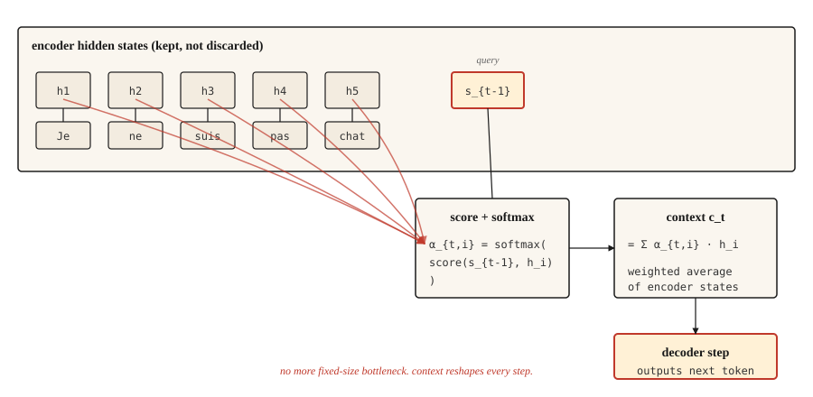

# 注意力机制：关键突破

> 解码器不再费力辨认压缩后的摘要，而是直接查看整个源序列。此后的发展，都是注意力机制加上工程实现。

**Type:** Build
**Languages:** Python
**Prerequisites:** 阶段 5 · 09（序列到序列模型）
**Time:** ~45 分钟

## 要解决的问题

第 09 课以一次实测的失败收尾：在简单复制任务上训练的 GRU（门控循环单元）编码器—解码器，准确率从序列长度为 5 时的 89%，跌到长度为 80 时接近随机猜测的水平。原因出在结构上，并非训练出了 bug：编码器提取到的全部信息都必须塞进一个固定大小的隐藏状态（hidden state），解码器除此之外看不到任何信息。

Bahdanau、Cho 和 Bengio 在 2014 年提出了一个三行就能概括的解决办法。不要只把编码器的最终状态交给解码器，而是保留编码器的每个状态。在每个解码步骤，对编码器状态求加权平均，权重回答的是：“解码器此刻需要多大程度地关注编码器的第 `i` 个位置？”这个加权平均就是上下文（context），它会随解码步骤而改变。

核心思想就是这样。Transformer 对它进行了扩展。自注意力（self-attention）把它用在单个序列内部，多头注意力（multi-head attention）则让它并行运行。但 2014 年的版本就已经突破了瓶颈；掌握它之后，转向 Transformer 要解决的是工程问题，而非概念问题。

## 核心概念



在每个解码步骤 `t`：

1. 将解码器上一步的隐藏状态 `s_{t-1}` 用作**查询（query）**。
2. 用它与编码器的每个隐藏状态 `h_1, ..., h_T` 计算分数，每个编码器位置得到一个标量。
3. 对分数应用 softmax，得到总和为 1 的注意力权重 `α_{t,1}, ..., α_{t,T}`。
4. 上下文向量 `c_t = Σ α_{t,i} * h_i`，即编码器状态的加权平均。
5. 解码器接收 `c_t` 和上一个输出 token（词元），生成下一个 token。

关键就在于加权平均。解码器需要把“Je”译成“I”时，会给“Je”对应的编码器状态较高的权重，给其他状态较低的权重。需要生成“not”时，则会给“pas”较高的权重。上下文向量的内容会随每一步改变。

## 张量形状：人人都会踩的坑

第一次实现注意力机制，往往就错在这里。请慢慢核对。

| 对象 | 形状 | 说明 |
|-------|-------|-------|
| 编码器隐藏状态 `H` | `(T_enc, d_h)` | 若使用 BiLSTM（双向长短期记忆网络），则 `d_h = 2 * d_hidden` |
| 解码器隐藏状态 `s_{t-1}` | `(d_s,)` | 一个向量 |
| 注意力分数 `e_{t,i}` | 标量 | 每个编码器位置各有一个 |
| 注意力权重 `α_{t,i}` | 标量 | 对所有 `i` 的分数应用 softmax 后得到 |
| 上下文向量 `c_t` | `(d_h,)` | 与一个编码器状态的形状相同 |

**Bahdanau（加性注意力，additive attention）分数。** `e_{t,i} = v_α^T * tanh(W_a * s_{t-1} + U_a * h_i)`。

- `s_{t-1}` 的形状为 `(d_s,)`，`h_i` 的形状为 `(d_h,)`。
- `W_a` 的形状为 `(d_attn, d_s)`，`U_a` 的形状为 `(d_attn, d_h)`。
- tanh 内部两项之和的形状为 `(d_attn,)`。
- `v_α` 的形状为 `(d_attn,)`。与 `v_α` 做内积后，结果就变成一个标量。**这就是 `v_α` 的作用。** 它并不神秘，只是通过投影，把注意力空间中的向量转换成一个标量分数。

**Luong（乘性注意力，multiplicative attention）分数。** 有三种变体：

- `dot`：`e_{t,i} = s_t^T * h_i`。要求 `d_s == d_h`，这是硬性约束。如果编码器是双向的，就跳过这一变体。
- `general`：`e_{t,i} = s_t^T * W * h_i`，其中 `W` 的形状为 `(d_s, d_h)`。它解除了维度必须相等的约束。
- `concat`：本质上就是 Bahdanau 的形式。由于前两种计算开销更小，这一种很少使用。

**Bahdanau 与 Luong 有一个特别容易混淆的地方。** Bahdanau 使用 `s_{t-1}`，即生成当前词*之前*的解码器状态；Luong 使用 `s_t`，即生成当前词*之后*的状态。混淆二者会让梯度出现细微错误，极难调试。选定一篇论文，就始终遵循它的约定。

```figure
attention-heatmap
```

## 动手实现

### 第 1 步：加性注意力（Bahdanau）

```python
import numpy as np


def additive_attention(decoder_state, encoder_states, W_a, U_a, v_a):
    projected_dec = W_a @ decoder_state
    projected_enc = encoder_states @ U_a.T
    combined = np.tanh(projected_enc + projected_dec)
    scores = combined @ v_a
    weights = softmax(scores)
    context = weights @ encoder_states
    return context, weights


def softmax(x):
    x = x - np.max(x)
    e = np.exp(x)
    return e / e.sum()
```

对照上表逐项检查形状。`encoder_states` 的形状为 `(T_enc, d_h)`。`projected_enc` 的形状为 `(T_enc, d_attn)`。`projected_dec` 的形状为 `(d_attn,)`，会通过广播（broadcasting）参与运算。`combined` 的形状为 `(T_enc, d_attn)`。`scores` 的形状为 `(T_enc,)`。`weights` 的形状为 `(T_enc,)`。`context` 的形状为 `(d_h,)`。核对无误，就可以使用了。

### 第 2 步：Luong 的 dot 和 general 变体

```python
def dot_attention(decoder_state, encoder_states):
    scores = encoder_states @ decoder_state
    weights = softmax(scores)
    return weights @ encoder_states, weights


def general_attention(decoder_state, encoder_states, W):
    projected = W.T @ decoder_state
    scores = encoder_states @ projected
    weights = softmax(scores)
    return weights @ encoder_states, weights
```

每种只需三行。这也正是 Luong 的论文受到重视的原因：多数任务上的准确率相当，代码却少得多。

### 第 3 步：数值算例

给定三个编码器状态，大致对应“cat”“sat”“mat”，再给定一个与第一个状态最匹配的解码器状态，注意力分布就会集中在位置 0。如果改变解码器状态，让它与最后一个状态更匹配，注意力就会移到位置 2，上下文向量也随之改变。

```python
H = np.array([
    [1.0, 0.0, 0.2],
    [0.5, 0.5, 0.1],
    [0.1, 0.9, 0.3],
])

s_close_to_cat = np.array([0.9, 0.1, 0.2])
ctx, w = dot_attention(s_close_to_cat, H)
print("weights:", w.round(3))
```

```text
weights: [0.464 0.305 0.231]
```

第一行的权重最高。接着，让解码器状态更接近第三个编码器状态，观察权重如何转移。就这么简单：注意力把对齐关系显式地表示出来。

### 第 4 步：为什么它能衔接到 Transformer

把上面的说法换成 Q/K/V 术语：

- **Query（查询）** = 解码器状态 `s_{t-1}`
- **Key（键）** = 编码器状态，用来与查询计算匹配分数
- **Value（值）** = 编码器状态，用来加权求和

在经典注意力机制中，键和值是同一组编码器状态。自注意力将二者分开：让序列查询自身，同时为 K 和 V 使用各自学习到的投影。多头注意力采用不同的可学习投影，并行完成这些运算。Transformer 把整套处理反复堆叠，并去掉循环神经网络（RNN）。

数学原理相同，张量形状也相同。从教学角度看，从 Bahdanau 注意力过渡到缩放点积注意力（scaled dot-product attention），主要是记号上的变化。

## 实际使用

PyTorch 和 TensorFlow 都直接提供了注意力模块。

```python
import torch
import torch.nn as nn

mha = nn.MultiheadAttention(embed_dim=128, num_heads=8, batch_first=True)
query = torch.randn(2, 5, 128)
key = torch.randn(2, 10, 128)
value = torch.randn(2, 10, 128)

output, weights = mha(query, key, value)
print(output.shape, weights.shape)
```

```text
torch.Size([2, 5, 128]) torch.Size([2, 5, 10])
```

这就是一个 Transformer 注意力层。它按批处理查询与键/值：查询序列含 5 个位置，键/值序列含 10 个位置，每个位置都是 128 维，使用 8 个头。`output` 是结合了上下文的新查询表示。`weights` 是可用于可视化的 5x10 对齐矩阵。

### 经典注意力机制何时仍然有用

- 教学。基于 RNN 的单头、单层版本能把每个概念清楚地呈现出来。
- 设备容纳不下 Transformer 的端侧序列任务。
- 阅读 2014-2017 年的论文。不理解 Bahdanau 的约定，就容易读错。
- 机器翻译（MT）中的细粒度对齐分析。即便在 Transformer 模型中，原始注意力权重也能用于可解释性分析；要读懂它们，首先得知道它们是什么。

### 把注意力权重当作解释的陷阱

注意力权重看起来很容易解释：各位置的权重总和为一，可以画成图，权重高就表示“关注了这里”。审稿人也很喜欢这样的图。

但它们并没有看上去那么有解释力。Jain 和 Wallace（2019）指出，在某些任务上，即使打乱注意力分布，或用任意其他分布替换它，模型的预测也可能不变。没有消融实验（ablation）或反事实检验（counterfactual check），就绝不能把注意力权重当作模型推理的证据。

## 交付成果

保存为 `outputs/prompt-attention-shapes.md`：

```markdown
---
name: attention-shapes
description: Debug shape bugs in attention implementations.
phase: 5
lesson: 10
---

Given a broken attention implementation, you identify the shape mismatch. Output:

1. Which matrix has the wrong shape. Name the tensor.
2. What its shape should be, derived from (d_s, d_h, d_attn, T_enc, T_dec, batch_size).
3. One-line fix. Transpose, reshape, or project.
4. A test to catch regressions. Typically: assert `output.shape == (batch, T_dec, d_h)` and `weights.shape == (batch, T_dec, T_enc)` and `weights.sum(dim=-1) close to 1`.

Refuse to recommend fixes that silently broadcast. Broadcast-hiding bugs surface later as silent accuracy degradation, the worst kind of attention bug.

For Bahdanau confusion, insist the decoder input is `s_{t-1}` (pre-step state). For Luong, `s_t` (post-step state). For dot-product, flag dimension mismatch between query and key as the most common first-time error.
```

## 练习

1. **简单。** 为 `softmax` 实现掩码（masking），让编码器中填充 token 的注意力权重为零。在包含不同长度序列的一个批次上测试。
2. **中等。** 为 Luong 的 `general` 形式加入多头注意力。将 `d_h` 分成 `n_heads` 组，每个头分别计算注意力，再拼接结果。验证单头情况下的结果与之前的实现一致。
3. **困难。** 在第 09 课的简单复制任务上，训练一个带 Bahdanau 注意力的 GRU 编码器—解码器。绘制准确率随序列长度变化的曲线，与不带注意力的基线比较。你应该能看到，长度越大，差距越明显，从而验证注意力机制突破了这一瓶颈。

## 关键术语

| 术语 | 通俗说法 | 实际含义 |
|------|-----------------|-----------------------|
| 注意力（Attention） | 看哪些内容 | 对值序列求加权平均，权重由查询与键的相似度计算得到。 |
| 查询、键、值（Query, Key, Value） | QKV | 三种投影：Q 发起查询，K 用于匹配，V 是要返回的内容。 |
| 加性注意力（Additive attention） | Bahdanau | 用前馈计算得到分数：`v^T tanh(W q + U k)`。 |
| 乘性注意力（Multiplicative attention） | Luong dot / general | 分数为 `q^T k` 或 `q^T W k`。计算开销更小，多数任务上的准确率相当。 |
| 对齐矩阵（Alignment matrix） | 那张漂亮的图 | 把注意力权重排列为 `(T_dec, T_enc)` 网格，从中观察模型关注了哪些位置。 |

## 延伸阅读

- [Bahdanau, Cho, Bengio (2014). Neural Machine Translation by Jointly Learning to Align and Translate](https://arxiv.org/abs/1409.0473) —— 提出注意力机制的论文。
- [Luong, Pham, Manning (2015). Effective Approaches to Attention-based Neural Machine Translation](https://arxiv.org/abs/1508.04025) —— 三种分数计算方式及其比较。
- [Jain and Wallace (2019). Attention is not Explanation](https://arxiv.org/abs/1902.10186) —— 注意力权重在可解释性方面的局限。
- [Dive into Deep Learning — Bahdanau Attention](https://d2l.ai/chapter_attention-mechanisms-and-transformers/bahdanau-attention.html) —— 可运行的 PyTorch 实现讲解。
