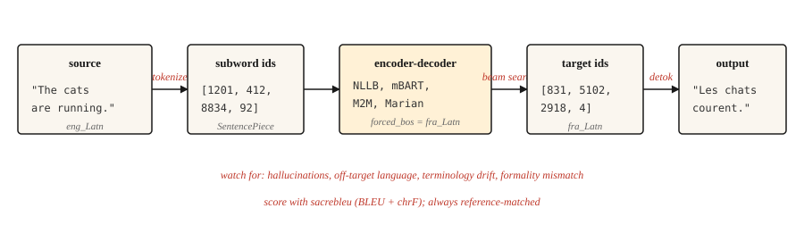

# 机器翻译

> 翻译为自然语言处理研究带来了三十年的资金支持，而且至今仍在继续。

**Type:** Build
**Languages:** Python
**Prerequisites:** 阶段 5 · 10（注意力机制），阶段 5 · 04（GloVe、FastText、子词）
**Time:** ~75 分钟

## 要解决的问题

模型读入一种语言的句子，再输出另一种语言的句子。句长会变，语序也会变。有些源语言单词对应多个目标语言单词，反过来也一样。习语更是无法逐词对应。英语的“I miss you”在法语中是“tu me manques”，字面意思是“你是我所缺少的”。这样的表达根本无法维持逐词对齐。

机器翻译推动自然语言处理（NLP）先后发明了编码器-解码器、注意力机制、Transformer，最终催生了整个大语言模型（LLM）范式。每一次进步都源于同一个驱动力：翻译质量可以衡量，而人类与机器之间的差距却始终难以消除。

本课不再回顾历史，而是介绍 2026 年实用的翻译管线（pipeline）：预训练多语言编码器-解码器（NLLB-200 或 mBART）、子词分词（subword tokenization）、束搜索（beam search）、BLEU 和 chrF 评估，以及几种至今仍会漏检并进入生产环境的失效模式。

## 核心概念



现代机器翻译（MT）采用在平行文本上训练的 Transformer 编码器-解码器。编码器按源语言的分词方式读取原文。解码器通过交叉注意力（cross-attention，第 10 课）利用编码器的输出，每次生成一个目标语言子词。解码时使用束搜索，避免陷入贪心解码（greedy decoding）的局限。随后对输出做反分词、还原大小写，并与参考译文对照评分。

实际应用中的机器翻译质量，主要取决于以下三个操作层面的选择。

- **分词器（tokenizer）。** 在混合语言语料库上训练的 SentencePiece（分词库）BPE（字节对编码）。NLLB 之所以能够处理零样本语言对，靠的就是跨语言共享词表。
- **模型规模。** NLLB-200 的 600M 蒸馏版可以在笔记本电脑上运行。NLLB-200 3.3B 是已发布的默认生产版本，54.5B 则是研究规模的上限。
- **解码。** 通用内容使用 4-5 的束宽。通过长度惩罚避免输出过短。需要保持术语一致时，使用约束解码（constrained decoding）。

```figure
seq2seq-alignment
```

## 动手实现

### 第 1 步：调用预训练机器翻译模型

```python
from transformers import AutoTokenizer, AutoModelForSeq2SeqLM

model_id = "facebook/nllb-200-distilled-600M"
tok = AutoTokenizer.from_pretrained(model_id, src_lang="eng_Latn")
model = AutoModelForSeq2SeqLM.from_pretrained(model_id)

src = "The cats are running."
inputs = tok(src, return_tensors="pt")

out = model.generate(
    **inputs,
    forced_bos_token_id=tok.convert_tokens_to_ids("fra_Latn"),
    num_beams=5,
    length_penalty=1.0,
    max_new_tokens=64,
)
print(tok.batch_decode(out, skip_special_tokens=True)[0])
```

```text
Les chats courent.
```

这里有三点值得注意。`src_lang` 告诉分词器应采用哪种文字系统和切分方式。`forced_bos_token_id` 告诉解码器应生成哪种语言。这两种做法都是 NLLB 特有的；mBART 和 M2M-100 各有自己的约定，不能混用。

### 第 2 步：BLEU 和 chrF

BLEU 衡量输出与参考译文之间连续 n 元片段（n-gram）的重合程度。它采用四种长度的参考片段（1-4），对各阶精确率取几何平均，并对过短的输出施加简短惩罚（brevity penalty）。分数范围为 [0, 100]。这个指标很常用，却让人难以解释：30 BLEU 算“可用”，40 算“良好”，50 算“出色”；小于 1 BLEU 的差异属于噪声。

chrF 衡量字符级 F 分数。对于形态变化丰富的语言，BLEU 容易漏计匹配，chrF 则更敏感。它通常与 BLEU 一起报告。

```python
import sacrebleu

hypotheses = ["Les chats courent."]
references = [["Les chats courent."]]

bleu = sacrebleu.corpus_bleu(hypotheses, references)
chrf = sacrebleu.corpus_chrf(hypotheses, references)
print(f"BLEU: {bleu.score:.1f}  chrF: {chrf.score:.1f}")
```

始终使用 `sacrebleu`。它统一了分词方式，让不同论文的分数具有可比性。自行编写 BLEU 计算代码，很容易得出误导性的基准结果。

### 三层评估体系（2026）

现代机器翻译评估使用三类互补的指标。上线时至少采用其中两类。

- **启发式指标**（BLEU、chrF）。速度快，依赖参考译文，可解释，但对同义改写不敏感。用于与既有结果比较，以及检测质量退步。
- **学习型指标**（COMET、BLEURT、BERTScore）。这些神经模型基于人工判断进行训练，比较译文与原文、参考译文之间的语义相似度。自 2023 年以来，COMET 与机器翻译研究的关联最为紧密；在 2026 年对质量要求较高的生产场景中，它是默认选择。
- **以大语言模型为评判者（LLM-as-judge）**（无需参考译文）。通过提示词（prompt）让大型模型从流畅度、忠实度、语气和文化适切性等方面给译文打分。评分标准设计合理时，GPT-4 作为评判者与人工判断一致的比例约为 80%。用于没有参考译文的开放式内容。

2026 年实用的评估技术栈：用 `sacrebleu` 计算 BLEU 和 chrF，用 `unbabel-comet` 计算 COMET，再通过提示词让 LLM 给出面向最终读者的质量判断。在信任任何指标并将其用于生产数据之前，都应先用 50-100 个经人工标注的样本进行校准。

无参考评估指标（COMET-QE、BLEURT-QE、LLM-as-judge）可以在没有参考译文的情况下评估翻译。对于缺乏参考译文的长尾语言对，这一点尤其重要。

### 第 3 步：生产环境中会出什么问题

上面的实用管线有 80% 的时候能译得流畅，剩下 20% 则会悄无声息地出错。几种典型失效模式如下：

- **幻觉（hallucination）。** 模型编造原文中不存在的内容，常见于模型不熟悉的领域词汇。症状是输出流畅，却陈述了原文没有表达的事实。应对方法：对领域术语使用约束解码；对受监管内容安排人工审核；监控明显长于输入的输出。
- **目标语言偏离（off-target generation）。** 模型译成了错误的语言。在罕见语言对上，NLLB 出现这种问题的频率高得出人意料。应对方法：核对 `forced_bos_token_id`，并在解码时始终用语言识别模型检查输出。
- **术语漂移（terminology drift）。** “Sign up”在文档 1 中变成“s'inscrire”，在文档 2 中却变成“créer un compte”。对于 UI 文本和面向用户的字符串，一致性比单次翻译质量更重要。应对方法：用术语表约束解码，或在译后编辑时应用词典。
- **正式程度不匹配（formality mismatch）。** 例如法语中的“tu”与“vous”，以及日语中不同的礼貌程度。模型会选择训练数据中更常见的形式，而对于面向客户的内容，这通常不合适。应对方法：若模型支持，在提示词前缀中加入表示正式程度的 token（词元）；也可以只使用正式语体的语料库对小模型做微调（fine-tuning）。
- **短输入导致输出长度暴增。** 输入句子很短时，译文往往会过长，因为源文本少于约 5 个 token 时，长度惩罚会急剧减弱。应对方法：设置与源文本长度成比例的最大长度硬上限。

### 第 4 步：面向特定领域的微调

预训练模型擅长通用任务。对于法律、医疗或游戏对白翻译，在领域平行数据上微调能带来可衡量的收益。做法并不复杂：

```python
from transformers import Trainer, TrainingArguments
from datasets import Dataset

pairs = [
    {"src": "The defendant pleaded guilty.", "tgt": "L'accusé a plaidé coupable."},
]

ds = Dataset.from_list(pairs)


def preprocess(ex):
    return tok(
        ex["src"],
        text_target=ex["tgt"],
        truncation=True,
        max_length=128,
        padding="max_length",
    )


ds = ds.map(preprocess, remove_columns=["src", "tgt"])

args = TrainingArguments(output_dir="out", per_device_train_batch_size=4, num_train_epochs=3, learning_rate=3e-5)
Trainer(model=model, args=args, train_dataset=ds).train()
```

几千个高质量平行样本，胜过几十万个从网页抓取的含噪样本。训练数据质量是改善生产效果最重要的因素。

## 实际使用

2026 年的机器翻译生产技术栈：

| 使用场景 | 推荐起点 |
|---------|---------------------------|
| 200 种语言之间的任意互译 | `facebook/nllb-200-distilled-600M`（笔记本电脑）或 `nllb-200-3.3B`（生产环境） |
| 以英语为中心、质量要求高、覆盖 50 种语言 | `facebook/mbart-large-50-many-to-many-mmt` |
| 短时运行、低成本推理、英语与法语/德语/西班牙语互译 | Helsinki-NLP / Marian 模型 |
| 对延迟要求严格的浏览器端场景 | 经 ONNX 量化（quantization）的 Marian（~50 MB） |
| 追求最高质量，愿意付费 | GPT-4 / Claude / Gemini 配合翻译提示词 |

截至 2026 年，LLM 在若干语言对上已经超越专用机器翻译模型，尤其擅长习语内容和长上下文。代价是按 token 计费的成本与延迟。如果上下文长度、风格一致性或通过提示词适应领域的能力比吞吐量更重要，就选择 LLM。

## 交付成果

保存为 `outputs/skill-mt-evaluator.md`：

```markdown
---
name: mt-evaluator
description: Evaluate a machine translation output for shipping.
version: 1.0.0
phase: 5
lesson: 11
tags: [nlp, translation, evaluation]
---

Given a source text and a candidate translation, output:

1. Automatic score estimate. BLEU and chrF ranges you would expect. State whether a reference is available.
2. Five-point human-verifiable check list: (a) content preservation (no hallucinations), (b) correct language, (c) register / formality match, (d) terminology consistency with glossary if provided, (e) no truncation or length explosion.
3. One domain-specific issue to probe. E.g., for legal: named entities and statute citations. For medical: drug names and dosages. For UI: placeholder variables `{name}`.
4. Confidence flag. "Ship" / "Ship with review" / "Do not ship". Tie to the severity of issues found in step 2.

Refuse to ship a translation without a language-ID check on output. Refuse to evaluate without a reference unless the user explicitly opts in to reference-free scoring (COMET-QE, BLEURT-QE). Flag any content over 1000 tokens as likely needing chunked translation.
```

## 练习

1. **简单。** 使用 `nllb-200-distilled-600M`，将一个含 5 个句子的英语段落译成法语，再译回英语。衡量往返翻译与原文有多接近。你应该能看到语义得以保留，但措辞发生了变化。
2. **中等。** 使用 `fasttext lid.176` 或 `langdetect`，为翻译输出实现语言识别检查。将它集成到机器翻译调用中，在返回结果前发现目标语言偏离。
3. **困难。** 选择一个领域，使用包含 5,000 对句子的平行语料库对 `nllb-200-distilled-600M` 进行微调。在留出集上测量微调前后的 BLEU。报告哪些类型的句子有所改善，哪些反而退步。

## 关键术语

| 术语 | 常见说法 | 实际含义 |
|------|-----------------|-----------------------|
| BLEU | 翻译分数 | 带简短惩罚的连续 n 元片段精确率。范围为 [0, 100]。 |
| chrF | 字符 F 分数 | 字符级 F 分数。对形态变化丰富的语言更敏感。 |
| NMT | 神经机器翻译 | 在平行文本上训练的 Transformer 编码器-解码器。2017+ 的默认方案。 |
| NLLB | No Language Left Behind | Meta 的 200 语言机器翻译模型系列。 |
| 约束解码 | 可控输出 | 强制特定 token 或连续 n 元片段出现在输出中，或禁止它们出现。 |
| 幻觉 | 编造的内容 | 缺乏原文依据的模型输出。 |

## 延伸阅读

- [Costa-jussà 等（2022）。No Language Left Behind: Scaling Human-Centered Machine Translation](https://arxiv.org/abs/2207.04672) —— NLLB 论文。
- [Post（2018）。A Call for Clarity in Reporting BLEU Scores](https://aclanthology.org/W18-6319/) —— 解释为什么只有使用 `sacrebleu` 才能正确报告 BLEU。
- [Popović（2015）。chrF: character n-gram F-score for automatic MT evaluation](https://aclanthology.org/W15-3049/) —— chrF 论文。
- [Hugging Face 机器翻译指南](https://huggingface.co/docs/transformers/tasks/translation) —— 实用的微调操作教程。
