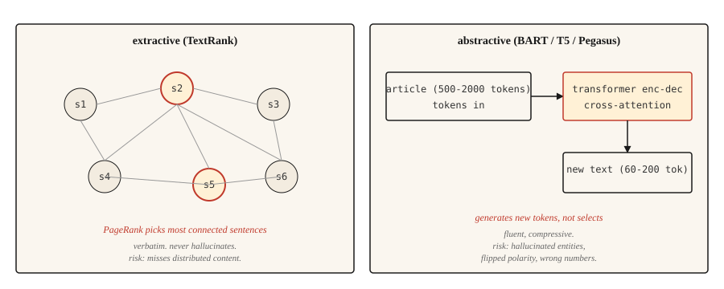

# 文本摘要

> 抽取式系统告诉你原文说了什么，生成式系统告诉你作者想表达什么。任务不同，容易出错的地方也不同。

**Type:** Build
**Languages:** Python
**Prerequisites:** 阶段 5 · 02（词袋 BoW + TF-IDF）、阶段 5 · 11（机器翻译）
**Time:** ~75 分钟

## 要解决的问题

你的信息流里出现了一篇 2,000 个单词的新闻报道，你需要用 120 个单词概括它。你可以选出文章中最重要的三个句子，这就是抽取式摘要（extractive summarization）；也可以用自己的话重写内容，这就是生成式摘要（abstractive summarization）。两者都叫摘要，却是完全不同的问题。

抽取式摘要是一个排序问题：给每个句子打分，返回得分最高的 `k` 个句子。输出直接照搬原句，所以语法总是通顺的。风险在于遗漏分散在文章各处的内容。

生成式摘要是一个生成问题：Transformer 以输入为条件，生成新的文本。输出流畅、精练，但可能产生幻觉（hallucination），编造原文中没有的事实。风险在于一本正经地捏造内容。

本课将实现这两种方法，并说明各自的失败模式。

## 核心概念



**抽取式。** 把文章看作一张图：节点是句子，边表示句子之间的相似度。在图上运行 PageRank 或类似算法，根据每个句子与其他句子的连接情况为它打分。得分最高的句子组成摘要。经典实现是 **TextRank**（Mihalcea 和 Tarau，2004）。

**生成式。** 用文档与摘要配对的数据，微调（fine-tuning）一个 Transformer 编码器—解码器模型（BART、T5、Pegasus）。推理时，模型读取文档，通过交叉注意力（cross-attention）逐个 token（词元）生成摘要。其中，Pegasus 使用缺失句预训练目标（gap-sentence pretraining objective），即使只做少量微调，也能很好地完成摘要任务。

用 **ROUGE**（Recall-Oriented Understudy for Gisting Evaluation，面向召回的摘要评估指标）进行评估。ROUGE-1 和 ROUGE-2 分别衡量一元片段（unigram）和二元片段（bigram）的重叠程度；ROUGE-L 衡量最长公共子序列（longest common subsequence）。分数越高越好，ROUGE-L 达到 40 算“不错”，达到 50 算“出色”。每篇论文都会报告这三项指标。使用 `rouge-score` 包即可。

```figure
summarize-collapse
```

## 动手实现

### 步骤 1：TextRank（抽取式）

```python
import math
import re
from collections import Counter


def sentence_split(text):
    return re.split(r"(?<=[.!?])\s+", text.strip())


def similarity(s1, s2):
    w1 = Counter(s1.lower().split())
    w2 = Counter(s2.lower().split())
    intersection = sum((w1 & w2).values())
    denom = math.log(len(w1) + 1) + math.log(len(w2) + 1)
    if denom == 0:
        return 0.0
    return intersection / denom


def textrank(text, top_k=3, damping=0.85, iterations=50, epsilon=1e-4):
    sentences = sentence_split(text)
    n = len(sentences)
    if n <= top_k:
        return sentences

    sim = [[0.0] * n for _ in range(n)]
    for i in range(n):
        for j in range(n):
            if i != j:
                sim[i][j] = similarity(sentences[i], sentences[j])

    scores = [1.0] * n
    for _ in range(iterations):
        new_scores = [1 - damping] * n
        for i in range(n):
            total_out = sum(sim[i]) or 1e-9
            for j in range(n):
                if sim[i][j] > 0:
                    new_scores[j] += damping * sim[i][j] / total_out * scores[i]
        if max(abs(s - ns) for s, ns in zip(scores, new_scores)) < epsilon:
            scores = new_scores
            break
        scores = new_scores

    ranked = sorted(range(n), key=lambda k: scores[k], reverse=True)[:top_k]
    ranked.sort()
    return [sentences[i] for i in ranked]
```

这里有两点值得说明。相似度函数用对数归一化的词重叠程度来评分，这是最初的 TextRank 变体。也可以计算 TF-IDF（词频-逆文档频率）向量的余弦相似度。阻尼系数（damping factor）0.85 和迭代次数采用的是 PageRank 的默认值。

### 步骤 2：用 BART 生成摘要

```python
from transformers import pipeline

summarizer = pipeline("summarization", model="facebook/bart-large-cnn")

article = """(long news article text)"""

summary = summarizer(article, max_length=120, min_length=60, do_sample=False)
print(summary[0]["summary_text"])
```

BART-large-CNN 在 CNN/DailyMail 语料库上经过微调，开箱即可生成新闻风格的摘要。对于其他领域，如科学论文、对话或法律文本，可以使用相应的 Pegasus 模型检查点，或在目标数据上进行微调。

### 步骤 3：用 ROUGE 评估

```python
from rouge_score import rouge_scorer

scorer = rouge_scorer.RougeScorer(["rouge1", "rouge2", "rougeL"], use_stemmer=True)
scores = scorer.score(reference_summary, generated_summary)
print({k: round(v.fmeasure, 3) for k, v in scores.items()})
```

始终启用词干提取（stemming）。否则，“running”和“run”会被算作不同的词，ROUGE 就会低估重叠程度。

### 不只看 ROUGE：2026 年的摘要评估

ROUGE 已主导摘要评估二十年，但到 2026 年，仅靠它已经不够了。一项针对自然语言生成（NLG）论文的大规模元分析表明：

- **BERTScore** 衡量上下文嵌入（contextual embedding）的相似度，截至 2023 年，它已逐渐普及，如今多数摘要论文会将它与 ROUGE 一起报告。
- **BARTScore** 把评估视为生成问题：给定原文，根据预训练 BART 赋予摘要的概率来评分。
- **MoverScore** 计算上下文嵌入之间的推土距离（Earth Mover's Distance）。它比 ROUGE 更能捕捉语义重叠，因此在 2025 年的摘要基准测试中位居榜首。
- **FactCC** 和**基于问答（QA）的忠实性（faithfulness）评估**在 2021-2023 年很常见，如今经常被 **G-Eval** 取代。G-Eval 是一条 GPT-4 提示词（prompt）链，通过思维链推理，对连贯性、一致性、流畅度和相关性打分。
- 在评分准则设计得当时，**G-Eval** 及类似的以大语言模型（LLM）为评判者的方法，有 ~80% 的评判结果与人工判断一致。

生产环境的建议：报告 ROUGE-L，便于与以往结果比较；报告 BERTScore，衡量语义重叠；报告 G-Eval，评估连贯性和事实性（factuality）。用 50-100 份人工标注的摘要进行校准。

### 步骤 4：事实性问题

生成式摘要容易产生幻觉。抽取式摘要直接照搬原文，幻觉风险要低得多，但如果摘出的句子脱离上下文、内容已经过时，或引用顺序错乱，仍可能误导读者。这也是生产系统在处理涉及合规的内容时，仍然偏好抽取式方法的最主要原因。

需要认识的幻觉类型：

- **实体错换（entity swap）。** 原文写的是“John Smith”，摘要却写成“John Brown”。
- **数字漂移（number drift）。** 原文写的是“25,000”，摘要却写成“25 million（百万）”。
- **极性反转（polarity flip）。** 原文说“拒绝了提议”，摘要却说“接受了提议”。
- **编造事实（fact invention）。** 原文没有提到 CEO，摘要却说 CEO 已经批准。

有效的评估方法包括：

- **FactCC。** 一个二元分类器，用原文句子与摘要句子之间的蕴含关系（entailment）进行训练，预测内容是否符合事实。
- **基于问答的事实性评估。** 向问答模型提出可以从原文中找到答案的问题。如果摘要支持的是不同答案，就将其标记出来。
- **实体级 F1。** 比较原文与摘要中的命名实体。只在摘要中出现的实体值得怀疑。

对于面向用户、且事实性至关重要的内容，如新闻、医疗、法律和金融文本，抽取式摘要是更稳妥的默认选择。生成式摘要则需要在处理流程中加入事实性检查。

## 实际使用

2026 年的技术栈：

| 使用场景 | 推荐方案 |
|---------|-------------|
| 英文新闻，摘要长度为 3-5 句 | `facebook/bart-large-cnn` |
| 科学论文 | `google/pegasus-pubmed` 或经过微调的 T5 |
| 多文档、长文本 | 通过提示词使用任意支持 32k+ 上下文的 LLM |
| 对话摘要 | `philschmid/bart-large-cnn-samsum` |
| 抽取式摘要，机制本身带来较低的幻觉风险 | TextRank 或 `sumy` 的 LSA / LexRank |

在 2026 年，如果算力不是限制，支持长上下文的 LLM 往往胜过专用模型。需要权衡的是成本和可复现性：专用模型的输出更一致。

## 交付成果

保存为 `outputs/skill-summary-picker.md`：

```markdown
---
name: summary-picker
description: Pick extractive or abstractive, named library, factuality check.
version: 1.0.0
phase: 5
lesson: 12
tags: [nlp, summarization]
---

Given a task (document type, compliance requirement, length, compute budget), output:

1. Approach. Extractive or abstractive. Explain in one sentence why.
2. Starting model / library. Name it. `sumy.TextRankSummarizer`, `facebook/bart-large-cnn`, `google/pegasus-pubmed`, or an LLM prompt.
3. Evaluation plan. ROUGE-1, ROUGE-2, ROUGE-L (use rouge-score with stemming). Plus factuality check if abstractive.
4. One failure mode to probe. Entity swap is the most common in abstractive news summarization; flag samples where source entities do not appear in summary.

Refuse abstractive summarization for medical, legal, financial, or regulated content without a factuality gate. Flag input over the model's context window as needing chunked map-reduce summarization (not just truncation).
```

## 练习

1. **简单。** 对 5 篇新闻报道运行 TextRank，把得分最高的 3 个句子与参考摘要进行比较，并测量 ROUGE-L。在 CNN/DailyMail 风格的文章上，你应当看到 30-45 的 ROUGE-L 分数。
2. **中等。** 实现实体级事实性评估：用 spaCy 从原文和摘要中提取命名实体，计算原文实体在摘要中的召回率（recall），以及以原文为依据的摘要实体精确率（precision）。精确率高、召回率低意味着安全但简略；精确率低则意味着出现了幻觉实体。
3. **困难。** 在 50 篇 CNN/DailyMail 文章上，比较 BART-large-CNN 与一个 LLM（Claude 或 GPT-4）。报告 ROUGE-L、事实性（用实体 F1 衡量）和每份摘要的成本，并记录各自在哪些方面胜出。

## 关键术语

| 术语 | 通俗说法 | 实际含义 |
|------|-----------------|-----------------------|
| 抽取式 | 挑选句子 | 原封不动地返回原文中的句子。绝不会产生幻觉。 |
| 生成式 | 重写 | 以原文为条件生成新文本。可能产生幻觉。 |
| ROUGE | 摘要指标 | 系统输出与参考摘要之间的连续 N 元片段（N-gram）/ 最长公共子序列（LCS）重叠程度。 |
| TextRank | 基于图的抽取式方法 | 在句子相似度图上运行 PageRank。 |
| 事实性 | 说得对不对 | 摘要中的陈述是否得到原文支持。 |
| 幻觉 | 编造的内容 | 摘要中不受原文支持的内容。 |

## 延伸阅读

- [Mihalcea and Tarau (2004). TextRank: Bringing Order into Texts](https://aclanthology.org/W04-3252/)——抽取式摘要的经典论文。
- [Lewis et al. (2019). BART: Denoising Sequence-to-Sequence Pre-training](https://arxiv.org/abs/1910.13461)——BART 论文。
- [Zhang et al. (2019). PEGASUS: Pre-training with Extracted Gap-sentences](https://arxiv.org/abs/1912.08777)——介绍 Pegasus 及其缺失句目标。
- [Lin (2004). ROUGE: A Package for Automatic Evaluation of Summaries](https://aclanthology.org/W04-1013/)——ROUGE 论文。
- [Maynez et al. (2020). On Faithfulness and Factuality in Abstractive Summarization](https://arxiv.org/abs/2005.00661)——介绍摘要事实性研究概况的论文。
