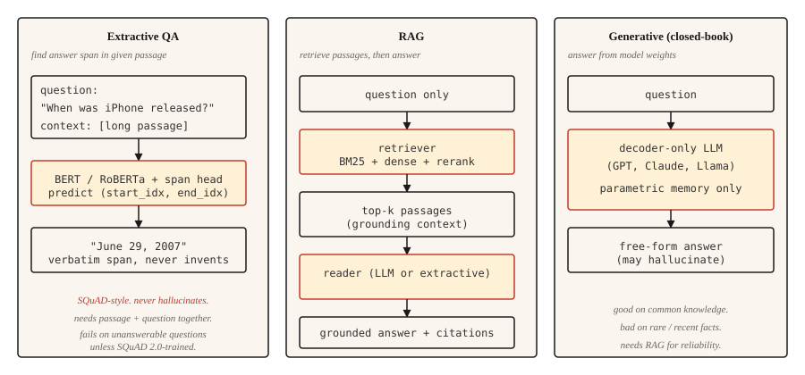

# 问答系统

> 三类系统塑造了现代问答（QA）：抽取式系统寻找答案片段，检索增强式系统让答案有文档依据，生成式系统生成答案。如今的每个 AI 助手都融合了这三类系统。

**Type:** Build
**Languages:** Python
**Prerequisites:** 阶段 5 · 11（机器翻译）、阶段 5 · 10（注意力机制）
**Time:** ~75 分钟

## 要解决的问题

用户输入“第一代 iPhone 是什么时候上市的？”，期待得到“June 29, 2007”。他们想要的不是“Apple 的历史漫长而丰富”，也不是孤零零的“2007”，连一句完整的话都没有。他们要的是直接、有依据且正确的答案。

过去十年，三种架构主导了问答系统。

- **抽取式问答（Extractive QA）。** 给定一个问题，以及一段已知包含答案的文本，找出答案所在的文本跨度（span，即答案片段）在段落中的起止索引。SQuAD 是这一任务的经典基准。
- **开放域问答（Open-domain QA）。** 不提供现成段落。先检索相关段落，再抽取或生成答案。这是如今所有检索增强生成（RAG）管线的基础。
- **生成式 / 闭卷问答（Generative / Closed-book QA）。** 大语言模型（LLM）依靠存储在参数中的记忆作答，不进行检索。推理速度最快，但事实可靠性最低。

2026 年的趋势是混合架构：检索出最相关的几个段落，再通过提示词（prompt）让生成式模型依据这些段落作答。这就是 RAG，第 14 课会深入讲解其中的检索部分。本课构建的是问答部分。

## 核心概念



**抽取式。** 使用 Transformer（BERT 系列）对问题和段落联合编码。训练两个预测头，分别预测答案起始和结束 token（词元）的索引。损失是在有效位置上计算的交叉熵（cross-entropy）。输出是段落中的一个片段。从结构上说，它绝不会产生幻觉（hallucination），也绝无法处理段落中找不到答案的问题。

**检索增强式（RAG）。** 分两个阶段。首先，检索器（retriever）从语料库中找出排名前 `k` 的段落。然后，阅读器（reader，可以是抽取式或生成式）根据这些段落给出答案。检索器与阅读器分离，便于分别训练和评估。现代 RAG 往往还在两者之间加入重排序器（reranker）。

**生成式。** 仅含解码器的 LLM（GPT、Claude、Llama）根据学到的权重作答，没有检索步骤。它擅长常识问题，却会在罕见或近期事实问题上出现灾难性的错误。幻觉率与事实在预训练数据中的出现频率负相关。

```figure
qa-span
```

## 动手实现

### 第 1 步：用预训练模型实现抽取式问答

```python
from transformers import pipeline

qa = pipeline("question-answering", model="deepset/roberta-base-squad2")

passage = (
    "Apple Inc. released the first iPhone on June 29, 2007. "
    "The device was announced by Steve Jobs at Macworld in January 2007."
)
question = "When was the first iPhone released?"

answer = qa(question=question, context=passage)
print(answer)
```

```python
{'score': 0.98, 'start': 57, 'end': 70, 'answer': 'June 29, 2007'}
```

`deepset/roberta-base-squad2` 在包含不可回答问题的 SQuAD 2.0 上训练。默认情况下，即使模型的空答案分数最高，`question-answering` 管线也会返回得分最高的答案片段，*不会*自动返回空答案。要明确启用“无答案”行为，需要在调用管线时传入 `handle_impossible_answer=True`：此时，只有空答案分数高于所有片段分数，管线才会返回空答案。无论采用哪种方式，都要检查 `score` 字段。

### 第 2 步：检索增强管线（简要实现）

```python
from sentence_transformers import SentenceTransformer
import numpy as np

encoder = SentenceTransformer("sentence-transformers/all-MiniLM-L6-v2")

corpus = [
    "Apple Inc. released the first iPhone on June 29, 2007.",
    "Macworld 2007 featured the iPhone announcement by Steve Jobs.",
    "Android launched in 2008 as Google's mobile operating system.",
    "The first iPod was released in 2001.",
]
corpus_embeddings = encoder.encode(corpus, normalize_embeddings=True)


def retrieve(question, top_k=2):
    q_emb = encoder.encode([question], normalize_embeddings=True)
    sims = (corpus_embeddings @ q_emb.T).squeeze()
    order = np.argsort(-sims)[:top_k]
    return [corpus[i] for i in order]


def answer(question):
    passages = retrieve(question, top_k=2)
    combined = " ".join(passages)
    return qa(question=question, context=combined)


print(answer("When was the first iPhone released?"))
```

这是一条两阶段管线。稠密检索器（dense retriever，Sentence-BERT）通过语义相似度查找相关段落。抽取式阅读器（RoBERTa-SQuAD）从合并后的高排名段落中取出答案片段。这种做法适用于小型语料库。面对 million（百万）篇文档规模的语料库，应使用 FAISS 或向量数据库。

### 第 3 步：使用 RAG 生成答案

```python
def rag_generate(question, llm):
    passages = retrieve(question, top_k=3)
    prompt = f"""Context:
{chr(10).join('- ' + p for p in passages)}

Question: {question}

Answer using only the context above. If the context does not contain the answer, say "I don't know."
"""
    return llm(prompt)
```

提示词的写法很重要。明确要求模型依据上下文作答，并在上下文不足时回答“我不知道”，与简单提示相比，可将幻觉率降低 40-60%。更精细的提示模式还会加入引文、置信分数和结构化抽取。

### 第 4 步：贴近真实场景的评估

SQuAD 使用 **完全匹配（Exact Match，EM）** 和 **token 级 F1**。EM 在规范化处理（转为小写、去除标点、去除冠词）后进行严格匹配：预测答案必须完全一致，否则得分为 0。F1 根据预测答案与参考答案之间重叠的 token 计算，部分匹配也能得分。这两种指标给改述答案的分数都会偏低：“June 29, 2007”与“June 29th, 2007”比较时，EM 通常为 0（序数词使规范化后的文本仍然不一致），但重叠的 token 仍能带来相当可观的 F1 得分。

对于生产环境中的问答系统，应评估：

- **答案准确率**（由 LLM 或人工判断，因为指标无法反映语义等价性）。
- **引文准确率（citation accuracy）。** 引用的段落是否确实支持答案？只需对生成的引文与检索到的段落做字符串匹配，就很容易自动检查。
- **拒答校准（refusal calibration）。** 当检索到的段落不包含答案时，系统是否会正确地回答“我不知道”？应测量错误自信率。
- **检索召回率（retrieval recall）。** 在评估阅读器之前，先衡量检索器是否把正确段落纳入排名前 `k` 的结果。阅读器无法弥补段落缺失的问题。

### RAGAS：2026 年的生产评估框架

`RAGAS` 专为 RAG 系统设计，是 2026 年交付生产系统时的默认选择。它无需标准参考答案，就能从四个维度评分：

- **忠实度（faithfulness）。** 答案中的每项断言是否都来自检索到的上下文？通过基于自然语言推断（NLI）的蕴含关系衡量。这是衡量幻觉的首要指标。
- **答案相关性（answer relevance）。** 答案是否回应了问题？根据答案生成假想问题，再与实际问题比较，以此衡量相关性。
- **上下文精确率（context precision）。** 检索到的文本块中，真正相关的占多少？精确率低，意味着提示词中有噪声。
- **上下文召回率（context recall）。** 检索结果是否包含了所有必要信息？召回率低，意味着阅读器无法成功作答。

无参考评分（reference-free scoring）让你无需精心整理的标准答案，就能评估生产环境中的实时流量。对于完全匹配指标无能为力的开放式问题，可以再叠加以大语言模型为评判者（LLM-as-judge）的评估。

运行 `pip install ragas`，接入检索器和阅读器，就能为每次查询得到四个标量分数，并在质量退步时发出告警。

## 实际使用

2026 年的技术组合：

| 使用场景 | 推荐方案 |
|---------|-------------|
| 给定段落，查找答案片段 | `deepset/roberta-base-squad2` |
| 面向固定语料库，不接受闭卷作答 | RAG：稠密检索器 + LLM 阅读器 |
| 面向文档库进行实时问答 | RAG，搭配混合检索器（BM25 + 稠密检索）及重排序器（第 14 课） |
| 对话式问答（追问） | 带对话历史的 LLM，每轮都使用 RAG |
| 对事实准确性要求高的受监管领域 | 在权威语料库上进行抽取式问答；绝不单独使用生成式系统 |

2026 年，抽取式问答已不再流行，因为结合 LLM 的 RAG 能处理更多场景。但在要求逐字引用的场景中，它仍在实际使用，例如法律研究、监管合规和审计工具。

## 交付成果

保存为 `outputs/skill-qa-architect.md`：

```markdown
---
name: qa-architect
description: Choose QA architecture, retrieval strategy, and evaluation plan.
version: 1.0.0
phase: 5
lesson: 13
tags: [nlp, qa, rag]
---

Given requirements (corpus size, question type, factuality constraint, latency budget), output:

1. Architecture. Extractive, RAG with extractive reader, RAG with generative reader, or closed-book LLM. One-sentence reason.
2. Retriever. None, BM25, dense (name the encoder), or hybrid.
3. Reader. SQuAD-tuned model, LLM by name, or "domain-fine-tuned DistilBERT."
4. Evaluation. EM + F1 for extractive benchmarks; answer accuracy + citation accuracy + refusal calibration for production. Name what you are measuring and how you are measuring it.

Refuse closed-book LLM answers for regulatory or compliance-sensitive questions. Refuse any QA system without a retrieval-recall baseline (you cannot evaluate the reader without knowing the retriever surfaced the right passage). Flag questions that require multi-hop reasoning as needing specialized multi-hop retrievers like HotpotQA-trained systems.
```

## 练习

1. **简单。** 针对 10 段 Wikipedia 文本搭建上面的 SQuAD 抽取式问答管线。手工编写 10 个问题，统计答案正确的次数。如果段落和问题都清晰无误，应该能答对 7-9 个。
2. **中等。** 加入一个拒答分类器。当最高检索分数低于某个阈值时（例如余弦相似度 0.3），直接返回“我不知道”，不再调用阅读器。在留出集上调整阈值。
3. **困难。** 自选一个包含 10,000 篇文档的语料库，搭建 RAG 管线。实现混合检索（BM25 + 稠密检索），并使用倒数排名融合（RRF，见第 14 课）。比较加入混合检索步骤前后的答案准确率，记录哪些问题类型受益最多。

## 关键术语

| 术语 | 常见说法 | 实际含义 |
|------|-----------------|-----------------------|
| 抽取式问答 | 找到答案片段 | 预测答案在给定段落中的起止索引。 |
| 开放域问答 | 在语料库上做问答 | 不提供现成段落；必须先检索，再作答。 |
| RAG | 先检索，再生成 | 检索增强生成。由检索器和阅读器组成的管线。 |
| SQuAD | 经典基准 | Stanford Question Answering Dataset（斯坦福问答数据集）。采用 EM + F1 指标。 |
| 幻觉 | 编造的答案 | 阅读器的输出得不到检索上下文的支持。 |
| 拒答校准 | 知道什么时候该闭嘴 | 无法作答时，系统能正确地回答“我不知道”。 |

## 延伸阅读

- [Rajpurkar et al. (2016). SQuAD: 100,000+ Questions for Machine Comprehension of Text](https://arxiv.org/abs/1606.05250) — 提出这一基准的论文。
- [Karpukhin et al. (2020). Dense Passage Retrieval for Open-Domain QA](https://arxiv.org/abs/2004.04906) — DPR，问答领域的经典稠密检索器。
- [Lewis et al. (2020). Retrieval-Augmented Generation for Knowledge-Intensive NLP Tasks](https://arxiv.org/abs/2005.11401) — 为 RAG 命名的论文。
- [Gao et al. (2023). Retrieval-Augmented Generation for Large Language Models: A Survey](https://arxiv.org/abs/2312.10997) — 全面介绍 RAG 的综述。
