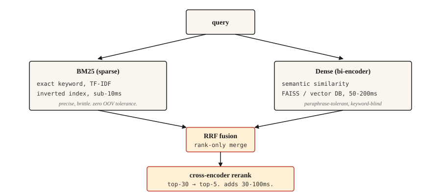

# 信息检索与搜索

> BM25 精确却脆弱。稠密检索覆盖面广，却会漏掉关键词。混合检索是 2026 年的默认选择。其余工作都是调优。

**Type:** Build
**Languages:** Python
**Prerequisites:** 阶段 5 · 02（词袋 BoW + TF-IDF（词频-逆文档频率）），阶段 5 · 04（GloVe、FastText、子词）
**Time:** ~75 分钟

## 要解决的问题

用户输入“如果有人靠说谎骗取钱财会怎样”，期望找到真正涵盖这种行为的法条：“IPC 第 420 条”。关键词搜索会完全漏掉它（没有共同词汇）。如果嵌入（embedding）没有在法律文本上训练过，语义搜索也会漏掉它。真正的搜索必须同时处理这两种情况。

信息检索（IR）是每个检索增强生成（RAG）系统、每个搜索栏以及每个文档网站模糊查找功能背后的流水线。2026 年在生产环境中奏效的架构并不是某一种方法，而是一串互补的方法，每一种都弥补前一种方法的失误。

本课将实现各个组成部分，并指出它们各自弥补哪些失误。

## 核心概念



四个层次，按需选用。

1. **稀疏检索（BM25）。** 速度快，精确匹配很准，语义匹配却很差。在倒排索引上运行。面对数百万篇文档，每次查询耗时低于 10ms。能够准确找到法条引用、产品代码、错误消息和命名实体。
2. **稠密检索。** 将查询和文档编码为向量，进行最近邻搜索。捕捉改述和语义相似性。会漏掉仅相差一个字符的精确关键词匹配。使用 FAISS 或向量数据库时，每次查询耗时 50-200ms。
3. **融合。** 合并稀疏检索和稠密检索的排名列表。倒数排名融合（Reciprocal Rank Fusion，RRF）是容易上手的默认选择，因为它忽略原始分数（这些分数的尺度不同），只使用排名位置。如果你知道在自己的领域中某一种信号占主导，也可以选择加权融合。
4. **交叉编码器重排序。** 从融合结果中取出 top-30。运行交叉编码器（cross-encoder，将查询 + 文档放在一起，对每一对打分），保留 top-5。交叉编码器处理每一对的速度比双编码器（bi-encoder）慢，但准确得多。只在 top-30 上运行，就能分摊这项开销。

三路检索（BM25 + 稠密检索 + SPLADE 这类学习型稀疏检索）在 2026 年的基准测试中优于两路检索，但需要支持学习型稀疏索引的基础设施。对大多数团队而言，两路检索加交叉编码器重排序是较好的平衡点。

```figure
gx-hybrid-retrieval
```

## 动手实现

### 第 1 步：从零实现 BM25

```python
import math
import re
from collections import Counter

TOKEN_RE = re.compile(r"[a-z0-9]+")


def tokenize(text):
    return TOKEN_RE.findall(text.lower())


class BM25:
    def __init__(self, corpus, k1=1.5, b=0.75):
        if not corpus:
            raise ValueError("corpus must not be empty")
        self.corpus = [tokenize(d) for d in corpus]
        self.k1 = k1
        self.b = b
        self.n_docs = len(self.corpus)
        self.avg_dl = sum(len(d) for d in self.corpus) / self.n_docs
        self.df = Counter()
        for doc in self.corpus:
            for term in set(doc):
                self.df[term] += 1

    def idf(self, term):
        n = self.df.get(term, 0)
        return math.log(1 + (self.n_docs - n + 0.5) / (n + 0.5))

    def score(self, query, doc_idx):
        q_tokens = tokenize(query)
        doc = self.corpus[doc_idx]
        dl = len(doc)
        freq = Counter(doc)
        score = 0.0
        for term in q_tokens:
            f = freq.get(term, 0)
            if f == 0:
                continue
            numerator = f * (self.k1 + 1)
            denominator = f + self.k1 * (1 - self.b + self.b * dl / self.avg_dl)
            score += self.idf(term) * numerator / denominator
        return score

    def rank(self, query, top_k=10):
        scored = [(self.score(query, i), i) for i in range(self.n_docs)]
        scored.sort(reverse=True)
        return scored[:top_k]
```

有两个参数值得了解。`k1=1.5` 控制词频饱和程度；值越高，词项重复获得的权重越大。`b=0.75` 控制长度归一化；0 表示忽略文档长度，1 表示完全归一化。这些默认值来自 Robertson 在原始论文中的建议，很少需要调优。

### 第 2 步：用双编码器进行稠密检索

```python
from sentence_transformers import SentenceTransformer
import numpy as np


def build_dense_index(corpus, model_id="sentence-transformers/all-MiniLM-L6-v2"):
    encoder = SentenceTransformer(model_id)
    embeddings = encoder.encode(corpus, normalize_embeddings=True)
    return encoder, embeddings


def dense_search(encoder, embeddings, query, top_k=10):
    q_emb = encoder.encode([query], normalize_embeddings=True)
    sims = (embeddings @ q_emb.T).flatten()
    order = np.argsort(-sims)[:top_k]
    return [(float(sims[i]), int(i)) for i in order]
```

对嵌入做 L2 归一化，使点积等于余弦相似度。`all-MiniLM-L6-v2` 为 384 维，速度快，能力足以满足大多数英文检索任务。多语言任务使用 `paraphrase-multilingual-MiniLM-L12-v2`。追求最高准确率时，使用 `bge-large-en-v1.5` 或 `e5-large-v2`。

### 第 3 步：倒数排名融合

```python
def reciprocal_rank_fusion(rankings, k=60):
    scores = {}
    for ranking in rankings:
        for rank, (_, doc_idx) in enumerate(ranking):
            scores[doc_idx] = scores.get(doc_idx, 0.0) + 1.0 / (k + rank + 1)
    fused = sorted(scores.items(), key=lambda x: x[1], reverse=True)
    return [(score, doc_idx) for doc_idx, score in fused]
```

常数 `k=60` 来自原始 RRF 论文。`k` 越大，排名差异对结果的贡献越平缓；`k` 越小，靠前的排名越占主导。60 是论文发表的默认值，很少需要调优。

### 第 4 步：混合搜索 + 重排序

```python
from sentence_transformers import CrossEncoder

reranker = CrossEncoder("cross-encoder/ms-marco-MiniLM-L-6-v2")


def hybrid_search(query, bm25, encoder, dense_embeddings, corpus, top_k=5, pool_size=30, reranker=reranker):
    sparse_ranking = bm25.rank(query, top_k=pool_size)
    dense_ranking = dense_search(encoder, dense_embeddings, query, top_k=pool_size)
    fused = reciprocal_rank_fusion([sparse_ranking, dense_ranking])[:pool_size]

    pairs = [(query, corpus[doc_idx]) for _, doc_idx in fused]
    scores = reranker.predict(pairs)
    reranked = sorted(zip(scores, [doc_idx for _, doc_idx in fused]), reverse=True)
    return reranked[:top_k]
```

将三个阶段组合起来。BM25 找到词汇匹配，稠密检索找到语义匹配。RRF 合并这两个排名，无需校准分数。交叉编码器将查询与文档成对输入，对 top-30 重新打分，从而捕捉双编码器遗漏的细粒度相关性。保留 top-5。

### 第 5 步：评估

| 指标 | 含义 |
|--------|---------|
| Recall@k（召回率） | 在存在正确文档的查询中，该文档出现在 top-k 的频率有多高？ |
| MRR（平均倒数排名，Mean Reciprocal Rank） | 第一个相关文档排名的倒数 1/rank 的平均值。 |
| nDCG@k（归一化折损累计增益） | 考虑相关性的不同程度，而不只是相关/不相关的二元判断。 |

具体到 RAG，检索器的 **Recall@k** 是最重要的数值。如果正确段落不在检索结果集中，阅读器就无法回答。

调试建议：对失败的查询，比较稀疏检索与稠密检索的排名差异。如果其中一种找到了正确文档，另一种却没有，那么你遇到的就是词汇不匹配（解决方法：补上缺失的另一半检索能力）或语义歧义（解决方法：改用更好的嵌入或重排序器）。

## 实际使用

2026 年的技术栈：

| 规模 | 技术栈 |
|-------|-------|
| 1k-100k 篇文档 | 内存中的 BM25 + `all-MiniLM-L6-v2` 嵌入 + RRF。无需独立数据库。 |
| 100k-10M 篇文档 | FAISS 或 pgvector 用于稠密检索 + Elasticsearch / OpenSearch 用于 BM25。并行运行。 |
| 10M+ 篇文档 | 使用支持混合检索的 Qdrant / Weaviate / Vespa / Milvus。在 top-30 上进行交叉编码器重排序。 |
| 质量最优的前沿方案 | 三路检索（BM25 + 稠密检索 + SPLADE）+ ColBERT 后期交互重排序 |

无论选择什么，都要为评估预留预算。在测试端到端 RAG 准确率之前，先对检索召回率做基准测试。阅读器无法弥补检索器的遗漏。

### 2026 年生产级 RAG 的宝贵经验

- **80% 的 RAG 失败可追溯到数据摄取和分块，而非模型。** 团队花上数周更换大语言模型（LLM）并调整提示词（prompt），与此同时，检索每三次查询就会悄悄返回一次错误上下文。先修好分块。
- **分块策略比分块大小更重要。** 固定大小的切分会破坏表格、代码和嵌套标题。默认采用能够识别句子边界的分块；对技术文档和产品手册，语义分块或基于 LLM 的分块值得投入。
- **父文档模式。** 为提高精确率，检索较小的“子”块。当来自同一父章节的多个子块出现时，用父块替换它们以保留上下文。这种做法无需重新训练，就能持续提升回答质量。
- **k_rerank=3 通常最优。** 超过这个数量后，每多一个块都会增加 token（词元）成本和生成延迟，却不会提高回答质量。如果对你而言 k=8 仍优于 k=3，说明重排序器表现不佳。
- **HyDE（假设文档嵌入）/ 查询扩展。** 根据查询生成一个假设答案，对其进行嵌入，再执行检索。这能弥合短问题与长文档之间的措辞差距，无需训练即可免费提升精确率。
- **上下文预算控制在 8K tokens 以下。** 如果经常触及这个上限，说明重排序器的阈值过于宽松。
- **为一切内容做版本管理。** 提示词、分块规则、嵌入模型、重排序器都要纳入。任何漂移都会悄悄破坏回答质量。针对忠实度、上下文精确率和未回答问题比例设置 CI 门禁，能在用户发现之前阻止质量回退。
- **三路检索（BM25 + 稠密检索 + SPLADE 这类学习型稀疏检索）优于两路检索** ，这是 2026 年基准测试的结果，尤其适用于将专有名词与语义混合的查询。在基础设施支持 SPLADE 索引时交付这一方案。

根据 2026 年的行业测量，合理的检索设计能将幻觉减少 70-90%。RAG 的大部分性能提升来自更好的检索，而非模型微调。

## 交付成果

保存为 `outputs/skill-retrieval-picker.md`：

```markdown
---
name: retrieval-picker
description: Pick a retrieval stack for a given corpus and query pattern.
version: 1.0.0
phase: 5
lesson: 14
tags: [nlp, retrieval, rag, search]
---

Given requirements (corpus size, query pattern, latency budget, quality bar, infra constraints), output:

1. Stack. BM25 only, dense only, hybrid (BM25 + dense + RRF), hybrid + cross-encoder rerank, or three-way (BM25 + dense + learned-sparse).
2. Dense encoder. Name the specific model. Match to language(s), domain, and context length.
3. Reranker. Name the specific cross-encoder model if used. Flag that rerank adds 30-100ms latency on top-30.
4. Evaluation plan. Recall@10 is the primary retriever metric. MRR for multi-answer. Baseline first, incremental improvements measured against it.

Refuse to recommend dense-only for corpora with named entities, error codes, or product SKUs unless the user has evidence dense handles exact matches. Refuse to skip reranking for high-stakes retrieval (legal, medical) where the final top-5 decides the user's answer.
```

## 练习

1. **简单。** 在包含 500 篇文档的语料库上实现上面的 `hybrid_search`。测试 20 个查询。比较仅用 BM25、仅用稠密检索及混合检索时，前 5 个结果的召回率。
2. **中等。** 添加 MRR 计算。对每个已知正确文档的测试查询，找出该文档在 BM25、稠密检索和混合检索排名中的位置。分别报告 MRR。
3. **困难。** 使用 MultipleNegativesRankingLoss（Sentence Transformers）在自己的领域中微调稠密编码器。用 500 对查询-文档构建训练集。比较微调前后的召回率。

## 关键术语

| 术语 | 通常的说法 | 实际含义 |
|------|-----------------|-----------------------|
| BM25 | 关键词搜索 | Okapi BM25。根据词频、逆文档频率（IDF）和长度为文档打分。 |
| 稠密检索 | 向量搜索 | 将查询 + 文档编码为向量，查找最近邻。 |
| 双编码器 | 嵌入模型 | 分别对查询和文档编码。查询时速度快。 |
| 交叉编码器 | 重排序模型 | 将查询 + 文档一起编码。速度慢但准确。 |
| RRF | 排名融合 | 通过对 `1/(k + rank)` 求和来合并两个排名。 |
| Recall@k | 检索指标 | 相关文档出现在 top-k 中的查询所占的比例。 |

## 延伸阅读

- [Robertson and Zaragoza (2009). The Probabilistic Relevance Framework: BM25 and Beyond](https://www.staff.city.ac.uk/~sbrp622/papers/foundations_bm25_review.pdf) — BM25 的权威论述。
- [Karpukhin et al. (2020). Dense Passage Retrieval for Open-Domain QA](https://arxiv.org/abs/2004.04906) — DPR，经典的双编码器。
- [Formal et al. (2021). SPLADE: Sparse Lexical and Expansion Model](https://arxiv.org/abs/2107.05720) — 缩小与稠密检索差距的学习型稀疏检索器。
- [Cormack, Clarke, Büttcher (2009). Reciprocal Rank Fusion outperforms Condorcet and individual Rank Learning Methods](https://plg.uwaterloo.ca/~gvcormac/cormacksigir09-rrf.pdf) — RRF 论文。
- [Khattab and Zaharia (2020). ColBERT: Efficient and Effective Passage Search](https://arxiv.org/abs/2004.12832) — 后期交互检索。
