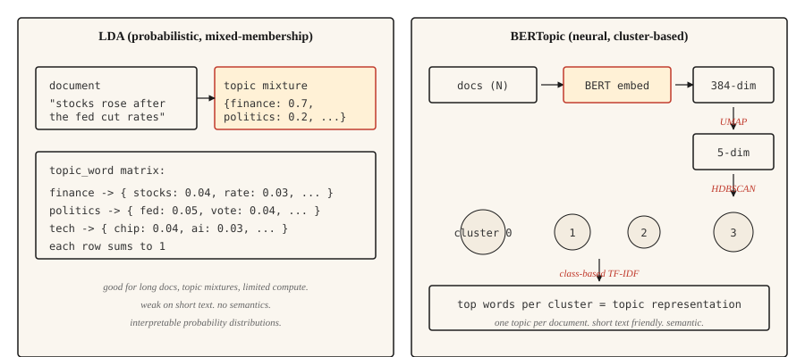

# 主题建模：LDA 与 BERTopic

> LDA（隐 Dirichlet 分配）：文档是主题的混合，主题是词上的分布。BERTopic：文档在嵌入（embedding）空间中聚成簇，簇就是主题。目标相同，分解方式不同。

**Type:** Learn
**Languages:** Python
**Prerequisites:** 阶段 5 · 02（BoW + TF-IDF），阶段 5 · 03（Word2Vec）
**Time:** ~45 分钟

## 要解决的问题

你有 10,000 条客户支持工单、50,000 篇新闻文章，或 200,000 条推文。你需要在不逐篇阅读的情况下，知道这批文本在谈什么。你没有已标注的类别，甚至不知道存在多少个类别。

主题建模（topic modeling）无需监督就能回答这个问题。给它一个语料库，它会返回少量连贯的主题，以及每篇文档在这些主题上的分布。

两类算法占据主导地位。LDA（2003）把每篇文档视为潜在主题的混合，把每个主题视为词上的分布。它采用 Bayes 推断。对于需要混合成员关系（mixed membership）的主题分配，以及可解释的词级概率分布的场景，LDA 至今仍用于生产环境。

BERTopic（2020）用 BERT 编码文档，通过 UMAP 降维，用 HDBSCAN 聚类，再通过基于类别的 TF-IDF（词频-逆文档频率）提取主题词。在短文本、社交媒体，以及语义相似性比词语重叠更重要的场景中，它更胜一筹。一篇文档只分配一个主题，这对长篇内容是一项限制。

本课帮助你建立对这两种方法的直观理解，并说明面对给定语料库时该选哪一种。

## 核心概念



**LDA 的生成过程。** 每个主题都是词上的分布，每篇文档都是主题的混合。要在文档中生成一个词，先从文档的主题混合中抽取一个主题，再从该主题的分布中抽取一个词。推断则反过来：给定观测到的词，推断每篇文档的主题分布和每个主题的词分布。具体计算由折叠 Gibbs 抽样（collapsed Gibbs sampling）或变分 Bayes 完成。

LDA 的关键输出：

- `doc_topic`：形状为 `(n_docs, n_topics)` 的矩阵，每行之和为 1（文档的主题混合）。
- `topic_word`：形状为 `(n_topics, vocab_size)` 的矩阵，每行之和为 1（主题的词分布）。

**BERTopic 流程。**

1. 用句子 Transformer 对每篇文档进行编码，例如 `all-MiniLM-L6-v2`，得到 384 维向量。
2. 用 UMAP 将维数降至 ~5 维。BERT 嵌入的维数太高，不适合聚类。
3. 用 HDBSCAN 聚类。它基于密度，产生大小不一的簇和一个“离群点”标签。
4. 对每个簇，在簇内文档上计算基于类别的 TF-IDF，提取排名靠前的词。

输出为每篇文档一个主题，另有一个值为 -1 的离群点标签。还可以选择通过 HDBSCAN 的概率向量获得软成员关系（soft membership）。

```figure
topic-drift
```

## 动手实现

### 第 1 步：通过 scikit-learn 实现 LDA

```python
from sklearn.feature_extraction.text import CountVectorizer
from sklearn.decomposition import LatentDirichletAllocation
import numpy as np


def fit_lda(documents, n_topics=5, max_features=1000):
    cv = CountVectorizer(
        max_features=max_features,
        stop_words="english",
        min_df=2,
        max_df=0.9,
    )
    X = cv.fit_transform(documents)
    lda = LatentDirichletAllocation(
        n_components=n_topics,
        random_state=42,
        max_iter=50,
        learning_method="online",
    )
    doc_topic = lda.fit_transform(X)
    feature_names = cv.get_feature_names_out()
    return lda, cv, doc_topic, feature_names


def print_top_words(lda, feature_names, n_top=10):
    for idx, topic in enumerate(lda.components_):
        top_idx = np.argsort(-topic)[:n_top]
        words = [feature_names[i] for i in top_idx]
        print(f"topic {idx}: {' '.join(words)}")
```

注意：这里移除了停用词，min_df 和 max_df 分别过滤罕见词和普遍出现的词；采用 CountVectorizer，而非 TfidfVectorizer，因为 LDA 需要原始计数。

### 第 2 步：BERTopic（生产环境）

```python
from bertopic import BERTopic

topic_model = BERTopic(
    embedding_model="sentence-transformers/all-MiniLM-L6-v2",
    min_topic_size=15,
    verbose=True,
)

topics, probs = topic_model.fit_transform(documents)
info = topic_model.get_topic_info()
print(info.head(20))
valid_topics = info[info["Topic"] != -1]["Topic"].tolist()
for topic_id in valid_topics[:5]:
    print(f"topic {topic_id}: {topic_model.get_topic(topic_id)[:10]}")
```

`Topic != -1` 这个过滤条件会去掉 BERTopic 的离群点分组，也就是 HDBSCAN 无法聚类的文档。`min_topic_size` 控制 HDBSCAN 的最小簇大小；BERTopic 库的默认值为 10。本示例根据课程中的数据规模，将它显式设为 15。对于文档数超过 10,000 的语料库，将它提高到 50 或 100。

### 第 3 步：评估

两种方法都会输出主题词。问题是，这些词是否连贯。

- **主题连贯性（topic coherence，c_v）。** 结合滑动窗口上下文中排名靠前的词对的 NPMI（归一化点互信息），将这些分数聚合为主题向量，再通过余弦相似度比较这些向量。越高越好。使用 `gensim.models.CoherenceModel`，并设置 `coherence="c_v"`。
- **主题多样性（topic diversity）。** 所有主题排名靠前的词中，不重复词所占的比例。越高越好，表示主题没有重叠。
- **定性检查。** 阅读每个主题排名靠前的词。它们描述的是一个真实存在的事物吗？人工判断仍然是最后一道防线。

## 什么情况下该选哪种方法

| 场景 | 选择 |
|-----------|------|
| 短文本（推文、评论、标题） | BERTopic |
| 包含多个主题混合的长文档 | LDA |
| 没有 GPU / 计算资源有限 | LDA 或非负矩阵分解（NMF） |
| 需要文档级的多主题分布 | LDA |
| 集成大语言模型（LLM）来标注主题 | BERTopic（直接支持） |
| 资源受限的边缘部署 | LDA |
| 追求最高的语义连贯性 | BERTopic |

实践中最重要的考虑因素是文档长度。BERT 嵌入会截断输入；LDA 的计数方式则适用于任意长度。对于超过嵌入模型上下文长度的文档，要么分块后聚合，要么使用 LDA。

## 实际使用

2026 年的技术栈：

- **BERTopic。** 短文本和所有重视语义的场景中的默认选择。
- **`gensim.models.LdaModel`。** 用于生产环境的经典 LDA，成熟且经过实战检验。
- **`sklearn.decomposition.LatentDirichletAllocation`。** 便于实验的 LDA。
- **NMF。** 非负矩阵分解。它是 LDA 的一种快速替代方法，在短文本上的质量相当。
- **Top2Vec。** 设计与 BERTopic 相似。社区规模较小，但在一些基准上表现不错。
- **FASTopic。** 较新的方法，在超大规模语料库上比 BERTopic 更快。
- **基于 LLM 的标注。** 运行任意聚类方法，再用提示词（prompt）让模型为每个簇命名。

## 交付成果

保存为 `outputs/skill-topic-picker.md`：

```markdown
---
name: topic-picker
description: Pick LDA or BERTopic for a corpus. Specify library, knobs, evaluation.
version: 1.0.0
phase: 5
lesson: 15
tags: [nlp, topic-modeling]
---

Given a corpus description (document count, avg length, domain, language, compute budget), output:

1. Algorithm. LDA / NMF / BERTopic / Top2Vec / FASTopic. One-sentence reason.
2. Configuration. Number of topics: `recommended = max(5, round(sqrt(n_docs)))`, clamped to 200 for corpora under 40,000 docs; permit >200 only when the corpus is genuinely large (>40k) and note the increased compute cost. `min_df` / `max_df` filters and embedding model for neural approaches also belong here.
3. Evaluation. Topic coherence (c_v) via `gensim.models.CoherenceModel`, topic diversity, and a 20-sample human read.
4. Failure mode to probe. For LDA, "junk topics" absorbing stopwords and frequent terms. For BERTopic, the -1 outlier cluster swallowing ambiguous documents.

Refuse BERTopic on documents longer than the embedding model's context window without a chunking strategy. Refuse LDA on very short text (tweets, reviews under 10 tokens) as coherence collapses. Flag any n_topics choice below 5 as likely wrong; flag >200 on corpora under 40k docs as likely over-splitting.
```

## 练习

1. **简单。** 在 20 Newsgroups 数据集上拟合一个包含 5 个主题的 LDA 模型。打印每个主题排名靠前的 10 个词。手动给每个主题命名。算法找到了真实类别吗？
2. **中等。** 在同一个 20 Newsgroups 子集上拟合 BERTopic。将发现的主题数量、排名靠前的词和定性连贯性与 LDA 进行比较。哪种方法能更清晰地呈现真实类别？
3. **困难。** 在你自己的语料库上，分别计算 LDA 和 BERTopic 的 c_v 连贯性。让每种方法分别使用 5、10、20、50 个主题运行。绘制连贯性随主题数量变化的曲线，报告哪种方法在不同主题数量下更稳定。

## 关键术语

| 术语 | 常见说法 | 实际含义 |
|------|-----------------|-----------------------|
| 主题 | 语料库讨论的某件事 | 词上的概率分布（LDA），或相似文档组成的簇（BERTopic）。 |
| 混合成员关系 | 一篇文档属于多个主题 | LDA 为每篇文档分配一个覆盖所有主题的分布。 |
| UMAP | 降维 | 保留局部结构的流形学习（manifold learning）方法，用于 BERTopic。 |
| HDBSCAN | 密度聚类 | 找出大小不一的簇，并为离群点生成“噪声”标签（-1）。 |
| c_v 连贯性 | 主题质量指标 | 滑动窗口内排名靠前的主题词之间的平均点互信息。 |

## 延伸阅读

- [Blei, Ng, Jordan (2003). Latent Dirichlet Allocation](https://www.jmlr.org/papers/volume3/blei03a/blei03a.pdf) — LDA 论文。
- [Grootendorst (2022). BERTopic: Neural topic modeling with a class-based TF-IDF procedure](https://arxiv.org/abs/2203.05794) — BERTopic 论文。
- [Röder, Both, Hinneburg (2015). Exploring the Space of Topic Coherence Measures](https://svn.aksw.org/papers/2015/WSDM_Topic_Evaluation/public.pdf) — 提出 c_v 等指标的论文。
- [BERTopic documentation](https://maartengr.github.io/BERTopic/) — 生产环境参考文档，示例很出色。
