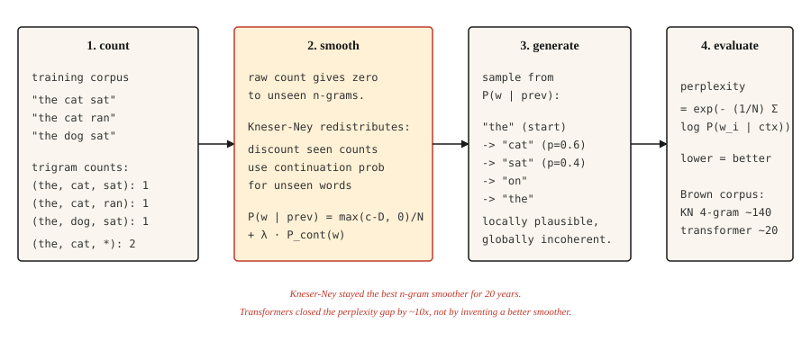

# Transformer 之前的文本生成：N-gram 语言模型

> 如果一个词让模型感到意外，说明模型不够好。困惑度（perplexity）把这种惊讶程度变成一个数字，平滑（smoothing）则让它保持有限。

**Type:** Build
**Languages:** Python
**Prerequisites:** 阶段 5 · 01（文本处理），阶段 2 · 14（朴素 Bayes）
**Time:** ~45 分钟

## 要解决的问题

在 Transformer、RNN（循环神经网络）和词嵌入（word embeddings）出现之前，语言模型通过统计一个词跟在前面 `n-1` 个词之后的次数，来预测下一个词。统计得到 "the cat" → "sat" 出现 47 次，"the cat" → "jumped" 出现 12 次，"the cat" → "refrigerator" 出现 0 次。将计数归一化，就得到概率分布。

这就是 n 元语言模型（n-gram language model）。从 1980 年到 2015 年，每个语音识别器、拼写检查器和基于短语的机器翻译系统都靠它运行。如今，只要需要低成本的设备端语言建模，它仍然在发挥作用。

有意思的问题是如何处理未见过的连续 n 元片段（n-gram）。直接基于计数的模型会给任何未见过的片段分配零概率，这会造成灾难性后果：句子很长，而几乎每个长句都至少包含一个未见过的序列。五十年的平滑研究解决了这个问题，Kneser-Ney（KN）平滑就是其成果，现代深度学习也继承了这套实证研究传统。

## 核心概念



### 预测游戏

在这些方法出现之前，一个实验就定义了什么是语言模型。遮住一个英语句子中的下一个字母，让一个人一次猜一个，直到猜对。记下猜测次数，再对几百个字母重复这个过程。

猜测次数并非无关紧要。它们是对文本的无损重新编码：把次数序列交给另一个猜测方式完全相同的人，对方就能还原每个字母，因为在每个位置上，对方都确切知道各种猜测的先后次序。如果一条消息能被重新编码成更少的符号，就说明它每个符号携带的信息较少。因此，猜测次数的统计结果为英语的熵（entropy）给出了上界。

Shannon 在 1951 年进行了这个实验，得到了一个至今仍影响着该领域的数值。由 27 个符号组成的字母表（26 个字母加空格），每个字母最多可携带 `log2(27) ≈ 4.75` bits（比特）。人在利用 100 个字母的上下文进行猜测时，结果落在每个字母 0.6 到 1.3 bits 之间。英语中大约四分之三的选择其实已经被上下文限定了。在任何模型有能力学习这些结构之前，人们就已经测量出了模型需要学习的结构。

此后的每个语言模型，都是这个游戏的机械玩家；本课中的每个评估数值，都是对这场游戏的计分：

- **交叉熵损失（cross-entropy loss）** 是模型编码每个符号平均需要的 bits 数。训练语言模型（LM），就是在最小化它在猜测游戏中的得分。
- **困惑度** 是 `2^bits`（或 `e^nats`）：模型经过猜测后仍然面对的分支因子（branching factor）。在 27 个符号之间均匀猜测，困惑度为 27；每个字母只需 1 bit 的玩家，其困惑度为 2。
- **上下文长度就是玩家的记忆。** 三元模型（trigram model）只有两个 token（词元）的记忆。Transformer 用 100K 个 token 来玩同一个游戏。规则从未改变，只是玩家变强了。

需要留意一处单位切换：这个游戏按每个字母的 bits 数计分（`log2`），而下文的 n 元模型公式按每个单词 token 的 nats（奈特）数计分（自然对数）。由于以 nats 表示时的困惑度 `e^H` 等于以 bits 表示时的 `2^H`，这两个视角是同一测量的不同单位表示。

```figure
prediction-game
```

**N-gram 概率：** `P(w_i | w_{i-n+1}, ..., w_{i-1})`。固定 `n`（三元模型通常取 3，4 元模型取 4），再根据计数计算：

```text
P(w | context) = count(context, w) / count(context)
```

**零计数问题。** 训练时未见过的任何 n 元片段，概率都会是零。2007 年一项针对 Brown 语料库的研究发现，即使使用 4 元模型，留出数据中的 4 元片段仍有 30% 未在训练中出现过。不做平滑，就无法在任何真实文本上进行评估。

**以下平滑方法按复杂程度递增排列：**

1. **Laplace 平滑（拉普拉斯平滑，也称加一平滑）。** 给每个计数加 1。方法简单，但对稀有事件的效果很差。
2. **Good-Turing。** 根据“频次的频次”，把频次较高的事件的一部分概率质量重新分配给未见过的事件。
3. **插值（interpolation）。** 用可调权重组合 n 元、(n-1) 元等模型的估计。
4. **回退（backoff）。** 如果 n 元片段的计数为零，就回退到 (n-1) 元片段。Katz 回退会对这一过程进行归一化。
5. **绝对折扣法（absolute discounting）。** 从所有计数中减去固定折扣 `D`，再将腾出的概率质量重新分配给未见过的事件。
6. **Kneser-Ney。** 在绝对折扣法的基础上，为低阶模型作出一个巧妙选择：使用*延续概率（continuation probability）*，即一个词出现过的不同左上下文的种类数，而非原始频次。

Kneser-Ney 的洞见很深刻。"San Francisco" 是常见的二元片段（bigram），一元片段（unigram）"Francisco" 大多跟在 "San" 之后。简单的绝对折扣法会给 "Francisco" 很高的一元概率，因为它的计数很高。Kneser-Ney 则注意到 "Francisco" 只出现在一种上下文中，因此降低了它的延续概率。结果是，以 "Francisco" 结尾的新二元片段会获得恰当的低概率。

**评估：困惑度。** 在留出测试集上，对每个词的负对数似然（negative log-likelihood）取平均，再取指数。越低越好。困惑度为 100，意味着模型的困惑程度相当于在 100 个词之间进行均匀选择。

```text
perplexity = exp(- (1/N) * Σ log P(w_i | context_i))
```

```figure
ngram-backoff
```

## 动手实现

### 步骤 1：三元片段计数

```python
from collections import Counter, defaultdict


def train_ngram(corpus_tokens, n=3):
    ngrams = Counter()
    contexts = Counter()
    for sentence in corpus_tokens:
        padded = ["<s>"] * (n - 1) + sentence + ["</s>"]
        for i in range(len(padded) - n + 1):
            ctx = tuple(padded[i:i + n - 1])
            word = padded[i + n - 1]
            ngrams[ctx + (word,)] += 1
            contexts[ctx] += 1
    return ngrams, contexts


def raw_probability(ngrams, contexts, context, word):
    ctx = tuple(context)
    if contexts.get(ctx, 0) == 0:
        return 0.0
    return ngrams.get(ctx + (word,), 0) / contexts[ctx]
```

输入是已分词的句子列表，输出是 n 元片段计数和上下文计数。`<s>` 与 `</s>` 表示句子边界。

### 步骤 2：Laplace 平滑

```python
def laplace_probability(ngrams, contexts, vocab_size, context, word):
    ctx = tuple(context)
    numerator = ngrams.get(ctx + (word,), 0) + 1
    denominator = contexts.get(ctx, 0) + vocab_size
    return numerator / denominator
```

给每个计数加 1。这样做能实现平滑，但会给未见过的事件分配过多概率质量，也会损害已见过的稀有事件。

### 步骤 3：Kneser-Ney（二元、插值式）

```python
def kneser_ney_bigram_model(corpus_tokens, discount=0.75):
    unigrams = Counter()
    bigrams = Counter()
    unigram_contexts = defaultdict(set)

    for sentence in corpus_tokens:
        padded = ["<s>"] + sentence + ["</s>"]
        for i, w in enumerate(padded):
            unigrams[w] += 1
            if i > 0:
                prev = padded[i - 1]
                bigrams[(prev, w)] += 1
                unigram_contexts[w].add(prev)

    total_unique_bigrams = sum(len(ctx_set) for ctx_set in unigram_contexts.values())
    continuation_prob = {
        w: len(ctx_set) / total_unique_bigrams for w, ctx_set in unigram_contexts.items()
    }

    context_totals = Counter()
    for (prev, w), count in bigrams.items():
        context_totals[prev] += count

    unique_follow = defaultdict(set)
    for (prev, w) in bigrams:
        unique_follow[prev].add(w)

    def prob(prev, w):
        count = bigrams.get((prev, w), 0)
        denom = context_totals.get(prev, 0)
        if denom == 0:
            return continuation_prob.get(w, 1e-9)
        first_term = max(count - discount, 0) / denom
        lambda_prev = discount * len(unique_follow[prev]) / denom
        return first_term + lambda_prev * continuation_prob.get(w, 1e-9)

    return prob
```

这里有三个组成部分。`continuation_prob` 衡量“这个词出现在多少种不同的上下文中”，这是 Kneser-Ney 的创新。`lambda_prev` 是折扣释放出的概率质量，用作回退项的权重。最终概率等于折扣后的主项加上加权后的延续项。

### 步骤 4：通过采样生成文本

```python
import random


def generate(prob_fn, vocab, prefix, max_len=30, seed=0):
    rng = random.Random(seed)
    tokens = list(prefix)
    for _ in range(max_len):
        candidates = [(w, prob_fn(tokens[-1], w)) for w in vocab]
        total = sum(p for _, p in candidates)
        r = rng.random() * total
        acc = 0.0
        for w, p in candidates:
            acc += p
            if r <= acc:
                tokens.append(w)
                break
        if tokens[-1] == "</s>":
            break
    return tokens
```

按概率大小成比例地采样。不同的随机种子总会产生不同的输出。如果想得到类似束搜索（beam search）的输出，就在每一步选择 argmax，即贪心选择，再加一个控制少量随机性的旋钮，也就是温度（temperature）。

### 步骤 5：困惑度

```python
import math


def perplexity(prob_fn, sentences):
    total_log_prob = 0.0
    total_tokens = 0
    for sentence in sentences:
        padded = ["<s>"] + sentence + ["</s>"]
        for i in range(1, len(padded)):
            p = prob_fn(padded[i - 1], padded[i])
            total_log_prob += math.log(max(p, 1e-12))
            total_tokens += 1
    return math.exp(-total_log_prob / total_tokens)
```

困惑度越低越好。在 Brown 语料库上，经过充分调优的 4 元 KN 模型可达到约 140 的困惑度，而 Transformer 语言模型在同一个测试集上可达到 15-30。差距约为 10 倍，这正是该领域转向新方法的原因。

## 实际使用

- **经典自然语言处理（NLP）教学。** 这是理解平滑、最大似然估计（MLE）和困惑度最清楚直接的方式。
- **KenLM。** 面向生产环境的 n 元模型库。在重视低延迟的语音和机器翻译（MT）系统中，用于重评分（rescoring）。
- **设备端自动补全。** 键盘中的三元模型，至今仍在使用。
- **基线。** 在宣称神经语言模型表现好之前，先计算 n 元语言模型的困惑度。如果你的 Transformer 没有明显优于 KN，那就说明有问题。

## 交付成果

保存为 `outputs/prompt-lm-baseline.md`：

```markdown
---
name: lm-baseline
description: Build a reproducible n-gram language model baseline before training a neural LM.
phase: 5
lesson: 16
---

Given a corpus and target use (next-word prediction, rescoring, perplexity baseline), output:

1. N-gram order. Trigram for general English, 4-gram if corpus is large, 5-gram for speech rescoring.
2. Smoothing. Modified Kneser-Ney is the default; Laplace only for teaching.
3. Library. `kenlm` for production, `nltk.lm` for teaching, roll your own only to learn.
4. Evaluation. Held-out perplexity with consistent tokenization between train and test sets.

Refuse to report perplexity computed with different tokenization between systems being compared — perplexity numbers are comparable only under identical tokenization. Flag OOV rate in test set; KN handles OOV poorly unless you reserve a special <UNK> token during training.
```

## 练习

1. **简单。** 在包含 1,000 个句子的 Shakespeare 语料库上训练三元语言模型，再生成 20 个句子。这些句子局部看似合理，整体却不连贯，这是经典演示。
2. **中等。** 为你的 KN 模型实现困惑度计算，并在 Shakespeare 语料的留出部分上评估，与 Laplace 平滑比较。你应该能看到 KN 将困惑度降低 30-50%。
3. **困难。** 构建三元拼写纠错器：给定一个拼错的词及其上下文，生成纠正候选，并按语言模型给出的上下文概率排序。使用公开的 Birkbeck 拼写语料库进行评估。

## 关键术语

| 术语 | 常见说法 | 实际含义 |
|------|-----------------|-----------------------|
| N-gram | 词序列 | 由连续 `n` 个 token 构成的序列。 |
| 平滑 | 避免零概率 | 重新分配概率质量，让未见过的事件获得非零概率。 |
| 困惑度 | 语言模型质量指标 | 在留出数据上计算 `exp(-average log-prob)`，越低越好。 |
| 回退 | 退回更短的上下文 | 如果三元片段的计数为零，就使用二元片段。Katz 回退将这一过程形式化。 |
| Kneser-Ney | n 元模型的最佳平滑方法 | 绝对折扣法，加上低阶模型的延续概率。 |
| 延续概率 | KN 特有 | `P(w)` 按 `w` 出现过的上下文数量加权，而非按原始计数加权。 |
| 文本的熵 | 每个符号的信息量 | 给定上下文后，编码下一个符号平均需要的 bits 数。Shannon 在 1951 年利用最长 100 个字母的上下文，估计印刷英语为 0.6-1.3 bits/letter（每个字母的比特数）；这一测量早于任何模型的出现。 |

## 延伸阅读

- [Shannon (1951). Prediction and Entropy of Printed English](https://www.princeton.edu/~wbialek/rome/refs/shannon_51.pdf)：定义猜测游戏的实验，给出了每个语言模型至今仍在优化的目标。
- [Jurafsky and Martin — Speech and Language Processing, Chapter 3 (2026 draft)](https://web.stanford.edu/~jurafsky/slp3/3.pdf)：关于 n 元语言模型和平滑的经典论述。
- [Chen and Goodman (1998). An Empirical Study of Smoothing Techniques for Language Modeling](https://dash.harvard.edu/handle/1/25104739)：确立 Kneser-Ney 作为最佳 n 元平滑方法地位的论文。
- [Kneser and Ney (1995). Improved Backing-off for M-gram Language Modeling](https://ieeexplore.ieee.org/document/479394)：KN 的原始论文。
- [KenLM](https://kheafield.com/code/kenlm/)：面向生产环境的快速 n 元语言模型，2026 年仍用于对延迟敏感的应用。
