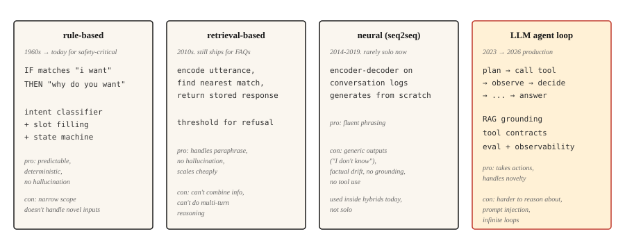

# 聊天机器人：从规则式、神经式到 LLM 智能体

> ELIZA 靠模式匹配回复，DialogFlow 映射意图（intent），GPT 从权重中给出答案，Claude 则调用工具并验证结果。每个时代都解决了上一代最严重的失败。

**Type:** Learn
**Languages:** Python
**Prerequisites:** 第 5 阶段 · 13（问答），第 5 阶段 · 14（信息检索）
**Time:** ~75 分钟

## 要解决的问题

用户说：“我想改签航班。”系统必须弄清用户想做什么、还缺哪些信息、怎样获取这些信息，以及如何完成操作。接着，用户又说：“等等，如果我改成取消呢？”这时，系统必须记住上下文、切换任务，并保留状态。

对机器学习（ML）系统来说，对话很难。输入是开放式的，输出必须在多轮对话中保持连贯，系统还可能需要执行现实中的操作，例如改签航班、向银行卡扣款。每一步出错，用户都看得见。

聊天机器人架构经历了四种范式，每种新范式的出现，都是因为上一种的失败太过明显。本课将依次介绍它们。2026 年的生产系统采用的是最后两种范式的混合。

## 核心概念



### 脚本驱动的半个世纪，1950-2001

第一种范式并非只持续了五年，而是延续了五十年。了解这段历程很重要，因为这一时期的所有系统，本质上都是同一台机器：匹配输入、给出预设回复，再更新少量状态。人们给这台机器添加了五十年的规则，却始终没能让它应对一般情形。正是这个上限，催生了第二到第四种范式。

**1950.** Turing 绕开了“机器能思考吗”这个问题，提出一个可操作的替代标准：如果提问者通过电传打字机交流，无法分辨对方是机器还是人，那么这个哲学问题也就不再重要。这个领域尚未有自己的名字，对话就已经成了它的衡量标准。

**1956.** 名字出现了。Dartmouth 的夏季研讨会提出“人工智能”（artificial intelligence）一词，其基本猜想是，智能的每一种特征“原则上都可以被精确地描述到足以让机器模拟的程度”。提案计划用两个月取得实质性进展。

**1966.** ELIZA 用上了你将在步骤 1 中实现的复述技巧（reflection）：分解规则从输入中提取片段，重组规则再把这些片段变成问题，抛回给用户。总共约 200 种模式，没有状态，也不理解内容，但用户照样向它倾诉。如此简单的机制就能产生这样的效果，这让 Weizenbaum 在此后的整个职业生涯中一直深感不安。

**1972.** Stanford 开发的 PARRY 用于模拟偏执状态，它补上了 ELIZA 缺少的一环：内部状态。表示恐惧、愤怒和不信任的数值变量在每轮对话中更新，并决定接下来触发哪段脚本，因此同样的输入会因之前的对话不同而得到不同的回复。在一项对话记录盲测中，精神科医生区分 PARRY 与真人患者的准确程度只相当于随机猜测。它是角色设定条件化（persona conditioning）的直接先驱，相当于用三个浮点数实现了一条系统提示词（system prompt）。同年，人们通过 ARPANET 让这两个机器人彼此交谈：扮演治疗师的脚本访谈一个模拟偏执状态的状态机，这成为网络上首次机器人之间的对话。

**1995.** ALICE 用 AIML 扩大了 ELIZA 这套方法的规模。AIML 是一种 XML 方言，用来描述模式与模板的配对。它有约 40,000 个手写类别，三次获得 Loebner Prize。它证明了规则式系统的扩展规律：更多规则能扩大覆盖范围，却永远换不来通用性。每一条规则，都是一项需要有人持续维护的负担。

**2001.** SmarterChild 把这套方法带给了 30 million（百万）名即时通信用户，并加入后端查询，把天气、股票、电影场次等信息嵌入模板。换个角度看，这就是披着 2001 年外衣的工具调用（tool calling）：解析意图、调用服务，再把结果组织成回复。

五十年过去，机制没变，规则却越加越多。这种范式走到尽头，并不是因为有人证明它行不通，而是因为手写状态机的维护成本随着覆盖范围线性增长，用户的期望却总被他们上周刚见到的新东西不断拉高。

```figure
chatbot-lineage
```

**规则式（rule-based；ELIZA、AIML、DialogFlow）。** 手写模式匹配用户输入并生成回复。意图分类器把请求路由到预定义流程，槽位填充（slot filling）状态机负责收集必要信息。在设计时限定的狭窄范围内，这类系统表现出色；一旦超出范围，就会立即失效。它们仍用于银行身份验证、机票预订等安全关键领域，因为这些场景不能容忍幻觉（hallucination）。

**检索式（retrieval-based）。** 这是一类常见问题解答（FAQ）系统。先对每个“话语、回复”配对进行编码；运行时，再编码用户消息，检索最接近的已存储回复。可以把它理解为 Zendesk 经典的“相似文章”功能。它比规则更能应对同一意思的不同说法。不生成新内容，也就没有幻觉。

**神经式（neural，序列到序列 seq2seq）。** 在对话日志上训练编码器—解码器（encoder-decoder），从头生成回复。措辞流畅，却容易给出泛泛的回答，例如“我不知道”，也容易出现事实漂移。它始终无法可靠地紧扣话题。这也是 Google、Facebook 和 Microsoft 在 2016-2019 年的聊天机器人都让人失望的原因。

**大语言模型（LLM）智能体（agent）。** 给语言模型包上一层循环，让它规划、调用工具并验证结果。这不是给聊天机器人加一条长提示词，而是一个智能体循环（agent loop）：规划 → 调用工具 → 观察结果 → 决定下一步。检索增强生成（RAG）优先检索，再让回答以检索结果为依据（grounding），从而避免幻觉。工具调用使它真正能够执行操作。这就是 2026 年的架构。

这四种范式并不是后一种依次取代前一种。2026 年的生产级聊天机器人会把请求分配给全部四种范式：用规则式系统处理身份验证和破坏性操作，用检索处理 FAQ，用神经生成让措辞自然，用 LLM 智能体处理含义模糊的开放式查询。

## 动手实现

### 步骤 1：基于规则的模式匹配

```python
import re


class RulePattern:
    def __init__(self, pattern, response_template):
        self.regex = re.compile(pattern, re.IGNORECASE)
        self.template = response_template


PATTERNS = [
    RulePattern(r"my name is (\w+)", "Nice to meet you, {0}."),
    RulePattern(r"i (need|want) (.+)", "Why do you {0} {1}?"),
    RulePattern(r"i feel (.+)", "Why do you feel {0}?"),
    RulePattern(r"(.*)", "Tell me more about that."),
]


def rule_based_respond(user_input):
    for pattern in PATTERNS:
        m = pattern.regex.match(user_input.strip())
        if m:
            return pattern.template.format(*m.groups())
    return "I don't understand."
```

用 20 行代码实现 ELIZA。复述技巧把“I feel sad”（我感到难过）变成“Why do you feel sad”（你为什么感到难过），这是 Weizenbaum 在 1966 年提出的经典心理治疗师演示，至今仍有启发意义。

### 步骤 2：检索式 FAQ

这段示例代码需要执行 `pip install sentence-transformers`，该命令会一并安装 torch。本课可运行的 `code/main.py` 则改用标准库实现 Jaccard 相似度，因此无需外部依赖就能运行。

```python
from sentence_transformers import SentenceTransformer
import numpy as np


FAQ = [
    ("how do i reset my password", "Go to Settings > Security > Reset Password."),
    ("how do i cancel my order", "Go to Orders, find the order, click Cancel."),
    ("what is your return policy", "30-day returns on unused items, original packaging."),
]


encoder = SentenceTransformer("sentence-transformers/all-MiniLM-L6-v2")
faq_questions = [q for q, _ in FAQ]
faq_embeddings = encoder.encode(faq_questions, normalize_embeddings=True)


def faq_respond(user_input, threshold=0.5):
    q_emb = encoder.encode([user_input], normalize_embeddings=True)[0]
    sims = faq_embeddings @ q_emb
    best = int(np.argmax(sims))
    if sims[best] < threshold:
        return None
    return FAQ[best][1]
```

基于阈值拒答是这里的关键设计选择。如果最好的匹配也不够接近，就返回 `None`，让系统转交后续处理。

### 步骤 3：神经生成基线

使用经过指令微调（instruction tuning）的小型编码器—解码器 FLAN-T5，或者经过微调（fine-tuning）的对话模型。到了 2026 年，它们已无法单独用于生产环境，因为会自相矛盾、偏离话题、胡编事实；但混合系统仍会用它们来生成自然的措辞。DialoGPT 一类仅解码器（decoder-only）模型需要显式的对话轮次分隔符和 EOS（序列结束）处理，才能给出连贯回复；作为教学示例，FLAN-T5 的 text2text 管线则可以直接使用。

```python
from transformers import pipeline

chatbot = pipeline("text2text-generation", model="google/flan-t5-small")

response = chatbot("Respond politely to: Hi there!", max_new_tokens=40)
print(response[0]["generated_text"])
```

### 步骤 4：LLM 智能体循环

2026 年生产系统的基本形态：

```python
def agent_loop(user_message, tools, llm, max_steps=5):
    history = [{"role": "user", "content": user_message}]
    for _ in range(max_steps):
        response = llm(history, tools=tools)
        tool_call = response.get("tool_call")
        if tool_call:
            tool_name = tool_call.get("name")
            args = tool_call.get("arguments")
            if not isinstance(tool_name, str) or tool_name not in tools:
                history.append({"role": "assistant", "tool_call": tool_call})
                history.append({"role": "tool", "name": str(tool_name), "content": f"error: unknown tool {tool_name!r}"})
                continue
            if not isinstance(args, dict):
                history.append({"role": "assistant", "tool_call": tool_call})
                history.append({"role": "tool", "name": tool_name, "content": f"error: arguments must be a dict, got {type(args).__name__}"})
                continue
            fn = tools[tool_name]
            result = fn(**args)
            history.append({"role": "assistant", "tool_call": tool_call})
            history.append({"role": "tool", "name": tool_name, "content": result})
        else:
            return response["content"]
    return "I could not complete the task in the step budget."
```

有三点需要说清。工具是可供 LLM 调用的函数。当 LLM 返回最终答案而不是工具调用时，循环终止。步数预算则可以防止系统在含义模糊的任务上无限循环。

真正的生产系统还会加入：优先检索，让回答有据可依（每次调用 LLM 前注入相关文档）；安全护栏（guardrail，在未经确认时拒绝破坏性操作）；可观测性（observability，记录每一步）；以及评估（自动检查智能体的行为是否符合规格要求）。

### 步骤 5：混合路由

```python
def hybrid_chat(user_input):
    if is_destructive_action(user_input):
        return structured_flow(user_input)

    faq_answer = faq_respond(user_input, threshold=0.6)
    if faq_answer:
        return faq_answer

    return agent_loop(user_input, tools, llm)


def is_destructive_action(text):
    danger_words = ["delete", "cancel", "charge", "refund", "transfer"]
    return any(w in text.lower() for w in danger_words)
```

这套模式是：凡是破坏性操作，都交给确定性规则；预设的 FAQ 交给检索；其余请求交给 LLM 智能体。2026 年的客服系统采用的就是这种做法。

## 实际使用

2026 年的技术栈：

| 使用场景 | 架构 |
|---------|---------------|
| 预订、付款、身份验证 | 规则式状态机 + 槽位填充 |
| 客服 FAQ | 从经过整理的答案中检索 |
| 开放式求助对话 | 带有 RAG + 工具调用的 LLM 智能体 |
| 内部工具 / IDE（集成开发环境）助手 | 带有工具调用（搜索、读取、写入）的 LLM 智能体 |
| 陪伴型 / 角色型聊天机器人 | 经过调优的 LLM，配以角色系统提示词，并对知识进行检索 |

生产环境中应始终使用混合路由。没有一种架构能妥善处理所有请求。路由层本身通常是一个小型意图分类器。

## 生产系统中仍存在的失效模式

- **自信地编造事实。** LLM 智能体声称自己完成了实际并未完成的操作。缓解措施：验证结果、记录工具调用；没有工具返回成功结果，就绝不允许 LLM 声称自己已完成某事。
- **提示词注入（prompt injection）。** 用户插入覆盖系统提示词的文本。这在 OWASP 的 LLM 应用十大风险（OWASP Top 10 for LLM Applications 2025）中列为 LLM01。它有两种形式：直接注入（粘贴进聊天中）和间接注入（藏在智能体读取的文档、邮件或工具输出中）。

  攻击成功率随场景而变化。在通用工具使用和编程基准中，前沿模型上的实测成功率范围为 ~0.5-8.5%。在某些高风险配置下，例如针对人工智能（AI）编程智能体的自适应攻击，或存在漏洞的编排方式，成功率曾达到 ~84%。生产环境中的 CVE（公开漏洞编号）案例包括 EchoLeak（CVE-2025-32711，通用漏洞评分系统 CVSS 的评分为 9.3）：这是 Microsoft 365 Copilot 中的一个零点击数据窃取漏洞，由攻击者控制的邮件即可触发。

  缓解措施：在整个循环中都把用户输入视为不可信内容；调用工具前先清理输入；将工具输出与主提示词隔离；采用“规划—验证—执行”（Plan-Verify-Execute，PVE）模式，让智能体先规划，再在执行每项操作前将其与计划核对（这样可以阻止工具结果注入计划之外的新操作）；破坏性操作必须由用户确认；工具权限范围遵循最小权限原则。

  再多的提示词工程也无法彻底消除这一风险。必须有外部运行时防御层，例如 LLM Guard、允许列表验证、语义异常检测。
- **范围蔓延（scope creep）。** 工具调用返回了与任务仅有间接关联的信息，导致智能体偏离任务。缓解措施：收窄工具契约（tool contract）规定的范围；让系统提示词紧扣任务；增加对偏离任务率的评估。
- **无限循环。** 智能体反复调用同一个工具。缓解措施：设置步数预算、对工具调用去重，并让 LLM 评判“我们是否正在取得进展”。
- **上下文窗口耗尽。** 长对话把最早的轮次挤出上下文。缓解措施：概括较早的对话轮次，按相似度检索相关历史轮次，或者使用长上下文模型。

## 交付成果

保存为 `outputs/skill-chatbot-architect.md`：

```markdown
---
name: chatbot-architect
description: Design a chatbot stack for a given use case.
version: 1.0.0
phase: 5
lesson: 17
tags: [nlp, agents, chatbot]
---

Given a product context (user need, compliance constraints, available tools, data volume), output:

1. Architecture. Rule-based, retrieval, neural, LLM agent, or hybrid (specify which paths go where).
2. LLM choice if applicable. Name the model family (Claude, GPT-4, Llama-3.1, Mixtral). Match to tool-use quality and cost.
3. Grounding strategy. RAG sources, retrieval method (see lesson 14), tool contracts.
4. Evaluation plan. Task success rate, tool-call correctness, off-task rate, hallucination rate on held-out dialogs.

Refuse to recommend a pure-LLM agent for any destructive action (payments, account deletion, data modification) without a structured confirmation flow. Refuse to skip the prompt-injection audit if the agent has write access to anything.
```

## 练习

1. **简单。** 实现上面的规则式回复函数，编写 10 种模式，做一个咖啡店点单机器人。测试重复下单、修改、取消和意图不清等边界情况。
2. **中等。** 构建 FAQ + LLM 兜底的混合系统。为一个 SaaS（软件即服务）产品准备 50 条预设 FAQ，LLM 兜底时从文档网站检索内容。用 100 个真实客服问题测量拒答率和准确率。
3. **困难。** 用三个工具（search、read-user-data、send-email）实现上面的智能体循环。使用包括提示词注入尝试在内的 50 个测试场景进行评估，报告偏离任务率、任务失败率，以及是否出现注入成功的情况。

## 关键术语

| 术语 | 常见说法 | 实际含义 |
|------|-----------------|-----------------------|
| 意图（Intent） | 用户想要什么 | 类别标签（book_flight、reset_password），据此路由到处理程序。 |
| 槽位（Slot） | 一条信息 | 机器人所需的参数，例如日期、目的地。槽位填充就是依次提问、收集参数的过程。 |
| RAG | 检索加生成 | 先检索相关文档，再让 LLM 的回答以这些文档为依据。 |
| 工具调用（Tool call） | 调用函数 | LLM 输出包含 name + args 的结构化调用，由运行时执行并返回结果。 |
| 智能体循环（Agent loop） | 规划、行动、验证 | 控制器交替执行 LLM 调用和工具调用，直到任务完成。 |
| 提示词注入（Prompt injection） | 用户攻击提示词 | 试图覆盖系统提示词的恶意输入。 |

## 延伸阅读

- [Turing (1950). Computing Machinery and Intelligence](https://academic.oup.com/mind/article/LIX/236/433/986238) —— 这篇论文让对话成为该领域的衡量标准。
- [Weizenbaum (1966). ELIZA — A Computer Program For the Study of Natural Language Communication](https://web.stanford.edu/class/cs124/p36-weizenabaum.pdf) —— 最初的规则式聊天机器人论文。
- [Colby, Weber, Hilf (1971). Artificial Paranoia](https://doi.org/10.1016/0004-3702(71)90002-6) —— 介绍 PARRY 的情感变量架构，它是第一个有状态的聊天机器人。
- [Thoppilan et al. (2022). LaMDA: Language Models for Dialog Applications](https://arxiv.org/abs/2201.08239) —— Google 在神经聊天机器人时代后期发表的论文，就在 LLM 智能体接棒之前。
- [Yao et al. (2022). ReAct: Synergizing Reasoning and Acting in Language Models](https://arxiv.org/abs/2210.03629) —— 为智能体循环模式命名的论文。
- [Anthropic's guide on building effective agents](https://www.anthropic.com/research/building-effective-agents) —— 2024 年的生产实践指南，到 2026 年依然适用。
- [Greshake et al. (2023). Not what you've signed up for: Compromising Real-World LLM-Integrated Applications with Indirect Prompt Injection](https://arxiv.org/abs/2302.12173) —— 关于提示词注入的论文。
- [OWASP Top 10 for LLM Applications 2025 — LLM01 Prompt Injection](https://genai.owasp.org/llmrisk/llm01-prompt-injection/) —— 这份排名把提示词注入列为首要安全风险。
- [AWS — Securing Amazon Bedrock Agents against Indirect Prompt Injections](https://aws.amazon.com/blogs/machine-learning/securing-amazon-bedrock-agents-a-guide-to-safeguarding-against-indirect-prompt-injections/) —— 编排层的实用防御措施，包括 Plan-Verify-Execute 和用户确认流程。
- [EchoLeak (CVE-2025-32711)](https://www.vectra.ai/topics/prompt-injection) —— 间接提示词注入导致零点击数据窃取的典型 CVE 案例，可用来说明为什么具有写入权限的智能体需要运行时防御。
