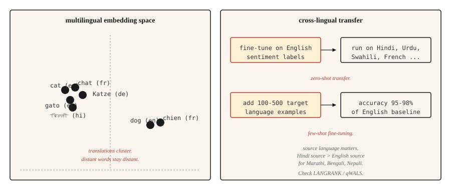

# 多语言自然语言处理（NLP）

> 一个模型支持 100+ 种语言，其中大多数语言都没有训练数据。跨语言迁移（cross-lingual transfer）是 2020 年代 NLP 实践中的一大奇迹。

**Type:** Learn
**Languages:** Python
**Prerequisites:** 阶段 5 · 04（GloVe、FastText 与子词嵌入），阶段 5 · 11（机器翻译）
**Time:** ~45 分钟

## 要解决的问题

英语有数十亿条带标签样本，乌尔都语只有数千条，迈蒂利语则几乎没有。任何面向全球用户的实用 NLP 系统，都必须能处理那些缺乏特定任务训练数据的长尾语言。

多语言模型的解决办法，是让一个模型同时学习多种语言。共享表示使模型能够把在高资源语言（high-resource languages）上学到的能力，迁移到低资源语言（low-resource languages）上。在英语情感分析（sentiment analysis）任务上对模型进行微调（fine-tuning）后，它就能直接对乌尔都语文本作出情感预测，效果好得出乎意料。这就是零样本跨语言迁移（zero-shot cross-lingual transfer），它重塑了 NLP 服务全球用户的方式。

本课将介绍其中的权衡、代表性模型，以及一个让多语言领域新手团队频频受挫的决策：选择哪种语言作为迁移的源语言。

## 核心概念



**共享词表（shared vocabulary）。** 多语言模型使用基于 SentencePiece（分词库）或 WordPiece（子词分词算法）的分词器（tokenizer），并用所有目标语言的文本训练它。各语言共享词表：在有亲缘关系的语言中，同一个子词（subword）单位表示相同的语素（morpheme）。英语和意大利语中的 `anti-` 会对应同一个 token（词元）。

**共享表示（shared representation）。** 在多种语言上通过掩码语言建模（masked language modeling）进行预训练的 Transformer，会学到这样的关系：不同语言中语义相近的句子会产生相近的隐藏状态（hidden states）。mBERT、XLM-R 和 NLLB 都表现出这一特征。英语 "cat" 的嵌入（embedding）会聚集在法语 "chat" 和西班牙语 "gato" 的嵌入附近，整句嵌入也有类似现象。

**零样本迁移（zero-shot transfer）。** 使用一种语言（通常是英语）的带标签数据微调模型。推理时，把它用于模型支持的任何其他语言，无需目标语言的标签。对于语言类型学上相近的语言，迁移效果较好；对于相距较远的语言，效果则较弱。

**少样本微调（few-shot fine-tuning）。** 加入 100-500 条目标语言的带标签样本，分类任务的准确率就能跃升到英语基线准确率的 95-98%。这是多语言 NLP 中性价比最高的一项改进手段。

## 模型一览

| 模型 | 年份 | 覆盖范围 | 说明 |
|-------|------|----------|-------|
| mBERT | 2018 | 104 种语言 | 在 Wikipedia 上训练。首个实用的多语言 LM（语言模型）。低资源语言表现较弱。 |
| XLM-R | 2019 | 100 种语言 | 在 CommonCrawl 上训练，语料规模远大于 Wikipedia。确立了跨语言任务的基线。Base 为 270M，Large 为 550M，M 表示百万。 |
| XLM-V | 2023 | 100 种语言 | 将 XLM-R 的词表扩展为 1M 个 token，原为 250k，k 表示千。低资源语言表现更好。 |
| mT5 | 2020 | 101 种语言 | 用于多语言生成的 T5 架构。 |
| NLLB-200 | 2022 | 200 种语言 | Meta 的翻译模型，包含 55 种低资源语言。 |
| BLOOM | 2022 | 46 种语言 + 13 种编程语言 | 经过多语言训练的开放大语言模型（LLM），参数量为 176B，B 表示十亿。 |
| Aya-23 | 2024 | 23 种语言 | Cohere 的多语言 LLM。在阿拉伯语、印地语和斯瓦希里语上表现出色。 |

按使用场景选择。分类任务可将 XLM-R-base 作为稳妥的默认选择。生成任务则要区分翻译与开放式生成，再从 mT5 或 NLLB 中选择。LLM 类任务可选用 Aya-23 或 Claude，并配合明确的多语言提示词（prompt）。

## 如何选择源语言（2026 年研究）

大多数团队默认使用英语作为微调的源语言。近期研究（2026 年）表明，这往往不是正确选择。

与单纯看语料库规模相比，语言相似度更能预测迁移效果。目标为斯拉夫语族语言时，德语或俄语往往胜过英语；目标为印度-雅利安语支语言时，印地语往往胜过英语。**qWALS** 相似度指标（2026 年，基于 World Atlas of Language Structures，即《世界语言结构地图集》的特征）对此进行了量化。**LANGRANK**（Lin 等，ACL 2019）则是另一种更早的方法，它综合语言相似度、语料库规模和语言谱系上的亲缘关系，对候选源语言进行排序。

实用原则：如果目标语言有一种在语言类型学上相近的高资源亲缘语言，就先尝试用这种语言微调，再与英语微调的结果比较。

```figure
n5-crosslingual-bridge
```

## 动手实现

### 第 1 步：零样本跨语言分类

```python
from transformers import AutoTokenizer, AutoModelForSequenceClassification
import torch

tok = AutoTokenizer.from_pretrained("joeddav/xlm-roberta-large-xnli")
model = AutoModelForSequenceClassification.from_pretrained("joeddav/xlm-roberta-large-xnli")


def classify(text, candidate_labels, hypothesis_template="This text is about {}."):
    scores = {}
    for label in candidate_labels:
        hypothesis = hypothesis_template.format(label)
        inputs = tok(text, hypothesis, return_tensors="pt", truncation=True)
        with torch.no_grad():
            logits = model(**inputs).logits[0]
        entail_score = torch.softmax(logits, dim=-1)[2].item()
        scores[label] = entail_score
    return dict(sorted(scores.items(), key=lambda x: -x[1]))


print(classify("I love this product!", ["positive", "negative", "neutral"]))
print(classify("मुझे यह उत्पाद पसंद है!", ["positive", "negative", "neutral"]))
print(classify("J'adore ce produit !", ["positive", "negative", "neutral"]))
```

一个模型，三种语言，同一个 API（应用程序编程接口）。在自然语言推断（NLI）数据上训练的 XLM-R，借助判断蕴含关系（entailment）的技巧，能够很好地迁移到分类任务。

### 第 2 步：多语言嵌入空间

```python
from sentence_transformers import SentenceTransformer
import numpy as np

model = SentenceTransformer("sentence-transformers/paraphrase-multilingual-MiniLM-L12-v2")

pairs = [
    ("The cat is sleeping.", "Le chat dort."),
    ("The cat is sleeping.", "El gato está durmiendo."),
    ("The cat is sleeping.", "Die Katze schläft."),
    ("The cat is sleeping.", "The dog is barking."),
]

for eng, other in pairs:
    emb_eng = model.encode([eng], normalize_embeddings=True)[0]
    emb_other = model.encode([other], normalize_embeddings=True)[0]
    sim = float(np.dot(emb_eng, emb_other))
    print(f"  {eng!r} <-> {other!r}: cos={sim:.3f}")
```

互为译文的句子在嵌入空间中彼此靠近，而内容不同的英语句子离得更远。这使跨语言检索、聚类和相似度计算成为可能。

### 第 3 步：少样本微调策略

```python
from transformers import TrainingArguments, Trainer
from datasets import Dataset


def few_shot_finetune(base_model, base_tokenizer, examples):
    ds = Dataset.from_list(examples)

    def tokenize_fn(ex):
        out = base_tokenizer(ex["text"], truncation=True, max_length=128)
        out["labels"] = ex["label"]
        return out

    ds = ds.map(tokenize_fn)
    args = TrainingArguments(
        output_dir="out",
        per_device_train_batch_size=8,
        num_train_epochs=5,
        learning_rate=2e-5,
        save_strategy="no",
    )
    trainer = Trainer(model=base_model, args=args, train_dataset=ds)
    trainer.train()
    return base_model
```

对于 100-500 条目标语言样本，`num_train_epochs=5` 和 `learning_rate=2e-5` 是稳妥的默认设置。更高的学习率（learning rate）会破坏多语言对齐，使模型最终只能处理英语。

## 真正有效的评估

- **在留出集上分别计算各语言的准确率。** 不要只看汇总结果，否则会掩盖长尾语言的问题。
- **与单语言基线比较。** 对于数据充足的语言，从零训练的单语言模型有时能胜过多语言模型。要实际测试。
- **实体级测试。** 测试目标语言中的命名实体。对于与拉丁文字差异较大的文字系统，多语言模型的分词能力往往较弱。
- **跨语言一致性。** 用两种语言表达相同含义，理应得到相同预测。要测量两者的差距。

## 实际使用

2026 年的技术选型：

| 任务 | 推荐选择 |
|-----|-------------|
| 覆盖 100 种语言的分类 | 微调后的 XLM-R-base（~270M） |
| 零样本文本分类 | `joeddav/xlm-roberta-large-xnli` |
| 多语言句子嵌入 | `sentence-transformers/paraphrase-multilingual-MiniLM-L12-v2` |
| 覆盖 200 种语言的翻译 | `facebook/nllb-200-distilled-600M`（见第 11 课） |
| 多语言生成 | Claude、GPT-4、Aya-23、mT5-XXL |
| 低资源语言 NLP | XLM-V，或使用相关高资源语言开展针对特定领域的微调 |

如果重视性能，就应始终为目标语言微调预留预算。零样本只是起点，而不是最终方案。

### 分词的隐性代价：低资源语言会遇到什么问题

多语言模型的所有语言共用一个分词器。用于训练词表的语料库以英语、法语、西班牙语、中文和德语为主。对于不在这些主导语言之列的语言，三种代价会在不知不觉中叠加：

- **平均每词 token 数偏高的代价（fertility tax）。** 低资源语言文本中，每个词分出的 token 数远多于英语。一个印地语句子所需的 token 数，可能是同义英语句子的 3-5x（三到五倍）。这 3-5x 的开销会挤占上下文窗口、降低训练效率并增加延迟。
- **识别变体的代价（variant recovery tax）。** 每个拼写错误、附加符号变体、Unicode 规范化不一致或大小写变体，都会在嵌入空间中变成需要从头学习、彼此无关的序列。母语使用者觉得显而易见的拼写对应关系，模型却学不到。
- **模型容量被挤占的代价（capacity spillover tax）。** 上述第 1 和第 2 项代价会消耗上下文位置、网络层深度和嵌入维度。因此，同一个模型留给这些语言进行实际推理的容量，系统性地少于留给高资源语言的容量。

实际症状是：模型在印地语上训练正常，损失曲线看起来没问题，评估困惑度（perplexity）也合理，但生产环境中的输出却暗藏错误。词形变化在句子中途就乱了，罕见的屈折形式仍然无法恢复。**分词器出了问题，单靠扩大数据规模无法补救。**

缓解办法：选择能良好覆盖目标语言的分词器，XLM-V 的 1M 个 token 词表就是一种直接的解决办法；训练前，在留出的目标语言文本上检查平均每词 token 数（fertility）；对于真正处于长尾的文字系统，使用字节级回退（byte-level fallback），例如 SentencePiece 的 `byte_fallback=True` 或 GPT-2 风格的字节级 BPE（字节对编码），以避免出现词表外（OOV，out-of-vocabulary）内容。

## 交付成果

保存为 `outputs/skill-multilingual-picker.md`：

```markdown
---
name: multilingual-picker
description: Pick source language, target model, and evaluation plan for a multilingual NLP task.
version: 1.0.0
phase: 5
lesson: 18
tags: [nlp, multilingual, cross-lingual]
---

Given requirements (target languages, task type, available labeled data per language), output:

1. Source language for fine-tuning. Default English; check LANGRANK or qWALS if target language has a typologically close high-resource language.
2. Base model. XLM-R (classification), mT5 (generation), NLLB (translation), Aya-23 (generative LLM).
3. Few-shot budget. Start with 100-500 target-language examples if available. Zero-shot only if labeling is infeasible.
4. Evaluation plan. Per-language accuracy (not aggregate), cross-lingual consistency, entity-level F1 on non-Latin scripts.

Refuse to ship a multilingual model without per-language evaluation — aggregate metrics hide long-tail failures. Flag scripts with low tokenization coverage (Amharic, Tigrinya, many African languages) as needing a model with byte-fallback (SentencePiece with byte_fallback=True, or byte-level tokenizer like GPT-2).
```

## 练习

1. **简单。** 针对英语、法语、印地语和阿拉伯语，每种语言选取 10 个句子运行零样本分类管线，并分别报告准确率。你应该会看到：法语表现出色，印地语尚可，阿拉伯语则不太稳定。
2. **中等。** 使用 `paraphrase-multilingual-MiniLM-L12-v2`，为一个小型混合语言语料库构建跨语言检索器。用英语查询，检索任意语言的文档，并测量 recall@5（前五项召回率）。
3. **困难。** 针对一个印地语分类任务，比较以英语和印地语为源语言进行微调的效果。两种设置下都使用 500 条目标语言样本进行少样本微调。报告哪种源语言得到的印地语准确率更高，以及高出多少。这是对 LANGRANK 核心主张的一次小规模检验。

## 关键术语

| 术语 | 常见说法 | 实际含义 |
|------|-----------------|-----------------------|
| 多语言模型 | 一个模型，多种语言 | 各语言共享词表和参数。 |
| 跨语言迁移 | 在一种语言上训练，在另一种语言上运行 | 在源语言上微调，在没有目标语言标签的情况下在目标语言上评估。 |
| 零样本（Zero-shot） | 没有目标语言标签 | 不在目标语言上微调就进行迁移。 |
| 少样本（Few-shot） | 少量目标语言标签 | 用于微调的 100-500 条目标语言样本。 |
| mBERT | 首个多语言 LM | 在 Wikipedia 上预训练、支持 104 种语言的 BERT。 |
| XLM-R | 标准的跨语言基线 | 在 CommonCrawl 上预训练、支持 100 种语言的 RoBERTa。 |
| NLLB | Meta 的 200 种语言机器翻译（MT）模型 | No Language Left Behind。包含 55 种低资源语言。 |

## 延伸阅读

- [Conneau et al. (2019). Unsupervised Cross-lingual Representation Learning at Scale](https://arxiv.org/abs/1911.02116)：XLM-R 论文。
- [Pires, Schlinger, Garrette (2019). How Multilingual is Multilingual BERT?](https://arxiv.org/abs/1906.01502)：开启跨语言迁移研究方向的分析论文。
- [Costa-jussà et al. (2022). No Language Left Behind](https://arxiv.org/abs/2207.04672)：NLLB-200 论文。
- [Üstün et al. (2024). Aya Model: An Instruction Finetuned Open-Access Multilingual Language Model](https://arxiv.org/abs/2402.07827)：Aya，Cohere 的多语言 LLM。
- [Language Similarity Predicts Cross-Lingual Transfer Learning Performance (2026)](https://www.mdpi.com/2504-4990/8/3/65)：讨论 qWALS / LANGRANK 与源语言选择的论文。
