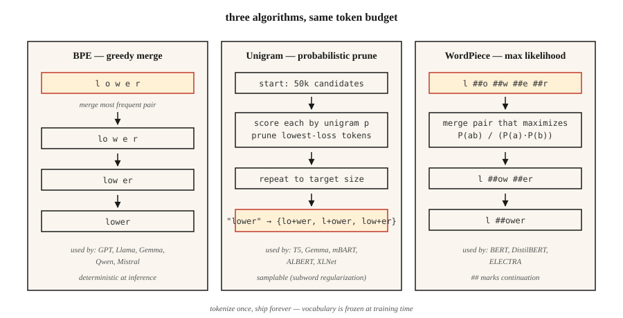

# 子词分词 — BPE、WordPiece、Unigram、SentencePiece

> 按词分词的分词器（tokenizer）遇到未见词就会卡壳。按字符分词又会让序列长度急剧膨胀。子词分词（subword tokenization）在两者之间取得折中。每个现代大语言模型（LLM）都依靠它投入使用。

**Type:** Learn
**Languages:** Python
**Prerequisites:** 阶段 5 · 01（文本处理）、阶段 5 · 04（GloVe / FastText / 子词）
**Time:** ~60 分钟

## 要解决的问题

你的词表有 50,000 个词。用户输入了 "untokenizable"，分词器却返回 `[UNK]`。模型于是得不到关于这个词的任何信号。更糟的是：语料库中处于第 90 百分位的文档含有 40 个罕见词，这意味着每篇文档丢失了 40 bits 的信息。

子词分词解决了这个问题。常见词仍然是单个 token（词元）。罕见词则拆成有意义的片段：`untokenizable` → `un`、`token`、`izable`。训练数据能覆盖一切，因为任何字符串归根结底都是字节序列。

2026 年的每个前沿 LLM 都采用三种算法之一：BPE（字节对编码）、Unigram（基于概率的子词分词算法）、WordPiece（子词分词算法），并由三个库之一封装：tiktoken、SentencePiece（分词库）、HF Tokenizers。不从中选一种，就无法交付语言模型。

## 核心概念



**BPE（字节对编码）。** 从字符级词表开始。统计每个相邻符号对的出现次数。将最频繁的一对合并为一个新 token。反复执行，直到达到目标词表大小。它是主流算法：GPT-2/3/4、Llama、Gemma、Qwen2、Mistral 都采用它。

**字节级 BPE。** 算法相同，但处理的是原始字节（256 个基础 token），而非 Unicode 字符。它保证零 `[UNK]` token：任何字节序列都能编码。GPT-2 使用 50,257 个 token（256 个字节 + 50,000 次合并 + 1 个特殊 token）。

**Unigram。** 从一个庞大的词表开始。为每个 token 分配一个一元概率。迭代剪除那些移除后使语料库对数似然增加最少的 token。推理时采用概率方式：可以对分词结果进行采样（可通过子词正则化进行数据增强）。T5、mBART、ALBERT、XLNet、Gemma 使用这种算法。

**WordPiece。** 合并能使训练语料似然最大化的符号对，而不是只看原始频次。BERT、DistilBERT、ELECTRA 使用这种算法。

**SentencePiece 与 tiktoken。** SentencePiece 是直接在原始 Unicode 文本上 *训练* 词表（BPE 或 Unigram）的库，将空白字符编码为 `▁`。tiktoken 是 OpenAI 面向预先构建词表提供的快速 *编码器* 而非训练工具。

经验法则：

- **训练新词表：** SentencePiece（多语言，无需预分词）或 HF Tokenizers。
- **使用 GPT 词表快速推理：** tiktoken（cl100k_base、o200k_base）。
- **两者兼顾：** HF Tokenizers，一个库同时支持训练 + 服务。

```figure
bpe-merge
```

## 动手实现

### 第 1 步：从零实现 BPE

参见 `code/main.py`。循环如下：

```python
def train_bpe(corpus, num_merges):
    vocab = {tuple(word) + ("</w>",): count for word, count in corpus.items()}
    merges = []
    for _ in range(num_merges):
        pairs = Counter()
        for symbols, freq in vocab.items():
            for a, b in zip(symbols, symbols[1:]):
                pairs[(a, b)] += freq
        if not pairs:
            break
        best = pairs.most_common(1)[0][0]
        merges.append(best)
        vocab = apply_merge(vocab, best)
    return merges
```

算法体现了三个事实。`</w>` 标记词尾，使 "low"（后缀）与 "lower"（前缀）保持区别。频率加权让高频符号对更早胜出。合并列表是有序的：推理时按照训练顺序应用合并。

### 第 2 步：用学到的合并规则编码

```python
def encode_bpe(word, merges):
    symbols = list(word) + ["</w>"]
    for a, b in merges:
        i = 0
        while i < len(symbols) - 1:
            if symbols[i] == a and symbols[i + 1] == b:
                symbols = symbols[:i] + [a + b] + symbols[i + 2:]
            else:
                i += 1
    return symbols
```

朴素实现的复杂度为 O(n·|merges|)。生产实现（tiktoken、HF Tokenizers）使用合并排名查找配合优先队列，运行时间接近线性。

### 第 3 步：SentencePiece 实践

```python
import sentencepiece as spm

spm.SentencePieceTrainer.train(
    input="corpus.txt",
    model_prefix="my_tokenizer",
    vocab_size=8000,
    model_type="bpe",          # or "unigram"
    character_coverage=0.9995, # lower for CJK (e.g. 0.9995 for English, 0.995 for Japanese)
    normalization_rule_name="nmt_nfkc",
)

sp = spm.SentencePieceProcessor(model_file="my_tokenizer.model")
print(sp.encode("untokenizable", out_type=str))
# ['▁un', 'token', 'izable']
```

注意：无需预分词，空格被编码为 `▁`；`character_coverage` 控制保留罕见字符与将其映射为 `<unk>` 之间的取舍力度。

### 第 4 步：用 tiktoken 处理兼容 OpenAI 的词表

```python
import tiktoken
enc = tiktoken.get_encoding("o200k_base")
print(enc.encode("untokenizable"))        # [127340, 101028]
print(len(enc.encode("Hello, world!")))   # 4
```

只做编码。速度快（Rust 后端）。与 GPT-4/5 的分词完全一致，可用于字节计数、成本估算和上下文窗口预算规划。

## 2026 年仍会带入生产的问题

- **分词器漂移。** 用词表 A 训练，却用词表 B 部署。token ID 不同，模型就会输出乱码。在 CI 中检查 `tokenizer.json` 的哈希。
- **空白字符歧义。** BPE 对 "hello" 与 " hello" 会生成不同的 token。始终显式指定 `add_special_tokens` 和 `add_prefix_space`。
- **多语言训练不足。** 以英语为主的语料会产生这样的词表：非拉丁文字被拆成的 token 数多达 5-10x（倍）。在 GPT-3.5 上，相同提示词（prompt）用日语/阿拉伯语表达，成本会达到 5-10x（倍）。o200k_base 部分解决了这个问题。
- **表情符号拆分。** 单个表情符号可能占用 5 个 token。规划上下文预算时，要把表情符号的处理作为检查项。

## 实际使用

2026 年的技术栈：

| 场景 | 选择 |
|-----------|------|
| 从零训练单语言模型 | HF Tokenizers（BPE） |
| 训练多语言模型 | SentencePiece（Unigram，`character_coverage=0.9995`） |
| 提供兼容 OpenAI 的 API（应用程序编程接口） | tiktoken（GPT-4+ 使用 `o200k_base`） |
| 领域专用词表（代码、数学、蛋白质） | 在领域语料上训练自定义 BPE，再与基础词表合并 |
| 边缘推理、小模型 | Unigram（较小的词表效果更好） |

词表大小是一项规模化决策，而不是常量。粗略经验是：参数量 <1B 时用 32k；参数量为 1-10B 时用 50-100k；多语言/前沿模型用 200k+（k 表示千，B 表示十亿）。

## 交付成果

保存为 `outputs/skill-bpe-vs-wordpiece.md`：

```markdown
---
name: tokenizer-picker
description: Pick tokenizer algorithm, vocab size, library for a given corpus and deployment target.
version: 1.0.0
phase: 5
lesson: 19
tags: [nlp, tokenization]
---

Given a corpus (size, languages, domain) and deployment target (training from scratch / fine-tuning / API-compatible inference), output:

1. Algorithm. BPE, Unigram, or WordPiece. One-sentence reason.
2. Library. SentencePiece, HF Tokenizers, or tiktoken. Reason.
3. Vocab size. Rounded to nearest 1k. Reason tied to model size and language coverage.
4. Coverage settings. `character_coverage`, `byte_fallback`, special-token list.
5. Validation plan. Average tokens-per-word on held-out set, OOV rate, compression ratio, round-trip decode equality.

Refuse to train a character-coverage <0.995 tokenizer on corpora with rare-script content. Refuse to ship a vocab without a frozen `tokenizer.json` hash check in CI. Flag any monolingual tokenizer under 16k vocab as likely under-spec.
```

## 练习

1. **简单。** 在 `code/main.py` 的微型语料上训练进行 500 次合并的 BPE。对三个留出词编码。有多少个恰好生成 1 个 token，又有多少个生成 >1 个 token？
2. **中等。** 用 100 个英文 Wikipedia 句子，对比 `cl100k_base`、`o200k_base` 以及你用 vocab=32k 训练的 SentencePiece BPE 的 token 数。报告各自的压缩率。
3. **困难。** 用 BPE、Unigram 和 WordPiece 分别在同一语料上训练。将它们分别用于一个小型情感分类器，测量下游准确率。算法选择带来的 F1 变化是否超过 1 点？

## 关键术语

| 术语 | 人们怎么说 | 实际含义 |
|------|-----------------|-----------------------|
| BPE | 字节对编码 | 贪心合并最频繁的字符对，直到达到目标词表大小。 |
| 字节级 BPE | 永远没有未知 token | 在原始 256 个字节上进行 BPE；GPT-2 / Llama 使用这种方法。 |
| Unigram | 概率分词器 | 利用对数似然从庞大的候选集合中剪枝；T5、Gemma 使用这种算法。 |
| SentencePiece | 处理空白字符的那个 | 在原始文本上训练 BPE/Unigram 的库；空格编码为 `▁`。 |
| tiktoken | 速度快的那个 | OpenAI 基于 Rust 的 BPE 编码器，使用预先构建的词表。不提供训练功能。 |
| 合并列表 | 神奇的数字 | `(a, b) → ab` 合并操作的有序列表；推理时依序应用。 |
| 字符覆盖率 | 多罕见才算过于罕见？ | 分词器必须覆盖的训练语料字符比例；典型值为 ~0.9995。 |

## 延伸阅读

- [Sennrich, Haddow, Birch (2015). Neural Machine Translation of Rare Words with Subword Units](https://arxiv.org/abs/1508.07909) — BPE 论文。
- [Kudo (2018). Subword Regularization with Unigram Language Model](https://arxiv.org/abs/1804.10959) — Unigram 论文。
- [Kudo, Richardson (2018). SentencePiece: A simple and language independent subword tokenizer](https://arxiv.org/abs/1808.06226) — 关于该库的论文。
- [Hugging Face — Summary of the tokenizers](https://huggingface.co/docs/transformers/tokenizer_summary) — 简明参考。
- [OpenAI tiktoken 仓库](https://github.com/openai/tiktoken) — 实用示例 + 编码列表。
