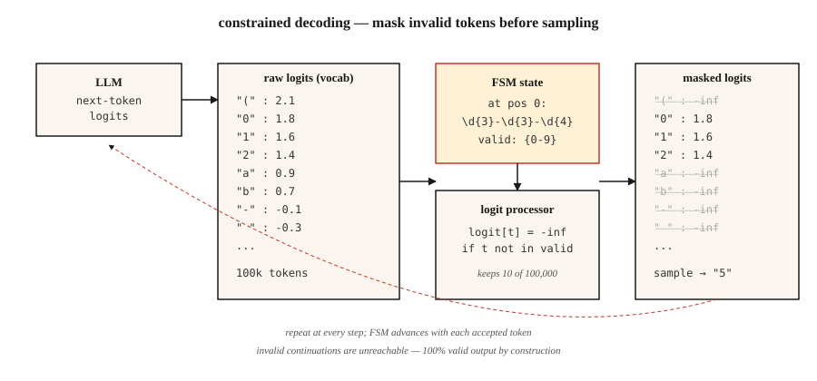

# 结构化输出与约束解码

> 向大语言模型（LLM）索要 JSON，大多数时候能得到 JSON。但在生产环境中，“大多数”就是问题所在。约束解码（constrained decoding）在采样前修改 logits（未经归一化的分数），把“大多数时候”变成“始终”。

**Type:** Build
**Languages:** Python
**Prerequisites:** 阶段 5 · 17（聊天机器人）、阶段 5 · 19（子词分词）
**Time:** ~60 分钟

## 要解决的问题

一个分类器向 LLM 发送提示词（prompt）：“返回 {positive, negative, neutral} 中的一项。”模型却返回：“情感为 positive，这条评论的评价极其正面，因为顾客明确表示他们……”你的解析器崩溃了，分类器的 F1 分数变成了 0.0。

自由形式的生成只是建议，算不上契约。生产系统需要契约。

在 2026 年，有三个层次的做法。

1. **提示词。** 好好提出要求：“只返回 JSON 对象。”在前沿模型上有 ~80% 的情况奏效，在较小模型上比例更低。
2. **原生结构化输出 API（应用程序编程接口）。** OpenAI `response_format`、Anthropic 工具调用、Gemini JSON 模式。对受支持的 schema（结构定义）可靠，但会绑定厂商。
3. **约束解码。** 在每个生成步骤修改 logits，使模型*无法*输出无效的 token（词元）。从构造上保证 100% 有效，适用于任何本地模型。

本课会帮助你直观理解这三种做法，并说明何时该选哪一种。

## 核心概念



**约束解码如何工作。** 在每个生成步骤，LLM 都会输出覆盖完整词表（~100k 个 token）的 logits 向量。*logits 处理器（logit processor）*位于模型与采样器之间。它根据当前在目标文法中的位置，计算哪些 token 有效；目标文法可以是 JSON Schema、正则表达式（regex）或上下文无关文法（context-free grammar，CFG）。接着，它将所有无效 token 的 logits 设为负无穷。对剩余 logits 做 softmax 后，概率质量只会分配给有效的后续内容。

2026 年的实现方案：

- **Outlines。** 将 JSON Schema 或正则表达式编译成有限状态机（finite-state machine，FSM）。每个 token 都能以 O(1) 的复杂度查询其是否为有效的下一个 token。由于基于 FSM，递归 schema 需要展平。
- **XGrammar / llguidance。** 上下文无关文法引擎，支持递归 JSON Schema，解码开销接近零。OpenAI 在其 2025 年的结构化输出实现中注明采用了 llguidance。
- **vLLM 引导解码（guided decoding）。** 通过 Outlines、XGrammar 或 lm-format-enforcer 后端，内置支持 `guided_json`、`guided_regex`、`guided_choice`、`guided_grammar`。
- **Instructor。** 基于 Pydantic、可用于任意 LLM 的封装层。校验失败时会重试。它支持跨提供商使用，但不修改 logits，而是依赖重试和针对结构化输出设计的提示词。

### 反直觉的结果

约束解码通常比无约束生成*更快*，原因有两个。首先，它缩小了下一个 token 的搜索空间。其次，巧妙的实现会完全跳过必然出现的 token 的生成过程，例如 `{"name": "` 这样的固定结构片段，其中每个字节都已确定。

### 代价高昂的陷阱

字段顺序很重要。如果把 `answer` 放在 `reasoning` 前面，模型就会在思考之前先确定答案。JSON 是有效的，答案却是错的。任何校验都发现不了这个问题。

```json
// BAD
{"answer": "yes", "reasoning": "because ..."}

// GOOD
{"reasoning": "... therefore ...", "answer": "yes"}
```

schema 的字段顺序关乎逻辑，不是排版问题。

```figure
constrained-decoder
```

## 动手实现

### 第 1 步：从零实现正则表达式约束的生成

独立的 FSM 实现见 `code/main.py`。核心思路浓缩在以下 30 行中：

```python
def mask_logits(logits, valid_token_ids):
    mask = [float("-inf")] * len(logits)
    for tid in valid_token_ids:
        mask[tid] = logits[tid]
    return mask


def generate_constrained(model, tokenizer, prompt, fsm):
    ids = tokenizer.encode(prompt)
    state = fsm.initial_state
    while not fsm.is_accept(state):
        logits = model.next_token_logits(ids)
        valid = fsm.valid_tokens(state, tokenizer)
        logits = mask_logits(logits, valid)
        tok = sample(logits)
        ids.append(tok)
        state = fsm.transition(state, tok)
    return tokenizer.decode(ids)
```

FSM 跟踪当前已经满足了文法的哪些部分。`valid_tokens(state, tokenizer)` 计算词表中的哪些 token 能推动 FSM 前进，同时仍然保留通向接受状态的路径。

### 第 2 步：用 Outlines 处理 JSON Schema

```python
from pydantic import BaseModel
from typing import Literal
import outlines


class Review(BaseModel):
    sentiment: Literal["positive", "negative", "neutral"]
    confidence: float
    evidence_span: str


model = outlines.models.transformers("meta-llama/Llama-3.2-3B-Instruct")
generator = outlines.generate.json(model, Review)

result = generator("Classify: 'The wait staff was attentive and the food arrived hot.'")
print(result)
# Review(sentiment='positive', confidence=0.93, evidence_span='attentive ... hot')
```

校验错误为零，永远如此。FSM 使无效输出不可能出现。

### 第 3 步：用 Instructor 实现不依赖特定提供商的 Pydantic 工作流

```python
import instructor
from anthropic import Anthropic
from pydantic import BaseModel, Field


class Invoice(BaseModel):
    vendor: str
    total_usd: float = Field(ge=0)
    line_items: list[str]


client = instructor.from_anthropic(Anthropic())
invoice = client.messages.create(
    model="claude-opus-4-7",
    max_tokens=1024,
    response_model=Invoice,
    messages=[{"role": "user", "content": "Extract from: 'Acme Corp $420. Widget, Gizmo.'"}],
)
```

这是另一种机制。Instructor 不动 logits，而是将 schema 编排进提示词，解析输出，并在校验失败时重试（默认 3 次）。它适用于任何提供商。重试会增加延迟和成本；可跨提供商迁移是它的卖点。

### 第 4 步：厂商原生 API

```python
from openai import OpenAI

client = OpenAI()
response = client.responses.create(
    model="gpt-5",
    input=[{"role": "user", "content": "Classify: 'The food was cold.'"}],
    text={"format": {"type": "json_schema", "name": "sentiment",
          "schema": {"type": "object", "required": ["sentiment"],
                     "properties": {"sentiment": {"type": "string",
                                                  "enum": ["positive", "negative", "neutral"]}}}}},
)
print(response.output_parsed)
```

这是在服务端进行的约束解码。对于受支持的 schema，它的可靠性与 Outlines 相当。不用管理本地模型，但会绑定到该厂商。

## 常见陷阱

- **递归 schema。** Outlines 会将递归展平到固定深度。树形输出，例如嵌套评论和抽象语法树（AST），需要 XGrammar 或 llguidance（基于 CFG）。
- **庞大的枚举。** 包含 10,000 个选项的枚举编译缓慢，甚至会超时。改用检索器：先预测 top-k 个候选项，再将输出限制在这些候选项中。
- **文法过于严格。** 强制使用 `date: "YYYY-MM-DD"` 正则表达式，会让模型无法在日期缺失时输出 `"unknown"`。模型会编造一个日期来应付。应允许 `null` 或哨兵值。
- **过早确定答案。** 参见上文的字段顺序陷阱。始终把推理过程放在前面。
- **不带 schema 的厂商 JSON 模式。** 纯 JSON 模式只保证 JSON 有效，不保证它*适合你的用例*。始终提供完整的 schema。

## 实际使用

2026 年的技术栈：

| 场景 | 选择 |
|-----------|------|
| OpenAI/Anthropic/Google 模型，简单 schema | 厂商原生结构化输出 |
| 任意提供商，Pydantic 工作流，可接受重试 | Instructor |
| 本地模型，需要 100% 有效性，扁平 schema | Outlines（FSM） |
| 本地模型，递归 schema | XGrammar 或 llguidance |
| 自托管推理服务器 | vLLM 引导解码 |
| 可接受重试的批量处理 | Instructor + 最便宜的模型 |

## 交付成果

保存为 `outputs/skill-structured-output-picker.md`：

```markdown
---
name: structured-output-picker
description: Choose a structured output approach, schema design, and validation plan.
version: 1.0.0
phase: 5
lesson: 20
tags: [nlp, llm, structured-output]
---

Given a use case (provider, latency budget, schema complexity, failure tolerance), output:

1. Mechanism. Native vendor structured output, Instructor retries, Outlines FSM, or XGrammar CFG. One-sentence reason.
2. Schema design. Field order (reasoning first, answer last), nullable fields for "unknown", enum vs regex, required fields.
3. Failure strategy. Max retries, fallback model, graceful `null` handling, out-of-distribution refusal.
4. Validation plan. Schema compliance rate (target 100%), semantic validity (LLM-judge), field-coverage rate, latency p50/p99.

Refuse any design that puts `answer` or `decision` before reasoning fields. Refuse to use bare JSON mode without a schema. Flag recursive schemas behind an FSM-only library.
```

## 练习

1. **简单。** 向一个小型开放权重模型（例如 Llama-3.2-3B）发出提示，要求它输出 `Review(sentiment, confidence, evidence_span)`，不使用约束解码。对 100 条评论测试，统计输出能解析为有效 JSON 的比例。
2. **中等。** 在同一语料上使用 Outlines JSON 模式，比较约束符合率、延迟和语义准确率。
3. **困难。** 从零实现一个用于电话号码（`\d{3}-\d{3}-\d{4}`）的正则表达式约束解码器。在 1000 个样本上验证无效输出数为 0。

## 关键术语

| 术语 | 常见说法 | 实际含义 |
|------|-----------------|-----------------------|
| 约束解码 | 强制输出有效内容 | 在每个生成步骤屏蔽无效 token 的 logits。 |
| logits 处理器 | 起约束作用的东西 | 函数：`(logits, state) -> masked_logits`。 |
| FSM | 有限状态机 | 编译后的文法表示；以 O(1) 的复杂度查询有效的下一个 token。 |
| CFG | 上下文无关文法 | 能处理递归的文法；比 FSM 慢，但表达能力更强。 |
| schema 字段顺序 | 有关系吗？ | 有，首个字段就会让模型作出决定；始终先放推理过程，再放答案。 |
| 引导解码 | vLLM 对它的称呼 | 同一概念，集成在推理服务器中。 |
| JSON 模式 | OpenAI 早期的版本 | 保证 JSON 语法正确；不保证符合 schema。 |

## 延伸阅读

- [Willard, Louf (2023). Efficient Guided Generation for LLMs](https://arxiv.org/abs/2307.09702)——Outlines 论文。
- [XGrammar 论文（2024）](https://arxiv.org/abs/2411.15100)——基于 CFG 的快速约束解码。
- [vLLM — Structured Outputs](https://docs.vllm.ai/en/latest/features/structured_outputs.html)——与推理服务器的集成。
- [OpenAI — Structured Outputs guide](https://platform.openai.com/docs/guides/structured-outputs)——API 参考及注意事项。
- [Instructor 库](https://python.useinstructor.com/)——跨提供商的 Pydantic 封装与重试。
- [JSONSchemaBench (2025)](https://arxiv.org/abs/2501.10868)——对 6 个约束解码框架的基准测试。
