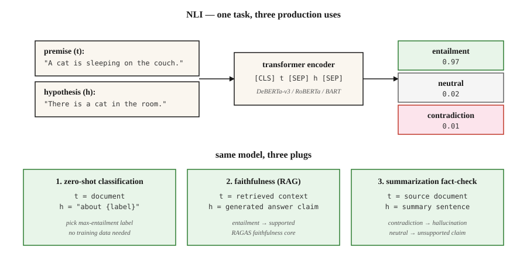

# 自然语言推断——文本蕴含

> “t 蕴含 h”表示人读到 t 后，会得出 h 为真的结论。自然语言推断（Natural Language Inference，NLI）的任务是预测蕴含关系 / 矛盾 / 中立。表面上平淡无奇，却是生产系统中的重要支撑。

**Type:** Learn
**Languages:** Python
**Prerequisites:** 阶段 5 · 05（情感分析），阶段 5 · 13（问答）
**Time:** ~60 分钟

## 要解决的问题

你构建了一个摘要生成器，它生成了一篇摘要。你怎么知道摘要中没有幻觉（hallucination）？

你构建了一个聊天机器人，它回答了“是”。你怎么知道检索到的段落支持这个答案？

你需要按主题对 10,000 篇新闻文章进行分类，却没有训练标签。能复用一个模型吗？

这三个问题都可以归结为自然语言推断。NLI 要问的是：给定前提（premise）`t` 和假设（hypothesis）`h`，`t` 是否蕴含 `h`，是否与它矛盾，或二者是中立关系（互不相关）？

- **幻觉检查：** `t` = 源文档，`h` = 摘要中的断言。不构成蕴含关系 = 幻觉。
- **有依据的问答（QA）：** `t` = 检索到的段落，`h` = 生成的答案。不构成蕴含关系 = 编造。
- **零样本分类（zero-shot classification）：** `t` = 文档，`h` = 用自然语言表述的标签（“This is about sports”，即“这是关于体育的内容”）。蕴含关系 = 预测标签。

一个任务，三种生产用途。这就是每个检索增强生成（RAG）评估框架内部都配有 NLI 模型的原因。

## 核心概念



**三种标签。**

- **蕴含关系（Entailment）。** `t` → `h`。“The cat is on the mat”（猫在垫子上）蕴含“There is a cat.”（有一只猫）。
- **矛盾（Contradiction）。** `t` → ¬`h`。“The cat is on the mat”（猫在垫子上）与“There is no cat.”（没有猫）矛盾。
- **中立（Neutral）。** 既不能推断为真，也不能推断为假。“The cat is on the mat”（猫在垫子上）与“The cat is hungry.”（猫饿了）是中立关系。

**不是逻辑蕴含。** NLI 是*自然*语言推断，关注的是普通读者会作出什么推断，而不是严格逻辑。在 NLI 中，“John walked his dog”（John 遛了他的狗）蕴含“John has a dog”（John 有一只狗），但严格的一阶逻辑只有在你用公理定义了拥有关系后，才会接受这一推断。

**数据集。**

- **SNLI**（2015）。570k 个人工标注的文本对（k 表示千），以图像描述作为前提。领域较窄。
- **MultiNLI**（2017）。433k 个文本对，涵盖 10 种体裁。2026 年的标准训练语料库。
- **ANLI**（2019）。对抗性 NLI。由人工编写专门用于让现有模型出错的样例。难度更高。
- **DocNLI, ConTRoL**（2020–21）。前提达到文档长度。测试多跳和长距离推断。

**架构。** Transformer 编码器（BERT、RoBERTa、DeBERTa）读取 `[CLS] premise [SEP] hypothesis [SEP]`，将 `[CLS]` 表示送入 3 类 softmax。在 MNLI 上训练，在留出的基准测试集上评估，在分布内文本对上获得 90%+ 的准确率。

**借助 NLI 实现零样本分类。** 给定一篇文档和候选标签，将每个标签转换成假设（“This text is about sports”，即“这段文本是关于体育的”），计算各自的蕴含概率，选择概率最大的标签。这就是 Hugging Face 的 `zero-shot-classification` 管线（pipeline）背后的机制。

```figure
nli-router
```

## 动手实现

### 步骤 1：运行预训练 NLI 模型

```python
from transformers import pipeline

nli = pipeline("text-classification",
               model="facebook/bart-large-mnli",
               top_k=None)  # return all labels; replaces deprecated return_all_scores=True

premise = "The cat is sleeping on the couch."
hypothesis = "There is a cat in the room."

result = nli({"text": premise, "text_pair": hypothesis})[0]
print(result)
# [{'label': 'entailment', 'score': 0.97},
#  {'label': 'neutral', 'score': 0.02},
#  {'label': 'contradiction', 'score': 0.01}]
```

对于生产环境中的 NLI，`facebook/bart-large-mnli` 和 `MoritzLaurer/DeBERTa-v3-large-mnli-fever-anli-ling-wanli` 是默认的开放模型选择。DeBERTa-v3 位居排行榜首。

### 步骤 2：零样本分类

```python
zs = pipeline("zero-shot-classification", model="facebook/bart-large-mnli")

text = "The stock market rallied after the central bank cut interest rates."
labels = ["finance", "sports", "politics", "technology"]

result = zs(text, candidate_labels=labels)
print(result)
# {'labels': ['finance', 'politics', 'technology', 'sports'],
#  'scores': [0.92, 0.05, 0.02, 0.01]}
```

默认模板是 “This example is about {label}.”，可以用 `hypothesis_template` 自定义。不需要训练数据，不需要微调（fine-tuning），开箱即用。

### 步骤 3：检查 RAG 的忠实度（faithfulness）

```python
def is_faithful(answer, context, threshold=0.5):
    result = nli({"text": context, "text_pair": answer})[0]
    entail = next(s for s in result if s["label"] == "entailment")
    return entail["score"] > threshold
```

这是 RAGAS 忠实度评估的核心：将生成的答案拆分成原子断言，逐条检查检索到的上下文是否支持它们，再报告构成蕴含关系的断言所占的比例。

### 步骤 4：手写 NLI 分类器（概念示例）

参见 `code/main.py` 中仅使用标准库的玩具示例：通过词汇重叠程度和否定检测来比较前提与假设。它无法与 Transformer 模型竞争，但展示了任务的基本形式：输入两段文本，输出 3 类标签中的一个，损失 = 对 `{entail, contradict, neutral}` 计算的交叉熵（cross-entropy）。

## 常见陷阱

- **只看假设的捷径。** 在 SNLI 上，模型仅凭假设就能以 ~60% 的准确率预测标签，因为 “not”、“nobody”、“never” 与矛盾标签相关。这是检测标签泄漏的有力基线。
- **词汇重叠启发式。** 子序列启发式（“每个子序列都被蕴含”）能通过 SNLI，却在 HANS/ANLI 上失败。应使用对抗性基准。
- **文档长度下的性能下降。** 单句 NLI 模型面对文档长度的前提时，F1 会下降 20+ 个点。对于长上下文，应使用在 DocNLI 上训练的模型。
- **零样本模板敏感度。** 使用 “This example is about {label}”、仅用 “{label}” 或使用 “The topic is {label}”，可能使准确率相差 10+ 个点。要调优模板。
- **领域不匹配。** MNLI 的训练数据是通用英语。法律、医学和科学文本需要特定领域的 NLI 模型（例如 SciNLI、MedNLI）。

## 实际使用

2026 年的技术栈：

| 使用场景 | 模型 |
|---------|-------|
| 通用 NLI | `MoritzLaurer/DeBERTa-v3-large-mnli-fever-anli-ling-wanli` |
| 快速 / 边缘端 | `cross-encoder/nli-deberta-v3-base` |
| 零样本分类（轻量级） | `facebook/bart-large-mnli` |
| 文档级 NLI | `MoritzLaurer/DeBERTa-v3-large-mnli-fever-anli-ling-wanli` |
| 多语言 | `MoritzLaurer/multilingual-MiniLMv2-L6-mnli-xnli` |
| RAG 中的幻觉检测 | RAGAS / DeepEval 内部的 NLI 层 |

2026 年的通用思路是：NLI 就像文本理解领域的万能胶带。每当你需要判断“A 是否支持 B？”或“A 是否与 B 矛盾？”时，先考虑 NLI，再考虑多调用一次大语言模型（LLM）。

## 交付成果

保存为 `outputs/skill-nli-picker.md`：

```markdown
---
name: nli-picker
description: Pick an NLI model, label template, and evaluation setup for a classification / faithfulness / zero-shot task.
version: 1.0.0
phase: 5
lesson: 21
tags: [nlp, nli, zero-shot]
---

Given a use case (faithfulness check, zero-shot classification, document-level inference), output:

1. Model. Named NLI checkpoint. Reason tied to domain, length, language.
2. Template (if zero-shot). Verbalization pattern. Example.
3. Threshold. Entailment cutoff for the decision rule. Reason based on calibration.
4. Evaluation. Accuracy on held-out labeled set, hypothesis-only baseline, adversarial subset.

Refuse to ship zero-shot classification without a 100-example labeled sanity check. Refuse to use a sentence-level NLI model on document-length premises. Flag any claim that NLI solves hallucination — it reduces it; it does not eliminate it.
```

## 练习

1. **简单。** 手工编写 20 个（前提、假设、标签）三元组，覆盖全部三类，在这些样例上运行 `facebook/bart-large-mnli` 并测量准确率。加入针对“子序列启发式”的对抗陷阱（“I did not eat the cake”，即“我没有吃蛋糕”，与“I ate the cake”，即“我吃了蛋糕”），看看模型是否会出错。
2. **中等。** 在 100 条 AG News 新闻标题上，比较零样本模板 `"This text is about {label}"`、`"The topic is {label}"` 和 `"{label}"`，报告准确率的变化幅度。
3. **困难。** 构建 RAG 忠实度检查器：先拆分原子断言，再逐条进行 NLI。用附有金标准上下文的 50 个 RAG 生成答案进行评估，对照人工标签测量假阳性率和假阴性率。

## 关键术语

| 术语 | 常见说法 | 实际含义 |
|------|-----------------|-----------------------|
| NLI | 自然语言推断 | 对前提与假设之间的关系进行 3 分类。 |
| RTE | 文本蕴含识别（Recognizing Textual Entailment） | NLI 的旧称；是同一个任务。 |
| 蕴含关系 | “t 蕴含 h” | 给定 t，普通读者会得出 h 为真的结论。 |
| 矛盾 | “t 排除了 h” | 给定 t，普通读者会得出 h 为假的结论。 |
| 中立 | “尚无法判断” | 无法从 t 推断 h 为真或为假。 |
| 零样本分类 | 将 NLI 用作分类器 | 将标签用自然语言表述为假设，选择蕴含概率最高的标签。 |
| 忠实度 | 答案是否有依据？ | 对（检索到的上下文，生成的答案）进行 NLI。 |

## 延伸阅读

- [Bowman et al. (2015). A large annotated corpus for learning natural language inference](https://arxiv.org/abs/1508.05326) —— SNLI。
- [Williams, Nangia, Bowman (2017). A Broad-Coverage Challenge Corpus for Sentence Understanding through Inference](https://arxiv.org/abs/1704.05426) —— MultiNLI。
- [Nie et al. (2019). Adversarial NLI](https://arxiv.org/abs/1910.14599) —— ANLI 基准。
- [Yin, Hay, Roth (2019). Benchmarking Zero-shot Text Classification](https://arxiv.org/abs/1909.00161) —— 将 NLI 用作分类器。
- [He et al. (2021). DeBERTa: Decoding-enhanced BERT with Disentangled Attention](https://arxiv.org/abs/2006.03654) —— 2026 年 NLI 的主力模型。
