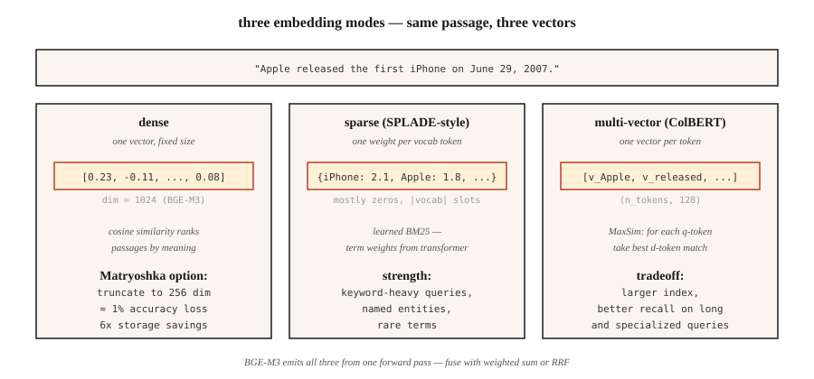

# 嵌入模型：2026 年深度解析

> Word2Vec 为每个词提供一个向量。现代嵌入（embedding）模型为每个文本段落提供一个向量，支持跨语言，并提供稀疏、稠密和多向量视角，维数可按索引需求调整。选错模型，你的检索增强生成（RAG）系统就会检索到错误的内容。

**Type:** Learn
**Languages:** Python
**Prerequisites:** 阶段 5 · 03（Word2Vec），阶段 5 · 14（信息检索）
**Time:** ~60 分钟

## 要解决的问题

你的 RAG 系统有 40% 的时候会检索到错误的文本段落。罪魁祸首很少是向量数据库或提示词（prompt），而是嵌入模型。

在 2026 年选择嵌入模型，需要从五个维度作出取舍：

1. **稠密、稀疏还是多向量。** 每个文本段落一个向量、每个 token（词元）一个向量，或一个稀疏的加权词袋。
2. **语言覆盖范围。** 在纯英语任务上，单语英语模型仍然占优。语料混合多种语言时，多语言模型占优。
3. **上下文长度。** 512 tokens、8,192 或 32,768，而且实际有效容量往往只有宣称上限的 60-70%。
4. **维数预算。** 全精度下的 3,072 个浮点数 = 每个向量 12 KB。存储 100M 个向量时，存储费用为 $1,300/月（M 表示百万）。Matryoshka 截断可将这一开销缩减 4×。
5. **开放权重还是托管。** 开放权重意味着你掌控技术栈和数据。托管意味着你用控制权换取始终最新的模型。

本课说明这些取舍，让你依据证据选择，而不是追逐上个季度的热门模型。

## 核心概念



**稠密嵌入（dense embeddings）。** 每个文本段落一个向量（通常为 384-3,072 维）。余弦相似度按语义接近程度对段落排序。代表有 OpenAI `text-embedding-3-large`、BGE-M3 稠密模式、Voyage-3。这是默认选择。

**稀疏嵌入（sparse embeddings）。** 采用 SPLADE 风格。Transformer 为词表中的每个 token 预测一个权重，然后将其中大部分置零。结果是大小为 |vocab| 的稀疏向量。它像 BM25 一样捕捉词汇匹配信号，但词项权重是学习得到的。在侧重关键词的查询上表现出色。

**多向量（后期交互，late interaction）。** 代表有 ColBERTv2、Jina-ColBERT。每个 token 一个向量。使用 MaxSim 评分：为每个查询 token 找出最相似的文档 token，再将分数相加。存储和评分成本更高，但在长查询和领域专用语料上占优。

**BGE-M3：同时提供三种表示。** 单个模型同时输出稠密、稀疏和多向量表示。每种表示都可独立查询；分数通过加权求和融合。在 2026 年，如果希望一个检查点就能提供灵活性，这是默认选择。

**Matryoshka 表示学习（套娃表示学习）。** 通过训练，使向量的前 N 维本身就能构成有用的独立嵌入。将 1,536 维向量截断到 256 维，以 ~1% 的准确率损失换取 6× 的存储节省。OpenAI text-3、Cohere v4、Voyage-4、Jina v5、Gemini Embedding 2、Nomic v1.5+ 均支持这一方法。

### MTEB 排行榜只反映部分情况

MTEB（Massive Text Embedding Benchmark，大规模文本嵌入基准）在推出时（2022）包含 8 类任务中的 56 项任务，到 MTEB v2 扩展为 100+ 项任务。2026 年初，Gemini Embedding 2 在检索上居首（67.71 MTEB-R）。Cohere embed-v4 在综合表现上领先（65.2 MTEB）。BGE-M3 在开放权重多语言模型中领先（63.0）。排行榜有必要参考，但仅靠它还不够；务必在自己的领域进行基准测试。

### 三层模式

| 使用场景 | 模式 |
|----------|---------|
| 快速首轮检索 | 稠密双编码器（bi-encoder；BGE-M3、text-3-small） |
| 提升召回率 | 稀疏检索（SPLADE、BGE-M3 稀疏模式）+ 倒数排名融合（RRF） |
| 提升 top-50 的精确率 | 多向量（ColBERTv2）或交叉编码器（cross-encoder）重排序器 |

大多数生产技术栈会同时使用这三层。

```figure
gx-matryoshka
```

## 动手实现

### 步骤 1：基线——使用 Sentence-BERT 生成稠密嵌入

```python
from sentence_transformers import SentenceTransformer
import numpy as np

encoder = SentenceTransformer("BAAI/bge-small-en-v1.5")
corpus = [
    "The first iPhone launched in 2007.",
    "Apple released the iPod in 2001.",
    "Android is an operating system from Google.",
]
emb = encoder.encode(corpus, normalize_embeddings=True)

query = "When was the iPhone released?"
q_emb = encoder.encode([query], normalize_embeddings=True)[0]
scores = emb @ q_emb
print(sorted(enumerate(scores), key=lambda x: -x[1]))
```

`normalize_embeddings=True` 使点积等于余弦相似度。始终设置它。

### 步骤 2：Matryoshka 截断

```python
def truncate(vectors, dim):
    out = vectors[:, :dim]
    return out / np.linalg.norm(out, axis=1, keepdims=True)

emb_256 = truncate(emb, 256)
emb_128 = truncate(emb, 128)
```

截断后重新归一化。Nomic v1.5、OpenAI text-3 和 Voyage-4 经过专门训练，使前几个维数层级的截断不会造成损失。非 Matryoshka 模型（原始 Sentence-BERT）在截断后性能会显著下降。

### 步骤 3：BGE-M3 的多功能性

```python
from FlagEmbedding import BGEM3FlagModel

model = BGEM3FlagModel("BAAI/bge-m3", use_fp16=True)

output = model.encode(
    corpus,
    return_dense=True,
    return_sparse=True,
    return_colbert_vecs=True,
)
# output["dense_vecs"]:    (n_docs, 1024)
# output["lexical_weights"]: list of dict {token_id: weight}
# output["colbert_vecs"]:  list of (n_tokens, 1024) arrays
```

三个索引，一次推理调用。分数融合如下：

```python
dense_score = ... # cosine over dense_vecs
sparse_score = model.compute_lexical_matching_score(q_lex, d_lex)
colbert_score = model.colbert_score(q_col, d_col)
final = 0.4 * dense_score + 0.2 * sparse_score + 0.4 * colbert_score
```

在自己的领域上调整这些权重。

### 步骤 4：在自定义任务上进行 MTEB 评估

```python
from mteb import MTEB

tasks = ["ArguAna", "SciFact", "NFCorpus"]
evaluation = MTEB(tasks=tasks)
results = evaluation.run(encoder, output_folder="./mteb-results")
```

在一个 *有代表性的* 子集上运行候选模型。不要只相信排行榜名次，你自己的领域才是关键。

### 步骤 5：从零手写余弦相似度

见 `code/main.py`。这里使用取平均的哈希技巧（Hashing Trick）嵌入（仅依赖标准库）。它无法与 Transformer 嵌入竞争，但展示了整个流程：分词 → 向量 → 归一化 → 点积。

## 常见陷阱

- **查询和文档使用同一个模型。** 有些模型（Voyage、Jina-ColBERT）采用非对称编码，查询与文档经过不同的路径。务必查看模型卡。
- **缺少前缀。** `bge-*` 模型需要在查询前加上 `"Represent this sentence for searching relevant passages: "`。忘记添加会造成 3-5 个点的召回率差距。
- **过度截断 Matryoshka。** 1,536 → 256 通常是安全的，1,536 → 64 则不然。请在自己的评估集上验证。
- **上下文截断。** 对于超过最大长度的输入，大多数模型会直接截断而不提示。长文档需要分块（见第 23 课）。
- **忽视尾部延迟。** MTEB 分数无法体现 p99 延迟。一个 600M 模型可能比 335M 模型高出 2 个点，但每次查询的成本高达 3×。

## 实际使用

2026 年的技术栈：

| 情况 | 选择 |
|-----------|------|
| 纯英语、快速、API（应用程序编程接口） | `text-embedding-3-large` 或 `voyage-3-large` |
| 开放权重、英语 | `BAAI/bge-large-en-v1.5` |
| 开放权重、多语言 | `BAAI/bge-m3` 或 `Qwen3-Embedding-8B` |
| 长上下文（32k+，k 表示千） | Voyage-3-large、Cohere embed-v4、Qwen3-Embedding-8B |
| 仅 CPU 部署 | Nomic Embed v2（137M 参数，MoE 混合专家架构） |
| 存储受限 | Matryoshka 截断 + int8 量化 |
| 侧重关键词的查询 | 添加 SPLADE 稀疏检索，并通过 RRF 与稠密检索融合 |

2026 年的做法：从 BGE-M3 或 text-3-large 开始，用 MTEB 在自己的领域上评估；如果某个领域专用模型领先超过 3 个点，就换用它。

## 交付成果

保存为 `outputs/skill-embedding-picker.md`：

```markdown
---
name: embedding-picker
description: Pick embedding model, dimension, and retrieval mode for a given corpus and deployment.
version: 1.0.0
phase: 5
lesson: 22
tags: [nlp, embeddings, retrieval]
---

Given a corpus (size, languages, domain, avg length), deployment target (cloud / edge / on-prem), latency budget, and storage budget, output:

1. Model. Named checkpoint or API. One-sentence reason.
2. Dimension. Full / Matryoshka-truncated / int8-quantized. Reason tied to storage budget.
3. Mode. Dense / sparse / multi-vector / hybrid. Reason.
4. Query prefix / template if required by the model card.
5. Evaluation plan. MTEB tasks relevant to domain + held-out domain eval with nDCG@10.

Refuse recommendations that truncate Matryoshka to <64 dims without domain validation. Refuse ColBERTv2 for corpora under 10k passages (overhead not justified). Flag long-document corpora (>8k tokens) routed to models with 512-token windows.
```

## 练习

1. **简单。** 用 `bge-small-en-v1.5` 以完整维数（384）编码 100 个句子，再使用 Matryoshka 128 维编码。在 10 条查询上测量 MRR（平均倒数排名）的下降幅度。
2. **中等。** 在自己领域的 500 个文本段落上比较 BGE-M3 的稠密、稀疏和 colbert 模式。哪种模式的 recall@10 更高？RRF 融合是否胜过表现最好的单一模式？
3. **困难。** 在自己领域最重要的 top-2 项任务上，对三个候选模型运行 MTEB。报告 MTEB 分数、一个含 100 条查询的批次的 p99 延迟，以及 $/1M 次查询的成本。选择 Pareto 最优的模型。

## 关键术语

| 术语 | 常见说法 | 实际含义 |
|------|-----------------|-----------------------|
| 稠密嵌入 | 那个向量 | 每段文本一个固定大小的向量。用余弦相似度排序。 |
| 稀疏嵌入 | 学习得到的 BM25 | 每个词表 token 一个权重；大部分为零；端到端训练。 |
| 多向量 | ColBERT 风格 | 每个 token 一个向量；MaxSim 评分；索引更大，召回率更高。 |
| Matryoshka | 俄罗斯套娃技巧 | 前 N 维本身就是有效的较小嵌入。 |
| MTEB | 那个基准 | Massive Text Embedding Benchmark，大规模文本嵌入基准；推出时有 56 项任务，v2 有 100+ 项。 |
| BEIR | 那个检索基准 | 18 项零样本检索任务；常用于衡量跨领域稳健性。 |
| 非对称编码 | 查询 ≠ 文档路径 | 模型为查询和文档使用不同的投影。 |

## 延伸阅读

- [Reimers, Gurevych (2019). Sentence-BERT](https://arxiv.org/abs/1908.10084)——双编码器论文。
- [Muennighoff et al. (2022). MTEB: Massive Text Embedding Benchmark](https://arxiv.org/abs/2210.07316)——介绍该排行榜的论文。
- [Chen et al. (2024). BGE-M3: Multi-lingual, Multi-functionality, Multi-granularity](https://arxiv.org/abs/2402.03216)——统一三种模式的模型。
- [Kusupati et al. (2022). Matryoshka Representation Learning](https://arxiv.org/abs/2205.13147)——维数阶梯训练目标。
- [Santhanam et al. (2022). ColBERTv2: Effective and Efficient Retrieval via Lightweight Late Interaction](https://arxiv.org/abs/2112.01488)——生产环境中的后期交互。
- [Hugging Face 上的 MTEB 排行榜](https://huggingface.co/spaces/mteb/leaderboard)——实时排名。
