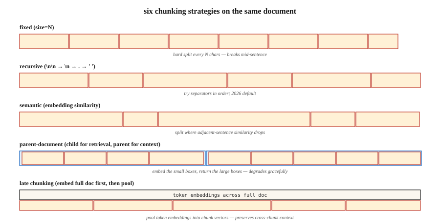

# RAG 分块策略

> 分块（chunking）配置对检索质量的影响，与嵌入（embedding）模型的选择同样重要（Vectara NAACL 2025）。分块做错了，再多重排序也救不了。

**Type:** Build
**Languages:** Python
**Prerequisites:** 阶段 5 · 14（信息检索），阶段 5 · 22（嵌入模型）
**Time:** ~60 分钟

## 要解决的问题

你把一份 50 页的合同放进检索增强生成（RAG）系统。用户问：“终止条款是什么？”检索器却返回了封面。为什么？因为模型是用 512-token（词元）文本块训练的，而终止条款位于文档第 20 页处，被分页截断，局部又没有将它与查询关联起来的关键词。

解决办法不是“买个更好的嵌入模型”，而是做好分块。块要多大？是否重叠？在哪里切分？是否附带周围上下文？

2026 年二月的基准测试给出了令人意外的结果：

- Vectara 的 2026 年研究：递归式 512-token 分块胜过语义分块，准确率为 69% → 54%。
- SPLADE + Mistral-8B 在 Natural Questions 上的结果：重叠没有带来可测量的收益。
- 上下文悬崖：上下文达到约 2,500 tokens 时，回答质量急剧下降。

“显而易见”的答案（语义分块、20% 重叠、1000 tokens）往往是错的。本课将帮助你建立对六种策略的直觉，并告诉你何时该选哪种。

## 核心概念



**固定长度分块。** 每隔 N 个字符或 tokens 切分一次。这是最简单的基线。它会在句子中间截断。压缩效果好，连贯性差。

**递归分块。** 使用 LangChain 的 `RecursiveCharacterTextSplitter`。先尝试按 `\n\n` 切分，再按 `\n`、`.`，最后按空格切分。可以顺畅地逐级回退。这是 2026 年的默认选择。

**语义分块。** 为每个句子生成嵌入。计算相邻句子之间的余弦相似度，在相似度低于阈值处切分。它能保持主题连贯，但速度较慢；有时会生成只有 40-token 的微小片段，损害检索效果。

**句子分块。** 按句子边界切分。每块一个句子，或使用包含 N 个句子的窗口。在长度不超过 ~5k tokens（k 表示千）时，效果可媲美语义分块，成本却只需一小部分。

**父文档。** 保存用于检索的小子块，*同时* 保存用于提供上下文的较大父块。按子块检索，返回父块。其效果退化较为平缓：即使子块质量不好，仍能返回合理的父块。

**后期分块（2024）。** 先在 token 层面为整个文档生成嵌入，再将 token 嵌入池化为文本块嵌入。这能保留跨块上下文。适用于长上下文嵌入模型（BGE-M3、Jina v3），但计算开销更高。

**上下文检索（Anthropic，2024）。** 在每个文本块前加上一段由大语言模型（LLM）生成的摘要，说明该块在文档中的位置（“此块是终止条款的第 3.2 节……”）。在 Anthropic 自己的基准测试中，检索效果提升了 35-50%。建立索引的成本较高。

### 胜过所有默认配置的规则

让文本块大小与查询类型匹配：

| 查询类型 | 文本块大小 |
|------------|-----------|
| 事实型（“CEO 叫什么名字？”） | 256-512 tokens |
| 分析型 / 多跳 | 512-1024 tokens |
| 理解整个章节 | 1024-2048 tokens |

这是 NVIDIA 的 2026 年基准测试结论。文本块应大到足以容纳答案及其局部上下文，又应小到能让检索器返回的 top-K 结果聚焦于答案，而不是上下文噪声。

```figure
n5-chunk-cuts
```

## 动手实现

### 步骤 1：固定长度分块与递归分块

```python
def chunk_fixed(text, size=512, overlap=0):
    step = size - overlap
    return [text[i:i + size] for i in range(0, len(text), step)]


def chunk_recursive(text, size=512, seps=("\n\n", "\n", ". ", " ")):
    if len(text) <= size:
        return [text]
    for sep in seps:
        if sep not in text:
            continue
        parts = text.split(sep)
        chunks = []
        buf = ""
        for p in parts:
            if len(p) > size:
                if buf:
                    chunks.append(buf)
                    buf = ""
                chunks.extend(chunk_recursive(p, size=size, seps=seps[1:] or (" ",)))
                continue
            candidate = buf + sep + p if buf else p
            if len(candidate) <= size:
                buf = candidate
            else:
                if buf:
                    chunks.append(buf)
                buf = p
        if buf:
            chunks.append(buf)
        return [c for c in chunks if c.strip()]
    return chunk_fixed(text, size)
```

### 步骤 2：语义分块

```python
def chunk_semantic(text, encoder, threshold=0.6, min_chars=200, max_chars=2048):
    sentences = split_sentences(text)
    if not sentences:
        return []
    embs = encoder.encode(sentences, normalize_embeddings=True)
    chunks = [[sentences[0]]]
    for i in range(1, len(sentences)):
        sim = float(embs[i] @ embs[i - 1])
        current_len = sum(len(s) for s in chunks[-1])
        if sim < threshold and current_len >= min_chars:
            chunks.append([sentences[i]])
        else:
            chunks[-1].append(sentences[i])

    result = []
    for group in chunks:
        text_group = " ".join(group)
        if len(text_group) > max_chars:
            result.extend(chunk_recursive(text_group, size=max_chars))
        else:
            result.append(text_group)
    return result
```

针对你的领域调节 `threshold`。太高 → 碎片过多。太低 → 只剩一个巨大的文本块。

### 步骤 3：父文档

```python
def chunk_parent_child(text, parent_size=2048, child_size=256):
    parents = chunk_recursive(text, size=parent_size)
    mapping = []
    for p_idx, parent in enumerate(parents):
        children = chunk_recursive(parent, size=child_size)
        for child in children:
            mapping.append({"child": child, "parent_idx": p_idx, "parent": parent})
    return mapping


def retrieve_parent(child_query, mapping, encoder, top_k=3):
    child_embs = encoder.encode([m["child"] for m in mapping], normalize_embeddings=True)
    q_emb = encoder.encode([child_query], normalize_embeddings=True)[0]
    scores = child_embs @ q_emb
    top = np.argsort(-scores)[:top_k]
    seen, parents = set(), []
    for i in top:
        if mapping[i]["parent_idx"] not in seen:
            parents.append(mapping[i]["parent"])
            seen.add(mapping[i]["parent_idx"])
    return parents
```

关键点：对父块去重。多个子块可能映射到同一个父块；全部返回会浪费上下文。

### 步骤 4：上下文检索（Anthropic 模式）

```python
def contextualize_chunks(document, chunks, llm):
    context_prompts = [
        f"""<document>{document}</document>
Here is the chunk to situate: <chunk>{c}</chunk>
Write 50-100 words placing this chunk in the document's context."""
        for c in chunks
    ]
    contexts = llm.batch(context_prompts)
    return [f"{ctx}\n\n{c}" for ctx, c in zip(contexts, chunks)]
```

为添加了上下文的文本块建立索引。查询时，检索会受益于这些额外的周围语境信号。

### 步骤 5：评测

```python
def recall_at_k(queries, corpus_chunks, encoder, k=5):
    chunk_embs = encoder.encode(corpus_chunks, normalize_embeddings=True)
    hits = 0
    for q_text, gold_idxs in queries:
        q_emb = encoder.encode([q_text], normalize_embeddings=True)[0]
        top = np.argsort(-(chunk_embs @ q_emb))[:k]
        if any(i in gold_idxs for i in top):
            hits += 1
    return hits / len(queries)
```

一定要做基准测试。最适合你语料库的策略，可能与任何一篇博客的结论都不同。

## 常见陷阱

- **只用事实型查询评测分块。** 多跳查询可能让完全不同的策略胜出。应使用按查询类型分层的评测集。
- **语义分块不设最小大小。** 这会产生 40-token 的片段，损害检索效果。务必强制执行 `min_tokens`。
- **盲目照搬重叠配置。** 2026 年的研究发现，重叠往往毫无收益，却使索引成本翻倍。应测量，不要想当然。
- **不强制执行最小/最大大小限制。** 5 tokens 或 5000 tokens 的文本块都会破坏检索效果。应限制其大小。
- **跨文档分块。** 绝不能让一个块横跨两个文档。始终先逐文档分块，再合并。

## 实际使用

2026 年的技术组合：

| 场景 | 策略 |
|-----------|----------|
| 首次构建，语料库情况未知 | 递归分块，512 tokens，无重叠 |
| 事实型问答 | 递归分块，256-512 tokens |
| 分析型 / 多跳 | 递归分块，512-1024 tokens + 父文档 |
| 大量交叉引用（合同、论文） | 后期分块或上下文检索 |
| 会话 / 对话语料库 | 按对话轮次分块 + 说话者元数据 |
| 短话语（推文、评论） | 一个文档 = 一个文本块 |

先从递归分块、大小 512 开始。在包含 50 条查询的评测集上测量 recall@5（召回率），再据此调优。

## 交付成果

保存为 `outputs/skill-chunker.md`：

```markdown
---
name: chunker
description: Pick a chunking strategy, size, and overlap for a given corpus and query distribution.
version: 1.0.0
phase: 5
lesson: 23
tags: [nlp, rag, chunking]
---

Given a corpus (document types, avg length, domain) and query distribution (factoid / analytical / multi-hop), output:

1. Strategy. Recursive / sentence / semantic / parent-document / late / contextual. Reason.
2. Chunk size. Token count. Reason tied to query type.
3. Overlap. Default 0; justify if >0.
4. Min/max enforcement. `min_tokens`, `max_tokens` guards.
5. Evaluation plan. Recall@5 on 50-query stratified eval set (factoid, analytical, multi-hop).

Refuse any chunking strategy without min/max chunk size enforcement. Refuse overlap above 20% without an ablation showing it helps. Flag semantic chunking recommendations without a min-token floor.
```

## 练习

1. **简单。** 用 fixed(512, 0)、recursive(512, 0) 和 recursive(512, 100) 对一份 20 页文档分块。比较文本块数量和边界质量。
2. **中等。** 围绕 5 个文档构建包含 30 条查询的评测集。测量递归分块、语义分块和父文档策略的 recall@5。哪种胜出？结果与博客文章一致吗？
3. **困难。** 实现上下文检索。测量相对于递归分块基线的 MRR（平均倒数排名）提升。报告索引成本（LLM 调用次数）与准确率增益的对比。

## 关键术语

| 术语 | 常见说法 | 实际含义 |
|------|-----------------|-----------------------|
| 文本块 | 文档的一部分 | 文档内部用于生成嵌入、建立索引和检索的单位。 |
| 重叠 | 安全余量 | 相邻文本块共享的 N tokens；在 2026 年的基准测试中往往无用。 |
| 语义分块 | 智能分块 | 在相邻句子的嵌入相似度下降处切分。 |
| 父文档 | 两级检索 | 检索小子块，返回较大的父块。 |
| 后期分块 | 嵌入之后再分块 | 在 token 层面为全文生成嵌入，再池化为文本块向量。 |
| 上下文检索 | Anthropic 的技巧 | 建立索引前，在每个文本块前添加由 LLM 生成的摘要。 |
| 上下文悬崖 | 2500-token 高墙 | 在 RAG 中，上下文达到约 2.5k tokens 时观察到的质量下降（2026 年一月）。 |

## 延伸阅读

- [Yepes et al. / LangChain — Recursive Character Splitting docs](https://python.langchain.com/docs/how_to/recursive_text_splitter/) — 生产环境中的默认选择。
- [Vectara (2024, NAACL 2025). Chunking configurations analysis](https://arxiv.org/abs/2410.13070) — 分块与嵌入模型的选择同样重要。
- [Jina AI — Late Chunking in Long-Context Embedding Models (2024)](https://jina.ai/news/late-chunking-in-long-context-embedding-models/) — 后期分块论文。
- [Anthropic — Contextual Retrieval](https://www.anthropic.com/news/contextual-retrieval) — 借助 LLM 生成的上下文前缀，检索效果提升 35-50%。
- [NVIDIA 2026 chunk-size benchmark — Premai summary](https://blog.premai.io/rag-chunking-strategies-the-2026-benchmark-guide/) — 根据查询类型选择文本块大小。
