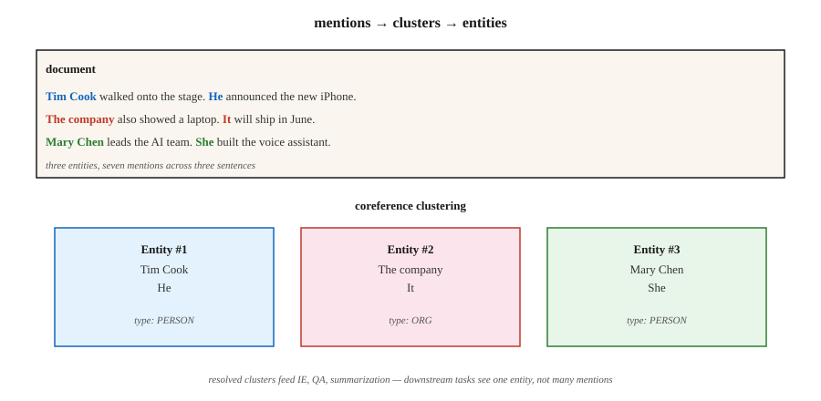

# 共指消解

> “她给他打了电话。他没有接。医生正在吃午饭。”三处指称涉及两个人，却没有提到任何人的名字。共指消解（coreference resolution）就是要弄清谁是谁。

**Type:** Learn
**Languages:** Python
**Prerequisites:** 阶段 5 · 06（命名实体识别 NER），阶段 5 · 07（词性标注 POS 与句法分析）
**Time:** ~60 分钟

## 要解决的问题

从一篇 300 个单词的文章中抽取 Apple Inc. 的每一处提及（mention）。文章直接写出“Apple”时，这很容易；写成“the company”“they”“Cupertino's technology giant”或“Jobs's firm”时，就难了。如果不把这些提及消解为同一实体，你的命名实体识别（NER）流水线就会漏掉 60-80% 的提及。

共指消解把所有指向同一现实实体的表达式关联到一个簇中。它是连接表层自然语言处理（NLP，如 NER、句法分析）与下游语义任务（信息抽取 IE、问答 QA、摘要、知识图谱 KG）的纽带。

为什么它在 2026 年很重要：

- 摘要：“The CEO announced...”与“Tim Cook announced...”——摘要应当写明 CEO 的姓名。
- 问答：“Who did she call?”要求先消解“she”。
- 信息抽取：知识图谱若把“PER1 founded Apple”和“Jobs founded Apple”当成独立条目，就是错误的。
- 多文档 IE：合并多篇报道同一事件的文章中的提及，属于跨文档共指。

## 核心概念



**任务。** 输入：一篇文档。输出：对提及（文本跨度，span）进行聚类，使每个簇都指向一个实体。

**提及类型。**

- **命名实体。** “Tim Cook”
- **名词性提及。** “the CEO”、“the company”
- **代词性提及。** “he”、“she”、“they”、“it”
- **同位语。** “Tim Cook, Apple's CEO,”

**架构。**

1. **基于规则（Hobbs，1978）。** 利用语法规则、基于句法树进行代词消解。是一个不错的基线。在代词处理上出乎意料地难以超越。
2. **提及对分类器。** 对每一对提及 (m_i, m_j)，预测它们是否共指。通过传递闭包进行聚类。这是 2016 年之前的标准方法。
3. **提及排序。** 对每个提及，为候选先行项（antecedent，包括“无先行项”）排序。选择排名最高的候选项。
4. **基于文本跨度的端到端方法（Lee 等，2017）。** 使用 Transformer 编码器。枚举长度不超过上限的所有候选文本跨度。预测提及分数。为每个文本跨度预测先行项概率。以贪心方式聚类。这是现代方法的默认选择。
5. **生成式方法（2024+）。** 向大语言模型（LLM）提供提示词（prompt）：“列出这段文本中的每个代词及其先行项。”在简单情形下效果不错，但处理长文档和罕见指称对象时较为吃力。

**评估指标。** 有五种标准指标（MUC、B³、CEAF、BLANC、LEA），因为没有任何单一指标能全面反映聚类质量。将前三种指标的平均值报告为 CoNLL F1。2026 年在 CoNLL-2012 上的最先进水平：~83 F1。

**已知难点。**

- 定指描述所指的实体在数页之前才被引入。
- 桥接回指（bridging anaphora，例如“the wheels”→ 前文提到的一辆汽车）。
- 中文、日文等语言中的零形回指（zero anaphora）。
- 后指（cataphora，代词出现在指称对象之前）：“When **she** walked in, Mary smiled.”

```figure
coref-links
```

## 动手实现

### 步骤 1：预训练神经共指消解（AllenNLP / spaCy-experimental）

```python
import spacy
nlp = spacy.load("en_coreference_web_trf")   # experimental model
doc = nlp("Apple announced new products. The company said they would ship soon.")
for cluster in doc._.coref_clusters:
    print(cluster, "->", [m.text for m in cluster])
```

对于更长的文档，你会得到类似下面的结果：
- 簇 1：[Apple, The company, they]
- 簇 2：[new products]

### 步骤 2：基于规则的代词消解器（教学用）

只依赖标准库的实现见 `code/main.py`：

1. 抽取提及：命名实体（首字母大写的文本跨度）、代词（字典查找）、定指描述（“the X”）。
2. 对每个代词，查看前面的 K 个提及，并根据以下因素评分：
   - 性别与数的一致性（启发式）
   - 邻近性（越近越优先）
   - 句法角色（优先选择主语）
3. 关联得分最高的先行项。

它无法与神经模型竞争，但能展示端到端模型必须面对的搜索空间和决策。

### 步骤 3：使用 LLM 进行共指消解

```python
prompt = f"""Text: {text}

List every pronoun and noun phrase that refers to a person or company.
Cluster them by what they refer to. Output JSON:
[{{"entity": "Apple", "mentions": ["Apple", "the company", "it"]}}, ...]
"""
```

要留意两种失败模式。第一，LLM 会过度合并（例如“him”和“her”实际指向两个不同的人）。第二，LLM 会悄悄漏掉长文档中的提及。务必通过文本跨度偏移量检查来验证。

### 步骤 4：评估

标准的 conll-2012 脚本会计算 MUC、B³、CEAF-φ4，并报告其平均值。对于内部评估，先在标注好的测试集上计算文本跨度级精确率和召回率，再加入提及关联 F1。

## 常见陷阱

- **单元素簇激增。** 有些系统会把每个提及都报告为一个独立的簇。B³ 对此较为宽容，MUC 则会惩罚这种情况。务必检查全部三种指标。
- **长上下文中的代词。** 文档超过 2,000 token（词元）时，性能会下降 ~15 F1。要谨慎分块。
- **性别假设。** 硬编码的性别规则在非二元性别的指称对象、组织和动物上会失效。使用学习得到的模型或中性评分方式。
- **LLM 在长文档上的漂移。** 单次 API（应用程序编程接口）调用无法可靠地对跨越 50+ 个段落的提及进行聚类。使用滑动窗口 + 合并。

## 实际使用

2026 年的技术栈：

| 情形 | 选择 |
|-----------|------|
| 英文，单文档 | `en_coreference_web_trf`（spaCy-experimental）或 AllenNLP 神经共指消解 |
| 多语言 | 在 OntoNotes 或 Multilingual CoNLL 上训练的 SpanBERT / XLM-R |
| 跨文档事件共指 | 专用端到端模型（2025–26 年最先进水平，SOTA） |
| 快速搭建 LLM 基线 | GPT-4o / Claude，配合要求结构化输出的共指消解提示词 |
| 生产级对话系统 | 基于规则的回退方案 + 神经模型主方案 + 关键槽位的人工审核 |

2026 年实际交付的集成模式是：先运行 NER，再运行共指消解，然后把共指簇合并到 NER 实体中。下游任务看到的是每个簇对应一个实体，而不是每个提及对应一个实体。

## 交付成果

保存为 `outputs/skill-coref-picker.md`：

```markdown
---
name: coref-picker
description: Pick a coreference approach, evaluation plan, and integration strategy.
version: 1.0.0
phase: 5
lesson: 24
tags: [nlp, coref, information-extraction]
---

Given a use case (single-doc / multi-doc, domain, language), output:

1. Approach. Rule-based / neural span-based / LLM-prompted / hybrid. One-sentence reason.
2. Model. Named checkpoint if neural.
3. Integration. Order of operations: tokenize → NER → coref → downstream task.
4. Evaluation. CoNLL F1 (MUC + B³ + CEAF-φ4 average) on held-out set + manual cluster review on 20 documents.

Refuse LLM-only coref for documents over 2,000 tokens without sliding-window merge. Refuse any pipeline that runs coref without a mention-level precision-recall report. Flag gender-heuristic systems deployed in demographically diverse text.
```

## 练习

1. **简单。** 在 5 段手工编写的文本上运行 `code/main.py` 中基于规则的消解器。对照真实标注，测量提及关联准确率。
2. **中等。** 在一篇新闻文章上使用预训练神经共指模型。将得到的簇与自己的人工标注对比。它在哪些地方失败了？
3. **困难。** 构建由共指消解增强的 NER 流水线：先运行 NER，再通过共指簇合并。在 100 篇文章上测量其相较于仅使用 NER 的实体覆盖率提升。

## 关键术语

| 术语 | 通俗说法 | 实际含义 |
|------|-----------------|-----------------------|
| 提及（Mention） | 一处指称 | 指向一个实体的一段文本（名称、代词、名词短语）。 |
| 先行项（Antecedent） | “it”指的是什么 | 与后面的提及共指的较早提及。 |
| 簇（Cluster） | 该实体的各处提及 | 全部指向同一现实实体的一组提及。 |
| 回指（Anaphora） | 向前文指称 | 后面的提及指向前面的提及（“he”→“John”）。 |
| 后指（Cataphora） | 向后文指称 | 前面的提及指向后面的提及（“When he arrived, John...”）。 |
| 桥接（Bridging） | 隐式指称 | “I bought a car. The wheels were bad.”（指的是那辆车的车轮。） |
| CoNLL F1 | 排行榜上的那个数字 | MUC、B³、CEAF-φ4 的 F1 分数的平均值。 |

## 延伸阅读

- [Jurafsky & Martin, SLP3 Ch. 26 — Coreference Resolution and Entity Linking](https://web.stanford.edu/~jurafsky/slp3/26.pdf) —— 权威教材章节。
- [Lee et al. (2017). End-to-end Neural Coreference Resolution](https://arxiv.org/abs/1707.07045) —— 基于文本跨度的端到端方法。
- [Joshi et al. (2020). SpanBERT](https://arxiv.org/abs/1907.10529) —— 改善共指消解的预训练方法。
- [Pradhan et al. (2012). CoNLL-2012 Shared Task](https://aclanthology.org/W12-4501/) —— 基准评测。
- [Hobbs (1978). Resolving Pronoun References](https://www.sciencedirect.com/science/article/pii/0024384178900064) —— 基于规则的经典方法。
