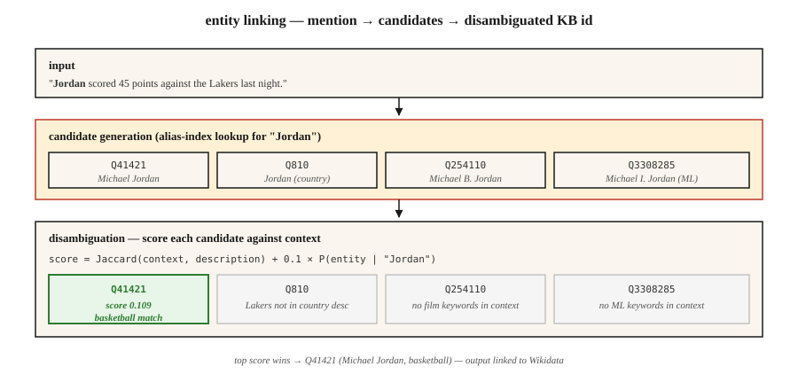

# 实体链接与消歧

> 命名实体识别（NER）找到了“Paris”。实体链接要判断：是法国巴黎？Paris Hilton？得克萨斯州的 Paris？还是特洛伊王子 Paris？没有链接，知识图谱中的歧义就无法消除。

**Type:** Build
**Languages:** Python
**Prerequisites:** 第 5 阶段 · 06（命名实体识别，NER），第 5 阶段 · 24（共指消解）
**Time:** ~60 分钟

## 要解决的问题

句子写道：“Jordan beat the press.” 你的 NER 将“Jordan”标注为 PERSON。很好。但究竟是 *哪一个* Jordan？

- Michael Jordan（篮球运动员）？
- Michael B. Jordan（演员）？
- Michael I. Jordan（Berkeley 的机器学习教授；没错，机器学习论文中确实会出现这种混淆）？
- Jordan（约旦这个国家）？
- Jordan（希伯来语名字）？

实体链接（entity linking，EL）将每个提及（mention）解析为知识库（KB）中的唯一条目：知识库可以是 Wikidata、Wikipedia、DBpedia，也可以是你的领域知识库。这包含两个子任务：

1. **候选生成（candidate generation）。** 给定“Jordan”，哪些 KB 条目可能与之对应？
2. **消歧（disambiguation）。** 给定上下文，哪个候选才是正确的？

这两个步骤都可以通过学习来实现，也都有基准评测。将它们组合起来的处理管线已有十年没有大的变化；不断变化的是消歧器的质量。

## 核心概念



**候选生成。** 给定提及的表面形式（surface form，例如“Jordan”），在别名索引（alias index）中查找候选。Wikipedia 的别名词典覆盖了大多数命名实体：“JFK” → John F. Kennedy、Jacqueline Kennedy、JFK 机场、JFK（电影）。典型索引会为每个提及返回 10-30 个候选。

**消歧：三种方法。**

1. **先验 + 上下文（Milne & Witten，2008）。** `P(entity | mention) × context-similarity(entity, text)`。效果好、速度快，无需训练。
2. **基于嵌入（embedding；ESS / REL / Blink）。** 对提及 + 上下文进行编码，对每个候选的描述进行编码，然后选择余弦相似度最大的候选。这是 2020-2024 年的默认方案。
3. **生成式（GENRE，2021；基于大语言模型（LLM），2023+）。** 逐 token（词元）解码实体的规范名称。将解码限制在由有效实体名称构成的前缀树（trie）中，从而保证输出是有效的 KB id。

**端到端与管线。** 现代模型（ELQ、BLINK、ExtEnD、GENRE）在一次处理过程中完成 NER + 候选生成 + 消歧。管线系统仍在生产环境中占主导地位，因为其中的组件可以替换。

### 两项衡量指标

- **提及召回率（候选生成）。** 在标准答案中的提及里，正确 KB 条目出现在候选列表中的比例。这是整条管线的性能下限。
- **消歧准确率 / F1。** 在候选中包含正确答案的前提下，top-1 结果正确的频率。

始终同时报告这两项指标。一个候选召回率为 80%、消歧准确率为 99% 的系统，其管线表现为 80%。

```figure
gx-entity-linking
```

## 动手实现

### 步骤 1：从 Wikipedia 重定向构建别名索引

```python
alias_to_entities = {
    "jordan": ["Q41421 (Michael Jordan)", "Q810 (Jordan, country)", "Q254110 (Michael B. Jordan)"],
    "paris":  ["Q90 (Paris, France)", "Q663094 (Paris, Texas)", "Q55411 (Paris Hilton)"],
    "apple":  ["Q312 (Apple Inc.)", "Q89 (apple, fruit)"],
}
```

Wikipedia 别名数据：~18M 个（别名，实体）对，M 表示百万。从 Wikidata 数据转储中下载，并存储为倒排索引。

### 步骤 2：基于上下文的消歧

```python
def disambiguate(mention, context, alias_index, entity_desc):
    candidates = alias_index.get(mention.lower(), [])
    if not candidates:
        return None, 0.0
    context_words = set(tokenize(context))
    best, best_score = None, -1
    for entity_id in candidates:
        desc_words = set(tokenize(entity_desc[entity_id]))
        union = len(context_words | desc_words)
        score = len(context_words & desc_words) / union if union else 0.0
        if score > best_score:
            best, best_score = entity_id, score
    return best, best_score
```

Jaccard 重叠度只是一个教学用的简化方案。将它替换为嵌入之间的余弦相似度（Transformer 版本见 `code/main.py` 的 step-2）。

### 步骤 3：基于嵌入的消歧（BLINK 风格）

```python
from sentence_transformers import SentenceTransformer
encoder = SentenceTransformer("sentence-transformers/all-MiniLM-L6-v2")

def embed_mention(text, mention_span):
    start, end = mention_span
    marked = f"{text[:start]} [MENTION] {text[start:end]} [/MENTION] {text[end:]}"
    return encoder.encode([marked], normalize_embeddings=True)[0]

def embed_entity(entity_id, description):
    return encoder.encode([f"{entity_id}: {description}"], normalize_embeddings=True)[0]
```

构建索引时，为每个 KB 实体计算一次嵌入。查询时，为提及 + 上下文计算一次嵌入，与候选池中的向量计算点积，并选取最大值对应的候选。

### 步骤 4：生成式实体链接（概念）

GENRE 逐字符解码实体的 Wikipedia 标题。约束解码（constrained decoding，见第 20 课）保证只能输出有效标题，并与基于 KB 构建的前缀树紧密集成。如今沿着这一思路发展而来的有 REL-GEN，以及通过提示词（prompt）让 LLM 以结构化格式输出的 EL。

```python
prompt = f"""Text: {text}
Mention: {mention}
List the best Wikipedia title for this mention.
Respond with JSON: {{"title": "..."}}"""
```

结合白名单（Outlines `choice`）使用，这是 2026 年最容易交付的 EL 管线。

### 步骤 5：在 AIDA-CoNLL 上评测

AIDA-CoNLL 是标准的 EL 基准：1,393 篇 Reuters 文章、34k 个提及（k 表示千），实体来自 Wikipedia。报告库内（in-KB）准确率（`P@1`）和库外（out-of-KB）NIL（知识库中无匹配条目）检测率。

## 常见陷阱

- **NIL 处理。** 某些提及不在 KB 中，例如新出现的实体或鲜为人知的人物。系统必须预测 NIL，而不是猜测一个错误实体。这项能力要单独衡量。
- **提及边界错误。** 上游 NER 漏掉文本跨度的一部分，例如将“Bank of America”仅标注为“Bank”。这会降低 EL 召回率。
- **热门实体偏差。** 训练后的系统过于倾向于预测高频实体。机器学习论文中对“Michael I. Jordan”的提及经常会被链接到篮球运动员 Jordan。
- **跨语言 EL。** 将中文文本中的提及映射到英文 Wikipedia 实体。这需要多语言编码器或一个翻译步骤。
- **KB 过时。** 新公司、事件和人物不会出现在去年的 Wikipedia 数据转储中。生产管线需要持续刷新知识库的机制。

## 实际使用

2026 年的技术栈：

| 场景 | 选择 |
|-----------|------|
| 通用英文 + Wikipedia | BLINK 或 REL |
| 跨语言，KB = Wikipedia | mGENRE |
| 适合使用 LLM，每天只有少量提及 | 用候选列表 + 受约束的 JSON 向 Claude/GPT-4 提供提示词 |
| 领域专用 KB（医疗、法律） | 结合 KB 感知检索的定制 BERT + 在该领域 AIDA 风格的数据集上微调（fine-tuning） |
| 极低延迟 | 仅使用精确匹配的先验（Milne-Witten 基线） |
| 研究领域的最先进水平（SOTA） | GENRE / ExtEnD / 生成式 LLM-EL |

2026 年可交付的生产模式：NER → 共指消解 → 对每个提及执行 EL → 将各簇合并为每簇一个规范实体。输出是文档中每个实体对应一个 KB id，而不是每个提及对应一个。

## 交付成果

保存为 `outputs/skill-entity-linker.md`：

```markdown
---
name: entity-linker
description: Design an entity linking pipeline — KB, candidate generator, disambiguator, evaluation.
version: 1.0.0
phase: 5
lesson: 25
tags: [nlp, entity-linking, knowledge-graph]
---

Given a use case (domain KB, language, volume, latency budget), output:

1. Knowledge base. Wikidata / Wikipedia / custom KB. Version date. Refresh cadence.
2. Candidate generator. Alias-index, embedding, or hybrid. Target mention recall @ K.
3. Disambiguator. Prior + context, embedding-based, generative, or LLM-prompted.
4. NIL strategy. Threshold on top score, classifier, or explicit NIL candidate.
5. Evaluation. Mention recall @ 30, top-1 accuracy, NIL-detection F1 on held-out set.

Refuse any EL pipeline without a mention-recall baseline (you cannot evaluate a disambiguator without knowing candidate gen surfaced the right entity). Refuse any pipeline using LLM-prompted EL without constrained output to valid KB ids. Flag systems where popularity bias affects minority entities (e.g. name-clashes) without domain fine-tuning.
```

## 练习

1. **简单。** 在 `code/main.py` 中实现先验 + 上下文消歧器，并用于 10 个有歧义的提及（Paris、Jordan、Apple）。人工标注正确实体，然后衡量准确率。
2. **中等。** 用句子 Transformer 对 50 个有歧义的提及进行编码，为每个候选的描述计算嵌入。比较基于嵌入的消歧与 Jaccard 上下文重叠度方法。
3. **困难。** 构建一个包含 1k 个实体的领域 KB，例如你公司的员工 + 产品。端到端实现 NER + EL，并在 100 个留出句子上衡量精确率和召回率。

## 关键术语

| 术语 | 常见说法 | 实际含义 |
|------|-----------------|-----------------------|
| 实体链接（EL） | 链接到 Wikipedia | 将一个提及映射到唯一的 KB 条目。 |
| 候选生成 | 可能是谁？ | 返回某个提及可能对应的 KB 条目的候选短名单。 |
| 消歧 | 选出正确的那个 | 根据上下文给候选打分，选出得分最高者。 |
| 别名索引 | 查找表 | 从表面形式 → 候选实体的映射。 |
| NIL | 不在 KB 中 | 明确预测没有匹配的 KB 条目。 |
| KB | 知识库 | Wikidata、Wikipedia、DBpedia，或你的领域 KB。 |
| AIDA-CoNLL | 那个基准 | 带有标准实体链接标注的 1,393 篇 Reuters 文章。 |

## 延伸阅读

- [Milne, Witten (2008). Learning to Link with Wikipedia](https://researchcommons.waikato.ac.nz/entities/publication/b9a0b520-abc5-47c5-a86a-da6c579893ab) — 奠定基础的先验 + 上下文方法。
- [Wu et al. (2020). Zero-shot Entity Linking with Dense Entity Retrieval (BLINK)](https://arxiv.org/abs/1911.03814) — 基于嵌入的主力方案。
- [De Cao et al. (2021). Autoregressive Entity Retrieval (GENRE)](https://arxiv.org/abs/2010.00904) — 使用约束解码的生成式 EL。
- [Hoffart et al. (2011). Robust Disambiguation of Named Entities in Text (AIDA)](https://www.aclweb.org/anthology/D11-1072.pdf) — 介绍该基准的论文。
- [REL: An Entity Linker Standing on the Shoulders of Giants (2020)](https://arxiv.org/abs/2006.01969) — 开放的生产技术栈。
