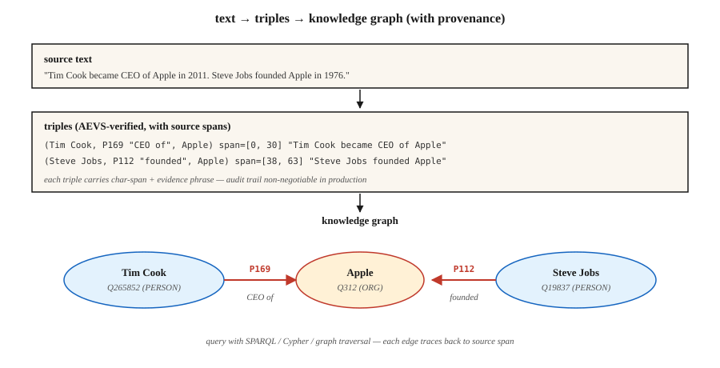

# 关系抽取与知识图谱构建

> 命名实体识别（NER）找到了实体，实体链接为它们确定了对应条目，关系抽取则找出它们之间的边。知识图谱（KG）是节点、边及其来源信息（provenance）的总和。

**Type:** Build
**Languages:** Python
**Prerequisites:** 第 5 阶段 · 06（NER），第 5 阶段 · 25（实体链接）
**Time:** ~60 分钟

## 要解决的问题

分析师读到一句话：“Tim Cook became CEO of Apple in 2011.” 其中有四项事实：

- `(Tim Cook, role, CEO)`
- `(Tim Cook, employer, Apple)`
- `(Tim Cook, start_date, 2011)`
- `(Apple, type, Organization)`

关系抽取（relation extraction，RE）把自由文本转化为结构化三元组 `(subject, relation, object)`。汇集整个语料库中的三元组，就得到了知识图谱。再对汇集的结果进行查询，就有了支撑检索增强生成（RAG）、分析或合规审计的推理基础。

2026 年的问题是：大语言模型（LLM）抽取关系时太积极了，积极过了头。它们会编造源文本并不支持的三元组。没有来源信息，你就无法区分真实三元组与貌似合理的虚构。2026 年的应对方式是 AEVS 式的锚定与验证管线。

## 核心概念



**三元组形式。** `(subject_entity, relation_type, object_entity)`。关系可以来自封闭本体（closed ontology，如 Wikidata 属性、FIBO、UMLS），也可以来自开放集合（OpenIE 风格，不限制关系类型）。

**三种抽取方法。**

1. **基于规则 / 模式。** Hearst 模式：“X such as Y” → `(Y, isA, X)`，再加上手工编写的正则表达式。脆弱，但精确、可解释。
2. **监督分类器。** 给定句子中的两个实体提及，从固定集合中预测它们的关系。使用 TACRED、ACE、KBP 训练。这是 2015–2022 年的标准做法。
3. **生成式 LLM。** 用提示词（prompt）要求模型输出三元组，开箱即用。但需要来源信息，否则就会生成貌似合理的无效内容。

**AEVS（Anchor-Extraction-Verification-Supplement，锚定—抽取—验证—补充，2026）。** 当前用于缓解幻觉的框架：

- **锚定。** 以精确位置标明每个实体的文本跨度（span）以及关系短语的文本跨度。
- **抽取。** 生成与锚定跨度关联的三元组。
- **验证。** 将三元组的每个元素匹配回源文本；拒绝任何缺乏支持的内容。
- **补充。** 再检查一遍覆盖情况，确保没有遗漏任何已锚定的跨度。

幻觉会大幅减少。虽然需要更多计算，但结果可审计。

**开放与封闭之间的取舍。**

- **封闭本体。** 固定的属性列表（例如 Wikidata 的 11,000+ 个属性）。可预测、可查询，也难以随意编造。
- **开放信息抽取（Open IE）。** 任何动词短语都可以成为关系。召回率高，精确率低，查询起来杂乱难理。

生产中的知识图谱通常混合使用两者：先用开放信息抽取发现关系，再把关系规范化（canonicalization）到封闭本体上，然后合并进主图。

```figure
relation-triples
```

## 动手实现

### 步骤 1：基于模式的抽取

```python
PATTERNS = [
    (r"(?P<s>[A-Z]\w+) (?:is|was) (?:a|an|the) (?P<o>[A-Z]?\w+)", "isA"),
    (r"(?P<s>[A-Z]\w+) (?:is|was) born in (?P<o>\w+)", "bornIn"),
    (r"(?P<s>[A-Z]\w+) works? (?:at|for) (?P<o>[A-Z]\w+)", "worksAt"),
    (r"(?P<s>[A-Z]\w+) founded (?P<o>[A-Z]\w+)", "founded"),
]
```

完整的玩具抽取器见 `code/main.py`。Hearst 模式至今仍用于特定领域的管线，因为它们便于调试。

### 步骤 2：监督式关系分类

```python
from transformers import AutoTokenizer, AutoModelForSequenceClassification

tok = AutoTokenizer.from_pretrained("Babelscape/rebel-large")
model = AutoModelForSequenceClassification.from_pretrained("Babelscape/rebel-large")

text = "Tim Cook was born in Alabama. He later became CEO of Apple."
encoded = tok(text, return_tensors="pt", truncation=True)
output = model.generate(**encoded, max_length=200)
triples = tok.batch_decode(output, skip_special_tokens=False)
```

REBEL 是一个序列到序列（seq2seq）关系抽取器：输入文本，输出三元组，并且已经使用 Wikidata 属性标识符。它在远程监督（distant supervision）数据上经过微调，是标准的开放权重基线。

### 步骤 3：用 LLM 提示词进行带锚定的抽取

```python
prompt = f"""Extract (subject, relation, object) triples from the text.
For each triple, include the exact character span in the source text.

Text: {text}

Output JSON:
[{{"subject": {{"text": "...", "span": [start, end]}},
   "relation": "...",
   "object": {{"text": "...", "span": [start, end]}}}}, ...]

Only include triples fully supported by the text. No inference beyond what is stated.
"""
```

对照源文本验证每个返回的跨度。只要 `text[start:end] != triple_entity`，就拒绝该项。这是 AEVS“验证”步骤的最简形式。

### 步骤 4：规范化到封闭本体

```python
RELATION_MAP = {
    "is the CEO of": "P169",       # "chief executive officer"
    "was born in":   "P19",         # "place of birth"
    "founded":        "P112",       # "founded by" (inverted subject/object)
    "works at":       "P108",       # "employer"
}


def canonicalize(relation):
    rel_low = relation.lower().strip()
    if rel_low in RELATION_MAP:
        return RELATION_MAP[rel_low]
    return None   # drop unmapped open relations or route to manual review
```

规范化往往占工程工作量的 60-80%。要为此预留预算。

### 步骤 5：构建小型图并查询

```python
triples = extract(text)
graph = {}
for s, r, o in triples:
    graph.setdefault(s, []).append((r, o))


def neighbors(node, relation=None):
    return [(r, o) for r, o in graph.get(node, []) if relation is None or r == relation]


print(neighbors("Tim Cook", relation="P108"))    # -> [(P108, Apple)]
```

这就是每个基于知识图谱的 RAG 系统的基本单元。可以借助 RDF 三元组存储（Blazegraph、Virtuoso）、属性图（Neo4j）或向量增强的图存储来扩展它。

## 常见陷阱

- **先做共指消解，再做 RE。** “He founded Apple”——RE 需要知道“he”是谁。先运行共指消解（第 24 课）。
- **实体规范化。** “Apple Inc”和“Apple”必须解析为同一个节点。先进行实体链接（第 25 课）。
- **幻觉三元组。** LLM 会输出文本不支持的三元组。必须强制进行跨度验证。
- **关系规范化漂移。** 开放信息抽取中的关系表述不一致（“was born in,”、“came from,”、“is a native of”）。将它们归并到规范标识符，否则图就无法查询。
- **时间错误。** “Tim Cook is CEO of Apple”——现在为真，在 2005 年却为假。许多关系只在限定时间内成立。应使用限定符（Wikidata 中的 `P580` 表示开始时间，`P582` 表示结束时间）。
- **领域不匹配。** REBEL 在 Wikipedia 上训练。法律、医学和科学文本通常需要经过领域微调的 RE 模型。

## 实际使用

2026 年的技术栈：

| 场景 | 选择 |
|-----------|------|
| 快速投入生产，通用领域 | REBEL 或 LlamaPred，配合 Wikidata 规范化 |
| 特定领域（生物医学、法律） | SciREX 式领域微调 + 自定义本体 |
| LLM 提示词抽取，输出需审计 | AEVS 管线：锚定 → 抽取 → 验证 → 补充 |
| 大规模新闻信息抽取 | 基于模式与监督方法的混合方案 |
| 从零构建知识图谱 | 开放信息抽取 + 人工规范化检查 |
| 时间知识图谱 | 抽取时附带限定符（开始/结束时间、时间点） |

集成模式为：NER → 共指消解 → 实体链接 → 关系抽取 → 本体映射 → 图数据加载。每个阶段都可以成为质量门禁。

## 交付成果

保存为 `outputs/skill-re-designer.md`：

```markdown
---
name: re-designer
description: Design a relation extraction pipeline with provenance and canonicalization.
version: 1.0.0
phase: 5
lesson: 26
tags: [nlp, relation-extraction, knowledge-graph]
---

Given a corpus (domain, language, volume) and downstream use (KG-RAG, analytics, compliance), output:

1. Extractor. Pattern-based / supervised / LLM / AEVS hybrid. Reason tied to precision vs recall target.
2. Ontology. Closed property list (Wikidata / domain) or open IE with canonicalization pass.
3. Provenance. Every triple carries source char-span + doc id. Non-negotiable for audit.
4. Merge strategy. Canonical entity id + relation id + temporal qualifiers; dedup policy.
5. Evaluation. Precision / recall on 200 hand-labelled triples + hallucination-rate on LLM-extracted sample.

Refuse any LLM-based RE pipeline without span verification (source provenance). Refuse open-IE output flowing into a production graph without canonicalization. Flag pipelines with no temporal qualifier on time-bounded relations (employer, spouse, position).
```

## 练习

1. **简单。** 在 5 个新闻报道句子上运行 `code/main.py` 中的模式抽取器，人工检查精确率。
2. **中等。** 在相同句子上使用 REBEL（或小型 LLM），比较三元组。哪个抽取器的精确率更高？哪个的召回率更高？
3. **困难。** 构建 AEVS 管线：用 LLM 抽取，再对照源文本验证跨度。在 50 个 Wikipedia 风格的句子上，测量验证步骤前后的幻觉率。

## 关键术语

| 术语 | 常见说法 | 实际含义 |
|------|-----------------|-----------------------|
| 三元组 | 主体—关系—客体 | `(s, r, o)` 元组，是知识图谱的基本单元。 |
| 开放信息抽取 | 什么都抽取 | 开放词汇的关系短语；召回率高，精确率低。 |
| 封闭本体 | 固定 schema（结构定义） | 有限的关系类型集合（Wikidata、UMLS、FIBO）。 |
| 规范化 | 一切都标准化 | 将表面名称 / 关系映射到规范标识符。 |
| AEVS | 有来源依据的抽取 | Anchor-Extraction-Verification-Supplement 管线（2026）。 |
| 来源信息 | 指向权威来源的链接 | 每个三元组都携带文档标识符和指向源文本的字符跨度。 |
| 远程监督 | 低成本标签 | 将文本与已有知识图谱对齐，以创建训练数据。 |

## 延伸阅读

- [Mintz et al. (2009). Distant supervision for relation extraction without labeled data](https://www.aclweb.org/anthology/P09-1113.pdf) — 远程监督论文。
- [Huguet Cabot, Navigli (2021). REBEL: Relation Extraction By End-to-end Language generation](https://aclanthology.org/2021.findings-emnlp.204.pdf) — seq2seq 关系抽取的主力方法。
- [Wadden et al. (2019). Entity, Relation, and Event Extraction with Contextualized Span Representations (DyGIE++)](https://arxiv.org/abs/1909.03546) — 联合信息抽取。
- [AEVS — Anchor-Extraction-Verification-Supplement framework](https://www.mdpi.com/2073-431X/15/3/178) — 2026 年的幻觉缓解设计。
- [Wikidata SPARQL tutorial](https://www.wikidata.org/wiki/Wikidata:SPARQL_tutorial) — 规范化图查询。
