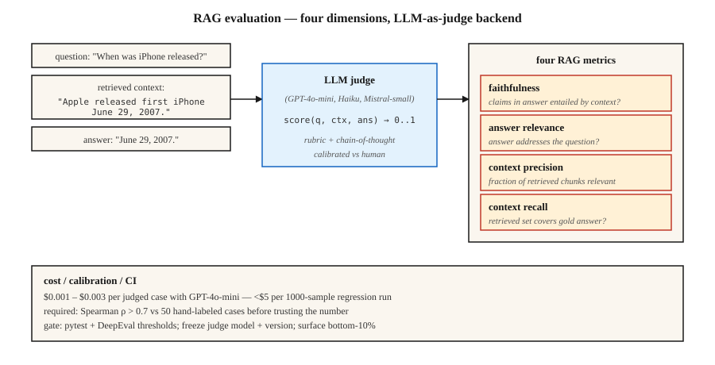

# LLM 评估 — RAGAS、DeepEval、G-Eval

> 完全匹配（Exact Match）和 F1 无法识别语义等价。人工审查难以扩展到大规模。以大语言模型为评判者（LLM-as-judge）是生产环境中的解决方案，但要经过充分校准（calibration），分数才值得信赖。

**Type:** Build
**Languages:** Python
**Prerequisites:** 阶段 5 · 13（问答），阶段 5 · 14（信息检索）
**Time:** ~75 分钟

## 要解决的问题

你的检索增强生成（RAG）系统回答：“June 29th, 2007.”
标准参考答案是：“June 29, 2007.”
完全匹配得分为 0，F1 得分为 ~75%，人工会给出 100%。

现在，把这样的评估扩展到 10,000 个测试用例，再乘以检索器、分块、提示词（prompt）或模型每次变更所需的评估次数。你需要一个能理解语义的评估器：能以低成本开展大规模评估，如实反映质量退步，并揭示需要关注的失败模式。

2026 年，解决这一问题的主力是三个框架。

- **RAGAS。** 全称为 Retrieval-Augmented Generation ASsessment，即检索增强生成评估。提供四项 RAG 指标：忠实度（faithfulness）、答案相关性（answer-relevance）、上下文精确率（context-precision）和上下文召回率（context-recall），后端采用自然语言推断（NLI）+ LLM 评判。以研究为基础，且轻量。
- **DeepEval。** 面向 LLM 的 Pytest。提供 G-Eval、任务完成度、幻觉（hallucination）和偏见指标，原生支持 CI/CD。
- **G-Eval。** 一种方法，也是 DeepEval 的一项指标：以 LLM 为评判者，结合思维链（chain-of-thought）和自定义准则，给出 0-1 分数。

三者都依赖 LLM-as-judge。本课将帮助你直观理解这种方法，以及围绕它建立可信度的机制。

## 核心概念



**LLM-as-judge。** 用一个依据评分细则（rubric）为输出打分的 LLM，替代静态指标。给定 `(query, context, answer)`，向评判 LLM 发出提示：“按忠实度给出 0-1 分数。”然后返回该分数。

它为何有效：LLM 以远低于人工的成本，就能近似人工判断。GPT-4o-mini 每个评分用例的成本为 ~$0.003，因此一次包含 1000 个样本的回归评估成本可低于 $5。

它为何会悄无声息地失效：

1. **评判者偏差。** 评判者偏好较长的答案、来自自身模型家族的答案，以及符合提示词风格的答案。
2. **JSON 解析失败。** 错误的 JSON → NaN（非数）分数 → 在汇总时被悄悄排除。RAGAS 用户对此深有体会。使用 try/except + 明确的失败模式进行把关。
3. **随模型版本发生漂移。** 升级评判者会改变每项指标。应冻结评判模型及其版本。

**RAG 四项指标。**

| 指标 | 所回答的问题 | 后端 |
|--------|----------|---------|
| 忠实度 | 答案中的每条断言都来自检索到的上下文吗？ | 基于 NLI 的蕴含关系判断 |
| 答案相关性 | 答案回应了问题吗？ | 根据答案生成假想问题，再与实际问题比较 |
| 上下文精确率 | 检索到的文本块中，相关块占多大比例？ | LLM 评判 |
| 上下文召回率 | 检索是否返回了全部所需信息？ | LLM 依据标准答案进行评判 |

**G-Eval。** 定义一项自定义准则：“答案是否引用了正确的来源？”框架会自动将其展开为思维链评估步骤，再给出 0-1 分数。它适合评估 RAGAS 尚未覆盖的领域特定质量维度。

**校准。** 在确认评判分数与人工标签的相关性之前，不要相信原始评判分数。用 100 个手工标注的样例进行评估，绘制评判者与人工评分的对比图，计算 Spearman 秩相关系数 rho。如果 rho < 0.7，就需要改进评判者的评分细则。

```figure
n5-judge-gauge
```

## 动手实现

### 步骤 1：用 NLI 评估忠实度（RAGAS 风格）

```python
from typing import Callable
from transformers import pipeline

nli = pipeline("text-classification",
               model="MoritzLaurer/DeBERTa-v3-large-mnli-fever-anli-ling-wanli",
               top_k=None)

# `llm` is any callable: prompt str -> generated str.
# Example: llm = lambda p: client.messages.create(model="claude-haiku-4-5", ...).content[0].text
LLM = Callable[[str], str]


def atomic_claims(answer: str, llm: LLM) -> list[str]:
    prompt = f"""Break this answer into simple factual claims (one per line):
{answer}
"""
    return llm(prompt).splitlines()


def faithfulness(answer: str, context: str, llm: LLM) -> float:
    claims = atomic_claims(answer, llm)
    if not claims:
        return 0.0
    supported = 0
    for claim in claims:
        result = nli({"text": context, "text_pair": claim})[0]
        entail = next((s for s in result if s["label"] == "entailment"), None)
        if entail and entail["score"] > 0.5:
            supported += 1
    return supported / len(claims)
```

将答案拆解为原子断言（atomic claims），针对检索到的上下文，用 NLI 逐条检查。忠实度 = 获得支持的断言所占比例。

### 步骤 2：答案相关性

```python
import numpy as np
from sentence_transformers import SentenceTransformer

# encoder: any model implementing .encode(texts, normalize_embeddings=True) -> ndarray
# e.g., encoder = SentenceTransformer("BAAI/bge-small-en-v1.5")

def answer_relevance(question: str, answer: str, encoder, llm: LLM, n: int = 3) -> float:
    prompt = f"Write {n} questions this answer could be the answer to:\n{answer}"
    generated = [line for line in llm(prompt).splitlines() if line.strip()][:n]
    if not generated:
        return 0.0
    q_emb = np.asarray(encoder.encode([question], normalize_embeddings=True)[0])
    g_embs = np.asarray(encoder.encode(generated, normalize_embeddings=True))
    sims = [float(q_emb @ g_emb) for g_emb in g_embs]
    return sum(sims) / len(sims)
```

如果答案所对应的问题与实际提出的问题不同，相关性就会下降。

### 步骤 3：G-Eval 自定义指标

```python
from deepeval.metrics import GEval
from deepeval.test_case import LLMTestCaseParams, LLMTestCase

metric = GEval(
    name="Correctness",
    criteria="The answer should be factually accurate and match the expected output.",
    evaluation_steps=[
        "Read the expected output.",
        "Read the actual output.",
        "List factual claims in the actual output.",
        "For each claim, mark supported or unsupported by the expected output.",
        "Return score = fraction supported.",
    ],
    evaluation_params=[LLMTestCaseParams.INPUT, LLMTestCaseParams.ACTUAL_OUTPUT, LLMTestCaseParams.EXPECTED_OUTPUT],
)

test = LLMTestCase(input="When was the first iPhone released?",
                   actual_output="June 29th, 2007.",
                   expected_output="June 29, 2007.")
metric.measure(test)
print(metric.score, metric.reason)
```

这些评估步骤就是评分细则。明确列出步骤，比笼统要求“给出 0-1 分数”的提示词更稳定。

### 步骤 4：CI 门禁

```python
import deepeval
from deepeval.metrics import FaithfulnessMetric, ContextualRelevancyMetric


def test_rag_system():
    cases = load_regression_cases()
    faith = FaithfulnessMetric(threshold=0.85)
    rel = ContextualRelevancyMetric(threshold=0.7)
    for case in cases:
        faith.measure(case)
        assert faith.score >= 0.85, f"faithfulness regression on {case.id}"
        rel.measure(case)
        assert rel.score >= 0.7, f"relevancy regression on {case.id}"
```

以 pytest 文件的形式交付。对每个 PR 都运行一次，出现质量退步时阻止合并。

### 步骤 5：从零实现玩具评估

参见 `code/main.py`。其中仅使用标准库，近似计算忠实度（答案断言与上下文的重叠程度），以及按 token（词元）重叠程度衡量的答案与问题相关性。它不适用于生产环境，只用于展示评估的基本结构。

## 常见陷阱

- **没有校准。** 如果评判者与人工标签的相关系数只有 0.3，其评分就是噪声。交付前必须做一次校准评估。
- **自我评估。** 用同一个 LLM 生成答案并进行评判，会让分数虚高 10-20%。评判者应选用不同模型家族。
- **成对评判中的位置偏差。** 评判者偏好先出现的选项。始终随机排列顺序，并按两种顺序都评判一次。
- **只看汇总分数会掩盖失败。** 0.85 的平均分往往掩盖了 5% 的灾难性失败。务必检查得分最低的分位区间。
- **标准评估集退化。** 没有版本管理的评估集随时间漂移，会破坏跨时间比较。每次变更时都要给数据集打上版本标签。
- **LLM 成本。** 规模扩大后，评判调用将成为主要成本。选择满足校准阈值的最便宜模型，例如 GPT-4o-mini、Claude Haiku、Mistral-small。

## 实际使用

2026 年的技术栈：

| 使用场景 | 框架 |
|---------|-----------|
| RAG 质量监控 | RAGAS（4 项指标） |
| CI/CD 回归测试门禁 | DeepEval + pytest |
| 自定义领域准则 | DeepEval 中的 G-Eval |
| 在线实时流量监控 | 使用无参考模式的 RAGAS |
| 人工参与的抽查 | 带标注界面的 LangSmith 或 Phoenix |
| 红队测试 / 安全评估 | Promptfoo + DeepEval |

典型技术栈是：用 RAGAS 做监控，用 DeepEval 做 CI，用 G-Eval 评估新的维度。三者都运行；它们之间的分歧能提供有用信息。

## 交付成果

保存为 `outputs/skill-eval-architect.md`：

```markdown
---
name: eval-architect
description: Design an LLM evaluation plan with calibrated judge and CI gates.
version: 1.0.0
phase: 5
lesson: 27
tags: [nlp, evaluation, rag]
---

Given a use case (RAG / agent / generative task), output:

1. Metrics. Faithfulness / relevance / context-precision / context-recall + any custom G-Eval metrics with criteria.
2. Judge model. Named model + version, rationale for cost vs accuracy.
3. Calibration. Hand-labeled set size, target Spearman rho vs human > 0.7.
4. Dataset versioning. Tag strategy, change log, stratification.
5. CI gate. Thresholds per metric, regression-window logic, bottom-quantile alert.

Refuse to rely on a judge untested against ≥50 human-labeled examples. Refuse self-evaluation (same model generates + judges). Refuse aggregate-only reporting without bottom-10% surfacing. Flag any pipeline where judge upgrade lands without parallel baseline eval.
```

## 练习

1. **简单。** 对 10 个已知含有幻觉的 RAG 样例使用 RAGAS，验证忠实度指标能否捕捉到每个样例中的幻觉。
2. **中等。** 为 50 个问答（QA）答案手工标注 0-1 的正确性分数，再用 G-Eval 评分。测量评判者与人工评分之间的 Spearman 秩相关系数 rho。
3. **困难。** 用 DeepEval 构建 pytest CI 门禁，刻意降低检索器的质量，验证门禁检查会失败。对得分最低的 10% 进行阈值检查，加入低分位区间告警。

## 关键术语

| 术语 | 常见说法 | 实际含义 |
|------|-----------------|-----------------------|
| LLM-as-judge | 用 LLM 评分 | 用提示词要求评判模型依据评分细则，为输出给出 0-1 分数。 |
| RAGAS | RAG 指标库 | 提供 4 项无参考 RAG 指标的开源评估框架。 |
| 忠实度 | 答案有依据吗？ | 答案断言中，被检索上下文蕴含的断言所占比例。 |
| 上下文精确率 | 检索到的文本块相关吗？ | top-K 文本块中，真正起作用的块所占比例。 |
| 上下文召回率 | 检索找全了吗？ | 标准答案断言中，获得检索文本块支持的断言所占比例。 |
| G-Eval | 自定义 LLM 评判者 | 评分细则 + 思维链评估步骤 + 0-1 分数。 |
| 校准 | 信任，但要核验 | 评判者分数与人工分数之间的 Spearman 秩相关。 |

## 延伸阅读

- [Es et al. (2023). RAGAS: Automated Evaluation of Retrieval Augmented Generation](https://arxiv.org/abs/2309.15217) — RAGAS 论文。
- [Liu et al. (2023). G-Eval: NLG Evaluation using GPT-4 with Better Human Alignment](https://arxiv.org/abs/2303.16634) — G-Eval 论文。
- [DeepEval docs](https://deepeval.com/docs/metrics-introduction) — 开放的生产技术栈。
- [Zheng et al. (2023). Judging LLM-as-a-Judge with MT-Bench and Chatbot Arena](https://arxiv.org/abs/2306.05685) — 偏差、校准与局限。
- [MLflow GenAI Scorer](https://mlflow.org/blog/third-party-scorers) — 整合 RAGAS、DeepEval 和 Phoenix 的统一框架。
