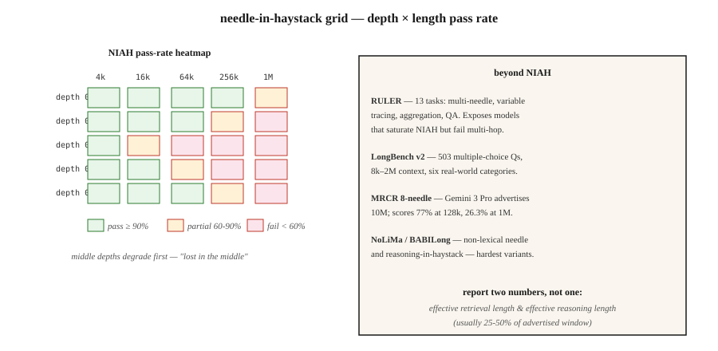

# 长上下文评估——NIAH、RULER、LongBench、MRCR

> Gemini 3 Pro 宣传其上下文可达 10M tokens（词元）。在 1M tokens 时，8-needle MRCR 的得分降至 26.3%。宣传容量 ≠ 可用容量。长上下文评估能告诉你，产品所依赖的模型实际能处理多大规模的上下文。

**Type:** Learn
**Languages:** Python
**Prerequisites:** 阶段 5 · 13（问答），阶段 5 · 23（分块策略）
**Time:** ~60 分钟

## 要解决的问题

你有一份 200 页的合同。模型声称能处理 1M-token 的上下文。你把合同粘贴进去，问：“终止条款是什么？”模型给出了回答，却是根据封面作答，因为终止条款位于深入文本 120k tokens 的位置，已经超出模型实际能关注到的范围。

这就是 2026 年的上下文容量落差。规格表写着 1M 或 10M，实际可用的却只有其中的 60-70%，而且“可用”的含义取决于任务。

- **检索（在草堆中找一根针）：** 在不超过宣传上限的长度范围内，前沿模型的表现近乎完美。
- **多跳 / 聚合：** 对大多数模型而言，超过 ~128k 后表现会急剧下降。
- **根据分散的事实进行推理：** 最先失效的任务。

长上下文评估衡量的正是这些维度。本课将介绍各项基准、它们实际测量的内容，以及如何为你的领域构建自定义找针测试。

## 核心概念



**大海捞针（Needle-in-a-Haystack，NIAH，2023）。** 在长上下文的指定深度放入一条事实（“魔法词是菠萝”），让模型检索出来。遍历深度 × 长度的组合。这是最早的长上下文基准。如今前沿模型在这项基准上已达到饱和；它是一项必要但不充分的基线。

**RULER（Nvidia，2024）。** 共有 13 种任务类型，分属 4 类：检索（单项 / 多键 / 多值）、多跳追踪（变量追踪）、聚合（常见词的频率）以及问答（QA）。上下文长度可配置（4k 到 128k+）。它能揭示那些在 NIAH 上已达到饱和、却无法完成多跳任务的模型。在 2024 年发布的版本中，17 个声称支持 32k+ 上下文的模型里，只有一半在 32k 时仍能维持质量。

**LongBench v2（2024）。** 包含 503 道选择题，上下文长度为 8k-2M 个单词，覆盖六类任务：单文档问答、多文档问答、长上下文学习（in-context learning）、长对话、代码仓库和长篇结构化数据。它是衡量实际长上下文表现的生产应用基准。

**MRCR（Multi-Round Coreference Resolution，多轮共指消解）。** 对大规模多轮对话进行共指消解。它有 8-needle、24-needle 和 100-needle 变体，分别包含相应数量的“针”，用于揭示模型在注意力退化之前能同时兼顾多少条事实。

**NoLiMa。** “非词面匹配的针”。针与查询之间没有字面重叠；检索需要进行一步语义推理。它比 NIAH 更难。

**HELMET。** 将多篇文档拼接起来，再提出一个来自其中任意一篇的问题，测试选择性注意力。

**BABILong。** 将 bAbI 推理链嵌入无关的“草堆”文本中，测试在草堆中推理的能力，而不只是检索。

### 实际应该报告什么

- **宣传的上下文窗口。** 规格表上的数字。
- **有效检索长度。** NIAH 的通过率达到某个阈值（例如 90%）时的长度。
- **有效推理长度。** 多跳或聚合任务的通过率达到该阈值时的长度。
- **退化曲线。** 按任务类型分别绘制准确率随上下文长度的变化曲线。

在规格表中列出两个数字：有效检索长度和有效推理长度。通常，有效推理长度为宣传窗口的 25-50%。

```figure
gx-niah-decay
```

## 动手实现

### 步骤 1：为你的领域定制 NIAH

参见 `code/main.py`。基本框架如下：

```python
def build_haystack(filler_text, needle, depth_ratio, total_tokens):
    if not (0.0 <= depth_ratio <= 1.0):
        raise ValueError(f"depth_ratio must be in [0, 1], got {depth_ratio}")
    if total_tokens <= 0:
        raise ValueError(f"total_tokens must be positive, got {total_tokens}")

    filler_tokens = tokenize(filler_text)
    needle_tokens = tokenize(needle)
    if not filler_tokens:
        raise ValueError("filler_text produced no tokens")

    # Repeat filler until long enough to fill the haystack body.
    body_len = max(total_tokens - len(needle_tokens), 0)
    while len(filler_tokens) < body_len:
        filler_tokens = filler_tokens + filler_tokens
    filler_tokens = filler_tokens[:body_len]

    insert_at = min(int(body_len * depth_ratio), body_len)
    haystack = filler_tokens[:insert_at] + needle_tokens + filler_tokens[insert_at:]
    return " ".join(haystack)


def score_niah(model, haystack, question, expected):
    answer = model.complete(f"Context: {haystack}\nQ: {question}\nA:", max_tokens=50)
    return 1 if expected.lower() in answer.lower() else 0
```

遍历 `depth_ratio` ∈ {0, 0.25, 0.5, 0.75, 1.0} × `total_tokens` ∈ {1k, 4k, 16k, 64k} 的组合，并绘制热力图。这就是目标模型的 NIAH 评估卡。

### 步骤 2：多针变体

```python
def build_multi_needle(filler, needles, total_tokens):
    depths = [0.1, 0.4, 0.7]
    chunks = [filler[:int(total_tokens * 0.1)]]
    for depth, needle in zip(depths, needles):
        chunks.append(needle)
        next_chunk = filler[int(total_tokens * depth): int(total_tokens * (depth + 0.3))]
        chunks.append(next_chunk)
    return " ".join(chunks)
```

“三个魔法词分别是什么？”这类问题要求把三条信息全部检索出来。单针测试成功，并不能预测多针测试也会成功。

### 步骤 3：多跳变量追踪（RULER 风格）

```python
haystack = """X1 = 42. ... (filler) ... X2 = X1 + 10. ... (filler) ... X3 = X2 * 2."""
question = "What is X3?"
```

要得出答案，必须串联三次赋值操作。在 128k 长度下，前沿模型在这里的准确率往往会降至 50-70%。

### 步骤 4：在你的技术栈上使用 LongBench v2

```python
from datasets import load_dataset
longbench = load_dataset("THUDM/LongBench-v2")

def eval_model_on_longbench(model, subset="single-doc-qa"):
    tasks = [x for x in longbench["test"] if x["task"] == subset]
    correct = 0
    for x in tasks:
        answer = model.complete(x["context"] + "\n\nQ: " + x["question"], max_tokens=20)
        if normalize(answer) == normalize(x["answer"]):
            correct += 1
    return correct / len(tasks)
```

分别报告各类别的准确率。汇总分数会掩盖不同任务之间的巨大差异。

## 常见陷阱

- **只用 NIAH 评估。** 在 1M tokens 下通过 NIAH，并不能说明多跳任务的表现。务必运行 RULER 或自定义多跳测试。
- **均匀深度采样。** 许多实现只测试 depth=0.5。应测试 depth=0、0.25、0.5、0.75、1.0；“中间信息丢失”（lost in the middle）效应确实存在。
- **针与填充文本有词面重叠。** 如果针与填充文本共享关键词，检索就会变得轻而易举。应使用 NoLiMa 风格、没有重叠的针。
- **忽略延迟。** 1M-token 的提示词（prompt）需要 30-120 秒进行预填充（prefill）。衡量准确率时，也要测量首 token 延迟，即首个输出 token 到达所需的时间。
- **采用厂商自报的数字。** OpenAI、Google、Anthropic 都会公布自己的分数。务必针对你的实际用例独立复测。

## 实际使用

2026 年的技术栈：

| 场景 | 基准 |
|-----------|-----------|
| 快速合理性检查 | 在 3 个深度 × 3 种长度下运行自定义 NIAH |
| 为生产环境选择模型 | 在目标长度下运行 RULER（13 项任务） |
| 实际问答质量 | LongBench v2 单文档问答子集 |
| 多跳推理 | BABILong 或自定义变量追踪 |
| 会话 / 对话 | 在目标长度下运行 MRCR 8-needle |
| 模型升级回归测试 | 固定的内部 NIAH + RULER 测试框架，对每个新模型运行 |

生产应用的经验法则：在预期长度下完成 NIAH + 1 项推理任务测试之前，绝不要相信宣传的上下文窗口。

## 交付成果

保存为 `outputs/skill-long-context-eval.md`：

```markdown
---
name: long-context-eval
description: Design a long-context evaluation battery for a given model and use case.
version: 1.0.0
phase: 5
lesson: 28
tags: [nlp, long-context, evaluation]
---

Given a target model, target context length, and use case, output:

1. Tests. NIAH depth × length grid; RULER multi-hop; custom domain task.
2. Sampling. Depths 0, 0.25, 0.5, 0.75, 1.0 at each length.
3. Metrics. Retrieval pass rate; reasoning pass rate; time-to-first-token; cost-per-query.
4. Cutoff. Effective retrieval length (90% pass) and effective reasoning length (70% pass). Report both.
5. Regression. Fixed harness, rerun on every model upgrade, surface deltas.

Refuse to trust a context window from the model card alone. Refuse NIAH-only evaluation for any multi-hop workload. Refuse vendor self-reported long-context scores as independent evidence.
```

## 练习

1. **简单。** 构建 NIAH 测试，覆盖 3 个深度（0.25、0.5、0.75）× 3 种长度（1k、4k、16k）。在任意模型上运行，并将通过率绘制成 3×3 热力图。
2. **中等。** 添加含 3 根针的变体。在每种长度下衡量全部 3 根针的检索情况，与相同长度下的单针通过率比较。
3. **困难。** 构建变量追踪任务（X1 → X2 → X3，包含 3 跳），并将其嵌入 64k 的填充文本中。测量 3 个前沿模型的准确率，分别报告每个模型的有效推理长度。

## 关键术语

| 术语 | 常见说法 | 实际含义 |
|------|-----------------|-----------------------|
| NIAH | 大海捞针 | 在填充文本中埋入一条事实，让模型检索出来。 |
| RULER | 加强版 NIAH | 包含检索 / 多跳 / 聚合 / 问答四类，共 13 种任务类型。 |
| 有效上下文 | 真正的容量 | 准确率仍保持在阈值以上时的长度。 |
| 中间信息丢失 | 深度偏差 | 模型对长输入中间部分的内容关注不足。 |
| 多针 | 同时处理多条事实 | 埋入多条信息；测试同时分配注意力的能力，而不只是检索。 |
| MRCR | 多轮共指消解 | 包含 8、24 或 100 根针的共指消解；揭示注意力饱和。 |
| NoLiMa | 非词面匹配的针 | 针与查询没有字面相同的 tokens；需要推理。 |

## 延伸阅读

- [Kamradt（2023）。Needle in a Haystack 分析](https://github.com/gkamradt/LLMTest_NeedleInAHaystack)——最初的 NIAH 仓库。
- [Hsieh 等（2024）。RULER: What's the Real Context Size of Your Long-Context LMs?](https://arxiv.org/abs/2404.06654)——多任务基准。
- [Bai 等（2024）。LongBench v2](https://arxiv.org/abs/2412.15204)——真实场景中的长上下文评估。
- [Modarressi 等（2024）。NoLiMa: Non-lexical needles](https://arxiv.org/abs/2404.06666)——更难的找针任务。
- [Kuratov 等（2024）。BABILong](https://arxiv.org/abs/2406.10149)——在草堆中推理。
- [Liu 等（2024）。Lost in the Middle: How Language Models Use Long Contexts](https://arxiv.org/abs/2307.03172)——研究深度偏差的论文。
