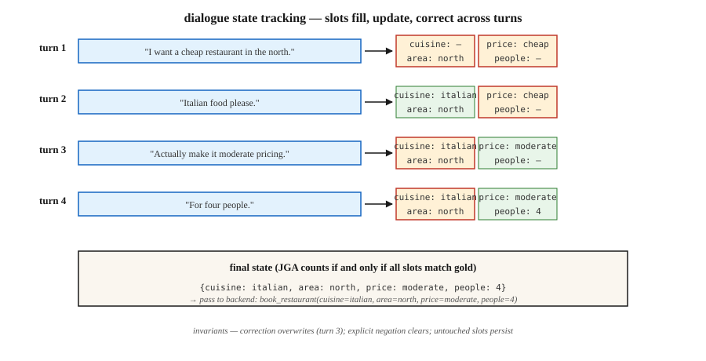

# 对话状态追踪

> “我想找一家北边的便宜餐厅……还是改成中等价位吧……再加上意大利菜。”三轮对话，三次状态更新。对话状态追踪（Dialogue State Tracking，DST）让槽位—值字典与对话保持同步，确保预订顺利完成。

**Type:** Build
**Languages:** Python
**Prerequisites:** 阶段 5 · 17（聊天机器人），阶段 5 · 20（结构化输出）
**Time:** ~75 分钟

## 要解决的问题

在面向任务的对话系统中，用户的目标被编码为一组槽位—值对（slot-value pairs）：`{cuisine: italian, area: north, price: moderate}`。在每一轮对话中，用户都可能新增、更改或移除一个槽位。系统必须读取整段对话，并正确输出当前状态。

只要一个槽位出错，系统就会订错餐厅、安排错航班，或从错误的银行卡扣款。DST 连接着用户所说的内容与后端执行的操作。

尽管已经有了大语言模型（LLM），为什么 DST 在 2026 年仍然重要：

- 对合规要求敏感的领域（银行、医疗、机票预订）需要确定的槽位值，不能依赖自由形式的生成。
- 使用工具的智能体（agent）在调用 API（应用程序编程接口）之前，仍然需要确定槽位值。
- 处理多轮对话中的更正，比看起来更难：“不对，还是改成星期四。”

现代处理管线：经典 DST 概念 + LLM 抽取器 + 结构化输出安全护栏（guardrail）。

## 核心概念



**任务结构。** schema（结构定义）定义领域（domain，如餐厅 restaurant、酒店 hotel、出租车 taxi）及各领域的槽位（slot，如菜系 cuisine、区域 area、价位 price、人数 people）。每个槽位可以为空，也可以填入封闭集合中的某个值（price: {cheap, moderate, expensive}），或填入自由形式的值（name: "The Copper Kettle"）。

**DST 的两种建模方式。**

- **分类。** 对每个 (slot, candidate_value) 对预测 yes/no。适用于封闭词表槽位。这是 2020 年以前的标准做法。
- **生成。** 给定对话，以自由文本生成槽位值。适用于开放词表槽位。这是当前的默认做法。

**指标。** 联合目标准确率（Joint Goal Accuracy，JGA）指*所有*槽位都正确的轮次占比。要么全对，要么该轮不计为正确。2026 年 MultiWOZ 2.4 排行榜的最高水平约为 83%。

**架构。**

1. **基于规则（槽位正则表达式 regex + 关键词）。** 狭窄领域中的强基线，便于调试。
2. **TripPy / BERT-DST。** 结合 BERT 编码的基于复制的生成。这是 LLM 出现之前的标准做法。
3. **LDST（LLaMA + LoRA）。** 经过指令微调的 LLM，以领域和槽位构造提示词（prompt）；LoRA 指低秩适配。在 MultiWOZ 2.4 上达到 ChatGPT 级别的质量。
4. **无本体（Ontology-free，2024–26）。** 跳过 schema，直接生成槽位名称和值。适用于开放领域。
5. **提示词 + 结构化输出（2024–26）。** LLM 配合 Pydantic schema + 约束解码（constrained decoding）。5 行代码即可用于生产环境。

### 典型失效模式

- **跨轮次共指。** “还是选第一个选项吧。”需要消解共指（coreference resolution），确定指的是哪个选项。
- **覆盖还是追加。** 用户说“加上意大利菜”。应该替换菜系，还是追加一种菜系？
- **隐式确认。** “好，挺好的。”这是否表示接受了所提供的预订方案？
- **更正。** “还是改成 7 pm 吧。”必须更新时间，但不能清空其他槽位。
- **指向系统上一轮话语的共指。** “对，就是那个。”“那个”到底指什么？

```figure
n5-slot-tracker
```

## 动手实现

### 步骤 1：基于规则的槽位抽取器

参见 `code/main.py`。正则表达式 + 同义词字典可以覆盖狭窄领域中 70% 的规范表述：

```python
CUISINE_SYNONYMS = {
    "italian": ["italian", "pasta", "pizza", "italy"],
    "chinese": ["chinese", "chow mein", "noodles"],
}


def extract_cuisine(utterance):
    for canonical, synonyms in CUISINE_SYNONYMS.items():
        if any(syn in utterance.lower() for syn in synonyms):
            return canonical
    return None
```

一旦超出规范词表，这种方法就很脆弱。它适合对槽位进行确定性确认。

### 步骤 2：状态更新循环

```python
def update_state(state, utterance):
    new_state = dict(state)
    for slot, extractor in SLOT_EXTRACTORS.items():
        value = extractor(utterance)
        if value is not None:
            new_state[slot] = value
    for slot in NEGATION_CLEARS:
        if is_negated(utterance, slot):
            new_state[slot] = None
    return new_state
```

三条不变量：

- 绝不重置用户未涉及的槽位。
- 出现明确否定（“不用管菜系了”）时，必须清空相应槽位。
- 用户作出更正（“还是改成……”）时，必须覆盖，而不是追加。

### 步骤 3：用结构化输出实现 LLM 驱动的 DST

```python
from pydantic import BaseModel
from typing import Literal, Optional
import instructor

class RestaurantState(BaseModel):
    cuisine: Optional[Literal["italian", "chinese", "indian", "thai", "any"]] = None
    area: Optional[Literal["north", "south", "east", "west", "center"]] = None
    price: Optional[Literal["cheap", "moderate", "expensive"]] = None
    people: Optional[int] = None
    day: Optional[str] = None


def llm_dst(history, llm):
    prompt = f"""You track the slot values of a restaurant booking across turns.
Dialogue so far:
{render(history)}

Update the state based on the latest user turn. Output only the JSON state."""
    return llm(prompt, response_model=RestaurantState)
```

Instructor + Pydantic 保证得到有效的状态对象。不需要正则表达式，不会出现 schema 不匹配，也不会凭空编造槽位。

### 步骤 4：JGA 评估

```python
def joint_goal_accuracy(predicted_states, gold_states):
    correct = sum(1 for p, g in zip(predicted_states, gold_states) if p == g)
    return correct / len(predicted_states)
```

校准标准：系统能在多少比例的轮次中把所有槽位都判断正确？在 MultiWOZ 2.4 上，2026 年顶尖系统的水平为 80-83%。你的领域内系统在自己的狭窄词表上应该超过这一水平，否则就输给了 LLM 基线。

### 步骤 5：处理更正

```python
CORRECTION_CUES = {"actually", "no wait", "on second thought", "change that to"}


def is_correction(utterance):
    return any(cue in utterance.lower() for cue in CORRECTION_CUES)
```

检测到更正时，应覆盖最近更新的槽位，而不是追加。没有 LLM 帮助，很难把这一点做好。现代做法是始终让 LLM 根据历史重新生成完整状态，而不是增量更新；这样就能自然地处理更正。

## 常见陷阱

- **基于完整历史重新生成的成本。** 让 LLM 每轮重新生成状态，总计会消耗 O(n²) 个 token（词元）。应限制历史长度，或对较早的轮次作摘要。
- **schema 漂移。** 事后新增槽位会破坏旧训练数据的适用性。应对 schema 进行版本管理。
- **大小写敏感。** “Italian”、“italian”和“ITALIAN”有所不同，所有环节都要做规范化。
- **隐式继承。** 如果用户之前指定了“4 人用餐”，之后要求换个时间，就不应该清空人数槽位。始终传入完整历史。
- **自由形式还是封闭集合。** 名称、时间和地址需要自由形式的槽位；菜系和区域则属于封闭集合。在 schema 中同时使用这两类槽位。

## 实际使用

2026 年的技术栈：

| 场景 | 方法 |
|-----------|----------|
| 狭窄领域（一两个意图） | 基于规则 + 正则表达式 |
| 广泛领域，有标注数据 | LDST（在 MultiWOZ 风格的数据上使用 LLaMA + LoRA） |
| 广泛领域，无标注，需要投入生产 | LLM + Instructor + Pydantic schema |
| 口语 / 语音 | 自动语音识别（ASR）+ 规范化器 + LLM-DST |
| 跨领域预订流程 | 由 schema 引导的 LLM，为每个领域使用各自的 Pydantic 模型 |
| 对合规要求敏感 | 以规则为主，LLM 配合确认流程作为后备方案 |

## 交付成果

保存为 `outputs/skill-dst-designer.md`：

```markdown
---
name: dst-designer
description: Design a dialogue state tracker — schema, extractor, update policy, evaluation.
version: 1.0.0
phase: 5
lesson: 29
tags: [nlp, dialogue, task-oriented]
---

Given a use case (domain, languages, vocab openness, compliance needs), output:

1. Schema. Domain list, slots per domain, open vs closed vocabulary per slot.
2. Extractor. Rule-based / seq2seq / LLM-with-Pydantic. Reason.
3. Update policy. Regenerate-whole-state / incremental; correction handling; negation handling.
4. Evaluation. Joint Goal Accuracy on a held-out dialogue set, slot-level precision/recall, confusion on the hardest slot.
5. Confirmation flow. When to explicitly ask the user to confirm (destructive actions, low-confidence extractions).

Refuse LLM-only DST for compliance-sensitive slots without a rule-based secondary check. Refuse any DST that cannot roll back a slot on user correction. Flag schemas without version tags.
```

## 练习

1. **简单。** 在 `code/main.py` 中构建基于规则的状态追踪器，处理 3 个槽位（cuisine、area、price）。用 10 段手工编写的对话进行测试，并测量 JGA。
2. **中等。** 在同一数据集上使用 Instructor + Pydantic + 小型 LLM。比较 JGA，检查最难处理的轮次。
3. **困难。** 实现这两种方案并进行路由：以规则为主，当规则方案能够有把握地输出的槽位数 <2 时，使用 LLM 作为后备方案。测量组合系统的 JGA，以及每轮的推理成本。

## 关键术语

| 术语 | 通常的说法 | 实际含义 |
|------|-----------------|-----------------------|
| DST | 对话状态追踪 | 在多轮对话中持续维护槽位—值字典。 |
| 槽位（Slot） | 用户意图的组成单元 | 后端所需的具名参数（cuisine、date）。 |
| 领域（Domain） | 任务所属领域 | 餐厅、酒店、出租车等，各自对应一组槽位。 |
| JGA | 联合目标准确率 | 所有槽位均正确的轮次占比。要么全对，要么该轮不计为正确。 |
| MultiWOZ | 基准 | 多领域 WOZ 数据集；标准的 DST 评估基准。 |
| 无本体 DST（Ontology-free DST） | 不使用 schema | 直接生成槽位名称和值，没有固定列表。 |
| 更正（Correction） | “还是改成……” | 覆盖先前已填槽位的对话轮次。 |

## 延伸阅读

- [Budzianowski et al. (2018). MultiWOZ — A Large-Scale Multi-Domain Wizard-of-Oz](https://arxiv.org/abs/1810.00278) —— 经典基准。
- [Feng et al. (2023). Towards LLM-driven Dialogue State Tracking (LDST)](https://arxiv.org/abs/2310.14970) —— 使用 LLaMA + LoRA 为 DST 进行指令微调。
- [Heck et al. (2020). TripPy — A Triple Copy Strategy for Value Independent Neural Dialog State Tracking](https://arxiv.org/abs/2005.02877) —— 基于复制的 DST 主力方法。
- [King, Flanigan (2024). Unsupervised End-to-End Task-Oriented Dialogue with LLMs](https://arxiv.org/abs/2404.10753) —— 基于 EM（期望最大化）的无监督面向任务对话（TOD）。
- [MultiWOZ leaderboard](https://github.com/budzianowski/multiwoz) —— 标准 DST 结果。
