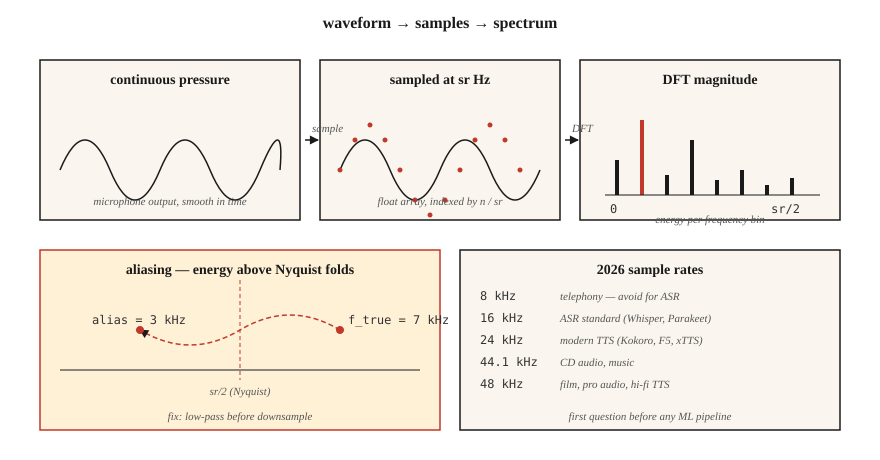

# 音频基础：波形、采样与 Fourier 变换

> 波形（waveform）是原始信号，频谱图（spectrogram）是它的表示形式，而 mel（梅尔频率尺度）特征则是适合机器学习的形式。现代自动语音识别（ASR）和文本转语音（TTS）流程都要沿着这条阶梯前进，第一步就是理解采样与 Fourier 变换（傅里叶变换）。

**Type:** Learn
**Languages:** Python
**Prerequisites:** 阶段 1 · 06（向量与矩阵），阶段 1 · 14（概率分布）
**Time:** ~45 分钟

## 要解决的问题

麦克风产生的是声压随时间变化的信号，神经网络接收的却是张量。两者之间有一整套约定，违反这些约定就会产生不易察觉的错误：模型训练看似正常，词错误率（WER）却翻倍；TTS 输出带有嘶嘶声；或者声音克隆系统记住了麦克风的特征，而不是说话人的特征。

语音系统中的每个错误都可以追溯到以下三个问题之一：

1. 数据录制时的采样率是多少，模型要求的又是多少？
2. 信号是否发生了混叠（aliasing）？
3. 你处理的是原始采样值，还是频域表示？

把这些问题处理好，阶段 6 的其余内容就容易掌握。处理不好，即使 Whisper-Large-v4 也只会产生糟糕的结果。

## 核心概念



**波形。** 由 `[-1.0, 1.0]` 范围内的浮点数组成的一维数组，以采样点编号为索引。要换算成秒，就除以采样率：`t = n / sr`。一段采样率为 16 kHz、时长为 10 秒的音频，是一个含有 160,000 个浮点数的数组。

**采样率（sampling rate，sr）。** 每秒采集的采样点数。2026 年常见的采样率如下：

| 采样率 | 用途 |
|------|-----|
| 8 kHz | 电话及早期 VOIP。Nyquist 频率为 4 kHz，会丢失辅音。ASR 应避免使用。 |
| 16 kHz | ASR 的标准采样率。Whisper、Parakeet、SeamlessM4T v2 都接收 16 kHz 音频。 |
| 22.05 kHz | 较早期模型的 TTS 声码器（vocoder）训练。 |
| 24 kHz | 现代 TTS（Kokoro、F5-TTS、xTTS v2）。 |
| 44.1 kHz | CD 音频、音乐。 |
| 48 kHz | 电影、专业音频、高保真 TTS（VALL-E 2、NaturalSpeech 3）。 |

**Nyquist-Shannon。** 采样率为 `sr` 时，能够无歧义地表示最高到 `sr/2` 的频率。`sr/2` 这一边界就是 *Nyquist 频率*。高于 Nyquist 频率的能量会发生 *混叠*，即折叠到较低频率，从而破坏信号。在降采样（downsampling）之前，务必先进行低通滤波。

**位深（bit depth）。** 16 位 PCM（脉冲编码调制，有符号 int16，范围 ±32,767）是通用的交换格式。音乐使用 24 位，内部数字信号处理（DSP）使用 32 位浮点数。`soundfile` 等库读取 int16 数据，但对外提供 `[-1, 1]` 范围内的 float32 数组。

**Fourier 变换。** 任何有限信号都可以表示为不同频率的正弦波之和。离散 Fourier 变换（DFT）对 `N` 个采样值计算出 `N` 个复系数，每个频点（frequency bin）对应一个。`bin k` 对应的频率为 `k · sr / N` Hz。复系数的模（magnitude）是该频率处的幅度（amplitude），角度则是相位（phase）。

**FFT。** 快速 Fourier 变换：当 `N` 为 2 的幂时，以 `O(N log N)` 的复杂度计算 DFT 的算法。每个音频库的底层都使用 FFT。对采样率为 16 kHz 的 1024 个采样值做 FFT，可得到 512 个可用频点，覆盖 0–8 kHz，分辨率为 15.6 Hz。

**分帧与加窗。** 我们不会对整段音频做一次 FFT，而是将其切成相互重叠的 *帧（frame）*（通常帧长为 25 ms、帧移（hop）为 10 ms），将每帧乘以窗函数（Hann、Hamming），以消除边缘处的不连续性，再逐帧做 FFT。这就是短时 Fourier 变换（STFT）。第 02 课会从这里继续展开。

```figure
mel-scale
```

## 动手实现

### 步骤 1：读取音频片段并绘制波形

`code/main.py` 只使用标准库中的 `wave` 模块，使演示无需额外依赖。在生产环境中，你会使用 `soundfile` 或 `torchaudio.load`（两者都返回 `(waveform, sr)` 元组）：

```python
import soundfile as sf
waveform, sr = sf.read("clip.wav", dtype="float32")  # shape (T,), sr=int
```

### 步骤 2：从基本原理合成正弦波

```python
import math

def sine(freq_hz, sr, seconds, amp=0.5):
    n = int(sr * seconds)
    return [amp * math.sin(2 * math.pi * freq_hz * i / sr) for i in range(n)]
```

以 16 kHz 采样率生成 1 秒的 440 Hz 正弦波（标准音 A），会得到 16,000 个浮点数。用 `wave.open(..., "wb")` 以 16 位 PCM 编码写入。

### 步骤 3：手动计算 DFT

```python
def dft(x):
    N = len(x)
    out = []
    for k in range(N):
        re = sum(x[n] * math.cos(-2 * math.pi * k * n / N) for n in range(N))
        im = sum(x[n] * math.sin(-2 * math.pi * k * n / N) for n in range(N))
        out.append((re, im))
    return out
```

`O(N²)` 的复杂度，对于 `N=256` 时验证正确性还可以，但不适合真实音频处理。实际代码会调用 `numpy.fft.rfft` 或 `torch.fft.rfft`。

### 步骤 4：找出主频

模的峰值索引 `k_star` 对应频率 `k_star * sr / N`。对 440 Hz 正弦波运行该过程，应当在频点 `440 * N / sr` 处得到峰值。

### 步骤 5：演示混叠

以 10 kHz 采样率对 7 kHz 正弦波采样（Nyquist 频率 = 5 kHz）。7 kHz 音调高于 Nyquist 频率，会折叠为 `10 − 7 = 3 kHz`。FFT 峰值出现在 3 kHz。这是经典的混叠演示，也解释了为什么每个 DAC（数模转换器）/ADC（模数转换器）都配有砖墙式低通滤波器（brick-wall low-pass filter，指截止处陡峭的滤波形状）。

## 实际使用

2026 年实际交付时会用到的技术栈：

| 任务 | 库 | 原因 |
|------|---------|-----|
| 读写 WAV/FLAC/OGG | `soundfile`（libsndfile 的封装） | 速度最快、稳定，返回 float32。 |
| 重采样 | `torchaudio.transforms.Resample` 或 `librosa.resample` | 内置正确的抗混叠处理。 |
| STFT / mel | `torchaudio` 或 `librosa` | 对 GPU 友好；属于 PyTorch 生态。 |
| 实时流式处理 | `sounddevice` 或 `pyaudio` | 跨平台的 PortAudio 绑定。 |
| 检查文件 | `ffprobe` 或 `soxi` | 命令行工具，速度快，可报告 sr/声道数/编解码器。 |

决策规则：**在匹配其他任何条件之前，先匹配采样率**。Whisper 要求 16 kHz、单声道、float32 音频。传入 44.1 kHz 立体声音频，就会得到看起来像模型出错的糟糕结果。

## 交付成果

保存为 `outputs/skill-audio-loader.md`。这个技能（skill）帮助你检查音频输入是否符合下游模型的要求，并在不符合时正确地重采样。

## 练习

1. **简单。** 以 16 kHz 采样率合成 1 秒的 220 Hz + 440 Hz + 880 Hz 混合信号。运行 DFT，确认三个峰值位于预期频点。
2. **中等。** 以 48 kHz 采样率录制一段 3 秒的 WAV 语音。使用 `torchaudio.transforms.Resample`（带抗混叠）将其降采样到 16 kHz，再用朴素抽取（decimation，即每三个采样点取一个）将原音频降采样到 16 kHz。对两种结果分别做 FFT。混叠出现在哪里？
3. **困难。** 仅使用 `math` 和步骤 3 中的 DFT，从零实现 STFT。帧长为 400，帧移为 160，采用 Hann 窗。用 `matplotlib.pyplot.imshow` 绘制模的大小。这就是第 02 课的频谱图。

## 关键术语

| 术语 | 常见说法 | 实际含义 |
|------|-----------------|-----------------------|
| 采样率 | 每秒采集多少个采样点 | ADC 测量信号的频率，单位为 Hz。 |
| Nyquist | 能表示的最高频率 | `sr/2`；高于它的能量会混叠回较低频率。 |
| 位深 | 每个采样值的分辨率 | `int16` = 65,536 个量化级；`float32` = `[-1, 1]` 范围内的 24 位精度。 |
| DFT | 用于序列的 Fourier 变换 | `N` 个采样值 → `N` 个复数频率系数。 |
| FFT | 快速的 DFT | `O(N log N)` 算法，要求 `N` = 2 的幂。 |
| 频点 | 频率列 | `k · sr / N` Hz；分辨率 = `sr / N`。 |
| STFT | 频谱图的底层计算 | 随时间进行分帧、加窗后的 FFT。 |
| 混叠 | 奇怪的频率重影 | 高于 Nyquist 频率的能量镜像折叠到较低频点。 |

## 延伸阅读

- [Shannon (1949). Communication in the Presence of Noise](https://people.math.harvard.edu/~ctm/home/text/others/shannon/entropy/entropy.pdf) — 采样定理背后的论文。
- [Smith — The Scientist and Engineer's Guide to Digital Signal Processing](https://www.dspguide.com/ch8.htm) — 免费的经典 DSP 教材。
- [librosa docs — audio primer](https://librosa.org/doc/latest/auto_tutorials/index.html) — 配有代码的实用教程。
- [Heinrich Kuttruff — Room Acoustics (6th ed.)](https://www.taylorfrancis.com/books/mono/10.1201/9781315372150/room-acoustics-heinrich-kuttruff) — 帮助理解为什么现实音频并非纯净正弦波的参考书。
- [Steve Eddins — FFT Interpretation notebook](https://blogs.mathworks.com/steve/2020/03/30/fft-spectrum-and-spectral-densities/) — 用 10 分钟理清对频点的直觉。
