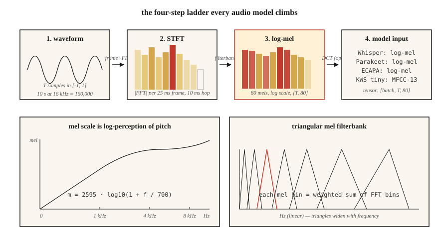

# 频谱图、mel 尺度与音频特征

> 神经网络不擅长直接处理原始波形，却能处理频谱图（spectrogram），而基于梅尔频率尺度（mel）的频谱图效果更好。2026 年的每个自动语音识别（ASR）、文本转语音（TTS）系统和音频分类器，都成败系于这一个预处理选择。

**Type:** Build
**Languages:** Python
**Prerequisites:** 阶段 6 · 01（音频基础）
**Time:** ~45 分钟

## 要解决的问题

以一段时长 10 秒、采样率为 16 kHz 的音频为例，它包含 160,000 个浮点数，都位于 `[-1, 1]` 范围内，与“狗叫”或“单词 cat”这样的标签几乎完全不相关。原始波形包含信息，但其形式让模型难以提取。相隔 100 ms 发出的两个相同音素，会有完全不同的原始采样点。

频谱图解决了这个问题。它压缩人类感知忽略的时间细节（微秒级抖动），并保留人类感知关注的结构（在 ~10–25 ms 的时间窗口内，哪些频率具有较高能量）。

mel 频谱图更进一步。人类对音高的感知呈对数关系：100 Hz 与 200 Hz 听起来的“间距”，和 1000 Hz 与 2000 Hz 的“间距”相同。mel 尺度通过变换频率轴来匹配这种感知。采用 mel 尺度的频谱图，是从 2010 到 2026 年语音机器学习中最重要的单一特征。

## 核心概念



**短时傅里叶变换（STFT）。** 将波形切分为相互重叠的帧（典型设置：25 ms 窗长、10 ms 帧移 = 在 16 kHz 下分别为 400 个采样点 / 160 个采样点）。每一帧都乘以窗函数（默认使用 Hann；Hamming 的取舍略有不同）。对每帧进行快速傅里叶变换（FFT）。将幅度谱堆叠成形状为 `(n_frames, n_freq_bins)` 的矩阵，这就是频谱图。

**对数幅度。** 原始幅度跨越 5-6 个数量级。取 `log(|X| + 1e-6)` 或 `20 * log10(|X|)` 来压缩动态范围。所有生产流水线都使用对数幅度，而非原始幅度。

**mel 尺度。** 单位为 Hz 的频率 `f` 可映射为 mel 值 `m`，公式为 `m = 2595 * log10(1 + f / 700)`。这一映射在 1 kHz 以下近似线性，在更高频率处近似对数。覆盖 0–8 kHz 的 80 个 mel 频带是标准的 ASR 输入。

**mel 滤波器组。** 一组在 mel 尺度上等间距分布的三角滤波器。每个滤波器对相邻的 FFT 频点进行加权求和。将 STFT 幅度与滤波器组矩阵相乘，一次矩阵乘法就能得到 mel 频谱图。

**log-mel 频谱图。** `log(mel_spec + 1e-10)`。Whisper 的输入，Parakeet 的输入，SeamlessM4T 的输入，也是 2026 年通用的音频前端。

**MFCC（梅尔频率倒谱系数）。** 对 log-mel 频谱图应用离散余弦变换（DCT，II 型），保留前 13 个系数。这会降低特征间的相关性，并进一步压缩表示。它一直是主流特征，直到大约 2015 年，直接处理 log-mel 的卷积神经网络（CNN）和 Transformer 赶了上来。它仍用于说话人识别（x-vectors、ECAPA）。

**分辨率取舍。** 更大的 FFT = 更好的频率分辨率，但更差的时间分辨率。25 ms / 10 ms 是音频机器学习的默认设置；音乐使用 50 ms / 12.5 ms；瞬态检测（鼓点、爆破音）使用 5 ms / 2 ms。

```figure
spectrogram-window
```

## 动手实现

### 步骤 1：对波形分帧

```python
def frame(signal, frame_len, hop):
    n = 1 + (len(signal) - frame_len) // hop
    return [signal[i * hop : i * hop + frame_len] for i in range(n)]
```

一段时长 10 秒、采样率为 16 kHz 的音频，在 `frame_len=400, hop=160` 时会得到 998 帧。

### 步骤 2：Hann 窗

```python
import math

def hann(N):
    return [0.5 * (1 - math.cos(2 * math.pi * n / (N - 1))) for n in range(N)]
```

在 FFT 之前逐元素相乘。这样可以消除在非零端点处截断所导致的频谱泄漏。

### 步骤 3：STFT 幅度

```python
def stft_magnitude(signal, frame_len=400, hop=160):
    win = hann(frame_len)
    frames = frame(signal, frame_len, hop)
    return [magnitudes(dft([w * s for w, s in zip(win, f)])) for f in frames]
```

生产环境使用 `torch.stft` 或 `librosa.stft`（基于 FFT，采用向量化实现）。这里的循环用于教学，会在 `code/main.py` 中对短音频片段运行。

### 步骤 4：mel 滤波器组

```python
def hz_to_mel(f):
    return 2595.0 * math.log10(1.0 + f / 700.0)

def mel_to_hz(m):
    return 700.0 * (10 ** (m / 2595.0) - 1)

def mel_filterbank(n_mels, n_fft, sr, fmin=0, fmax=None):
    fmax = fmax or sr / 2
    mels = [hz_to_mel(fmin) + (hz_to_mel(fmax) - hz_to_mel(fmin)) * i / (n_mels + 1)
            for i in range(n_mels + 2)]
    hzs = [mel_to_hz(m) for m in mels]
    bins = [int(h * n_fft / sr) for h in hzs]
    fb = [[0.0] * (n_fft // 2 + 1) for _ in range(n_mels)]
    for m in range(n_mels):
        for k in range(bins[m], bins[m + 1]):
            fb[m][k] = (k - bins[m]) / max(1, bins[m + 1] - bins[m])
        for k in range(bins[m + 1], bins[m + 2]):
            fb[m][k] = (bins[m + 2] - k) / max(1, bins[m + 2] - bins[m + 1])
    return fb
```

当 `n_fft=400` 时，覆盖 0–8 kHz 的 80 个 mel 频带会得到一个 `(80, 201)` 矩阵。将形状为 `(n_frames, 201)` 的 STFT 幅度矩阵与滤波器组矩阵的转置相乘，得到形状为 `(n_frames, 80)` 的 mel 频谱图。

### 步骤 5：log-mel

```python
def log_mel(mel_spec, eps=1e-10):
    return [[math.log(max(v, eps)) for v in frame] for frame in mel_spec]
```

常见替代方法包括 `librosa.power_to_db`（按参考值归一化的 dB）和 `10 * log10(power + eps)`。Whisper 使用更复杂的裁剪 + 归一化流程（参见 Whisper 的 `log_mel_spectrogram`）。

### 步骤 6：MFCC

```python
def dct_ii(x, n_coeffs):
    N = len(x)
    return [
        sum(x[n] * math.cos(math.pi * k * (2 * n + 1) / (2 * N)) for n in range(N))
        for k in range(n_coeffs)
    ]
```

对每个 log-mel 帧应用 DCT，保留前 13 个系数，这就得到 MFCC 矩阵。通常会丢弃第一个系数，因为它编码了整体能量。

## 实际使用

2026 年的技术栈：

| 任务 | 特征 |
|------|----------|
| ASR（Whisper、Parakeet、SeamlessM4T） | 80 个 log-mel 频带，10 ms 帧移，25 ms 窗长 |
| TTS 声学模型（VITS、F5-TTS、Kokoro） | 80 个 mel 频带，5–12 ms 帧移，用于精细的时间控制 |
| 音频分类（AST、PANNs、BEATs） | 128 个 log-mel 频带，10 ms 帧移 |
| 说话人嵌入（embedding）（ECAPA-TDNN、WavLM） | 80 个 log-mel 频带，或基于原始波形的自监督学习（SSL） |
| 音乐（MusicGen、Stable Audio 2） | EnCodec 离散 token（词元），而非 mel 特征 |
| 关键词检测 | 面向小型设备的 40 个 MFCC 系数 |

经验法则：**只要不是处理音乐，就从 80 个 log-mel 频带开始。** 采用其他选择需要充分理由。

## 2026 年仍会带入生产环境的陷阱

- **mel 数量不匹配。** 训练时使用 80 个 mel 频带，推理时使用 128 个。故障可能悄无声息地发生。两端都应记录特征形状。
- **上游采样率不匹配。** 以 22.05 kHz 计算的 mel 特征与以 16 kHz 计算的不同。应在特征化*之前*修正采样率（SR）。
- **dB 与对数。** Whisper 需要 log-mel，而非 dB-mel。部分 HF 流水线会自动检测，你自己编写的代码则不会。
- **归一化漂移。** 训练时对每条语音单独归一化，推理时却使用全局归一化。这种生产环境错误会让词错误率（WER）翻倍。
- **填充导致的泄漏。** 在音频末尾补零，会使末尾帧产生平坦频谱。应使用对称填充或复制填充。

## 交付成果

保存为 `outputs/skill-feature-extractor.md`。这个技能文件会根据给定的目标模型，选择特征类型、mel 数量、帧长/帧移和归一化方式。

## 练习

1. **简单。** 运行 `code/main.py`。它会合成一个啁啾信号（频率从 200 → 4000 Hz 扫过），并打印每帧最大值所在的 mel 频带索引。可以选择绘图，确认它与扫频过程一致。
2. **中等。** 将 `n_mels` 分别设为 `{40, 80, 128}`，将 `frame_len` 分别设为 `{200, 400, 800}`，重新运行。沿时间轴测量尖峰带宽。哪种组合最能分辨这个啁啾信号？
3. **困难。** 实现 `power_to_db`，并在 AudioMNIST 上比较小型 CNN 分类器使用以下特征时的 ASR 准确率：(a) 原始 log-mel，(b) 使用 `ref=max` 的 dB-mel，(c) MFCC-13 + delta + delta-delta。报告 top-1 准确率。

## 关键术语

| 术语 | 常见说法 | 实际含义 |
|------|-----------------|-----------------------|
| 帧 | 一个切片 | 输入一次 FFT 的 25 ms 波形片段。 |
| 帧移 | 步长 | 相邻帧之间间隔的采样点数；10 ms 是 ASR 的默认值。 |
| 窗 | Hann/Hamming 那类函数 | 逐点相乘的系数，使帧边缘逐渐衰减到零。 |
| STFT | 频谱图生成器 | 分帧 + 加窗后的 FFT，产生时间 × 频率矩阵。 |
| mel | 经过变换的频率 | 对数感知尺度；`m = 2595·log10(1 + f/700)`。 |
| 滤波器组 | 那个矩阵 | 将 STFT 投影到 mel 频带的三角滤波器。 |
| log-mel | Whisper 的输入 | `log(mel_spec + eps)`；在 2026 年已标准化。 |
| MFCC | 传统特征 | 对 log-mel 做 DCT，得到去相关的 13 个系数。 |

## 延伸阅读

- [Davis、Mermelstein（1980）：用于单音节词识别的参数化表示比较](https://ieeexplore.ieee.org/document/1163420) - 提出 MFCC 的论文。
- [Stevens、Volkmann、Newman（1937）：用于测量音高心理量的尺度](https://pubs.aip.org/asa/jasa/article-abstract/8/3/185/735757/) - 最初的 mel 尺度。
- [OpenAI：Whisper 源码，log_mel_spectrogram](https://github.com/openai/whisper/blob/main/whisper/audio.py) - 阅读参考实现。
- [librosa 特征提取文档](https://librosa.org/doc/latest/api/feature.html) - `mfcc`、`melspectrogram` 以及帧移/窗长的参考资料。
- [NVIDIA NeMo：音频预处理](https://docs.nvidia.com/deeplearning/nemo/user-guide/docs/en/main/asr/asr_all.html#featurizers) - 面向 Parakeet + Canary 模型的生产规模流水线。
