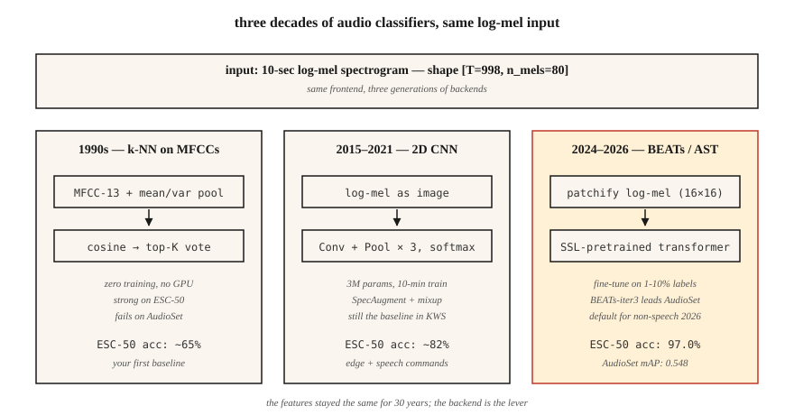

# 音频分类：从基于 MFCC 的 k-NN 到 AST 与 BEATs

> 从区分“狗叫还是警笛”到判断“这是什么语言”，都属于音频分类。所用特征是 mel（梅尔频率尺度）特征。架构每隔十年就会变迁，评估指标始终是 AUC（曲线下面积）、F1 分数和各类别召回率。

**Type:** Build
**Languages:** Python
**Prerequisites:** 阶段 6 · 02（频谱图与 Mel）、阶段 3 · 06（CNN）、阶段 5 · 08（用于文本的 CNN 与 RNN）
**Time:** ~75 分钟

## 要解决的问题

拿到一段 10 秒的音频，你想知道：“这是什么声音？”可能要识别城市声音（警笛、电钻、狗叫）、语音指令（yes/no/stop）、语言（en/es/ar）、说话人的情绪（愤怒/中性），或者环境声音（室内/室外、嘈杂人声）。这些都属于 *音频分类* 。到了 2026 年，基线架构已经成熟：log-mel（经对数压缩的 mel 特征）→ 卷积神经网络（CNN）或 Transformer → softmax。

核心难点在数据，而非网络。音频数据集存在严重的类别不平衡（class imbalance）、明显的领域偏移（domain shift，例如干净音频与含噪音频之间的差异），还有标签噪声（“城市中的嘈杂人声”和“餐厅噪声”究竟由谁划分？）。问题的 80% 在于数据整理、数据增强和评估，而不是把 CNN 换成 Transformer。

## 核心概念



**基于 MFCC 的 k-NN（1990 年代的基线）。** 将每个片段的 MFCC（梅尔频率倒谱系数）展平，与带标签的样本库计算余弦相似度（cosine similarity），再由相似度最高的 K 个样本进行多数投票。这就是 k 近邻（k-NN）分类。它在干净的小型数据集（Speech Commands、ESC-50）上表现出乎意料地好，无需 GPU 即可运行。

**基于 log-mel 的 2D CNN（2015-2019）。** 将形状为 `(T, n_mels)` 的 log-mel 当作图像，使用 ResNet-18 或 VGG 风格的网络。沿时间轴做全局均值池化，再对各类别做 softmax。在 2026 年的大多数 kaggle 竞赛中，这仍然是基线方法。

**音频频谱图 Transformer（Audio Spectrogram Transformer，AST，2021-2024）。** 将 log-mel 切成频谱图块（例如 16×16 的块），加入位置嵌入（position embeddings），再送入视觉 Transformer（ViT）。在 AudioSet 的监督学习任务上达到当前最佳水平（SOTA），平均精确率均值（mAP）为 0.485。

**BEATs 与 WavLM-base（2024-2026）。** 在数百万小时的音频上进行自监督预训练。微调（fine-tuning）到你的任务时，只需原本所需监督数据量的 1-10%。在 2026 年，这是非语音音频任务的默认起点。BEATs-iter3 在 AudioSet 上的 mAP 比 AST 高 1-2，而计算量仅为其 1/4。

**将 Whisper-encoder 用作冻结的主干网络（frozen backbone，2024）。** 取出 Whisper 的编码器，去掉解码器，接上线性分类器。无需任何音频增强，就能在语言识别和简单事件分类上接近 SOTA。这是一种“免费午餐”式的基线。

### 类别不平衡才是真正的挑战

ESC-50：50 个类别，每类 40 个片段，分布均衡，任务简单。UrbanSound8K：10 个类别，不平衡比例为 10:1。AudioSet：632 个类别，长尾比例达 100,000:1。有效的方法包括：

- 训练时使用均衡采样，评估时不要使用。
- Mixup：对两个片段及其标签做线性插值，以此增强数据。
- SpecAugment：随机遮蔽一些时间段和频带。方法简单，却很关键。

### 评估

- 多类别、互斥标签任务（Speech Commands）：top-1 准确率、top-5 准确率。
- 多类别、多标签任务（AudioSet、UrbanSound 风格的任务）：平均精确率均值（mAP）。
- 严重不平衡的任务：各类别召回率 + 宏平均 F1。

2026 年值得了解的指标数值：

| 基准 | 基线 | 2026 年 SOTA | 来源 |
|-----------|----------|-----------|--------|
| ESC-50 | 82%（AST） | 97.0%（BEATs-iter3） | BEATs 论文（2024） |
| AudioSet mAP | 0.485（AST） | 0.548（BEATs-iter3） | HEAR 2026 年排行榜 |
| Speech Commands v2 | 98%（CNN） | 99.0%（Audio-MAE） | HEAR v2 结果 |

```figure
mfcc-pipeline
```

## 动手实现

### 第 1 步：提取特征

```python
def featurize_mfcc(signal, sr, n_mfcc=13, n_mels=40, frame_len=400, hop=160):
    mag = stft_magnitude(signal, frame_len, hop)
    fb = mel_filterbank(n_mels, frame_len, sr)
    mels = apply_filterbank(mag, fb)
    log = log_transform(mels)
    return [dct_ii(frame, n_mfcc) for frame in log]
```

### 第 2 步：生成定长汇总表示

```python
def summarize(mfcc_frames):
    n = len(mfcc_frames[0])
    mean = [sum(f[i] for f in mfcc_frames) / len(mfcc_frames) for i in range(n)]
    var = [
        sum((f[i] - mean[i]) ** 2 for f in mfcc_frames) / len(mfcc_frames) for i in range(n)
    ]
    return mean + var
```

方法简单，效果却很好：对时间维度求均值和方差，就能把含 13 个系数的 MFCC 汇总成固定的 26 维嵌入（embedding），计算几乎瞬间完成。直到 2017 年，这种方法在 ESC-50 上还曾胜过当时最先进的神经网络（NN）基线。

### 第 3 步：k-NN

```python
def cosine(a, b):
    dot = sum(x * y for x, y in zip(a, b))
    na = math.sqrt(sum(x * x for x in a)) or 1e-12
    nb = math.sqrt(sum(x * x for x in b)) or 1e-12
    return dot / (na * nb)

def knn_classify(q, bank, labels, k=5):
    sims = sorted(range(len(bank)), key=lambda i: -cosine(q, bank[i]))[:k]
    votes = Counter(labels[i] for i in sims)
    return votes.most_common(1)[0][0]
```

### 第 4 步：升级为基于 log-mel 的 CNN

使用 PyTorch：

```python
import torch.nn as nn

class AudioCNN(nn.Module):
    def __init__(self, n_mels=80, n_classes=50):
        super().__init__()
        self.body = nn.Sequential(
            nn.Conv2d(1, 32, 3, padding=1), nn.ReLU(), nn.MaxPool2d(2),
            nn.Conv2d(32, 64, 3, padding=1), nn.ReLU(), nn.MaxPool2d(2),
            nn.Conv2d(64, 128, 3, padding=1), nn.ReLU(),
            nn.AdaptiveAvgPool2d(1),
        )
        self.head = nn.Linear(128, n_classes)

    def forward(self, x):  # x: (B, 1, T, n_mels)
        return self.head(self.body(x).flatten(1))
```

参数量为 3M（M 表示百万）。使用单张 RTX 4090，在 ESC-50 上训练用时为 ~10 min（分钟），准确率达到 80%+。

### 第 5 步：微调预训练音频 Transformer（以 AST 为例）

```python
from transformers import ASTFeatureExtractor, ASTForAudioClassification

ext = ASTFeatureExtractor.from_pretrained("MIT/ast-finetuned-audioset-10-10-0.4593")
model = ASTForAudioClassification.from_pretrained(
    "MIT/ast-finetuned-audioset-10-10-0.4593",
    num_labels=50,
    ignore_mismatched_sizes=True,
)

inputs = ext(audio, sampling_rate=16000, return_tensors="pt")
logits = model(**inputs).logits
```

这个示例微调了从 Hub 获取的 AST。2026 年的默认选择 BEATs 不在 Hugging Face Hub 上：从 [microsoft/unilm 中的 BEATs 发布目录](https://github.com/microsoft/unilm/tree/master/beats)下载检查点，并使用该仓库的 `BEATs` 和 `BEATsConfig` 类加载；微调循环的整体形式保持不变。

## 实际使用

2026 年的技术栈：

| 场景 | 起步方案 |
|-----------|-----------|
| 极小数据集（<1000 个片段） | 基于 MFCC 均值的 k-NN（作为基线）+ 音频增强 |
| 中等数据集（1K–100K，K 表示千） | 微调 BEATs 或 AST |
| 大型数据集（>100K） | 从零训练，或微调 Whisper-encoder |
| 实时、边缘端 | 40-MFCC CNN，量化（quantization）为 int8（关键词检测 KWS 风格） |
| 多标签（AudioSet） | BEATs-iter3，配合二元交叉熵（BCE）损失 + mixup + SpecAugment |
| 语言识别 | MMS-LID、SpeechBrain VoxLingua107 基线 |

选择原则：**从冻结的主干网络起步，不要从一个全新模型起步** 。微调 BEATs 的分类头，几小时就能达到 SOTA 的 95%，无需花上数周。

## 交付成果

保存为 `outputs/skill-classifier-designer.md`。针对给定的音频分类任务，选择架构、数据增强方法、类别平衡策略和评估指标。

## 练习

1. **简单。** 运行 `code/main.py`。它会在含 4 个类别的合成数据集（不同音高的纯音）上训练基于 MFCC 的 k-NN 基线。报告混淆矩阵。
2. **中等。** 将 `summarize` 改为计算 [mean, var, skew, kurtosis]，即均值、方差、偏度和峰度。在同一合成数据集上，4 种矩统计量的池化是否优于均值加方差？
3. **困难。** 使用 `torchaudio`，在 ESC-50 的第 1 折上训练一个 2D CNN。报告 5 折交叉验证准确率。加入 SpecAugment（时间遮蔽 = 20，频率遮蔽 = 10），并报告指标的变化量。

## 关键术语

| 术语 | 常见说法 | 实际含义 |
|------|-----------------|-----------------------|
| AudioSet | 音频领域的 ImageNet | Google 的弱标签 YouTube 数据集，含 2M 个片段、632 个类别。 |
| ESC-50 | 小型分类基准 | 环境声音数据集，50 个类别 × 每类 40 个片段。 |
| AST | 音频频谱图 Transformer | 将 ViT 用于 log-mel 频谱图块；2021 年的 SOTA。 |
| BEATs | 自监督音频 | Microsoft 的模型，截至 2026 年，iter3 在 AudioSet 上处于领先地位。 |
| Mixup | 成对增强 | `x = λ·x1 + (1-λ)·x2; y = λ·y1 + (1-λ)·y2`。 |
| SpecAugment | 基于遮蔽的数据增强 | 将频谱图中随机选取的时间段和频带置零。 |
| mAP | 主要的多标签指标 | 跨类别和阈值的平均精确率均值。 |

## 延伸阅读

- [Gong, Chung, Glass (2021). AST: Audio Spectrogram Transformer](https://arxiv.org/abs/2104.01778) —— 2021–2024 年的标杆架构。
- [Chen et al. (2022, rev. 2024). BEATs: Audio Pre-Training with Acoustic Tokenizers](https://arxiv.org/abs/2212.09058) —— 2024+ 的默认选择。
- [Park et al. (2019). SpecAugment](https://arxiv.org/abs/1904.08779) —— 主流的音频增强方法。
- [Piczak (2015). ESC-50 dataset](https://github.com/karolpiczak/ESC-50) —— 至今仍在使用的 50 类基准。
- [Gemmeke et al. (2017). AudioSet](https://research.google.com/audioset/) —— 含 632 个类别的 YouTube 音频分类体系，仍是黄金标准。
