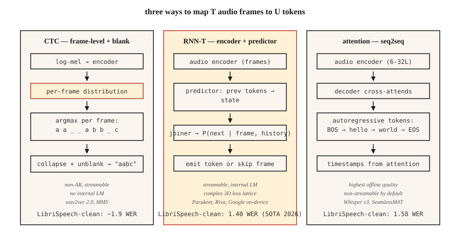

# 语音识别（ASR）：CTC、RNN-T 与注意力

> 自动语音识别（ASR）是在每个时间步进行音频分类，再由一个懂英语和静音的序列模型将结果串联起来。CTC、RNN-T 和注意力是实现它的三种方式。选一种，并理解选择它的理由。

**Type:** Build
**Languages:** Python
**Prerequisites:** 阶段 6 · 02（频谱图与 mel）、阶段 5 · 08（用于文本处理的 CNN 和 RNN）、阶段 5 · 10（注意力）
**Time:** ~45 分钟

## 要解决的问题

你有一段 10 秒、16 kHz 的音频，想得到一个字符串：“turn on the kitchen lights”。难点在于结构：音频帧与字符并非一一对齐。单词“okay”可能持续 200 ms，也可能持续 1200 ms。静音会穿插在话语中，有些音素比其他音素持续得更久，而且输出 token（词元）的数量无法预先确定。

有三种建模方式可以解决这个问题：

1. **连接时序分类（CTC，Connectionist Temporal Classification）。** 为每一帧输出各 token 的概率，其中包括特殊的 *空白 token（blank）*。解码时合并重复项并去掉空白。非自回归，速度快。wav2vec 2.0 和 MMS 采用这种方式。
2. **循环神经网络转导器（RNN-T，Recurrent Neural Network Transducer）。** 联合网络根据编码器的当前帧和先前的 token，预测下一个 token。支持流式处理。Google 的设备端 ASR 和 NVIDIA Parakeet 采用这种方式。
3. **注意力编码器—解码器。** 编码器将音频压缩为隐藏状态，解码器通过交叉注意力，以自回归方式生成 token。Whisper 和 SeamlessM4T 采用这种方式。

2026 年，LibriSpeech test-clean 上达到当前最佳水平（SOTA）的词错误率（WER）为 1.4%（NVIDIA 的 Parakeet-TDT-1.1B）和 1.58%（Whisper-Large-v3-turbo）。这些数值差别很小，部署方式的差别却很大。

## 核心概念



**CTC 的直观理解。** 让编码器输出 `T` 个帧级分布，每个分布覆盖 `V+1` 个 token（V 个字符加上空白）。对于长度为 `U < T` 的目标字符串 `y`，凡是折叠后得到 `y` 的帧对齐关系都计入其中。CTC 损失对所有这样的对齐关系求和。推理时，逐帧取 argmax，合并重复项，再移除空白。

优点：非自回归、支持流式处理、无需前瞻。缺点：采用 *条件独立假设*，即每一帧的预测都独立于其他帧，因此内部没有语言模型（LM）。可以通过束搜索（beam search）或浅融合（shallow fusion）引入外部 LM 来弥补。

**RNN-T 的直观理解。** 增加一个将历史 token 转为嵌入的 *预测网络（predictor）*，以及一个 *联合网络（joiner）*，后者把预测网络的状态与编码器帧结合起来，形成覆盖 `V+1` 个选项的联合分布（其中 `+1` 表示空值／不输出）。它显式建模了 CTC 忽略的条件依赖关系。每一步都只以过去的帧和过去的 token 为条件，因此支持流式处理。

优点：支持流式处理，并且内部有 LM。缺点：训练更复杂，也更占内存（3D（三维）损失格网）；RNN-T 损失的计算内核本身就构成了一类专门的库。

**注意力编码器—解码器。** 编码器（6-32 层 Transformer）处理 log-mel 帧，即经过对数压缩的 mel 特征帧；mel 指梅尔频率尺度。解码器（6-32 层 Transformer）对编码器输出施加交叉注意力，以自回归方式生成 token。没有对齐约束，注意力可以查看音频中的任意位置。除非限制注意力范围，否则不支持流式处理（例如分块的 Whisper-Streaming，2024）。

优点：离线 ASR 质量最高，用标准的序列到序列（seq2seq）工具即可轻松训练。缺点：自回归延迟与输出长度成正比；不经过工程改造就无法进行流式处理。

### WER：用一个数衡量

**词错误率（Word Error Rate）** = `(S + D + I) / N`，其中 S=替换次数，D=删除次数，I=插入次数，N=参考文本的词数。它对应词级别的 Levenshtein 编辑距离，越低越好。WER 超过 20% 通常无法使用；低于 5% 则在朗读语音上达到与人类相当的水平。以下是 2026 年标准基准上的数值：

| 模型 | LibriSpeech test-clean | LibriSpeech test-other | 参数量（B 为十亿，M 为百万） |
|-------|------------------------|------------------------|------|
| Parakeet-TDT-1.1B | 1.40% | 2.78% | 1.1B 参数 |
| Whisper-Large-v3-turbo | 1.58% | 3.03% | 809M |
| Canary-1B Flash | 1.48% | 2.87% | 1B |
| Seamless M4T v2 | 1.7% | 3.5% | 2.3B |

这些模型都基于编码器—解码器或 RNN-T。纯 CTC 系统（wav2vec 2.0）在 test-clean 上的数值约为 1.8–2.1%。

```figure
ctc-collapse
```

## 动手实现

### 步骤 1：CTC 贪心解码

```python
def ctc_greedy(frame_logits, blank=0, vocab=None):
    # frame_logits: list of per-frame probability vectors
    preds = [max(range(len(p)), key=lambda i: p[i]) for p in frame_logits]
    out = []
    prev = -1
    for p in preds:
        if p != prev and p != blank:
            out.append(p)
        prev = p
    return "".join(vocab[i] for i in out) if vocab else out
```

两条规则：合并连续重复项，去掉空白。例如：`a a _ _ a b b _ c` → `a a b c`。

### 步骤 2：CTC 束搜索

```python
def ctc_beam(frame_logits, beam=8, blank=0):
    import math
    beams = [([], 0.0)]  # (tokens, log_prob)
    for p in frame_logits:
        log_p = [math.log(max(pi, 1e-10)) for pi in p]
        candidates = []
        for seq, lp in beams:
            for t, lpt in enumerate(log_p):
                new = seq[:] if t == blank else (seq + [t] if not seq or seq[-1] != t else seq)
                candidates.append((new, lp + lpt))
        candidates.sort(key=lambda x: -x[1])
        beams = candidates[:beam]
    return beams[0][0]
```

生产系统采用前缀树束搜索，并结合 LM 融合；这里展示的是概念框架。

### 步骤 3：WER

```python
def wer(ref, hyp):
    r, h = ref.split(), hyp.split()
    dp = [[0] * (len(h) + 1) for _ in range(len(r) + 1)]
    for i in range(len(r) + 1):
        dp[i][0] = i
    for j in range(len(h) + 1):
        dp[0][j] = j
    for i in range(1, len(r) + 1):
        for j in range(1, len(h) + 1):
            cost = 0 if r[i - 1] == h[j - 1] else 1
            dp[i][j] = min(
                dp[i - 1][j] + 1,
                dp[i][j - 1] + 1,
                dp[i - 1][j - 1] + cost,
            )
    return dp[len(r)][len(h)] / max(1, len(r))
```

### 步骤 4：使用 Whisper 进行推理

```python
import whisper
model = whisper.load_model("large-v3-turbo")
result = model.transcribe("clip.wav")
print(result["text"])
```

一行调用即可用上 2026 年最强的通用 ASR。在 24 GB GPU 上以 ~20× 实时速度运行。

### 步骤 5：使用 Parakeet 或 wav2vec 2.0 进行流式处理

```python
from transformers import pipeline
asr = pipeline("automatic-speech-recognition", model="nvidia/parakeet-tdt-1.1b")
for chunk in streaming_audio():
    print(asr(chunk, return_timestamps=True))
```

流式 ASR 需要分块的编码器注意力，以及跨块保留的状态；请使用支持这些能力的库（Parakeet 可用 NeMo，或使用带 `chunk_length_s` 的 `transformers` 管线）。

## 实际使用

2026 年的技术栈：

| 场景 | 选择 |
|-----------|------|
| 英语、离线、追求最高质量 | Whisper-large-v3-turbo |
| 多语言、要求鲁棒性 | SeamlessM4T v2 |
| 流式、低延迟 | Parakeet-TDT-1.1B 或 Riva |
| 边缘端、移动端、延迟 <500 ms | 量化后的 Whisper-Tiny 或 Moonshine（2024） |
| 长音频 | Whisper 搭配基于语音活动检测（VAD）的分块（WhisperX） |
| 特定领域（医疗、法律） | 微调 wav2vec 2.0，并融合领域 LM |

## 2026 年仍会带入生产的常见陷阱

- **没有 VAD。** 在静音上运行 Whisper 会产生幻觉（“Thanks for watching!”）。始终用 VAD 将无语音片段挡在识别流程之外。
- **字符、词与子词级 WER 混淆。** 应在规范化（转为小写、移除标点）*之后* 报告词级 WER。
- **语种识别漂移。** Whisper 的自动语种识别（LID）会误将含噪音频送到日语或威尔士语识别路径；已知语种时，强制指定 `language="en"`。
- **长音频未分块。** Whisper 的窗口长度为 30 秒。超过该长度时，使用 `chunk_length_s=30, stride=5`。

## 交付成果

保存为 `outputs/skill-asr-picker.md`。针对给定的部署目标，选择模型、解码策略、分块方式和 LM 融合方案。

## 练习

1. **简单。** 运行 `code/main.py`。它对手工构造的 CTC 输出进行贪心解码，并与参考文本比较，计算 WER。
2. **中等。** 正确实现步骤 2 中的前缀树束搜索（考虑空白合并规则）。在包含 10 个样例的合成数据集上，与贪心解码比较。
3. **困难。** 在 [LibriSpeech test-clean](https://www.openslr.org/12) 上使用 `whisper-large-v3-turbo`。计算前 100 段话语的 WER，并与已公布的数值比较。

## 关键术语

| 术语 | 常见说法 | 实际含义 |
|------|-----------------|-----------------------|
| CTC | 带空白 token 的损失 | 对所有帧到 token 的对齐关系进行边缘化；非自回归。 |
| RNN-T | 流式损失 | CTC 加上下一 token 预测网络；能处理词序。 |
| 注意力编码器—解码器 | Whisper 风格 | 编码器加上使用交叉注意力的解码器；离线质量最佳。 |
| WER | 要报告的那个数 | 词级别的 `(S+D+I)/N`。 |
| 空白（Blank） | 什么都没有 | CTC 中的特殊 token，表示“当前帧不输出”。 |
| LM 融合 | 外部语言模型 | 在束搜索中加上经过加权的 LM 对数概率。 |
| VAD | 挡住静音的关口 | 语音活动检测器；裁去非语音片段。 |

## 延伸阅读

- [Graves et al. (2006). Connectionist Temporal Classification](https://www.cs.toronto.edu/~graves/icml_2006.pdf) — CTC 论文。
- [Graves (2012). Sequence Transduction with RNNs](https://arxiv.org/abs/1211.3711) — RNN-T 论文。
- [Radford et al. / OpenAI (2022). Whisper: Robust Speech Recognition via Large-Scale Weak Supervision](https://arxiv.org/abs/2212.04356) — 2022 年的经典论文；v3-turbo 扩展发表于 2024 年。
- [NVIDIA NeMo — Parakeet-TDT card](https://huggingface.co/nvidia/parakeet-tdt-1.1b) — 2026 年 Open ASR Leaderboard 的榜首。
- [Hugging Face — Open ASR Leaderboard](https://huggingface.co/spaces/hf-audio/open_asr_leaderboard) — 覆盖 25+ 个模型的实时基准。
