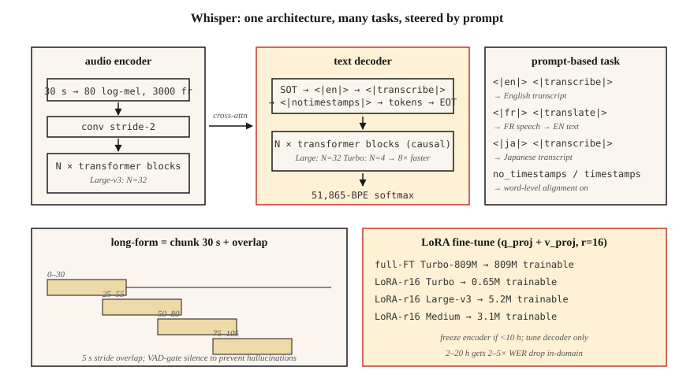

# Whisper：架构与微调

> Whisper 是采用 30 秒窗的 Transformer 编码器—解码器，使用 680k 小时（k 表示千）的多语言弱监督音频—文本对训练而成。一种架构支持多种任务，在 99 种语言上都表现稳健。它是 2026 年自动语音识别（ASR）的参考模型。

**Type:** Build
**Languages:** Python
**Prerequisites:** 阶段 6 · 04（ASR）、阶段 5 · 10（注意力）、阶段 7 · 05（完整 Transformer）
**Time:** ~75 分钟

## 要解决的问题

OpenAI 于 2022 年九月发布的 Whisper，是首个像通用工具一样开箱即用的 ASR 模型：放入音频即可得到文本，支持 99 种语言，能够抵抗噪声，还能在笔记本电脑上运行。到 2024 年，OpenAI 已推出 Large-v3 和 Turbo 变体；到 2026 年，从播客转写、语音助手到 YouTube 字幕，Whisper 都成了默认的基线模型。

但你不能永远把 Whisper 这条管线当作黑盒。领域偏移（domain shift）会让它失效：专业术语、说话人口音、专有名词、短片段和静音都会带来问题。你需要知道：

1. 它内部究竟是什么结构。
2. 如何正确地向它输入分块音频、流式音频或长音频。
3. 何时需要微调（fine-tuning），以及如何微调。

## 核心概念



**架构。** 标准的 Transformer 编码器—解码器。

- 输入：30 秒的 log-mel 频谱图（spectrogram），即经对数压缩的 mel 特征图；包含 80 个 mel 频带（mel 指梅尔频率尺度），帧移为 10 ms → 3000 帧。较短的片段做零填充，较长的片段做分块处理。
- 编码器：卷积降采样（步幅为 2）+ `N` 个 Transformer 块。Large-v3 的配置为：32 层、1280 维、20 个注意力头。
- 解码器：`N` 个 Transformer 块，包含因果自注意力（causal self-attention），以及面向编码器输出的交叉注意力（cross-attention）。规模与编码器相同。
- 输出：词表含 51,865 个 token（词元），输出采用 BPE（字节对编码）token。

Large-v3 有 1.55B 个参数（B 表示十亿）。Turbo 把解码器从 32 层减为 4 层，延迟缩减倍率为 8×，代价是词错误率（WER）恶化 <1%。

**提示词格式。** Whisper 是一个多任务模型，通过解码器提示词（prompt）中的特殊 token 来控制任务：

```text
<|startoftranscript|><|en|><|transcribe|><|notimestamps|> Hello world.<|endoftext|>
```

- `<|en|>`：语言标签；强制确定翻译还是转写的行为。
- `<|transcribe|>` 或 `<|translate|>`：将任意语言的输入翻译为英语输出，或逐字转写。
- `<|notimestamps|>`：跳过词级时间戳，速度更快。

提示词让同一个模型能够执行多种任务。把 `<|en|>` 改成 `<|fr|>`，它就会转写法语。

**30 秒窗。** 所有处理都固定在 30 秒窗口内。较长的片段需要分块，较短的片段需要填充。窗口原生不支持流式处理，这正是 WhisperX、Whisper-Streaming 和 faster-whisper 存在的原因。

**Log-mel 归一化。** 使用 `(log_mel - mean) / std`，其中统计量来自 Whisper 自身的训练语料库。你 *必须* 使用 Whisper 的预处理（`whisper.audio.log_mel_spectrogram`），而不是 `librosa.feature.melspectrogram`。

### 2026 年的变体

| 变体 | 参数量（M 表示百万） | 延迟（A100） | WER（LibriSpeech-clean） |
|---------|--------|----------------|------------------------|
| Tiny | 39M | 1× 实时速度 | 5.4% |
| Base | 74M | 1× | 4.1% |
| Small | 244M | 1× | 3.0% |
| Medium | 769M | 1× | 2.7% |
| Large-v3 | 1.55B | 2× | 1.8% |
| Large-v3-turbo | 809M | 8× | 1.58% |
| Whisper-Streaming (2024) | 1.55B | 流式 | 2.0% |

### 微调

2026 年的标准工作流：

1. 收集 10–100 小时的目标领域音频及与之对齐的转写文本。
2. 运行 `transformers.Seq2SeqTrainer`，并使用 `generate_with_loss` 回调。
3. 参数高效方案：在注意力层的 `q_proj`、`k_proj`、`v_proj` 上应用 LoRA（低秩适配），可使 GPU 显存需求的缩减倍率达到 4×，代价是 WER 增加 <0.3。
4. 如果音频不足 10 小时，就冻结编码器，只微调解码器。
5. 使用 Whisper 自身的分词器（tokenizer）和提示词格式；绝不要更换分词器。

社区结果：在 20 小时的医疗口述音频上微调 Medium，可将医疗词汇上的 WER 从 12% 降至 4.5%。在 4 小时的冰岛语音频上微调 Turbo，可将 WER 从 18% 降至 6%。

```figure
sp-asr-attention
```

## 动手实现

### 步骤 1：直接运行现成的 Whisper

```python
import whisper
model = whisper.load_model("large-v3-turbo")
result = model.transcribe(
    "clip.wav",
    language="en",
    task="transcribe",
    temperature=0.0,
    condition_on_previous_text=False,  # prevents runaway repetition
)
print(result["text"])
for seg in result["segments"]:
    print(f"[{seg['start']:.2f}–{seg['end']:.2f}] {seg['text']}")
```

你应当始终覆盖的关键默认值：`temperature=0.0`（采样默认沿 0.0 → 0.2 → 0.4 … 这条回退链尝试）、`condition_on_previous_text=False`（防止幻觉（hallucination）逐级蔓延），以及 `no_speech_threshold=0.6`（静音检测）。

### 步骤 2：长音频分块处理

```python
# whisperx is the 2026 reference for long-form with word-level timestamps
import whisperx
model = whisperx.load_model("large-v3-turbo", device="cuda", compute_type="float16")
segments = model.transcribe("1hour.mp3", batch_size=16, chunk_size=30)
```

WhisperX 增加了 (1) Silero 语音活动检测（VAD）门控、(2) 通过 wav2vec 2.0 进行词级对齐、(3) 通过 `pyannote.audio` 进行说话人分离（diarization）。它是 2026 年生产环境转写的主力工具。

### 步骤 3：使用 LoRA 微调

```python
from transformers import WhisperForConditionalGeneration, WhisperProcessor
from peft import LoraConfig, get_peft_model

model = WhisperForConditionalGeneration.from_pretrained("openai/whisper-large-v3-turbo")
lora = LoraConfig(
    r=16, lora_alpha=32, target_modules=["q_proj", "v_proj"],
    lora_dropout=0.1, bias="none", task_type="SEQ_2_SEQ_LM",
)
model = get_peft_model(model, lora)
# model.print_trainable_parameters()  -> ~3M trainable / 809M total
```

接下来使用标准的 Trainer 训练循环。每 1000 步保存一次检查点，并在留出数据上用 WER 评估。

### 步骤 4：检查各层学到了什么

```python
# Grab cross-attention weights during decode to see what the decoder attends to.
with torch.inference_mode():
    out = model.generate(
        input_features=features,
        return_dict_in_generate=True,
        output_attentions=True,
    )
# out.cross_attentions: layer × head × step × src_len
```

用热力图可视化：随着解码步骤扫过编码器帧，你会看到对角线状的对齐关系。这条对角线就是 Whisper 对词级时间戳的理解方式。

## 实际使用

2026 年的技术栈：

| 场景 | 选择 |
|-----------|------|
| 通用英语，离线处理 | 通过 `whisperx` 使用 Large-v3-turbo |
| 移动端 / 边缘端 | 量化（quantization）为 int8 的 Whisper-Tiny 或 Moonshine |
| 多语言长音频 | 通过 `whisperx` 使用 Large-v3，并配合说话人分离 |
| 低资源语言 | 使用 LoRA 微调 Medium 或 Turbo |
| 流式处理（2 s 延迟） | Whisper-Streaming 或 Parakeet-TDT |
| 词级时间戳 | WhisperX（通过 wav2vec 2.0 进行强制对齐） |

`faster-whisper`（采用 CTranslate2 后端）是 2026 年最快的 CPU+GPU 推理运行时：速度为原版的 4×，输出完全相同。

## 2026 年仍会进入生产环境的常见陷阱

- **静音时产生幻觉文本。** Whisper 使用字幕训练，其中包含 "Thanks for watching!"、"Subscribe!" 和歌词。调用前务必先用 VAD 进行门控。
- **`condition_on_previous_text` 的连锁效应。** 一次幻觉会污染后续窗口。除非你需要各块之间的语言连贯性，否则应设为 `False`。
- **短片段填充。** 把 2 秒的片段填充到 30 秒，可能会在末尾的静音部分产生幻觉。使用 `pad=False`，或先用 VAD 进行门控。
- **错误的 mel 统计量。** 用 librosa 的 mel 特征替代 Whisper 的特征，会产生近乎随机的输出。使用 `whisper.audio.log_mel_spectrogram`。

## 交付成果

保存为 `outputs/skill-whisper-tuner.md`。为给定领域设计一条 Whisper 微调或推理管线。

## 练习

1. **简单。** 运行 `code/main.py`。它会对 Whisper 风格的提示词进行分词，计算解码时的形状预算，并打印一段 10 分钟音频的分块安排。
2. **中等。** 安装 `faster-whisper`，转写一段 10 分钟的播客，并与人工转写文本比较，计算 WER。试着比较 `language="auto"` 与强制指定 `language="en"` 的效果。
3. **困难。** 使用 HF 的 `datasets`，选择一种 Whisper 表现不佳的语言（例如乌尔都语），在 2 小时音频上用 LoRA 微调 Medium，训练 2 轮（epoch），并报告 WER 的变化。

## 关键术语

| 术语 | 常见说法 | 实际含义 |
|------|-----------------|-----------------------|
| 30 秒窗 | Whisper 的限制 | 输入的硬性上限；更长的音频要分块。 |
| SOT | 转写开始 | `<\|startoftranscript\|>` 启动解码器提示词。 |
| 时间戳 token | 时间对齐 | 51k 词表中，以 0.02 s 为间隔的每个时间偏移都对应一个特殊 token。 |
| Turbo | 速度快的变体 | 4 层解码器，速度提高至 8×，WER 恶化 <1%。 |
| WhisperX | 长音频封装工具 | VAD + Whisper + wav2vec 对齐 + 说话人分离。 |
| LoRA 微调 | 高效微调 | 为注意力添加低秩适配器；训练 ~0.3% 的参数。 |
| 幻觉 | 悄无声息的失败 | Whisper 从噪声或静音中生成流畅的英语。 |

## 延伸阅读

- [Radford et al. (2022). Whisper paper](https://arxiv.org/abs/2212.04356) — 原始架构与训练方案。
- [OpenAI (2024). Whisper Large-v3-turbo release](https://github.com/openai/whisper/discussions/2363) — 4 层解码器，速度为原来的 8×。
- [Bain et al. (2023). WhisperX](https://arxiv.org/abs/2303.00747) — 长音频、词级对齐与说话人分离。
- [Systran — faster-whisper repo](https://github.com/SYSTRAN/faster-whisper) — 采用 CTranslate2 后端，速度为原来的 4×。
- [HuggingFace — Whisper fine-tune tutorial](https://huggingface.co/blog/fine-tune-whisper) — 标准的 LoRA / 全量微调教程。
