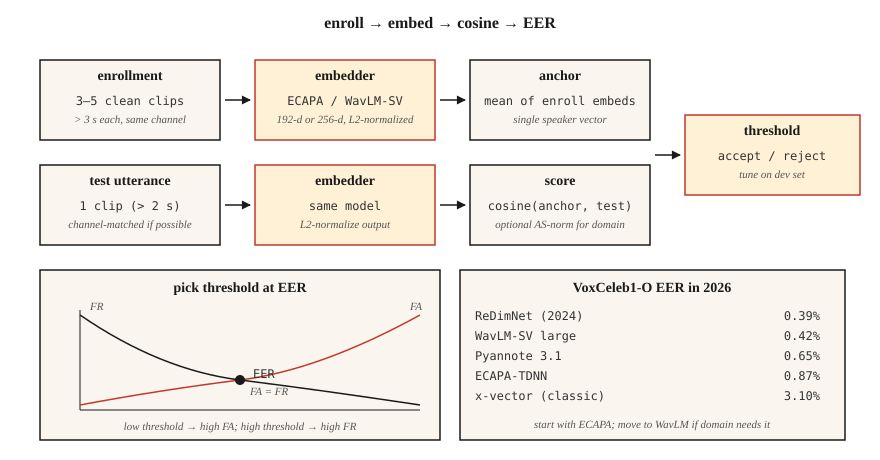

# 说话人识别与验证

> ASR（自动语音识别）问的是“他们说了什么？”说话人识别问的是“这是谁说的？”数学形式看起来相同：嵌入（embedding）加余弦相似度，但每一项生产决策都取决于一个 EER 数值。

**Type:** Build
**Languages:** Python
**Prerequisites:** 阶段 6 · 02（频谱图与 mel（梅尔频率尺度）），阶段 5 · 22（嵌入模型）
**Time:** ~45 分钟

## 要解决的问题

用户说出一句口令。你想知道：这个人是否就是其声称的那个人（*验证*，1:1），或者是否是注册库中的第一个人（*辨识*，1:N）？还是两者都不是，而是一个未知说话人（*开放集*）？

2018 之前：GMM-UBM + i-vectors。EER 尚可，但容易受信道变化（手机与笔记本电脑之间的差异）和情绪影响。2018–2022：x-vectors（以角度间隔训练的 TDNN 主干网络）。2022+：ECAPA-TDNN 和 WavLM-large 嵌入。到 2026 年，这一领域由三种模型和一个指标主导。

这个指标就是 **EER** ，即等错误率（Equal Error Rate）。设置判定阈值，使错误接受率 = 错误拒绝率。交点处的错误率就是 EER。每篇论文、每份排行榜、每次采购沟通都会用到它。

## 核心概念



**管线。** 注册：录制目标说话人 5–30 秒的语音，计算固定维度的嵌入（ECAPA-TDNN 为 192-d，WavLM-large 为 256-d；d 表示维）。验证：获取测试话语的嵌入，计算余弦相似度，再与阈值比较。

**ECAPA-TDNN（2020，到 2026 仍占主导地位）。** 全称为 Emphasized Channel Attention, Propagation and Aggregation - Time-Delay Neural Network（强调通道注意力、传播与聚合的时延神经网络）。它使用带压缩与激励的 1D 卷积块和多头注意力池化，随后通过线性层输出 192-d 表示。在 VoxCeleb 1+2（2,700 名说话人、1.1M 段话语；M 表示百万）上，用加性角度间隔损失（AAM-softmax）训练。

**WavLM-SV（2022+）。** 用 AAM 损失微调预训练的 WavLM-large 自监督学习（SSL）主干网络。质量更高，但速度更慢：300+ MB 对比 15 MB。

**x-vector（基线）。** TDNN + 统计池化。经典方案，在 CPU / 边缘端仍然有用。

**AAM-softmax。** 在标准 softmax 的角度空间中加入间隔 `m`：正确类别使用 `cos(θ + m)`。这会强制不同类别在角度上分离。典型值为 `m=0.2`，缩放系数为 `s=30`。

### 评分

- 注册嵌入与测试嵌入之间的 **余弦相似度** 。根据阈值作出判定。
- **PLDA（概率线性判别分析）。** 将嵌入投影到潜在空间，在该空间中，同一说话人与不同说话人两种假设的似然比有闭式表达式。在余弦相似度基础上加入它，可使 EER 降低 +10–20%。2020 之前是标准做法，现在只用于闭集场景。
- **分数归一化。** `S-norm` 或 `AS-norm`：根据冒认者参照组的均值和标准差，对每个分数进行归一化。这对跨领域评测至关重要。

### 你应了解的数字（2026）

| 模型 | VoxCeleb1-O EER | 参数量 | 吞吐量（A100，RT 表示实时速度倍数） |
|-------|-----------------|--------|-------------------|
| x-vector（经典） | 3.10% | 5 M | 400× RT |
| ECAPA-TDNN | 0.87% | 15 M | 200× RT |
| WavLM-SV large | 0.42% | 316 M | 20× RT |
| Pyannote 3.1 分段 + 嵌入 | 0.65% | 6 M | 100× RT |
| ReDimNet（2024） | 0.39% | 24 M | 100× RT |

### 说话人分离（diarization）

在多说话人片段中标注“谁在何时说话”。管线：语音活动检测（VAD）→ 分段 → 为每个片段计算嵌入 → 聚类（凝聚聚类或谱聚类）→ 平滑边界。现代技术栈：`pyannote.audio` 3.1，将说话人分段 + 嵌入 + 聚类封装在一次调用中。2026 年在 AMI 上达到当前最佳水平（SOTA）的说话人分离错误率（DER）为 ~15%（低于 2022 年的 23%）。

```figure
sp-eer-crossover
```

## 动手实现

### 步骤 1：从 MFCC（梅尔频率倒谱系数）统计量构建玩具嵌入

```python
def embed_mfcc_stats(signal, sr):
    frames = featurize_mfcc(signal, sr, n_mfcc=13)
    mean = [sum(f[i] for f in frames) / len(frames) for i in range(13)]
    std = [
        math.sqrt(sum((f[i] - mean[i]) ** 2 for f in frames) / len(frames))
        for i in range(13)
    ]
    return mean + std  # 26-d
```

离 SOTA 还差得很远，仅用于教学。`code/main.py` 用它在合成说话人数据上做概念验证。

### 步骤 2：余弦相似度 + 阈值

```python
def cosine(a, b):
    dot = sum(x * y for x, y in zip(a, b))
    na = math.sqrt(sum(x * x for x in a))
    nb = math.sqrt(sum(x * x for x in b))
    return dot / (na * nb) if na and nb else 0.0

def verify(enroll, test, threshold=0.75):
    return cosine(enroll, test) >= threshold
```

### 步骤 3：从相似度配对分数计算 EER

```python
def eer(same_scores, diff_scores):
    thresholds = sorted(set(same_scores + diff_scores))
    best = (1.0, 1.0, 0.0)  # (fa, fr, threshold)
    for t in thresholds:
        fr = sum(1 for s in same_scores if s < t) / len(same_scores)
        fa = sum(1 for s in diff_scores if s >= t) / len(diff_scores)
        if abs(fa - fr) < abs(best[0] - best[1]):
            best = (fa, fr, t)
    return (best[0] + best[1]) / 2, best[2]
```

返回 (eer, threshold_at_eer)。两者都要报告。

### 步骤 4：用 SpeechBrain 进入生产应用

```python
from speechbrain.pretrained import EncoderClassifier

clf = EncoderClassifier.from_hparams(source="speechbrain/spkrec-ecapa-voxceleb")

# enroll: average the embeddings of 3-5 clean samples
enroll = torch.stack([clf.encode_batch(load(x)) for x in enrollment_clips]).mean(0)
# verify
score = clf.similarity(enroll, clf.encode_batch(load("test.wav"))).item()
verdict = score > 0.25   # ECAPA typical threshold; tune on your data
```

### 步骤 5：用 pyannote 进行说话人分离

```python
from pyannote.audio import Pipeline

pipe = Pipeline.from_pretrained("pyannote/speaker-diarization-3.1")
diarization = pipe("meeting.wav", num_speakers=None)
for turn, _, speaker in diarization.itertracks(yield_label=True):
    print(f"{turn.start:.1f}–{turn.end:.1f}  {speaker}")
```

## 实际使用

2026 年的技术栈：

| 场景 | 选择 |
|-----------|------|
| 闭集 1:1 验证，边缘端 | ECAPA-TDNN + 余弦相似度阈值 |
| 开放集验证，云端 | WavLM-SV + AS-norm |
| 说话人分离（会议、播客） | `pyannote/speaker-diarization-3.1` |
| 反欺骗（重放 / 深度伪造检测） | AASIST 或 RawNet2 |
| 微型嵌入式设备（关键词检测 KWS + 注册） | Titanet-Small（NeMo） |

## 常见陷阱

- **信道不匹配。** 在 VoxCeleb（网络视频）上训练的模型 ≠ 电话音频。始终在目标信道上评测。
- **短话语。** 测试音频短于 3 秒时，EER 会急剧恶化。
- **带噪声的注册。** 一次嘈杂的注册就会污染参考基准。使用 ≥3 个干净样本并取平均值。
- **跨条件使用固定阈值。** 始终在目标领域的留出开发集上调整阈值。
- **对未归一化嵌入计算余弦相似度。** 先进行 L2 归一化，否则向量的大小会占主导。

## 交付成果

保存为 `outputs/skill-speaker-verifier.md`。选定模型、注册规程、阈值调优方案和欺诈防范措施。

## 练习

1. **简单。** 运行 `code/main.py`。构建合成“说话人”（不同的音调特征），完成注册，并在包含 100 对样本的试验列表上计算 EER。
2. **中等。** 在 30 段 VoxCeleb1 话语（5 名说话人 × 每人 6 段）上使用 SpeechBrain ECAPA。分别用余弦相似度和 PLDA 计算 EER。
3. **困难。** 用 `pyannote.audio` 构建完整的注册 → 说话人分离 → 验证管线。在 AMI 开发集上评测 DER。

## 关键术语

| 术语 | 常见说法 | 实际含义 |
|------|-----------------|-----------------------|
| EER | 核心指标 | 错误接受 = 错误拒绝时的阈值。 |
| 验证 | 1:1 | “这是 Alice 吗？” |
| 辨识 | 1:N | “谁在说话？” |
| 开放集 | 可能出现未知说话人 | 测试集可以包含未注册的说话人。 |
| 注册 | 登记 | 计算说话人的参考嵌入。 |
| AAM-softmax | 损失 | 带加性角度间隔的 softmax；强制簇分离。 |
| PLDA | 经典评分 | 概率线性判别分析；基于嵌入进行似然比评分。 |
| DER | 说话人分离指标 | 说话人分离错误率：漏检 + 误报 + 混淆。 |

## 延伸阅读

- [Snyder et al. (2018). X-Vectors: Robust DNN Embeddings for Speaker Recognition](https://www.danielpovey.com/files/2018_icassp_xvectors.pdf) — 经典深度嵌入论文。
- [Desplanques et al. (2020). ECAPA-TDNN](https://arxiv.org/abs/2005.07143) — 2020–2026 年占主导地位的架构。
- [Chen et al. (2022). WavLM: Large-Scale Self-Supervised Pre-Training for Full Stack Speech Processing](https://arxiv.org/abs/2110.13900) — 用于说话人验证（SV）和说话人分离的 SSL 主干网络。
- [Bredin et al. (2023). pyannote.audio 3.1](https://github.com/pyannote/pyannote-audio) — 生产级说话人分离 + 嵌入技术栈。
- [VoxCeleb 排行榜（更新于 2026）](https://www.robots.ox.ac.uk/~vgg/data/voxceleb/) — 各模型当前的 EER 排名。
