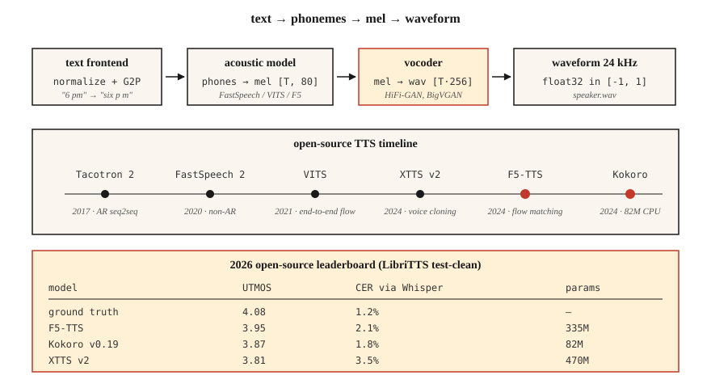

# 文本转语音（TTS）：从 Tacotron 到 F5 和 Kokoro

> 自动语音识别（ASR）把语音转成文本；文本转语音（TTS）则反过来，把文本转成语音。2026 年的技术栈分为三部分：文本 → token（词元）、token → mel（梅尔频率尺度）表征、mel → 波形（waveform）。每一部分都有笔记本电脑就能容纳的默认模型。

**Type:** Build
**Languages:** Python
**Prerequisites:** 阶段 6 · 02（频谱图与 mel）、阶段 5 · 09（序列到序列，Seq2Seq）、阶段 7 · 05（完整 Transformer）
**Time:** ~75 分钟

## 要解决的问题

给定字符串 "Please remind me to water the plants at 6 pm."，你需要生成一段 3 秒的音频，听起来自然，韵律（prosody，包括停顿和重音）正确，"plants" 中的元音发音准确，而且要在 CPU 上用不到 300 ms 完成生成，以供实时语音助手使用。你还需要切换声音，处理语码转换输入，也就是混合不同语言的输入（"remind me at 6 pm, daijoubu?"），并且别在人名的发音上出洋相。

现代 TTS 管线通常由以下部分组成：

1. **文本前端（text frontend）。** 对文本进行规范化（日期、数字、电子邮件地址），将其转换为音素（phoneme）或子词 token，并预测韵律特征。
2. **声学模型（acoustic model）。** 文本 → mel 频谱图（spectrogram）。代表模型有 Tacotron 2 (2017)、FastSpeech 2 (2020)、VITS (2021)、F5-TTS (2024)、Kokoro (2024)。
3. **声码器（vocoder）。** mel → 波形。代表模型有 WaveNet (2016)、WaveRNN、HiFi-GAN (2020)、BigVGAN (2022)，以及 2024+ 年的神经编解码器式声码器。

到了 2026 年，端到端扩散模型和流匹配（flow matching）模型逐渐模糊了声学模型与声码器之间的界限。不过，调试时仍然可以按这三部分来理解系统。

## 核心概念



**Tacotron 2 (2017)。** 序列到序列（seq2seq）架构：字符嵌入（embedding）→ 双向 LSTM（BiLSTM）编码器 → 位置敏感注意力 → 自回归 LSTM 解码器输出 mel 帧。自回归（AR）生成速度慢，处理长文本时不够稳定。它至今仍被用作基线。

**FastSpeech 2 (2020)。** 非自回归模型。时长预测器（duration predictor）输出每个音素应占多少个 mel 帧。只需 1 次前向计算，速度是 Tacotron 的 10×。由于采用单调对齐，自然度有所损失，但应用很广。

**VITS (2021)。** 通过变分推断（variational inference），将编码器、基于流的时长建模与 HiFi-GAN 声码器放在一起，进行端到端联合训练。只用一个模型就能获得高质量语音，是 2022–2024 年开源 TTS 的主流。变体包括 YourTTS（多说话人零样本模型）和 XTTS v2 (2024, Coqui)。

**F5-TTS (2024)。** 采用流匹配的扩散 Transformer。韵律自然，只需 5 秒参考音频就能进行零样本声音克隆（voice cloning）。位居 2026 年开源 TTS 排行榜前列。参数量为 335M（M 表示百万）。

**Kokoro (2024)。** 体积小（82M），可在 CPU 上运行，是实时英语 TTS 中的佼佼者。采用封闭词表，仅支持英语，许可证为 apache-2.0。

**OpenAI TTS-1-HD、ElevenLabs v2.5、Google Chirp-3。** 商业领域的顶尖模型。ElevenLabs v2.5 的情绪标签（"[whispered]"、"[laughing]"）和角色声音在 2026 年有声书制作中占据主导地位。

### 声码器的演进

| 年代 | 声码器 | 延迟 | 质量 |
|-----|---------|---------|---------|
| 2016 | WaveNet | 只能离线处理 | 发布时达到最先进水平（SOTA） |
| 2018 | WaveRNN | ~实时 | 良好 |
| 2020 | HiFi-GAN | 实时速度的 100× | 接近真人 |
| 2022 | BigVGAN | 实时速度的 50× | 可泛化到不同说话人和语言 |
| 2024 | SNAC、DAC（神经编解码器） | 与 AR 模型集成 | 离散 token，比特利用率高 |

到 2026 年，大多数“TTS”模型已经能够端到端地将文本转成波形；mel 频谱图只是内部表征。

### 评估

- **平均意见得分（MOS，Mean Opinion Score）。** 采用 1–5 分量表，通过众包获取评分。仍是黄金标准，但过程慢得让人头疼。
- **比较平均意见得分（CMOS，Comparative MOS）。** 比较对 A 和 B 的偏好。在同等标注量下，可以得到更窄的置信区间。
- **UTMOS、DNSMOS。** 无需参考音频的神经网络 MOS 预测器，用于排行榜。
- **通过 ASR 计算字符错误率（CER，Character Error Rate）。** 将 TTS 输出交给 Whisper 识别，再以输入文本为基准计算 CER，用作可懂度的代理指标。
- **说话人嵌入余弦相似度（SECS，Speaker Embedding Cosine Similarity）。** 用于评估声音克隆质量。

2026 年在 LibriTTS test-clean 上的数据如下：

| 模型 | UTMOS | CER（通过 Whisper 计算） | 参数量（M 为百万，B 为十亿） |
|-------|-------|-------------------|------|
| 真实音频 | 4.08 | 1.2% | — |
| F5-TTS | 3.95 | 2.1% | 335M |
| XTTS v2 | 3.81 | 3.5% | 470M |
| VITS | 3.62 | 3.1% | 25M |
| Kokoro v0.19 | 3.87 | 1.8% | 82M |
| Parler-TTS Large | 3.76 | 2.8% | 2.3B |

```figure
sp-tts-stack
```

## 动手实现

### 步骤 1：将输入转换为音素

```python
from phonemizer import phonemize
ph = phonemize("Hello world", language="en-us", backend="espeak")
# 'həloʊ wɜːld'
```

音素是通用的桥梁。对于质量尚未达到 VITS 水平的模型，应避免直接输入原始文本。

### 步骤 2：运行 Kokoro（2026 年的 CPU 默认选择）

```python
from kokoro import KPipeline
tts = KPipeline(lang_code="a")  # "a" = American English
audio, sr = tts("Please remind me to water the plants at 6 pm.", voice="af_bella")
# audio: float32 tensor, sr=24000
```

可离线运行，单个文件，参数量为 82M。

### 步骤 3：运行 F5-TTS，进行声音克隆

```python
from f5_tts.api import F5TTS
tts = F5TTS()
wav = tts.infer(
    ref_file="my_voice_5s.wav",
    ref_text="The quick brown fox jumps over the lazy dog.",
    gen_text="Please remind me to water the plants.",
)
```

传入一段 5 秒的参考音频片段及其转写文本，F5 就会克隆其中的韵律和音色。

### 步骤 4：从零实现 HiFi-GAN 声码器

完整实现太大，无法放进一份教程脚本，但结构如下：

```python
class HiFiGAN(nn.Module):
    def __init__(self, mel_channels=80, upsample_rates=[8, 8, 2, 2]):
        super().__init__()
        # 4 upsample blocks, total 256x to go from mel-rate to audio-rate
        ...
    def forward(self, mel):
        return self.blocks(mel)  # -> waveform
```

训练目标包括：对抗损失（判别器处理短时间窗）、mel 频谱图重建损失，以及特征匹配损失。现成方案已经很成熟，可直接使用 `hifi-gan` 仓库或 nvidia-NeMo 中的预训练检查点。

### 步骤 5：完整管线（伪代码）

```python
text = "Please remind me at 6 pm."
phones = phonemize(text)
mel = acoustic_model(phones, speaker=alice)      # [T, 80]
wav = vocoder(mel)                                # [T * 256]
soundfile.write("out.wav", wav, 24000)
```

## 实际使用

2026 年的技术栈：

| 场景 | 选择 |
|-----------|------|
| 实时英语语音助手 | Kokoro (CPU) 或 XTTS v2 (GPU) |
| 利用 5 s 参考音频进行声音克隆 | F5-TTS |
| 商业角色声音 | ElevenLabs v2.5 |
| 有声书朗读 | ElevenLabs v2.5，或微调（fine-tuning）XTTS v2 |
| 低资源语言 | 用 5–20 h 目标语言数据训练 VITS |
| 富有表现力的语音／情绪标签 | ElevenLabs v2.5，或微调 StyleTTS 2 |

截至 2026 年，开源模型中的领先选择是：**追求质量用 F5-TTS，追求效率用 Kokoro**。除非你在研究历史，否则别再选 Tacotron。

## 常见陷阱

- **没有文本规范化器（text normalizer）。** "Dr. Smith" 中的 "Dr." 该读成 "Doctor" 还是 "Drive"？"2026" 该读成 "twenty twenty six" 还是 "two zero two six"？一定要先规范化文本，再交给音素转换器（phonemizer）。
- **词表外（OOV）专有名词。** "Ghumare" → "ghyu-mair"？应为未知 token 配备兜底的字素到音素转换模型。
- **削波（clipping）。** 声码器输出很少发生削波，但推理时 mel 缩放方式不匹配，可能使输出超出 ±1.0。始终使用 `np.clip(wav, -1, 1)`。
- **采样率不匹配。** Kokoro 输出 24 kHz 音频，而下游管线要求 16 kHz → 需要重采样，否则就会出现混叠（aliasing）。

## 交付成果

保存为 `outputs/skill-tts-designer.md`。根据给定的声音、延迟和语言目标设计一条 TTS 管线。

## 练习

1. **简单。** 运行 `code/main.py`。它用一个玩具词表构建音素词典，估计每个音素的时长，并打印一份模拟的“mel”帧时间安排。
2. **中等。** 安装 Kokoro，分别用声音 `af_bella` 和 `am_adam` 合成同一句话。比较音频时长和主观质量。
3. **困难。** 录制一段你自己的声音，时长为 5 秒，作为参考音频片段。使用 F5-TTS 克隆该声音，报告参考音频与克隆输出之间的 SECS。

## 关键术语

| 术语 | 通俗说法 | 实际含义 |
|------|-----------------|-----------------------|
| 音素 | 声音单位 | 抽象的语音类别；英语中有 39 个（ARPABet）。 |
| 时长预测器 | 每个音素持续多久 | 非自回归模型的输出；每个音素占据的帧数，为整数。 |
| 声码器 | mel → 波形 | 将 mel 频谱图映射为原始采样点的神经网络。 |
| HiFi-GAN | 标准声码器 | 基于 GAN；在 2020–2024 年占据主导地位。 |
| MOS | 主观质量 | 人类评分者给出的 1–5 分平均意见得分。 |
| SECS | 声音克隆指标 | 目标声音与输出声音的说话人嵌入之间的余弦相似度。 |
| F5-TTS | 2024 年的开源最先进模型 | 基于流匹配的扩散模型；支持零样本克隆。 |
| Kokoro | CPU 英语模型中的领先者 | 参数量为 82M 的模型，采用 Apache 2.0 许可证。 |

## 延伸阅读

- [Shen et al. (2017). Tacotron 2](https://arxiv.org/abs/1712.05884)：序列到序列（seq2seq）基线模型。
- [Kim, Kong, Son (2021). VITS](https://arxiv.org/abs/2106.06103)：基于流的端到端模型。
- [Chen et al. (2024). F5-TTS](https://arxiv.org/abs/2410.06885)：当前开源领域的最先进模型。
- [Kong, Kim, Bae (2020). HiFi-GAN](https://arxiv.org/abs/2010.05646)：到 2026 年仍在实际应用的声码器。
- [HuggingFace 上的 Kokoro-82M](https://huggingface.co/hexgrad/Kokoro-82M)：2024 年推出、适合 CPU 运行的英语 TTS 模型。
