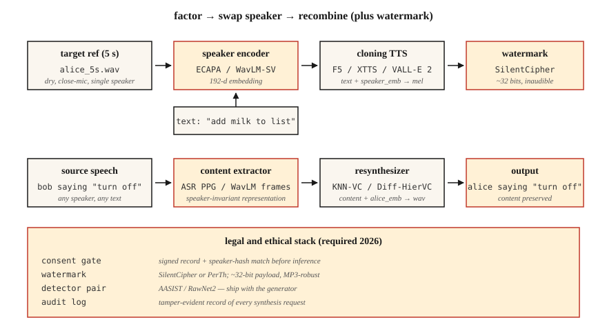

# 声音克隆与声音转换

> 声音克隆（voice cloning）用别人的声音朗读你输入的文字。声音转换（voice conversion）把你的声音变成别人的声音，同时保留你说的内容。两者都依赖同一种分解：将说话人身份与内容分离。

**Type:** Build
**Languages:** Python
**Prerequisites:** 阶段 6 · 06（说话人识别），阶段 6 · 07（文本转语音，TTS）
**Time:** ~75 分钟

## 要解决的问题

在 2026 年，只需一段 5 秒的音频和一块消费级 GPU，就能高质量地克隆任何人的声音。ElevenLabs、F5-TTS、OpenVoice v2 和 VoiceBox 都提供零样本或少样本声音克隆。这项技术既能造福人们（无障碍文本转语音、配音、辅助发声），也能成为武器（诈骗电话、政治深度伪造、知识产权盗用）。

这是两项紧密相关的任务：

- **声音克隆（TTS 侧）：** 文本 + 5 秒的参考声音 → 以该声音说出的音频。
- **声音转换（语音侧）：** 源音频（A 说 X）+ B 的参考声音 → B 说 X 的音频。

两者都将波形（waveform）分解为（内容、说话人、韵律），再把一个来源的内容与另一个来源的说话人重新组合。

在 2026 年交付系统时，你必须遵守的一项关键约束是：**欧盟（AI Act，自 2026 年八月起执行）和加利福尼亚州（AB 2905，2025 年生效）均依法要求设置水印和授权同意检查**。你的管线必须在输出中加入听不见的水印，并拒绝未经同意的声音克隆。

## 核心概念



**零样本克隆（zero-shot cloning）。** 将一段 5 秒的音频片段传给一个已在数千名说话人的数据上训练过的模型。说话人编码器将该片段映射为说话人嵌入（speaker embedding）；TTS 解码器以这个嵌入和文本为条件生成语音。

采用这种方法的模型：F5-TTS（2024）、YourTTS（2022）、XTTS v2（2024）、OpenVoice v2（2024）。

**少样本微调（few-shot fine-tuning）。** 录制 5-30 分钟的目标声音。使用 LoRA（低秩适配）对基础模型微调一小时。质量会从“还可以”跃升至“无法分辨”。Coqui 和 ElevenLabs 都支持这一模式；社区也用它来微调 F5-TTS。

**声音转换（VC）。** 有两类方法：

- **识别—合成（recognition-synthesis）。** 运行类似自动语音识别（ASR）的模型，提取内容表征（例如音素的软后验概率、PPG（音素后验概率图）），然后结合目标说话人嵌入重新合成。对语言和口音变化具有鲁棒性。KNN-VC（2023）和 Diff-HierVC（2023）采用这种方法。
- **解耦（disentanglement）。** 训练一个自编码器，在瓶颈处的潜在空间中分离内容、说话人和韵律。推理时替换说话人嵌入。质量较低，但速度更快。AutoVC（2019）和 VITS-VC 的变体采用这种方法。

**基于神经音频编解码器的克隆（2024+）。** VALL-E、VALL-E 2、NaturalSpeech 3 和 VoiceBox 将音频表示为 SoundStream / EnCodec 产生的离散 token（词元），并在这些编解码器 token 上训练大型自回归或流匹配模型。使用简短提示输入（prompt）时，质量可与 ElevenLabs 相媲美。

### 伦理要求不是事后附加项

**水印。** PerTh（Perth）和 SilentCipher（2024）将一个 ~16-32 比特的 ID 嵌入音频，听感上无法察觉。水印在重新编码、流式传输和常见编辑后仍能保留。这些开源方案已可用于生产环境。

**授权同意检查。** 每份克隆输出都必须配有一条可验证的授权同意记录。例如：“本人 Rohit 于 2026-04-22 授权将此声音用于 X 目的。”将其存储在可显露篡改的日志中。

**检测。** AASIST、RawNet2 和 Wav2Vec2-AASIST 均提供检测器。ASVspoof 2025 挑战赛公布：面对 ElevenLabs、VALL-E 2 和 Bark 的输出，当前最佳检测器的等错误率（EER）为 0.8–2.3%。

### 关键数据（2026）

| 模型 | 支持零样本？ | SECS（说话人嵌入余弦相似度，衡量与目标的相似度） | WER（词错误率，衡量可懂度） | 参数量（M 表示百万） |
|-------|-----------|--------------------|--------------|--------|
| F5-TTS | 是 | 0.72 | 2.1% | 335M |
| XTTS v2 | 是 | 0.65 | 3.5% | 470M |
| OpenVoice v2 | 是 | 0.70 | 2.8% | 220M |
| VALL-E 2 | 是 | 0.77 | 2.4% | 370M |
| VoiceBox | 是 | 0.78 | 2.1% | 330M |

SECS > 0.70 通常意味着大多数听众已无法将其与目标声音区分开来。

```figure
sp-voice-factorize
```

## 动手实现

### 步骤 1：通过识别—合成进行分解（main.py 中的纯代码演示）

```python
def clone_pipeline(ref_audio, text, target_embedder, tts_model):
    speaker_emb = target_embedder.encode(ref_audio)
    mel = tts_model(text, speaker=speaker_emb)
    return vocoder(mel)
```

概念很简单；实现工作主要集中在 `tts_model` 和说话人编码器中。

### 步骤 2：使用 F5-TTS 进行零样本克隆

```python
from f5_tts.api import F5TTS
tts = F5TTS()
wav = tts.infer(
    ref_file="rohit_5s.wav",
    ref_text="The quick brown fox jumps over the lazy dog.",
    gen_text="Please add milk and bread to my list.",
)
```

参考转写文本必须与音频完全一致；不匹配会破坏对齐。

### 步骤 3：使用 KNN-VC 进行声音转换

```python
import torch
from knnvc import KNNVC  # 2023 model, https://github.com/bshall/knn-vc
vc = KNNVC.load("wavlm-base-plus")
out_wav = vc.convert(source="my_voice.wav", target_pool=["alice_1.wav", "alice_2.wav"])
```

KNN-VC 运行 WavLM，提取源音频和目标音频池中每一帧的嵌入，然后用池中的最近邻替换每个源帧。这是一种非参数方法，只需一分钟的目标语音即可工作。

### 步骤 4：嵌入水印

```python
from silentcipher import SilentCipher
sc = SilentCipher(model="2024-06-01")
payload = b"consent_id:abc123;ts:1745353200"
watermarked = sc.embed(wav, sr=24000, message=payload)
detected = sc.detect(watermarked, sr=24000)   # returns payload bytes
```

载荷为 ~32 比特，在经过 MP3 重新编码和轻度噪声干扰后仍可检测。

### 步骤 5：授权同意检查

```python
def cloned_inference(text, ref_audio, consent_record):
    assert verify_signature(consent_record), "Signed consent required"
    assert consent_record["speaker_id"] == hash_speaker(ref_audio)
    wav = tts.infer(ref_file=ref_audio, gen_text=text)
    wav = watermark(wav, payload=consent_record["id"])
    return wav
```

## 实际使用

2026 年的技术栈：

| 场景 | 选择 |
|-----------|------|
| 基于 5 秒音频的零样本克隆，开源 | F5-TTS 或 OpenVoice v2 |
| 商业生产环境中的声音克隆 | ElevenLabs Instant Voice Clone v2.5 |
| 声音转换（改换声音） | KNN-VC 或 Diff-HierVC |
| 多说话人微调 | StyleTTS 2 + 说话人适配器 |
| 跨语言声音克隆 | XTTS v2 或 VALL-E X |
| 深度伪造检测 | Wav2Vec2-AASIST |

## 常见陷阱

- **参考转写文本未对齐。** F5-TTS 及类似模型要求参考文本与参考音频完全匹配，包括标点符号。
- **参考音频带有混响。** 回声会毁掉克隆效果。请近距离拾音，录制干声。
- **情绪不匹配。** 用“欢快”的参考音频训练，会让所有克隆输出都带上欢快的情绪。参考音频的情绪应与目标用途相符。
- **语言泄漏。** 克隆一位英语说话人的声音后，让模型说法语，往往仍会带着原来的口音；请使用跨语言模型（XTTS、VALL-E X）。
- **没有水印。** 自 2026 年八月起，在欧盟无法合法交付。

## 交付成果

保存为 `outputs/skill-voice-cloner.md`。设计一条克隆或转换管线，包含授权同意检查 + 水印 + 质量目标。

## 练习

1. **简单。** 运行 `code/main.py`。通过计算替换前后两个“说话人”之间的余弦相似度，演示说话人嵌入的替换。
2. **中等。** 使用 OpenVoice v2 克隆你自己的声音。测量参考声音与克隆声音之间的 SECS。通过 Whisper 测量字符错误率（CER）。
3. **困难。** 为 20 份克隆音频添加 SilentCipher 水印，将它们以 128 kbps 进行 MP3 编码和解码，然后检测载荷。报告比特准确率。

## 关键术语

| 术语 | 常见说法 | 实际含义 |
|------|-----------------|-----------------------|
| 零样本克隆 | 5 秒就够了 | 预训练模型 + 说话人嵌入；无需训练。 |
| PPG | 音素后验概率图 | 逐帧的 ASR 后验概率，用作不依赖具体语言的内容表征。 |
| KNN-VC | 最近邻转换 | 将每个源帧替换为目标池中最近的帧。 |
| 神经音频编解码器 TTS | VALL-E 风格 | 在 EnCodec/SoundStream token 上建模的自回归（AR）模型。 |
| 水印 | 听不见的签名 | 嵌入音频的比特，重新编码后仍然保留。 |
| SECS | 克隆保真度 | 目标声音与克隆声音的说话人嵌入之间的余弦相似度。 |
| AASIST | 深度伪造检测器 | 反欺骗模型；检测合成语音。 |

## 延伸阅读

- [Chen et al. (2024). F5-TTS](https://arxiv.org/abs/2410.06885) — 达到当前最佳水平（SOTA）的开源零样本声音克隆。
- [Baevski et al. / Microsoft (2023). VALL-E](https://arxiv.org/abs/2301.02111) 和 [VALL-E 2 (2024)](https://arxiv.org/abs/2406.05370) — 基于神经音频编解码器的 TTS。
- [Qian et al. (2019). AutoVC](https://arxiv.org/abs/1905.05879) — 基于解耦的声音转换。
- [Baas, Waubert de Puiseau, Kamper (2023). KNN-VC](https://arxiv.org/abs/2305.18975) — 基于检索的声音转换。
- [SilentCipher (2024) — Audio Watermarking](https://github.com/sony/silentcipher) — 可用于生产环境的 32 比特音频水印。
- [ASVspoof 2025 results](https://www.asvspoof.org/) — 检测器与合成器之间的攻防竞赛，2026 年更新。
