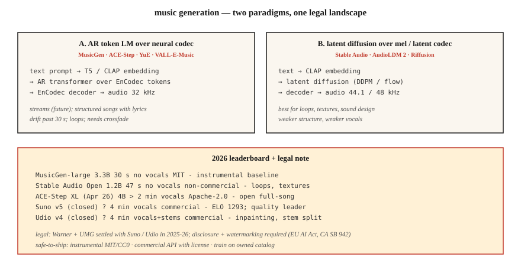

# 音乐生成：MusicGen、Stable Audio、Suno 与许可授权的巨变

> 2026 年的音乐生成：Suno v5 和 Udio v4 主导商业领域；MusicGen、Stable Audio Open 和 ACE-Step 领跑开源领域。技术问题已基本解决。法律问题（Warner Music 的 $500M 和解、UMG 和解）在 2025-2026 年重塑了这一领域。

**Type:** Build
**Languages:** Python
**Prerequisites:** 阶段 6 · 02（频谱图），阶段 4 · 10（扩散模型）
**Time:** ~75 分钟

## 要解决的问题

文本 → 一段 30 秒到 4 分钟的音乐，包含歌词、人声和曲式结构。可分为三个子问题：

1. **器乐生成（instrumental generation）。** “带有温暖键盘音色的 lo-fi 嘻哈鼓点”这样的文本 → 音频。代表模型有 MusicGen、Stable Audio、AudioLDM。
2. **歌曲生成（song generation，含人声 + 歌词）。** “一首关于 Texas 雨夜的乡村歌曲” → 完整歌曲。代表模型有 Suno、Udio、YuE、ACE-Step。
3. **条件生成 / 可控生成。** 续写现有片段、重新生成桥段、切换曲风、进行分轨分离（stem separation），或局部重生成（inpainting）。Udio 的局部重生成 + 分轨分离，是 2026 年同类产品需要追赶的功能。

## 核心概念



### 基于神经编解码器 token 的语言模型（LM）

Meta 的 **MusicGen**（2023，MIT）及其许多衍生模型：以文本 / 旋律嵌入（embedding）为条件，自回归（autoregressive）地预测 EnCodec token（神经音频编解码器输出的离散音频符号；32 kHz，4 个码本（codebook）），再用 EnCodec 解码。参数量为 300M - 3.3B。它是一个表现出色的基线模型，但生成长度超过 30 秒后就力不从心。

**ACE-Step**（开源，4B XL 于 2026 年四月发布）在此基础上扩展，支持以歌词为条件生成完整歌曲。它是开源社区中最接近 Suno 的模型。

### 对 mel（梅尔频率尺度）频谱图或潜在表示进行扩散

**Stable Audio（2023）** 和 **Stable Audio Open（2024）**：对压缩后的音频进行潜在扩散（latent diffusion）。擅长生成循环片段（loop）、声音设计素材和氛围音效纹理。不太擅长生成结构完整的整首歌曲。

**AudioLDM / AudioLDM2**：通过类似 T2I 的潜在扩散实现文本转音频，并将其推广到音乐、音效和语音。

### 混合架构（生产应用）：Suno、Udio、Lyria

模型权重不公开。可能采用自回归（AR）编解码器语言模型 + 基于扩散的声码器（vocoder），并为人声 / 鼓声 / 旋律设置专门的输出头。Suno v5（2026）以 ELO 1293 的得分领跑质量榜。Udio v4 加入了局部重生成 + 分轨分离（贝斯、鼓、人声可分别下载）。

### 评估

- **弗雷歇音频距离（FAD；Fréchet Audio Distance）。** 使用 VGGish 或 PANNs 特征，衡量生成音频的嵌入分布与真实音频的嵌入分布之间的距离。越低越好。MusicGen small 在 MusicCaps 上的 FAD 为 4.5；当前最佳水平（SOTA）为 ~3.0。
- **音乐性（musicality，主观指标）。** 由人的偏好决定。Suno v5 以 ELO 1293 领先。
- **文本—音频对齐。** 计算提示词（prompt）与输出之间的 CLAP（音频—文本对比嵌入）得分。
- **音乐生成瑕疵。** 过渡偏离节拍、人声乐句漂移、超过 30 s 后结构丢失。

## 2026 年模型版图

| 模型 | 参数量 | 时长 | 人声 | 许可证 |
|-------|--------|--------|--------|---------|
| MusicGen-large | 3.3B | 30 s | 无 | MIT |
| Stable Audio Open | 1.2B | 47 s | 无 | Stability 非商业许可 |
| ACE-Step XL (Apr 2026) | 4B | &gt; 2 min | 有 | Apache-2.0 |
| YuE | 7B | &gt; 2 min | 有，多语言 | Apache-2.0 |
| Suno v5（权重不公开） | ? | 4 min | 有，ELO 1293 | 商业许可 |
| Udio v4（权重不公开） | ? | 4 min | 有 + 分轨 | 商业许可 |
| Google Lyria 3（权重不公开） | ? | 实时 | 有 | 商业许可 |
| MiniMax Music 2.5 | ? | 4 min | 有 | 商业 API（应用程序编程接口） |

## 法律格局（2025-2026）

- **Warner Music 与 Suno 和解。** 金额为 $500M。WMG 现在对 Suno 上的 AI 仿拟（AI-likeness）、音乐权利和用户生成曲目拥有监督权。UMG 也与 Udio 达成了类似的和解。
- **EU AI Act** + **California SB 942**：必须披露音乐由 AI 生成。
- **Riffusion / MusicGen** 采用 MIT 许可证，没有合规包袱，但也不提供商业人声生成功能。

可安全交付的做法：

1. 只生成器乐（MusicGen、Stable Audio Open，输出采用 MIT/CC0 许可）。
2. 使用商业 API（Suno、Udio、ElevenLabs Music），每次生成都取得相应许可。
3. 使用自有或已获许可的曲库训练（多数企业最终会选择这条路）。
4. 用水印 + 元数据标记生成结果。

```figure
sp-codec-tokens
```

## 动手实现

### Step 1：用 MusicGen 生成

```python
from audiocraft.models import MusicGen
import torchaudio

model = MusicGen.get_pretrained("facebook/musicgen-small")
model.set_generation_params(duration=10)
wav = model.generate(["upbeat synthwave with driving drums, 128 BPM"])
torchaudio.save("out.wav", wav[0].cpu(), 32000)
```

有三种规模：`small`（300M，速度快）、`medium`（1.5B）、`large`（3.3B）。如果只是想看看“这个创意能否奏效”，小型版本就够了。

### Step 2：旋律条件化

```python
melody, sr = torchaudio.load("humming.wav")
wav = model.generate_with_chroma(
    ["jazz piano cover"],
    melody.squeeze(),
    sr,
)
```

MusicGen-melody 接收色度图（chromagram），在改变音色（timbre）的同时保留曲调。适合“把这段旋律改成弦乐四重奏”这样的需求。

### Step 3：FAD 评估

```python
from frechet_audio_distance import FrechetAudioDistance
fad = FrechetAudioDistance()

fad.get_fad_score("generated_folder/", "reference_folder/")
```

计算 VGGish 嵌入之间的距离。适合做曲风层面的回归测试，但不能替代人的聆听评价。

### Step 4：融入 LLM 音乐工作流

结合第 7-8 课的思路，融入大语言模型（LLM）音乐工作流：

```python
prompt = "Write a 30-second jazz loop. Describe the drums, bass, and piano voicing."
description = llm.complete(prompt)
music = musicgen.generate([description], duration=30)
```

## 实际使用

| 目标 | 技术组合 |
|------|-------|
| 器乐声音设计 | Stable Audio Open |
| 游戏 / 自适应音乐 | Google Lyria RealTime（权重不公开） |
| 带人声的完整歌曲（商业） | Suno v5 或 Udio v4，附明确许可 |
| 带人声的完整歌曲（开放模型） | ACE-Step XL 或 YuE |
| 简短广告歌曲 | MusicGen，以哼唱的参考音频为旋律条件 |
| 音乐视频背景音乐 | MusicGen + Stable Video Diffusion |

## 2026 年生产应用中仍存在的问题

- **洗白版权的提示词。** “Taylor Swift 风格的歌曲”：商业服务 Suno/Udio 现在会过滤这类提示词，开放模型则不会。请加入自己的过滤列表。
- **超过 30 s 后重复 / 漂移。** AR 模型会反复循环。对多次生成结果进行交叉淡化（crossfade），或使用 ACE-Step 保持结构连贯。
- **速度漂移（tempo drift）。** 模型会偏离设定的 BPM（每分钟拍数）。在提示词中加入 BPM 标签，并用 librosa 的 `beat_track` 做生成后筛选。
- **人声可懂度。** Suno 表现出色；开放模型唱出的字词往往含混不清。如果歌词很重要，请使用商业 API 或进行微调（fine-tuning）。
- **单声道输出。** 开放模型会生成单声道或伪立体声。用真正的立体声重建来改善效果（ezst、Cartesia 的立体声扩散）。

## 交付成果

保存为 `outputs/skill-music-designer.md`。为音乐生成部署选择模型、许可策略、时长 / 结构方案和披露元数据。

## 练习

1. **简单。** 运行 `code/main.py`。它会用 ASCII 符号输出“生成式”的和弦进行（chord progression）+ 鼓点模式，是音乐生成的简化示意。如果愿意，可以用任意 MIDI 渲染器将其播放出来。
2. **中等。** 安装 `audiocraft`，用 MusicGen-small 生成 10 秒片段，覆盖 4 种曲风提示词，并相对于参考曲风数据集测量 FAD。
3. **困难。** 使用 ACE-Step（或 MusicGen-melody），以不同音色的提示词为同一曲调生成三个变体。计算与提示词的 CLAP 相似度，验证对齐程度。

## 关键术语

| 术语 | 常见说法 | 实际含义 |
|------|-----------------|-----------------------|
| FAD | 音频版 FID | 真实音频与生成音频的嵌入分布之间的 Fréchet 距离。 |
| 色度图（Chromagram） | 用音高表示旋律 | 每帧一个 12 维向量；作为旋律条件化的输入。 |
| 分轨（Stems） | 乐器轨道 | 分离出的贝斯 / 鼓 / 人声 / 旋律，以 WAV 格式保存。 |
| 局部重生成（Inpainting） | 重新生成一个片段 | 遮蔽一个时间窗口，模型只重新生成这一部分。 |
| CLAP | 文本—音频版 CLIP | 音频—文本对比嵌入；用于评估文本—音频对齐。 |
| EnCodec | 音乐编解码器 | MusicGen 使用的 Meta 神经编解码器；32 kHz，4 个码本。 |

## 延伸阅读

- [Copet et al. (2023). MusicGen](https://arxiv.org/abs/2306.05284)：开放的自回归基准。
- [Evans et al. (2024). Stable Audio Open](https://arxiv.org/abs/2407.14358)：声音设计的默认选择。
- [ACE-Step](https://github.com/ace-step/ACE-Step)：开放的 4B 完整歌曲生成器，2026 年四月发布。
- [Suno v5 平台文档](https://suno.com)：商业领域的质量领跑者。
- [AudioLDM2](https://arxiv.org/abs/2308.05734)：用于音乐 + 音效的潜在扩散。
- [WMG-Suno 和解报道](https://www.musicbusinessworldwide.com/warner-music-group-settles-with-suno-strikes-first-of-its-kind-deal-with-ai-song-generator/)：2025 年十一月的先例。
