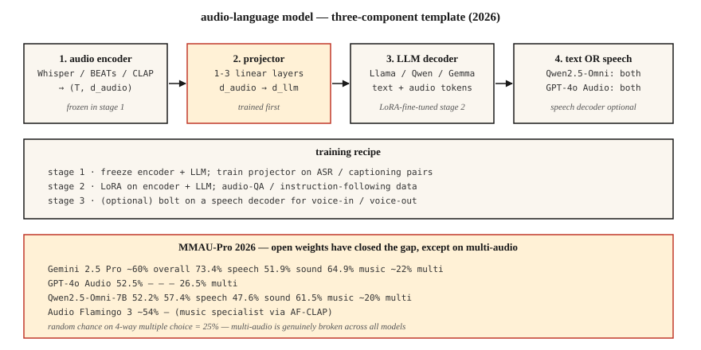

# 音频语言模型 — Qwen2.5-Omni、Audio Flamingo、GPT-4o Audio

> 2026 年的音频语言模型能够结合语音 + 环境声音 + 音乐进行推理。Qwen2.5-Omni-7B 在 MMAU-Pro 上的表现媲美 GPT-4o Audio。Audio Flamingo Next 在 LongAudioBench 上胜过 Gemini 2.5 Pro。开放权重模型与闭源模型之间的差距已基本消失，唯独多音频任务例外：在这类任务上，所有模型的表现都接近随机猜测。

**Type:** Learn
**Languages:** Python
**Prerequisites:** 阶段 6 · 04（ASR）、阶段 12 · 03（视觉语言模型）、阶段 7 · 10（音频 Transformer）
**Time:** ~45 分钟

## 要解决的问题

你有一段 5 秒的音频：狗叫声、有人大喊“停！”，随后一片安静。值得回答的问题涉及多个维度：

- **转写。** “说了什么？”这是自动语音识别（ASR）的范畴。
- **语义推理。** “这个人是否处于危险之中？”这需要联合理解狗叫声 + 喊声 + 随后的安静。
- **音乐推理。** “哪些乐器在演奏旋律？”
- **长音频检索。** “在这段 90 分钟的讲座中，讲师在哪里讲解了梯度下降？”

只用一个提示词（prompt）就能回答上述所有问题的单一模型，就是 **音频语言模型（audio-language model）** (LALM / ALM)。它与纯 ASR 不同：LALM 会生成自由形式的自然语言回答，而不只是转写文本。

## 核心概念



### 三组件模板

2026 年的每一种 LALM 都有相同的基本结构：

1. **音频编码器（audio encoder）。** Whisper 编码器 · BEATs · CLAP · WavLM · 或各模型自行定制的编码器。
2. **投影器（projector）。** 通过线性层或多层感知机（MLP），把音频编码器的特征映射到大语言模型（LLM）的 token 嵌入空间（embedding space）。token 是模型处理的序列单位，文本语境中称为词元。
3. **LLM。** 基于 Llama / Qwen / Gemma 的解码器。接收交错排列的文本 + 音频 token，生成文本。

训练过程：

- **阶段 1。** 冻结编码器 + LLM；在 ASR / 描述生成数据上仅训练投影器。
- **阶段 2。** 在遵循指令的音频任务（QA 问答、推理、音乐理解）上进行全量微调（fine-tuning）或 LoRA（低秩适配）微调。
- **阶段 3（可选）。** 为语音输入 / 语音输出增加语音解码器。Qwen2.5-Omni 和 AF3-Chat 采用了这种方式。

### 2026 年模型版图

| 模型 | 主干网络 | 音频编码器 | 输出模态 | 获取方式 |
|-------|----------|---------------|-----------------|--------|
| Qwen2.5-Omni-7B | Qwen2.5-7B | 定制 + Whisper | 文本 + 语音 | Apache-2.0 |
| Qwen3-Omni | Qwen3 | 定制 | 文本 + 语音 | Apache-2.0 |
| Audio Flamingo 3 | Qwen2 | AF-CLAP | 文本 | NVIDIA non-commercial |
| Audio Flamingo Next | Qwen2 | AF-CLAP v2 | 文本 | NVIDIA non-commercial |
| SALMONN | Vicuna | Whisper + BEATs | 文本 | Apache-2.0 |
| LTU / LTU-AS | Llama | CAV-MAE | 文本 | Apache-2.0 |
| GAMA | Llama | AST + Q-Former | 文本 | Apache-2.0 |
| Gemini 2.5 Flash/Pro（闭源） | Gemini | 专有 | 文本 + 语音 | API（应用程序编程接口） |
| GPT-4o Audio（闭源） | GPT-4o | 专有 | 文本 + 语音 | API |

### 基准测试反映的真实水平（2026）

**MMAU-Pro。** 1800 组 QA 问答对，覆盖语音 / 声音 / 音乐 / 混合类别，也包含多音频子集。

| 模型 | 总体 | 语音 | 声音 | 音乐 | 多音频 |
|-------|---------|--------|-------|-------|-------------|
| Gemini 2.5 Pro | ~60% | 73.4% | 51.9% | 64.9% | ~22% |
| Gemini 2.5 Flash | ~57% | 73.4% | 50.5% | 64.9% | 21.2% |
| GPT-4o Audio | 52.5% | — | — | — | 26.5% |
| Qwen2.5-Omni-7B | 52.2% | 57.4% | 47.6% | 61.5% | ~20% |
| Audio Flamingo 3 | ~54% | — | — | — | — |
| Audio Flamingo Next | 在 LongAudioBench 上达到当前最佳水平（SOTA） | — | — | — | — |

**多音频这一列暴露了所有模型的严重短板。** 在 4 选项选择题上，随机猜测的正确率 = 25%；大多数模型的得分就在这个水平附近。LALM 仍然难以比较两段音频。

### 2026 年 LALM 适用的场景

- **呼叫中心录音的合规审查。** “客服是否提到了必要披露内容？”
- **无障碍辅助。** 向失聪用户描述声音事件，而不只是转写语音。
- **内容审核。** 检测暴力言语 + 威胁性语气 + 背景情境。
- **播客 / 会议章节划分。** 按语义概括内容，而不只是区分说话轮次。
- **音乐曲库分析。** “找出所有在 B 段发生转调的曲目。”

### 它们（目前）还不适用的场景

- 比和弦层面更细粒度的音乐理论分析。
- 在长对话中结合说话人归属进行推理（超过 10 分钟后性能会退化）。
- 多音频比较（22-26% 的表现仅略高于随机猜测）。
- 实时流式推理（大多数模型采用离线批量推理）。

```figure
v4-alm-tokens
```

## 动手实现

### 步骤 1：向 Qwen2.5-Omni 提问

```python
from transformers import AutoModelForCausalLM, AutoProcessor

processor = AutoProcessor.from_pretrained("Qwen/Qwen2.5-Omni-7B")
model = AutoModelForCausalLM.from_pretrained("Qwen/Qwen2.5-Omni-7B", torch_dtype="auto")

audio, sr = load_wav("clip.wav", sr=16000)
messages = [{
    "role": "user",
    "content": [
        {"type": "audio", "audio": audio},
        {"type": "text", "text": "What sounds do you hear, and what's happening?"},
    ],
}]
inputs = processor.apply_chat_template(messages, tokenize=True, return_tensors="pt")
output = model.generate(**inputs, max_new_tokens=200)
print(processor.decode(output[0], skip_special_tokens=True))
```

### 步骤 2：投影器模式

```python
import torch.nn as nn

class AudioProjector(nn.Module):
    def __init__(self, audio_dim=1280, llm_dim=4096):
        super().__init__()
        self.down = nn.Linear(audio_dim, llm_dim)
        self.act = nn.GELU()
        self.up = nn.Linear(llm_dim, llm_dim)

    def forward(self, audio_features):
        return self.up(self.act(self.down(audio_features)))
```

就这么简单。投影器通常由 1-3 个线性层组成。用 ASR 数据对（音频 → 转写文本）训练它，就是阶段 1 的前置任务（pretext task）。

### 步骤 3：在 MMAU / LongAudioBench 上进行基准测试

```python
from datasets import load_dataset
mmau = load_dataset("gamma-lab-umd/MMAU-Pro", split="test")
mcq = mmau.filter(lambda item: len(item["choices"] or []) > 1)

correct = 0
for item in mcq:
    answer = call_model(item["audio_path"], item["question"], item["choices"])
    if answer == item["answer"]:
        correct += 1
print(f"Accuracy: {correct / len(mcq):.3f}")
```

`audio_path` 指向数据集仓库中的 `data.zip`（约 47 GB），因此需要先下载并解压，再进行评分。这个完全匹配循环只是基本合理性检查，并非基准测试评分器，所以它得到的数值不能与已发表的 MMAU-Pro 结果相比。官方评估器通过嵌入相似度（NV-Embed-v2）匹配选择题答案，使用大语言模型评判器（LLM judge）为开放式答案评分，并用正则表达式规则检查指令遵循类答案：将预测结果写入 `model_output` 列，然后运行 [MMAU-Pro 仓库](https://github.com/sonalkum/MMAUPro)中的 `evaluate_mmau_pro_comprehensive.py`。分别报告每个 `category`（speech、sound、music、multi 及其余类别）的结果。汇总数值会掩盖模型具体在哪些方面失效。

## 实际使用

| 任务 | 2026 年的选择 |
|------|-----------|
| 自由形式音频问答（QA，开放权重） | Qwen2.5-Omni-7B |
| 长音频表现最佳的开放权重模型 | Audio Flamingo Next |
| 表现最佳的闭源模型 | Gemini 2.5 Pro |
| 语音输入 / 语音输出智能体（agent） | Qwen2.5-Omni 或 GPT-4o Audio |
| 音乐推理 | Audio Flamingo 3 或 2（专攻音乐的 AF-CLAP） |
| 呼叫中心审查 | 通过 API 使用 Gemini 2.5 Pro，并对你的政策文档采用检索增强生成（RAG） |

## 常见陷阱

- **过度信任多音频能力。** 如果你的任务需要判断“哪个片段包含 X”，就要正视模型表现只有随机猜测水平这一现实。
- **长音频性能退化。** 超过 10 分钟后，大多数模型的说话人归属判断会失效。先进行说话人分离（diarization，即标注谁在何时说话；第 6 课），再生成摘要。
- **静音输入时的幻觉。** 使用 Whisper 编码器的 LALM 继承了 Whisper 的同类问题。用语音活动检测（VAD）把关。
- **挑选有利基准结果。** 厂商博文会突出表现最好的类别。你应自行运行 MMAU-Pro 多音频子集测试。

## 交付成果

保存为 `outputs/skill-alm-picker.md`。针对给定的音频理解任务，选择 LALM + 基准测试子集 + 输出模态（文本或语音）。

## 练习

1. **简单。** 运行 `code/main.py`，观察玩具投影器模式，以及模拟 LALM 的 (audio-embedding, text-tokens) → 输出 token 路由；括号中的输入分别是音频嵌入和文本 token。
2. **中等。** 在 100 道 MMAU-Pro 语音题上评估 Qwen2.5-Omni-7B，并与论文报告的数值比较。
3. **困难。** 构建最简音频描述生成基线：BEATs 编码器 + 2 层投影器 + 冻结的 Llama-3.2-1B。在 AudioCaps 上仅微调投影器，并在 Clotho-AQA 上与 SALMONN 比较。

## 关键术语

| 术语 | 常见说法 | 实际含义 |
|------|-----------------|-----------------------|
| LALM | 音频版 ChatGPT | 音频编码器 + 投影器 + LLM 解码器。 |
| 投影器（Projector） | 适配器（Adapter） | 将音频特征映射到 LLM 嵌入空间的小型 MLP。 |
| MMAU | 那个基准测试 | 10k 组音频 QA 问答对（k 表示千），涵盖语音、声音和音乐。 |
| MMAU-Pro | 更难的 MMAU | 1800 道多音频 / 侧重推理的问题。 |
| LongAudioBench | 长音频评估 | 对数分钟长的音频片段提出语义查询。 |
| 语音输入 / 语音输出 | 语音原生 | 模型接收语音并输出语音，不绕经文本。 |

## 延伸阅读

- [Chu et al. (2024). Qwen2-Audio](https://arxiv.org/abs/2407.10759) — 参考架构。
- [Alibaba (2025). Qwen2.5-Omni](https://huggingface.co/Qwen/Qwen2.5-Omni-7B) — 语音输入、语音输出。
- [NVIDIA (2025). Audio Flamingo 3](https://arxiv.org/abs/2507.08128) — 开放权重长音频模型中的领先者。
- [NVIDIA (2026). Audio Flamingo Next](https://arxiv.org/abs/2604.10905) — LongAudioBench 上的 SOTA。
- [Tang et al. (2023). SALMONN](https://arxiv.org/abs/2310.13289) — 双编码器先驱。
- [MMAU-Pro 排行榜](https://sonalkum.github.io/mmau-pro/) — 实时更新的 2026 年排名。
