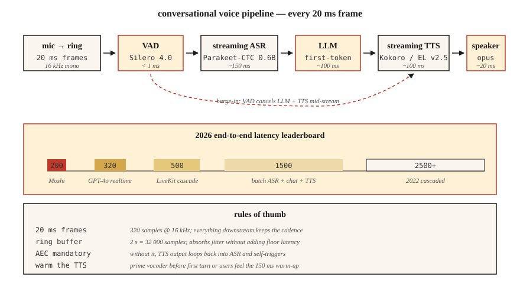

# 实时音频处理

> 批处理管线处理一个文件。实时管线则要在下一段 20 毫秒的音频到来之前，处理完当前这段 20 毫秒的音频。每个对话式 AI（人工智能）系统、广播演播室和电话机器人，能否正常运作都取决于能否守住这一延迟预算。

**Type:** Build
**Languages:** Python
**Prerequisites:** 阶段 6 · 02（频谱图）、阶段 6 · 04（ASR）、阶段 6 · 07（TTS）
**Time:** ~75 分钟

## 要解决的问题

你想要一个交互自然的语音助手。人类对话的话轮交替延迟为 ~230 ms（从静音到响应）。超过 500 ms 就会显得机械；超过 1500 ms 则像是出了故障。2026 年，完整的 **听取 → 理解 → 响应 → 发声** 循环的预算如下：

| 阶段 | 预算 |
|-------|--------|
| 麦克风 → 缓冲区 | 20 ms |
| 语音活动检测（VAD） | 10 ms |
| 自动语音识别（ASR，流式处理） | 150 ms |
| 大语言模型（LLM，首 token〔词元〕） | 100 ms |
| 文本转语音（TTS，首个音频块） | 100 ms |
| 渲染 → 扬声器 | 20 ms |
| **合计** | **~400 ms** |

Moshi（Kyutai，2024）的全双工（full duplex）延迟达到了 200 ms。GPT-4o-realtime（2024）的延迟为 ~320 ms。2022 年上线的级联管线延迟为 2500 ms。这 10× 的改进来自三项技术：(1) 全链路采用流式处理，(2) 利用部分结果进行异步管线处理，(3) 可打断的生成。

## 核心概念



**帧 / 音频块 / 窗（frame / chunk / window）。** 实时音频以固定大小的块流动。常见选择是 20 ms（在 16 kHz 下为 320 个采样点）。下游的所有环节都必须跟上这个节奏。

**环形缓冲区（ring buffer）。** 固定大小的环形缓冲区。生产者线程写入新帧，消费者线程读取。它能避免在关键处理路径（hot path）中分配内存。大小 ≈ 最大延迟 × 采样率；一个能容纳 2 秒音频的 16 kHz 环形缓冲区 = 32,000 个采样点。

**VAD（Voice Activity Detection，语音活动检测）。** 没有人说话时，用门控阻止下游处理。Silero VAD 4.0（2024）在 CPU（中央处理器）上处理每个 30 ms 帧的耗时 <1 ms。`webrtcvad` 是较老的替代方案。

**流式 ASR。** 这类模型随着音频到达而输出部分转写文本。Parakeet-CTC-0.6B 在流式模式下（NeMo，2024），以 320 ms 的延迟达到 2–5% 的词错误率（WER）。Whisper-Streaming（Macháček 等，2023）将 Whisper 分块运行，以 ~2 s 的延迟实现近流式处理。

**打断。** 用户在助手说话时开口，系统必须 (a) 检测插话打断（barge-in），(b) 停止 TTS，(c) 丢弃剩余的 LLM 输出。所有操作都要在 100 ms 内完成，否则用户就会觉得助手听不见自己。

**WebRTC Opus 传输。** 20 ms 帧、48 kHz、8–128 kbps 自适应比特率。这是浏览器和移动端的标准方案。LiveKit、Daily.co、Pion 是 2026 年用于构建语音应用的技术栈。

**抖动缓冲区（jitter buffer）。** 网络数据包会乱序或延迟到达。抖动缓冲区对它们重排序并平滑到达节奏；太小 → 可听见的断续，太大 → 延迟。典型值为 60–80 ms。

### 常见注意事项

- **线程争用。** Python 的 GIL（全局解释器锁）加上计算繁重的模型，可能让音频线程得不到运行机会。使用采用 C 回调的音频库（sounddevice、PortAudio），并让 Python 远离关键处理路径。
- **采样率转换延迟。** 在管线内部重采样会增加 5–20 ms。要么预先重采样，要么使用零延迟重采样器（PolyPhase、`soxr_hq`）。
- **TTS 预热。** 即使是 Kokoro 这样快速的 TTS，首次请求也有 100–200 ms 的预热时间。缓存模型，并在第一个真实话轮之前通过一次试运行来预热。
- **回声消除。** 如果没有声学回声消除（AEC），TTS 输出会重新进入麦克风，让 ASR 被机器人的声音触发。WebRTC AEC3 是默认的开源方案。

```figure
nyquist-aliasing
```

## 动手实现

### 步骤 1：环形缓冲区

```python
import collections

class RingBuffer:
    def __init__(self, capacity):
        self.buf = collections.deque(maxlen=capacity)
    def write(self, frame):
        self.buf.extend(frame)
    def read(self, n):
        return [self.buf.popleft() for _ in range(min(n, len(self.buf)))]
    def level(self):
        return len(self.buf)
```

容量决定最大缓冲延迟。在 16 kHz 下，32,000 个采样点 = 2 s。

### 步骤 2：VAD 门控

```python
def simple_energy_vad(frame, threshold=0.01):
    return sum(x * x for x in frame) / len(frame) > threshold ** 2
```

在生产环境中替换为 Silero VAD：

```python
import torch
vad, _ = torch.hub.load("snakers4/silero-vad", "silero_vad")
is_speech = vad(torch.tensor(frame), 16000).item() > 0.5
```

### 步骤 3：流式 ASR

```python
# Parakeet-CTC-0.6B streaming via NeMo
from nemo.collections.asr.models import EncDecCTCModelBPE
asr = EncDecCTCModelBPE.from_pretrained("nvidia/parakeet-ctc-0.6b")
# chunk_ms=320 ms, look_ahead_ms=80 ms
for chunk in audio_stream():
    partial_text = asr.transcribe_streaming(chunk)
    print(partial_text, end="\r")
```

### 步骤 4：打断处理器

```python
class Dialog:
    def __init__(self):
        self.tts_task = None

    def on_user_speech(self, frame):
        if self.tts_task and not self.tts_task.done():
            self.tts_task.cancel()   # barge-in
        # then feed to streaming ASR

    def on_final_user_utterance(self, text):
        self.tts_task = asyncio.create_task(self.reply(text))

    async def reply(self, text):
        async for tts_chunk in llm_then_tts(text):
            speaker.write(tts_chunk)
```

这依赖于异步 I/O（输入/输出）和可取消的 TTS 流式处理。标准做法是在音频轨道上使用 WebRTC peerconnection.stop()。

## 实际使用

2026 年的技术栈：

| 层 | 选择 |
|-------|------|
| 传输层 | LiveKit（WebRTC）或 Pion（Go） |
| VAD | Silero VAD 4.0 |
| 流式 ASR | Parakeet-CTC-0.6B 或 Whisper-Streaming |
| LLM 首 token | Groq、Cerebras、vLLM-streaming |
| 流式 TTS | Kokoro 或 ElevenLabs Turbo v2.5 |
| 回声消除 | WebRTC AEC3 |
| 原生端到端 | OpenAI Realtime API（应用程序编程接口）或 Moshi |

## 常见陷阱

- **为了保险而缓冲 500 ms。** 缓冲区 *就是* 你的延迟下限。把它缩小。
- **未对线程绑核。** 音频回调运行在优先级低于 UI（用户界面）的线程上 = 负载较高时出现音频故障。
- **TTS 音频块太小。** 小于 200 ms 的音频块会让声码器（vocoder）伪影变得可听见。320 ms 的音频块是最佳折中。
- **没有抖动缓冲区。** 真实网络存在抖动；不做平滑处理就会出现爆音。
- **一次性错误处理。** 音频管线必须能抵御崩溃。一个异常就会终止会话。

## 交付成果

保存为 `outputs/skill-realtime-designer.md`。设计一条实时音频管线，为每个阶段给出具体的延迟预算。

## 练习

1. **简单。** 运行 `code/main.py`。它模拟环形缓冲区 + 基于能量的 VAD；为一段模拟的 10 秒音频流打印各阶段延迟。
2. **中等。** 使用 `sounddevice` 构建一个直通环路，以 20 ms 帧处理麦克风输入，并在每帧打印 VAD 状态。
3. **困难。** 使用 `aiortc` 构建全双工回声测试：浏览器 → WebRTC → Python → WebRTC → 浏览器。用 1 kHz 脉冲测量端到端实测延迟（glass-to-glass latency）。

## 关键术语

| 术语 | 通常的说法 | 实际含义 |
|------|-----------------|-----------------------|
| 环形缓冲区 | 循环队列 | 固定大小、无锁（或在单生产者单消费者〔SPSC〕模式下加锁）的音频帧先进先出（FIFO）队列。 |
| VAD | 静音门控 | 区分语音与非语音的模型或启发式方法。 |
| 流式 ASR | 实时语音转文本（STT） | 随着音频到达而输出部分文本；前瞻范围有界。 |
| 抖动缓冲区 | 网络平滑器 | 对乱序数据包重排序的队列；典型值为 60–80 ms。 |
| AEC | 回声消除 | 减去经扬声器到麦克风的声学反馈路径传回的信号。 |
| 插话打断 | 用户打断 | 系统在 TTS 进行过程中检测到用户语音；必须取消播放。 |
| 全双工 | 双向同时进行 | 用户和机器人可以同时说话；Moshi 是全双工的。 |

## 延伸阅读

- [Macháček et al. (2023). Whisper-Streaming](https://arxiv.org/abs/2307.14743) — 分块运行的近流式 Whisper。
- [Kyutai (2024). Moshi](https://kyutai.org/Moshi.pdf) — 全双工，延迟 200 ms。
- [LiveKit Agents framework (2024)](https://docs.livekit.io/agents/) — 生产环境音频智能体编排。
- [Silero VAD repo](https://github.com/snakers4/silero-vad) — 耗时低于 1 ms 的 VAD，Apache 2.0。
- [WebRTC AEC3 paper](https://webrtc.googlesource.com/src/+/main/modules/audio_processing/aec3/) — 开源的回声消除。
