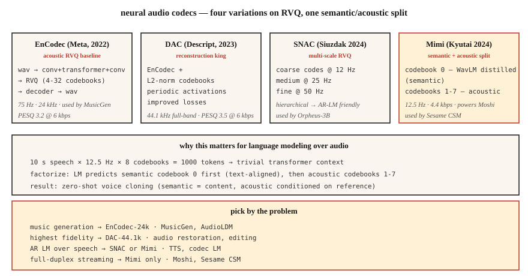

# 神经音频编解码器：EnCodec、SNAC、Mimi、DAC 与语义—声学分离

> 2026 年的音频生成几乎都以 token（词元）为基础。EnCodec、SNAC、Mimi 和 DAC 将连续波形转成 Transformer 可以预测的离散序列。将 token 分为语义与声学两类，即让第一个码本承载语义，其余码本承载声学信息，是音频领域自 Transformer 以来最重要的架构转变。

**Type:** Learn
**Languages:** Python
**Prerequisites:** 阶段 6 · 02（频谱图）、阶段 10 · 11（量化）、阶段 5 · 19（子词分词）
**Time:** ~60 分钟

## 要解决的问题

语言模型处理的是离散 token，音频却是连续的。如果想为语音 / 音乐构建大语言模型（LLM）风格的模型，例如 MusicGen、Moshi、Sesame CSM、VibeVoice 或 Orpheus，你首先需要一个**神经音频编解码器（neural audio codec）**：它包含一个通过学习将音频离散化为来自小词表的 token 的编码器，以及一个与之配套、用于重建波形的解码器。

目前形成了两大类：

1. **重建优先的编解码器（reconstruction-first codecs）**，例如 EnCodec、DAC。它们优化音频的感知质量。其 token 是“声学”的，涵盖说话人身份、音色、背景噪声等所有信息。
2. **语义优先的编解码器（semantic-first codecs）**，例如 Mimi（Kyutai）、SpeechTokenizer。它们强制第一个码本编码语言 / 语音内容，通常通过从 WavLM 蒸馏来实现。后续码本承载声学细节。

2024-2026 年的关键认识是：**尝试从文本生成语音时，纯重建型编解码器会给出含混不清的语音。**对编解码器 token 建模的 LLM 必须在同一码本中同时学习语言结构和声学结构，这种方式难以扩展。将二者分开，让语义码本 0 承载语义、声学码本 1-N 承载声学信息，才使 Moshi 和 Sesame CSM 得以奏效。

## 核心概念



### 核心技巧：残差向量量化（RVQ）

所有现代音频编解码器都使用**残差向量量化（Residual Vector Quantization，RVQ）**，即将多个小码本级联起来，而不是使用一个大码本，后者需要 millions（数百万）个码才能达到良好质量。第一个码本量化编码器的输出，第二个量化残差，以此类推。每个码本包含 1024 个码。8 个码本 = 有效词表大小为 1024^8 = 10^24。

推理时，解码器将每一帧选中的所有码相加，完成重建。

### 2026 年值得关注的四种编解码器

**EnCodec（Meta，2022）。**基线方案。它直接对波形进行编码和解码，以 RVQ 作为瓶颈。采样率为 24 kHz，最多可用 32 个码本，默认在 1.5 kbps 下使用 4 个码本。采用 `1D conv + transformer + 1D conv` 架构。MusicGen 使用了它。

**DAC（Descript，2023）。**在 RVQ 中使用 L2 归一化的码本、周期性激活函数和改进的损失函数。在所有开放编解码器中，它的重建保真度最高；使用 12 个码本时，有时难以与原始语音区分。支持 44.1 kHz 全频带音频。

**SNAC（Hubert Siuzdak，2024）。**采用多尺度 RVQ，粗粒度码本的帧率低于细粒度码本。它实际上以分层方式对音频建模：以 ~12 Hz 表示粗略“轮廓”，再以 50 Hz 表示细节。Orpheus-3B 使用了它，因为这种分层结构很适合基于语言模型（LM）的生成。

**Mimi（Kyutai，2024）。**改变 2026 年格局的方案。帧率低至 12.5 Hz，使用 8 个码本，比特率为 4.4 kbps。码本 0 **通过 WavLM 蒸馏得到**，训练目标是预测 WavLM 的语音内容特征。码本 1-7 表示声学残差。这种分离方式支撑了 Moshi（第 15 课）和 Sesame CSM。

### 帧率对语言建模很重要

更低的帧率 = 更短的序列 = 更快的 LM。

| 编解码器 | 帧率 | 1 s = N 帧 | 适用场景 |
|-------|-----------|----------------|---------|
| EnCodec-24k | 75 Hz | 75 | 音乐、通用音频 |
| DAC-44.1k | 86 Hz | 86 | 高保真音乐 |
| SNAC-24k（粗粒度） | ~12 Hz | 12 | 高效的自回归语言模型（AR-LM） |
| Mimi | 12.5 Hz | 12.5 | 流式语音 |

在 12.5 Hz 下，一段 10 秒的话语只有 125 个编解码器帧，Transformer 可以轻松预测它们。

### 语义 token 与声学 token

```text
frame_t → [semantic_token_t, acoustic_token_0_t, acoustic_token_1_t, ..., acoustic_token_6_t]
```

- **语义 token（Mimi 中的码本 0）。**编码说了什么，即音素、词和内容。通过辅助预测损失从 WavLM 蒸馏得到。
- **声学 token（码本 1-7）。**编码音色、说话人身份、韵律、背景噪声和细微信息。

自回归语言模型（AR LM）先以文本为条件预测语义 token，再以语义 + 说话人参考音频为条件预测声学 token。正是这种因子分解，使现代文本转语音（TTS）系统能够进行零样本声音克隆：语义模型负责内容，声学模型负责音色。

### 2026 年的重建质量（单位：比特每秒，比特率越低越好）

| 编解码器 | 比特率 | PESQ（客观感知质量指标） | ViSQOL（客观感知质量指标） |
|-------|---------|------|--------|
| Opus-20kbps | 20 kbps | 4.0 | 4.3 |
| EnCodec-6kbps | 6 kbps | 3.2 | 3.8 |
| DAC-6kbps | 6 kbps | 3.5 | 4.0 |
| SNAC-3kbps | 3 kbps | 3.3 | 3.8 |
| Mimi-4.4kbps | 4.4 kbps | 3.1 | 3.7 |

按每比特带来的感知质量衡量，Opus 等传统编解码器仍然胜出。神经编解码器的优势在于**离散 token**（Opus 并不产生这种 token）和**生成模型质量**（LM 利用这些 token 能做到什么）。

```figure
rvq-codec-cascade
```

## 动手实现

### 步骤 1：用 EnCodec 编码

```python
from encodec import EncodecModel
import torch

model = EncodecModel.encodec_model_24khz()
model.set_target_bandwidth(6.0)  # kbps

wav = torch.randn(1, 1, 24000)
with torch.no_grad():
    encoded = model.encode(wav)
codes, scale = encoded[0]
# codes: (1, n_codebooks, n_frames), dtype=int64
```

在 6 kbps 下，`n_codebooks=8`。每个码的取值为 0-1023（10 比特）。

### 步骤 2：解码并衡量重建效果

```python
with torch.no_grad():
    wav_recon = model.decode([(codes, scale)])

from torchaudio.functional import compute_deltas
import torch.nn.functional as F

mse = F.mse_loss(wav_recon[:, :, :wav.shape[-1]], wav).item()
```

### 步骤 3：语义—声学分离（Mimi 风格）

```python
from moshi.models import loaders
mimi = loaders.get_mimi()

with torch.no_grad():
    codes = mimi.encode(wav)  # shape (1, 8, frames@12.5Hz)

semantic = codes[:, 0]
acoustic = codes[:, 1:]
```

语义码本 0 与 WavLM 对齐。你可以训练一个从文本到语义的 Transformer，其词表比直接生成音频所需的词表小得多。随后，单独的声学到波形解码器以说话人参考音频为条件进行解码。

### 步骤 4：为什么对编解码器 token 建模的 AR LM 能奏效

对于一段 10 s 的语音，按 Mimi 的 12.5 Hz × 8 个码本计算：

```text
N_tokens = 10 * 12.5 * 8 = 1000 tokens
```

对 Transformer 来说，1000 个 token 的上下文很短。一个参数量为 256M 的 Transformer 在现代 GPU 上能够以毫秒级耗时生成 10 秒的语音。

## 实际使用

按问题选择编解码器：

| 任务 | 编解码器 |
|------|-------|
| 通用音乐生成 | EnCodec-24k |
| 最高保真度的重建 | DAC-44.1k |
| 对语音建模的 AR LM（TTS） | SNAC 或 Mimi |
| 流式全双工语音 | Mimi（12.5 Hz） |
| 带文本的音效库 | EnCodec + T5 条件 |
| 细粒度音频编辑 | DAC + 局部重生成（inpainting） |

经验法则：**如果你要构建生成模型，就从 Mimi 或 SNAC 开始。如果你要构建压缩管线，就用 Opus。**

## 常见陷阱

- **码本过多。**增加码本会线性提高保真度，也会线性增加 LM 的序列长度。用到 8-12 个就停。
- **帧率不匹配。**先在 12.5 Hz 的 Mimi 上训练 LM，再在 50 Hz 的 EnCodec 上微调（fine-tuning），会在没有明显报错的情况下失败。
- **认为所有码本都一样。**在 Mimi 中，码本 0 承载内容；丢失它会摧毁可懂度。丢失码本 7 则几乎察觉不到。
- **只用重建质量作为指标。**一个编解码器的重建效果可能很好，但如果语义结构不好，它可能完全不适合基于 LM 的生成。

## 交付成果

保存为 `outputs/skill-codec-picker.md`。针对给定的生成或压缩任务选择编解码器。

## 练习

1. **简单。**运行 `code/main.py`。它实现了一个玩具版的标量 + 残差量化器，并衡量增加码本时的重建误差。
2. **中等。**安装 `encodec`，在一段留出的语音片段上比较 1、4、8、32 个码本的效果。绘制 PESQ 或均方误差（MSE）随比特率变化的曲线。
3. **困难。**加载 Mimi，编码一个音频片段。将码本 0 替换为随机整数，再解码。然后以同样方式替换码本 7。比较这两种破坏方式：破坏码本 0 应当会摧毁可懂度，而破坏码本 7 应当几乎不产生变化。

## 关键术语

| 术语 | 常见说法 | 实际含义 |
|------|-----------------|-----------------------|
| RVQ | 残差量化 | 多个小码本级联，每个码本量化前一级留下的残差。 |
| 帧率 | 编解码器速度 | 每秒有多少 token 帧。帧率越低，LM 越快。 |
| 语义码本 | 码本 0（Mimi） | 从自监督学习（SSL）特征蒸馏得到的码本，用于编码内容。 |
| 声学码本 | 其余部分 | 音色、韵律、噪声和细微信息。 |
| PESQ / ViSQOL | 感知质量 | 与平均意见得分（MOS）相关的客观指标。 |
| EnCodec | Meta 的编解码器 | RVQ 基线，MusicGen 使用了它。 |
| Mimi | Kyutai 的编解码器 | 12.5 Hz 帧率，语义—声学分离，支撑 Moshi。 |

## 延伸阅读

- [Défossez 等（2023）。EnCodec](https://arxiv.org/abs/2210.13438)：RVQ 基线。
- [Kumar 等（2023）。Descript Audio Codec（DAC）](https://arxiv.org/abs/2306.06546)：保真度最高的开放编解码器。
- [Siuzdak（2024）。SNAC](https://arxiv.org/abs/2410.14411)：多尺度 RVQ。
- [Kyutai（2024）。Mimi codec](https://kyutai.org/codec-explainer)：语义—声学分离与 WavLM 蒸馏。
- [Borsos 等（2023）。AudioLM](https://arxiv.org/abs/2209.03143)：两阶段语义/声学范式。
- [Zeghidour 等（2021）。SoundStream](https://arxiv.org/abs/2107.03312)：最早支持流式处理的 RVQ 编解码器。
